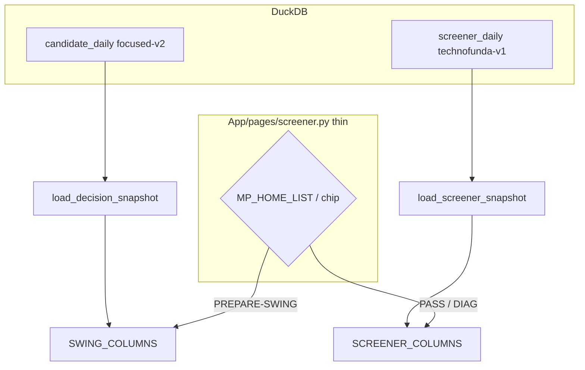
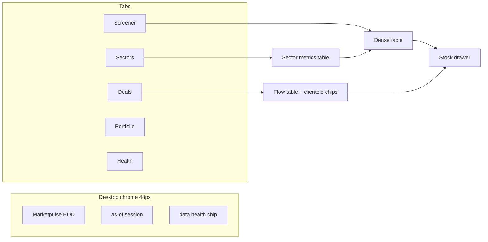
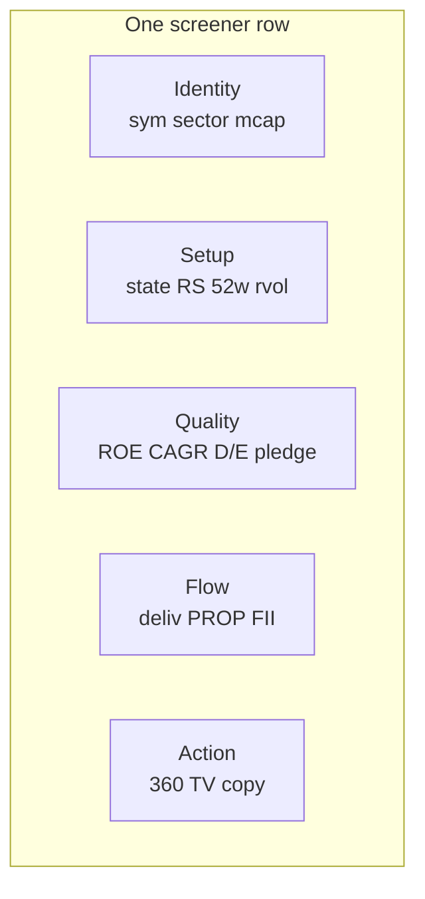
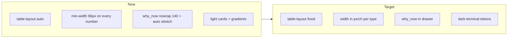
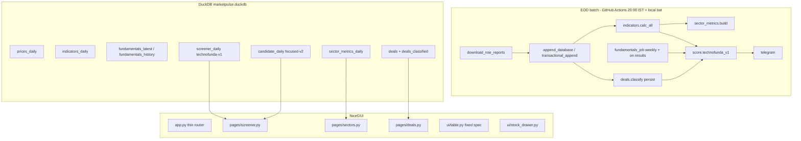

# Marketpulse: EOD Technofunda Screener for Multibaggers

| Field | Value |
| :--- | :--- |
| **Title** | Marketpulse redesign: End-of-Day technofunda screener for Indian multibagger candidates |
| **Author** | Marketpulse design loop |
| **Date** | 2026-08-16 |
| **Status** | Draft |
| **Revision** | 2026-08-16b |
| **Supersedes** | `2026-08-03-marketpulse-focused-watchlist-design.md`, `docs/superpowers/specs/2026-08-03-marketpulse-focused-watchlist-design.md`, `docs/superpowers/specs/2026-08-10-marketpulse-recovery-design.md` (product thesis only; recovery data-authority work is kept), `docs/superpowers/specs/2026-08-11-deals-institution-leaderboard-design.md` (layout intent kept; HFT-exclusion default is reversed), `AI/Gemini/*` (not a source of truth) |

> **Revision 2026-08-16b — user decisions: hold fundamentals; swing/technical first; Marketpulse is the only product repo.**

This document is a critic's audit of the existing app plus a concrete redesign. Compliments are not the point. File paths are relative to the Marketpulse clone unless noted. The **diagnosis** (ATR, VCP, distance, deals, Gemini, UI) is unchanged. The **sequence** is: make the swing/technical desk trustworthy first; park technofunda until the user un-holds fundamentals.

---

## Overview

Marketpulse is a NiceGUI + DuckDB EOD desk that already downloads official NSE session files, computes a large technical feature set, scores a `focused-v2` swing-candidate queue, and shows deals / sector / portfolio pages. That is a usable data spine. It is **not** a technofunda multibagger screener **today**.

**Near-term product (this implementation slice):** a trustworthy **EOD swing / technical desk**. After the close, or the next morning, open one dense table of the `focused-v2` queue. Fix indicator math, table density, prop-included deals, computed sector metrics, peel `app.py`, and CI hygiene. Home remains `focused-v2`. Do **not** scrape screener.in, do **not** parse XBRL, do **not** flip the home list to a fusion product.

**Later product (on hold until the user un-holds fundamentals):** an EOD technofunda screener whose job is a short ranked list of multibagger-shaped Indian equities that pass both a fundamental quality gate and a technical setup gate. Phase 0 PROXY / `screener_daily` / fusion 45/35/20 remain in this document as the **later contract**, not the next merge.

This redesign keeps the EOD batch pipeline and DuckDB store. It does not add a live ticker, WebSockets, options chain, or LLM-written sector essays. Next work extracts indicator math into one testable module (current SMA ATR first; Wilder as a parallel column), stops treating prop desks as noise, and **deletes** Sector Intel's hardcoded Gemini universe from the runtime path.

**Marketpulse is the only product repo.** The public `nsetools-marketpulse` fork is a **reference**: cherry-pick a fetch idea if a gap is easy *and* trusted. Do not add nsetools as a dependency. Do not run a second product. It is not trusted as the EOD data layer (live unofficial quotes, dead historical bhav URL, no bulk/block/mcap/PE/PR).

---

## Background & Motivation

### Current state (what actually exists)

```
NSE archives (bhav, 52w, mcap, PE, bands, bulk, block, MA, PR zip)
        │
        ▼
Scripts/download_nse_reports.py  →  Input/downloads/{ddmmyyyy}/ + Input/daily + Input/archive
        │
        ▼
Scripts/daily_pipeline.py → append_database.py → build_database.calc_indicators()
        │                     → decision_pipeline.process_accepted_session()
        │                     → candidate_engine.score_candidates() → candidate_daily
        │                     → telegram_deals.notify_deals()
        ▼
Database/marketpulse.duckdb   (market, read-only from UI)
Database/marketpulse_user.duckdb   (portfolio / journal)
        │
        ▼
App/app.py  (204,163 bytes; 3,892 physical lines / 3,561 non-blank)  + thin pages + read models
```

Verified store: **DuckDB**, not parquet/SQLite. Core tables in `Scripts/schema.sql` and `build_database.py`: `prices_daily`, `indicators_daily`, `stocks_master`, `deals`, `candidate_daily`, `sector_rotation`, `index_daily`, `security_reference_daily`, `security_events`, `corporate_actions`, `signal_ledger`, `ingestion_batches`.

The app already does several things well: official-report ingestion with checksums, point-in-time 52w join (when it works), a versioned decision snapshot that refuses to silently fall back to `focused-v1`, and a user DB split so the UI cannot write the market file. Those stay.

### Pain points (why the current product misses the job)

1. **Wrong job.** `DecisionPolicy` (`Scripts/decision_policy.py:11-21`) is a swing gate: ₹1,000 Cr, ₹10 Cr 20d ADV, 5% trigger distance, 8% stop, 1.5 R:R. Indian multi-year compounders routinely start below that cap floor and do not have a 20-session "trigger."
2. **No fundamentals.** PE is ingested as a snapshot and parked on `stocks_master`. There is no revenue/PAT CAGR, ROE/ROCE, debt, promoter, pledge, FCF, or margin series. The 2026-08-03 spec listed shareholding as future colour; it was never built.
3. **Indicator math is buried and only partly correct.** All RSI/EMA/ATR/RS/VCP live inside `Scripts/build_database.py` (`calc_indicators`, 992 lines). There is **no** `tests/` coverage of the formulas. MACD and SMA are not implemented despite being discussed as if they were.
4. **Deals hide the most useful short-horizon confirmation.** `exclude_hft=True` is the default in `App/deals_read_model.py`, `Scripts/institutional_engine.py`, and the Deals UI checkbox. Prop/HFT names are classified `is_hft=True` and dropped from netting, cluster radar, and the candidate participation pillar.
5. **Sector Intel is a Gemini product, not a screener product.** Default view is a hand-curated 70-name "Next-Gen Tech Megatrend" with gradient banners and role-thesis blurbs. The underlying `sector_rotation` table is usable; the page is not.
6. **The UI is a light marketing dashboard pretending to be a terminal.** Warm off-white, 16px card padding, `table-layout: auto`, `min-width` without `width` on the default path, `why_now` as a nowrap 140px sentence that then eats leftover viewport, and a 3,892-line god file. The user's complaint about uneven columns is how `table_from_df` is written.
7. **Repo hygiene.** 1,285 files; 878 of them are `Input/archive/*.csv`; 277 more under `Input/downloads/`. CI (`.github/workflows/eod.yml`) runs the pipeline and commits Input, and **does not run pytest**.

### Prior specs this document overrides

| Prior doc | Keep | Override |
| :--- | :--- | :--- |
| 2026-08-03 focused watchlist | Point-in-time rule, one canonical scorer, ledger identity; **swing desk is the near-term product again (user 2026-08-16b)** | Treating the 2026-08-03 spec as the long-term ceiling; HFT-as-noise |
| 2026-08-10 recovery | Read-only market DB, PR ingestion, focused-v2 snapshot, Data Health freshness | "Restore swing workflow before visual redesign"; ₹1,000 Cr as the identity of the product |
| 2026-08-11 deals leaderboard | Compact institution table, TV copy | Default HFT exclusion; "clean institutional accumulation" framing |
| `AI/Gemini/*` | Nothing as architecture | Invented filenames, wrong RS weights, wrong VCP states, prop-as-noise rationale |

---

## Goals & Non-Goals

### Goals — near-term (next implementation slice)

- After the NSE close (or next morning), one dense desktop table shows the **`focused-v2` swing queue**, not a marketing dashboard.
- Indicator math is a single testable module; current SMA ATR is golden-tested; Wilder ATR is a **parallel** column only.
- Deals: classify clientele (FII, DII, **PROP**, HNI, corporate, other). Prop is first-class. Default include. User can isolate or hide.
- Sector Intel: **computed** relative strength, breadth, leadership, concentration. No Gemini essays, no hardcoded 70-name theme.
- UI: dark terminal, fixed column widths, `why_now` out of the table.
- Incremental architecture: stop growing `App/app.py`; peel unused pages; pytest on PRs; stop committing `Input/archive`.
- Screener IA (Today + Candidates merge) reads **focused-v2 only**.

### Goals — later (on hold; user must un-hold fundamentals)

- A name must pass **both** a fundamental quality gate and a technical setup gate, then rank by a transparent fusion score (45/35/20).
- Fundamentals from free/cheap Indian sources (schema/PROXY contract already written below). **No screener.in scrape and no XBRL in this slice.**
- Home list may flip to technofunda-v1 only after the user un-holds and the later-phase PRs land.

### Non-goals (hard)

- No live ticker, no WebSocket, no intraday charting as a product requirement.
- No options chain / F&O trading terminal.
- No LLM-generated sector narratives as a core feature (optional later annotation only).
- No paid Bloomberg/FactSet in v1 (optional later phase, listed below).
- No broker execution, no order placement.
- No mobile-first layout. This is a wide-table desktop screener.
- Do not add `nsetools-marketpulse` as a dependency or run it as a second product. It is a **reference** for quote/constituent *shapes* if a gap appears; not trusted as the EOD data layer (see § A.6). EQUITY_L is already vendored at `Input/static/EQUITY_L .csv` (space in the filename is real).
- Do not treat `nse_screener` as a drop-in merge; it is prior art for module shape only.
- Do not implement screener.in scrape or XBRL in the next slice. Do not put yfinance numbers into any score.
- Do not overwrite `indicators_daily.atr_14` with Wilder ATR.
- Do not flip `MP_HOME_LIST` to technofunda until the user un-holds fundamentals.

---

## A. Current-state audit

### A.1 Architecture and maintainability

**`App/app.py` is a 204,163-byte god file** (3,892 physical lines; 3,561 non-blank). `def main()` (`:3848`) only wires seven tabs, but the file still contains a second product: `table_from_df`, KPI widgets, market health, sector tree, strong groups, strong RS stocks, screener SQL builders, VCP lab, special watchlist, backtest, journal, stock detail, portfolio CRUD, plus leftover `def add_styles()` (`:2931`) that is not the real theme (real theme is `App/ui/styles.py`).

Tabs actually launched (`:3857-3865`):

| Tab | Builder | Reality |
| :--- | :--- | :--- |
| Today | `today_page` → `candidates_page.build_today_page` | focused-v2 queue |
| Candidates | `candidates_page.build_candidates_page` | same snapshot + blocked |
| Sector Intel | `sector_rotation_page` → `pages/research/sector_intel.py` | Gemini thematic default |
| Momentum | `special_watchlist_page` | leftover scanner, still in the god file |
| Deals | `deals_page` → `pages/research/deals.py` | HFT-off by default |
| Portfolio | `portfolio_page` | still in the god file (~350 lines) |
| Data Health | `data_health_page` | extracted |

Dead or unreachable page functions still compiled into the process: `market_health_page`, `sector_tree_page`, `strong_groups_page`, `strong_rs_stocks_page`, `screener_page`, `vcp_lab_page`, `backtest_page`, `journal_page`, `stock_detail_page`. That is why the file cannot shrink: every recovery PR was afraid to delete them.

**`Scripts/build_database.py` (992 lines)** is the other god file: CSV readers, deal load, RSI, candles, weekly/monthly resample, indicators, master, enrichment, breadth, sector rotation, screener materialization. Indicator math cannot be unit-tested without importing the whole rebuild.

**`Scripts/fix.py` exists.** It is a string-rewrite script that patches `build_sector_rotation` in place. That is not a codebase; that is a scar.

**Import path chaos.** Almost every module has:

```python
try:
    from X import Y
except ModuleNotFoundError:
    from Scripts.X import Y
```

Because `app.py` is launched as a script with `Scripts/` on `sys.path`. There is no installable package.

**Tests: 32 `test_*.py` + `conftest.py` = 33 files, 78 `def test_*` functions, the wrong surface.** Strong on migrations, manifests, ledger identity, policy thresholds, and UI wiring contracts. **Zero golden tests for RSI, EMA, ATR, RS, VCP, 52w distance, or MACD.** `tests/test_institutional_engine.py:91` invents `sma_20` / `sma_50` columns that `calc_indicators` never writes. `tests/test_sector_intel.py` and `tests/test_thematic_tracker.py` `@pytest.mark.skipif` the live DuckDB — they do not run in CI and they do not pin numbers. Gemini README's "78 / 78 Passed (100% Green)" is a function count, not a formula-correctness claim.

**CI (`.github/workflows/eod.yml`).** Cron `30 14 * * *` (20:00 IST). Restores DuckDB via `actions/cache`, runs `daily_pipeline.py --lookback 7`, uploads the DB, **commits all of `Input/` to main**. No `pytest` job. No indicator regression. The cache key is `marketpulse-duckdb-${{ github.run_id }}` with prefix restore — workable, but a corrupted cache becomes the next run's baseline. Committing 878 archive CSVs is how the repo hit 1,285 files.

**Pipeline correctness (operational).** `daily_pipeline.py` is the right shape: download → fail-closed bhav gate → transactional append → decision materialize → Telegram. `download_nse_reports.py` uses `curl_cffi` Chrome impersonation against `nseindia.com/api/daily-reports?key=CM` plus archive fallbacks. That is unofficial but is the **correct** unofficial surface (session reports), unlike nsetools live APIs. Risk: NSE HTML/API shape changes; retries exist (`--retries 2` in CI).

### A.2 Indicators and calculations — verified against the code

All formulas below are from `Scripts/build_database.py` unless noted. There is **no SMA** and **no MACD** anywhere in `Scripts/` or `App/`.

#### EMA — correct (standard)

```441:442:Scripts/build_database.py
        for window in EMA_WINDOWS:
            g[f"ema_{window}"] = close.ewm(span=window, adjust=False, min_periods=window).mean()
```

`EMA_WINDOWS = [10, 20, 50, 63, 100, 150, 200]` (`Scripts/config.py:46`). This is the standard pandas / TradingView EMA (`α = 2/(span+1)`, `adjust=False`). **Verdict: correct.**

#### RSI — Wilder-correct, but not independently tested

```360:367:Scripts/build_database.py
def calc_rsi(close: pd.Series, period: int = 14) -> pd.Series:
    delta = close.diff()
    gain = delta.clip(lower=0)
    loss = -delta.clip(upper=0)
    avg_gain = gain.ewm(alpha=1 / period, adjust=False, min_periods=period).mean()
    avg_loss = loss.ewm(alpha=1 / period, adjust=False, min_periods=period).mean()
    rs = avg_gain / avg_loss.replace(0, np.nan)
    return 100 - (100 / (1 + rs))
```

This **is** Wilder's RSI (RMA with `α = 1/14`). Not the SMA-RSI that many Python snippets get wrong. **Verdict: formula correct.** Missing: seed with SMA of first 14 gains/losses (Wilder's original). The ewm-from-bar-1 variant is what TradingView uses; acceptable if documented. **No golden test.** `avg_loss == 0` → RSI = NaN rather than 100; minor.

RSI divergence (`:370-383`) flags any 3-bar swing vs previous swing. That is not classical divergence (needs confirmed swing, minimum separation, trend context). It will fire constantly. **Severity: medium** (noise in `why_now` / weekly flags).

#### ATR — wrong definition (SMA, not Wilder)

```457:460:Scripts/build_database.py
        true_range = pd.concat([(high - low), (high - prev_close).abs(), (low - prev_close).abs()], axis=1).max(axis=1)
        g["true_range"] = true_range
        g["atr_14"] = true_range.rolling(14, min_periods=5).mean()
        g["atr_pct"] = g["atr_14"] / close * 100
```

True range is correct. ATR is **not**. Standard ATR-14 is Wilder's RMA: `ATR_t = (ATR_{t-1} * 13 + TR_t) / 14`, equivalently `tr.ewm(alpha=1/14, adjust=False)`. The code is a 14-day SMA with `min_periods=5`, so ATR is defined on bar 5 and is jumpy. Downstream `atr_pct > 8` risk penalty and `atr_pct_avg_*` contraction tests inherit the error.

**Correct:**

```python
tr = true_range
atr_14 = tr.ewm(alpha=1 / 14, adjust=False, min_periods=14).mean()
```

**Severity: high.** Every VCP contraction score and risk penalty uses this.

#### SMA — not implemented

No `sma_20`, `sma_50`, `sma_200`. Tests and the stock-360 fixture pretend they exist (`tests/test_institutional_engine.py:91`). Weekly `wma_30` is a 30-week **SMA** of weekly closes (`:516`), which is fine, but daily SMA structure (Minervini: price > 150/200 SMA, 150 SMA > 200 SMA) is absent. Trend score uses EMA 50/150/200 instead.

#### MACD — not implemented

No MACD line, signal, or histogram. Do not advertise MACD. If added later: `EMA12 − EMA26`, signal `EMA9` of MACD, histogram difference. Not needed for v1 multibagger gates.

#### Volume / RVOL — definition OK, dry-up score is confused

```447:453:Scripts/build_database.py
        g["avg_volume_20d"] = g["volume"].rolling(20, min_periods=5).mean()
        ...
        g["rvol"] = g["volume"] / g["avg_volume_20d"]
```

RVOL vs 20d SMA volume is standard. **Verdict: correct.**

`volume_dryup_score` (`:661-666`) awards 25 points for `rvol < 1` **on the current bar**. A quiet day inside a base is not the same as a contraction sequence. A breakout day with `rvol >= 1.5` **loses** that 25 points, so VCP score **falls** on the day the pattern completes. `vcp_state == "Breakout"` is assigned from raw `new_20d_high & rvol >= 1.5 & trend_score >= 70` (`:677`), not from a high `vcp_score`. The score and the state disagree on the most important day.

**Severity: high** for anyone using `vcp_score` as a rank input.

#### 52-week high/low — mostly leak-safe, one dangerous fallback

Intended design (`:563-617`) is an as-of join via `asof_reference`. Good. Tests in `tests/test_reference_history.py` actually cover this.

Bugs / hazards:

1. **Exception fallback paints latest 52w onto every historical row** (`:585-599`). Any join error silently reintroduces the look-ahead leak the as-of path was written to prevent.
2. **`high_252d` fallback uses `min_periods=3`** (`:474-477`). A 4-day listing gets a "52w high."
3. **`distance_to_high_pct` uses `.abs()`** (`:646`):

```python
indicators["distance_to_high_pct"] = indicators[["away_database_high_pct", "away_52w_high_pct"]].abs().min(axis=1)
```

`away_*` is `(close / high - 1) * 100`, so a **new high** (`+2%`) becomes distance `2`, same as 2% below. Pivot proximity then treats breakouts as "near the high" rather than **through** the high. Also `min` of the two abs-distances means a name 40% below 52w but 1% below a short-history `database_high` looks tight.

**Correct distance-to-high for a long setup:**

```python
distance_to_high_pct = (-indicators[["away_database_high_pct", "away_52w_high_pct"]].max(axis=1)).clip(lower=0)
# 0 = at or above the relevant high; 5 = 5% below
```

**Severity: high.** This feeds `pivot_proximity_score`, `vcp_score`, `near_high_tight`, and risk geometry indirectly.

#### Relative strength — not vs Nifty, not IBD RS, and Gemini documents the wrong weights

```621:632:Scripts/build_database.py
    rs_latest_q = (indicators["close_price"] / close_by_symbol.shift(63) - 1) * 100
    rs_prior_q2 = (close_by_symbol.shift(63) / close_by_symbol.shift(126) - 1) * 100
    ...
    rs_score = (
        rs_latest_q.fillna(0) * 0.40
        + rs_prior_q2.fillna(0) * 0.20
        + rs_prior_q3.fillna(0) * 0.20
        + rs_prior_q4.fillna(0) * 0.20
    )
    indicators["rs_percentile"] = rs_score.groupby(indicators["trade_date"]).rank(pct=True) * 100
```

What this is: **cross-sectional percentile of a 40/20/20/20 quarterly momentum mix vs other NSE names that day.**

What this is not:

- Not vs Nifty 50. `score_candidates` later adds `stock_3m - nifty_3m` (`Scripts/candidate_engine.py:196-200`) as a **separate** leadership input. The stored `rs_percentile` column is peer rank, not benchmark RS.
- Not IBD RS (IBD uses 40/20/20/20 of **weighted quarterly returns** vs the universe — similar idea — but IBD's published method also uses 3-month / 6-month / 9-month / 12-month overlapping windows, not four non-overlapping quarters). Close in spirit, not identical.
- **Gemini `SYSTEM_ARCHITECTURE.md:135` documents `0.40·R3M + 0.30·R6M + 0.20·R9M + 0.10·R12M`.** That is **not the code.** The docs and the product have already drifted.

Bugs:

- **`fillna(0)` on missing quarters.** A 80-session IPO is scored as if three prior quarters returned 0%. That systematically crushes new listings — the exact names a multibagger hunt cares about. Correct: require 252 sessions for the primary RS, or renormalize weights over available quarters and flag `rs_history_short`.
- **Equal-weight universe includes illiquid / BE / SME if they made it into indicators.** Rank is polluted by junk.
- **No sector-relative RS series persisted.** Only computed ephemerally in the scorer.

**Severity: high** for product meaning; medium for formula-vs-IBD.

#### VCP — not Minervini VCP

```654:684:Scripts/build_database.py
    indicators["contraction_score"] = (
        (range_5d < range_10d) * 25 + (range_10d < range_20d) * 25
        + (atr5 < atr20) * 25 + (atr20 < atr50) * 25
    )
    indicators["vcp_score"] = trend*0.30 + contraction*0.30 + volume_dryup*0.25 + pivot*0.15
    # states: Failed Breakout | Breakout | Near Pivot | Building Base
```

Minervini VCP requires **successive, named contractions** (e.g. 25% → 15% → 8%) with volume drying on each contraction and a pivot at the left-side high. This code checks "shorter windows have smaller ranges than longer windows" — true of any mildly quiet week — and a 4-way heuristic score. `is_vcp` is true for Building Base / Near Pivot / Breakout **and** `trend_score >= 60`. There is no contraction count, no depth sequence, no 3T/2T label.

Gemini documents `Tighter (3T)` / `Forming`. The code emits `Failed Breakout`, `Breakout`, `Near Pivot`, `Building Base`. Docs are fiction.

`train_vcp_classifier.py` exists as a leftover ML experiment. It is not on the production path.

**Severity: high** as a naming lie. Keep the heuristic as `base_quality_score`; do not call it VCP until successive contractions are detected.

#### Trend score — acceptable heuristic

```647:653:Scripts/build_database.py
    trend_score = 20*(close>ema50) + 20*(close>ema150) + 20*(close>ema200)
                + 20*ema_200_rising + 20*(rs_percentile>=70)
```

`ema_200_rising` is `ema_200 > ema_200.shift(20)` (`:480`). Fine as a 0–100 checklist. It is **not** Minervini Stage 2 (which wants 150 SMA > 200 SMA, 200 SMA rising at least 1 month, price ≥ 30% above 52w low, etc.).

#### Weekly / monthly 200 EMA — statistically empty

```515:515:Scripts/build_database.py
            weekly_ema_200 = weekly.ewm(span=200, adjust=False, min_periods=10).mean()
```

A 200-week EMA with `min_periods=10` is a 10-week EMA wearing a 200 badge until ~4 years of data exist. Monthly 200 (`:540`) is worse. `wema_10_cross_200` will fire on garbage.

**Weekly resample look-ahead:** `resample("W-FRI")` includes the **in-progress** week if `as_of` is not Friday. Mid-week EOD runs leak the week's partial close into `wema_*` and weekly RSI. **Severity: medium.**

#### Candles — loose

Morning star (`:500-506`) does not require the star to gap or the third bar to close well into the first body beyond the midpoint check. Shooting star requires `close > close.shift(10)` (`:495`) — a shooting star in an uptrend only, which is the opposite of the reversal the name implies. Confirmed shooting star then requires the same condition again (`:509`).

#### Risk geometry (`Scripts/candidate_engine.py:48-80`)

Trigger = `pivot_price` or `high_20d` **only if pivot > close**. If price is already through the 20d high, geometry is invalid. That is a swing-breakout assumption and will **block** names already extending — including many Stage-2 compounders. Invalidation = **max** of `ema_20, ema_50, low_10d, low_20d` (nearest support **above** the others — i.e. the tightest). If that sits above the pivot, it fabricates `min(close*0.98, pivot*0.98)`. First resistance = min of highs **above** pivot; if none, geometry fails.

This is internally consistent for "wait for a tight breakout." It is the wrong geometry for a multi-year hold. Do not delete it; stop using it as a **hard eligibility gate** for the multibagger list.

#### Composite `focused-v2` score (`candidate_engine.py:20, 202-235`)

```
PILLAR_WEIGHTS = leadership 0.30, setup 0.25, participation 0.20, context 0.15, risk 0.10
```

Problems:

- Leadership averages **six** series including `50 + benchmark_rs * 2` (clips to 0/100 fast: a 25-point beat vs Nifty is already 100) and `rank_acceleration`, which **is never written** by `calc_indicators` — so that slot is always the default 50.
- Setup averages the four VCP components **plus** EMA-stack bonus **plus** near-high-tight. The test `test_candidate_total_is_reproducible_and_vcp_is_not_double_counted` only checks that `vcp_score` itself is not a sixth average input. The four components **are** the VCP score. Naming is dishonest.
- Participation treats **one-day `close_location_pct`** as a 0–100 pillar input. A close in the top of today's range is not institutional participation.
- `normalized_deal_activity` defaults to 50 and **excludes HFT/prop**, so real desk prints never move the score.
- `_score(..., default=50)` turns missing data into "average." Missing should be NaN and fail a gate, not launder into 50.

**Severity: high** as an explanation problem. The score is reproducible (good) and semantically mushy (bad).

### A.3 UI themes and layout — critic's notes

Current theme (`App/ui/styles.py`) is explicitly **"Bloomberg terminal reborn in light mode"** (`:11-15`): `--mp-bg: #f7f6f2`, Inter, 16px card padding, 10px radius, teal `#01696f`, decorative heat-bar **gradients** (`linear-gradient(90deg, #f59e0b, #22c55e)` at `:403` and `:567`). Sector Intel then layers Tailwind marketing: `bg-gradient-to-r from-teal-50 via-slate-50`, 4-column pillar **cards**, emoji headers (`⚡ NEXT-GEN TECH MEGATREND`). That is the opposite of a screener.

**Why columns look uneven (the user's actual bug):**

1. Default path in `table_from_df` (`App/app.py:347-487`) sets `min-width` but **does not set `width` unless `compact=True`** (`:468`: `width_decl = f"width:{width}px;" if compact else ""`).
2. CSS (`styles.py:253-256`) forces `table-layout: auto !important; width: max-content; min-width: 100%`. Auto layout gives leftover viewport to the greediest nowrap text column. `why_now` is **not** in the 320px wrap set (`{"why", "risks", "why_focus", "current_setup", "what_matched", "notes"}` at `app.py:450-451`). It falls through to generic text: `width=140`, `wrap=False`, `white-space:nowrap` (`:463-475`). The stretch is auto-layout + a nowrap sentence, not a 320px spec. `client_name` is 200–240; `symbols` is 260. A 2-digit RS and a 4-digit MCap both get `min-width: 96px` (`:462`) and then stretch.
3. Broken CSS after the wrap-col rule (`styles.py:297-306`):

```css
.mp-table td.mp-wrap-col { ... max-width: 360px; }
  overflow: hidden;       /* orphaned — invalid, ignored */
  text-overflow: ellipsis;
  white-space: nowrap;
}
```

4. Column-pref "hide" is a `localStorage` + `location.reload()` + `querySelector('.q-table')` hack that matches headers by **substring** (`app.py:500-524`). Hiding `rs` would hide anything whose header contains "rs".
5. `pagination=25` plus `max-height: min(70vh, 720px)` means a 40-row screener is a nested scroll inside a page scroll.
6. Heat bars reserve 110px (`styles.py:551-556`) for a 0–100 integer.

Candidates default columns (`App/candidates_page.py:20-31`) are already closer to a desk (`symbol, state, score, sector, why_now, trigger, invalidation, dist, R:R, mcap`) but `why_now` is a nowrap sentence and `table-layout:auto` donates leftover viewport to it.

Sector Intel and Deals use **cards** (`deal_flow_card` min-width 200 / max 280; 8 thematic tiles in a 4-col grid). Cards are the wrong primitive for comparison. Screeners are tables.

Stock drawer (`App/ui/stock_drawer.py`) is the right idea (detail out of the table) and should stay.

### A.4 Sector Intel / Gemini — critique

**What the code computes (good raw material):** `build_sector_rotation` (`build_database.py:781-844`) aggregates equal-weighted mean RS, % above 50/200 EMA, near-52w count, VCP count, turnover, and a `rotation_score`:

```
0.40*mean(rs_percentile) + 0.25*%above50 + 0.20*%above200 + 0.75*clip(mean 1m return, ±20)
```

States: Leading / Emerging / Improving / Weakening / Lagging via rank and 5d score change. This is data. It is also **equal-weight**, so a 20-name industry is dominated by junk names, and **not cap-weighted or benchmarked vs Nifty sector indices**. `index_daily` exists; the 13-Aug-2026 MA file (`Input/daily/MA130826.csv`) has **145** `Nifty*` index rows. DuckDB `nunique(index_name)` was not re-queried. There is still **no** map from `stocks_master.sector` to those index names and **no** constituent snapshot.

**What the page does (bad product):**

- Default mode is `"Thematic"` (`sector_intel.py:50`), not taxonomy.
- `NEXTGEN_TECH_UNIVERSE` (`thematic_read_model.py:12-99`) is a **hand-curated 70-ticker Gemini research note** hardcoded in Python. RELIANCE, BHARTIARTL, ADANIENT sit in "Compute & AI Servers." ASTRAL and PRINCEPIPE sit in "Pipes, Pumps & Water (ZLD)" because an LLM connected CPVC to data-center cooling. "Ecosystem RS" (`sector_intel.py:115`) is a stock-count-weighted average — mega-caps and pipe names share a number that means nothing.
- Role strings are essays: `"OSAT / ATMP Mega Packaging Fab (Sanand, Gujarat - JV with Renesas)"`.
- UI is gradient banners, 4-col card grid, emoji, "10/10" in the docstring.
- `_build_why_focus` (`sector_read_model.py:21-61`) is a template string, not a model. Fine as a cell subtitle. It is currently dressed up as "thesis."

**`AI/Gemini/` is actively harmful as architecture:**

| Claim | Reality |
| :--- | :--- |
| Files `ingest_pipeline.py`, `calculate_indicators.py`, `run_all.py`, `daily_recovery.py` | Do not exist |
| RS weights 40/30/20/10 | Code is 40/20/20/20 |
| VCP states `Tighter (3T)` | Code states listed above |
| Candidate states Ready/Focus/Monitor | Code: Prepare/Observe/Blocked |
| `deals_daily` / `entity_type` | Table is `deals`; classification is runtime |
| "78/78 green" | No formula tests; several tests skip without a local DB |
| Prop removed because HFT arb "doesn't matter" (`CHRONOLOGY` Phase 2) | User rejected this. The toggle defaults to exclude. |

Do not let an agent treat `AI/Gemini/` as the spec. **PR 0 deletes it from the runtime path and archives the files.** `NEXTGEN_TECH_UNIVERSE` is removed from `App/thematic_read_model.py` (module deleted or reduced to a stub that raises if imported). Zero example theme files are auto-loaded. See Key Decision 14.

### A.5 Deals / prop exclusion — critique

Classification (`Scripts/institutional_engine.py:182-265`) is a keyword waterfall:

1. `HFT_KEYWORDS` → `tier="HFT / Arbitrage"`, `is_hft=True`, `is_institutional=False`
2. DII MF / insurance
3. FII / SWF
4. Super investors
5. Any name containing `LIMITED|LTD|PVT|PRIVATE|VENTURES|HOLDINGS|TRUST|INVESTMENTS|PARTNERS` → Corporate / PE, `is_institutional=True`
6. Else Other / Individual

**The exclusion surface (all default-on):**

| Site | Behaviour |
| :--- | :--- |
| `classify_client` | Jane Street, Citadel, Jump, HRTI, Graviton, Millennium, Tower, Susquehanna, Two Sigma, Share India, QE Securities, NK Securities, Irage, … marked `is_hft` |
| `net_deals_daily(exclude_hft=True)` `:282-289` | Drops them before netting |
| `get_cluster_buys` `:318` | `~df["is_hft"]` — prop can never cluster |
| `compute_stock_deal_metrics` `:360-361` | "Filter out HFT arbitrage" — participation score never sees them |
| `query_deals_desk_default` `:69,146-147` | Default exclude |
| `query_deals_advanced` `:232,289-290` | Default exclude |
| `App/pages/research/deals.py:77,103-108` | Checkbox **on**, label "Exclude HFT Arbitrage Churn" |
| `Scripts/telegram_deals.py:181-276` | **Does not exclude.** Telegram and the Deals page disagree. |

**Classifier bugs beyond the product disagreement:**

- `MILLENNIUM` is in **both** `HFT_KEYWORDS` (`:40`) and `FII_GLOBAL_FUNDS` (`:144`). HFT wins. Same for names that are real prop **and** real medium-horizon liquidity (Jane Street block prints on India names are not "churn to hide").
- Corporate rule is a magnet: almost every registered Indian entity contains `LIMITED`. Brokers, prop books with "SECURITIES" not in the HFT list, and family offices all become "Corporate / Promoter / PE" and `is_institutional=True`. Cluster radar then treats two random Ltd names as "institutions accumulating."
- Super-investor list is a celebrity roster. Fine as a **tag**, not as a tier that implies skill.
- No persistent `clientele` column on `deals`. Every query re-runs substring matching.

The 2026-08-11 deals design made the leaderboard narrower. It did not question the exclusion. This document reverses the default: **classify, display, let the user filter. Never drop.**

**v1 taxonomy decision (not a microstructure model):** every name that today's `is_hft=True` path would match is `clientele=PROP`, `clientele_sub=PROP_HFT`, `is_prop=True`. There is **no** live split of "arb print vs investment print" in v1. Conflicts (`MILLENNIUM`, and any future dual-list name) are tagged `needs_review=True` and still ship as PROP. Full waterfall, corporate predicate, and 40 golden cases from `Input/daily/bulk.csv` + `block.csv` are in § B Deal classifier spec.

### A.6 nsetools-marketpulse fork

Local clone: `C:\Users\SIDDHA~1\AppData\Local\Temp\grok-Siddhant.Patil\repos\nsetools-marketpulse`. Upstream-style MIT library (Vivek Jha). Fork adds no Marketpulse-specific EOD reports.

**What it can fetch** (`src/nsetools/nse.py`, `urls.py`):

- Stock codes from `nsearchives.../EQUITY_L.csv` (Marketpulse already vendors `Input/static/EQUITY_L .csv` — note the space in the filename)
- Live/delayed `api/quote-equity`
- Live 52w high/low **hit lists** (`api/live-analysis-data-52weekhighstock`) — not the official CM-52-week file
- Index quotes, constituents via `api/equity-stockIndices`
- Top gainers/losers, advances/declines
- Futures quote
- Historical bhav via **dead** URL `https://www.nseindia.com/content/historical/EQUITIES/...` (`downloader.py:38`)

**What it cannot fetch:** bulk deals, block deals, official 52w CSV, mcap, PE, price bands, PR zip, delivery bhav. That is the entire Marketpulse input set (`Scripts/download_nse_reports.py` `REPORT_KEYS`).

**Licensing / ToS / fragility:**

- Library: MIT. Fine to read.
- Endpoints: unofficial `www.nseindia.com/api/*` with UA spoof (`ua.py:37-41`) and a warm-up GET to plant cookies. NSE ToS does not grant this. Endpoints break without notice. `www1.nseindia.com` legacy URLs are already dying.
- Product conflict: this is a **live quote client**. The product is an **EOD screener**. Adopting it invites the exact WebSocket/intraday gravity the user forbade.

**Recommendation: reference only. Do not adopt as the data layer.** Referring the public repo and cherry-picking a **specific** fetch idea into Marketpulse **works** — if the idea is easy *and* trusted (for example, a constituent JSON shape when a session-dated official snapshot is missing). Do **not** add the package. Do **not** call `get_quote` in the pipeline. Do **not** run a second product. EQUITY_L is already vendored at `Input/static/EQUITY_L .csv` (space in filename). Sector-index RS is **deferred** until a session-dated constituent snapshot exists (Key Decision 15). Do not scrape `api/equity-stockIndices` at 20:00 as if it were history.

### A.7 nse_screener prior art (do not merge blindly)

`C:\Users\Siddhant_Patil\nse_screener` is a smaller, cleaner shape: `engine/indicators.py` (isolated), `engine/fundamentals_engine.py` (screener.in scrape), parquet OHLCV per symbol, `data/sector_industry.parquet`.

Useful ideas: **one indicators module**, parquet as a rebuild artifact, a fundamentals job.

Do not copy `fundamentals_engine.py` as-is. It is a BeautifulSoup scraper of `screener.in/company/{sym}/` with positional quarter indexing (`vals[-1], vals[-5]`), silent `except:`, 1–2s sleeps, and a 10-name `__main__`. Fine as a prototype of **which fields** to take from screener.in (EPS, OPM, PE, FII/DII/promoter trend). The production job needs a schema, cache, checksum, and a ToS-aware rate limit.

Its RSI matches Marketpulse (Wilder ewm). Its volume ratio uses EMA-20 of volume, not SMA-20. Pick one and test it.

### A.8 Repo hygiene

- 1,285 files; **878** `Input/archive` CSVs; **277** dated download copies. The same session exists in `daily/`, `downloads/{date}/`, and `archive/`.
- `Input/static/EQUITY_L .csv` has a space before `.csv`.
- DuckDB is not in git (good) but CI commits every Input change to `main`.
- `AI/Gemini/` and `Scripts/fix.py` should not be in a production tree.
- No package metadata (`pyproject.toml`) at repo root; `Scripts/requirements.txt` only.

---

## B. Product design: EOD Technofunda Screener

**Read this section in two layers.** Near-term: job-to-be-done is still a dense EOD swing/technical queue (`focused-v2`). Later-phase: the technofunda definition, PROXY gate, fusion knots, and `screener_daily` contract remain valid **when** the user un-holds fundamentals. They are not the next PR.

### Job to be done

After market close, or the next morning, a serious amateur in Indian cash equities opens Marketpulse and sees **≤50 rows**, already gated and ranked, of names that look like **multi-year compounders currently in a constructive technical posture**, with flow context.

Not a swing blotter. Not a theme magazine. Not a live tape.

### Technofunda, defined for this product

A **multibagger-shaped candidate** is a listed NSE equity that is:

1. **Fundamentally able to compound** over 3–7 years (growth + quality + a balance sheet that does not explode + a valuation that is not a fantasy), **and**
2. **Technically in a Stage-2-like daily posture** (uptrend or tight base under highs, leadership vs Nifty 50 and vs the peer universe, volume that confirms rather than distributes), **and**
3. Optionally **confirmed by flow** (delivery expansion, bulk/block prints — **including prop** — that agree with the setup).

Fusion rule (home list):

```
IF tech_gate == PASS AND funda_gate IN (PROXY, PASS):
    rank by fusion_score          # Phase 0: quality_score uses the PROXY piecewise
ELSE:
    not on the default PASS chip
    (Diagnostics chip lists universe_rejected / tech_fail / funda_fail / funda_unknown)
```

**This fusion rule is the later-phase contract.** It is **not** the next implementation slice. Home stays `focused-v2` until the user un-holds fundamentals. No scrape, no XBRL, no `MP_HOME_LIST` flip in near-term PRs.

Multibagger hunting is **not** "highest RSI" and **not** "cheapest PE." High RSI on a leveraged commodity trader with pledged promoters is a trap. Cheap PE on a structurally declining business is a trap.

### Dual-product contract (later phase — parked)

**Near-term:** one product, one table (`candidate_daily` / `focused-v2`), one read (`load_decision_snapshot`), one `SWING_COLUMNS` spec. PR 9 is a layout merge of Today + Candidates, still reading focused-v2.

The two-table contract below is **on hold**. Do not implement `screener_daily` or `technofunda_score.py` until the user un-holds fundamentals. When that happens, this is the implementable contract. Slogans are not.

| Item | Decision |
| :--- | :--- |
| Tables | **`candidate_daily` stays focused-v2 only.** New table **`screener_daily`** holds technofunda-v1. Do not reuse `setup_score` for two meanings. |
| Scorer modules | `Scripts/candidate_engine.py` unchanged for focused-v2. New **`Scripts/technofunda_score.py`**. |
| Read models | `load_decision_snapshot()` stays focused-v2 / ₹1,000. New **`load_screener_snapshot(db, as_of)`** reads `screener_daily` only. |
| Default chip **before** flip | `PREPARE-SWING` — focused-v2 eligible rows, swing `ColumnSpec`. Home still works the day after PR 9, before PR 7. |
| Default chip **after** flip | `PASS` — `screener_daily` where `tech_gate=PASS` and `funda_gate IN (PROXY, PASS)` (then PASS-only). |
| `PREPARE-SWING` | **Second read** of `focused-v2` eligible rows. Not a filter on the technofunda 50. A name can be swing-eligible and funda-fail; it appears only on the swing chip. |
| `BLOCKED` / `DIAG` | Screener diagnostics: tech or funda failed, or universe rejected. Not mixed into PASS. |
| Column specs | Two lists: `SCREENER_COLUMNS` and `SWING_COLUMNS`. Chip switch swaps the spec. Never one union table. |
| Flip flag | env `MP_HOME_LIST=swing\|technofunda` (default `swing` until flip). Data Health shows the flag; no in-app write of the flag in v1. |
| Overlay lifetime | Swing overlay remains **at least one quarter** after flip (Open Question 3). |



### Technical gate (daily bars only)

Every row is a single boolean. No unless-clauses that contradict a class definition.

`tech_gate = PASS` iff **all** of:

| Check | Boolean | Notes |
| :--- | :--- | :--- |
| Series | `latest_series == "EQ"` | `read_bhavcopy` (`build_database.py:132-133`) already prefers EQ when both exist. **BE-only names are excluded from the default list.** They may appear on Diagnostics with badge `series=BE`. |
| Universe mcap | `market_cap_cr >= MP_MCAP_FLOOR` | Floor is a UI toggle `{100, 250, 500}`, default **250**. Not a code constant like today's 1000. |
| Liquidity | `avg_traded_value_cr_20d >= 2.0` | Same ADV column as today. |
| Band | `band >= 10` | Existing. |
| Surveillance | reuse `evaluate_candidate_eligibility` GSM / ESM stage 2+ blockers (`decision_policy.py:81-84`) | Not a new predicate. ASM/ESM stage 1 remains a warning. |
| Trend | `(close > ema_150) AND (ema_150 > ema_200)` **OR** `(close > ema_50 AND ema_200 > ema_200.shift(20))` | EMA only. **No SMA-150/200 aliases.** |
| RS | `(rs_vs_nifty_63d > 0) AND (rs_percentile >= 60)` | **Single boolean. No OR.** `rs_vs_nifty_63d` = stock 63d return − Nifty 50 63d return from `index_daily`. `rs_vs_sector_63d` is **not computed in v1** (no sector-index constituent map). |
| Setup class | `setup_class IN (BASE, PIVOT, BREAKOUT)` | Mutually exclusive, first match wins: BREAKOUT if new 20d or 52w high AND rvol ≥ 1.5 AND close_location_pct ≥ 66; else PIVOT if `distance_below_52w <= 5`; else BASE if contraction_ok AND dryup_ok AND `distance_below_52w <= 15`; else `NONE`. |
| Drawdown | `distance_below_52w <= 35` | Applies to **all** classes. BASE is already ≤15, so this binds PIVOT/BREAKOUT/NONE only. There is no "unless BASE" exception. |

RSI is a **column**, not a gate. MACD is out of v1. Do not add SMA.

`contraction_ok` = `range_5d_pct < range_10d_pct AND atr_pct_avg_5d < atr_pct_avg_20d` (uses **current SMA ATR** until indicators-v2). `dryup_ok` = `avg_volume_5d < avg_volume_20d`. Breakout does **not** require dryup (fixes the current score/state fight).

### Fundamental gate

`funda_gate` is an enum: `PROXY | PASS | FAIL | UNKNOWN`.

**There is no promoter or pledge series in this repo.** `Scripts/pr_report_ingestion.py:175` writes `security_risk_daily.risk_type` as `new_high` / `new_low` only. Grep of `Scripts/` for `pledge|sharehold|promoter` is empty. Phase 0 must not pretend those fields exist.

#### Phase 0 — PROXY (later contract only; **not** in the next slice)

Schema and piecewise functions stay written so a later funda job does not invent a gate. **Do not implement** `fundamentals_job.py`, `funda.yml`, or a PROXY home list until the user un-holds fundamentals.

`funda_gate = PROXY` iff all of:

| Check | Boolean |
| :--- | :--- |
| Mcap | `market_cap_cr >= MP_MCAP_FLOOR` |
| Liquidity | `avg_traded_value_cr_20d >= 2` |
| Band | `band >= 10` |
| Surveillance | not GSM / ESM stage 2+ (reuse policy) |
| PE sanity | `pe` is null **or** `pe <= 2 * sector_pe_median` (median of names in the same `stocks_master.sector` with non-null PE on that session). Missing PE is **not** a fail. |
| Financials | `is_deferred_financial(symbol)` is false. Predicate (one boolean, columns that exist in `Input/static/sector.csv` via `read_sector()`): **`broad_industry IN financials_broad_industries`**. List lives in `Scripts/data/financials.yaml` and is exactly `Banks`, `Finance`, `Insurance` (verified values; e.g. HDFCBANK=`Banks`/`Private Sector Bank`, BAJFINANCE=`Finance`/`Non Banking Financial Company (NBFC)`, GICRE=`Insurance`/`General Insurance`). Do **not** match on `industry` tokens `{Bank, NBFC, Finance, Insurance}` — those strings are not `industry` values. Do **not** use `broad_sector == "Financial Services"` — that also drops Capital Markets (360ONE, ANGELONE) which are not CAR/NNPA names. Deferred names get `funda_gate=UNKNOWN`, reason `financials_deferred`. Goldens: `HDFCBANK` → deferred, `BAJFINANCE` → deferred, `RELIANCE` (`broad_industry=Petroleum Products`) → not deferred. |

`quality_score` under PROXY = `piecewise_pe_vs_median` only (0–100; see Appendix A). Fusion still runs so the table ranks.

#### Phase 1 — PASS / FAIL / UNKNOWN (after scrape fixtures are green)

Critical fields: `revenue_cagr_3y`, `roe`. If either is missing → `UNKNOWN` (Diagnostics only; **not** on PASS). Optional FCF missing → warning, not a block.

`funda_gate = PASS` iff all of:

| Check | Boolean |
| :--- | :--- |
| Growth | `revenue_cagr_3y >= 12` OR `pat_cagr_3y >= 15` |
| Quality | `roe >= 15` OR `roce >= 15` |
| Leverage | `debt_to_equity <= 1.0` (non-financials only) |
| Promoter | `promoter_pct >= 40` OR promoter Δ over last 3 quarters ≥ 0 |
| Pledge | `promoter_pledge_pct <= 5` is clean; `> 5` and `<= 20` is **warn** (still PASS if everything else holds); `> 20` is **FAIL** |
| Margins | `opm_latest >= 0.70 * opm_3y_median` |
| Hygiene | mcap ≥ floor; not SME with < 4 quarters in `fundamentals_history` |

`FAIL` if any hard boolean is false. Cheap PE is never sufficient. PE > 2× sector median **and** growth < 20 is a quality_score penalty, not a gate fail.

### Fusion score (transparent, 0–100)

```
fusion = 0.45 * quality_score + 0.35 * setup_score + 0.20 * flow_score
```

Piecewise knots are in **Appendix A**. Three worked examples are in **Appendix B**. Pin them in `tests/test_fundamentals_quality.py` **before** the scorer PR.

Weights (must sum to 100 inside each pillar):

- `quality_score` (Phase 1) = 0.30·growth + 0.25·roe_roce + 0.15·leverage + 0.15·promoter_pledge + 0.15·margins. Phase 0 PROXY = PE-vs-median only.
- `setup_score` = 0.30·trend_pts + 0.25·rs_pts + 0.25·class_pts + 0.20·proximity_pts. **Do not average old VCP component scores.**
- `flow_score` = 0.30·delivery_pts + 0.40·deal_pts + 0.15·mix_pts + 0.15·upday_rvol_pts.

**Deal window:** last **10 distinct deal sessions** (reuse `telegram_deals.py:202-208` session list), not 10 calendar days. ADV in the denominator is `avg_traded_value_cr_20d` on the as-of session.

**Mix agreement:** `mix_pts = 15` iff at least one PROP buy **and** at least one (FII or DII) buy in those 10 sessions, same symbol, each ≥ ₹1 Cr. Else 0. Isolated HNI/OTHER = 0.

Changing weights requires `score_version = technofunda-v1` (then v2). Shadow compare is a **new report** (gate counts, overlap with focused-v2 Prepare, pillar histograms). Do **not** use `signal_outcomes` 5/10/20/60d MFE as the go-live test for a 3–7 year compounder score (`compare_score_versions.py:52-73`).

### Deal / flow product

Clientele enum persisted on every deal row:

```
FII | DII | PROP | HNI | CORPORATE | OTHER
```

#### Classifier spec (deterministic waterfall)

Keyword tables live in `Scripts/data/clientele_keywords.yaml` (not scattered tuples). First match wins:

1. **PROP** — `HFT_KEYWORDS` as they exist today (`institutional_engine.py:16-43`), including Jane Street, Citadel, Jump, HRTI, Graviton, Millennium, Tower, Susquehanna, Two Sigma, Share India, QE Securities, NK Securities, Irage, Junomoneta, Microcurves, Elixir, Alpha Alternatives, … → `clientele=PROP`, `clientele_sub=PROP_HFT`, `is_prop=True`. **v1 does not split PROP_HFT vs PROP_DESK.** Every current `is_hft` name is PROP. Exclusion is opt-in.
2. **DII** — `DII_MUTUAL_FUNDS` then `DII_INSURANCE_PENSION`. Sub: `MF` or `INSURANCE_PENSION`. Skip if name also contains `BROKING|CAPITAL MARKET|CAPITAL MARKETS|CAPITAL MKTS|SHARE BROKERS` (keep existing MF exclusion; singular + plural).
3. **FII** — `FII_GLOBAL_FUNDS` **minus** any token already in the PROP table. Sub: `SWF` if GOVERNMENT|NORGES|GIC|ABU DHABI|TEMASEK|KUWAIT|QATAR else `FPI`.
4. **HNI** — `SUPER_INVESTORS` → `clientele=HNI`, `super=true`.
5. **CORPORATE** — name matches `LIMITED|LTD|PVT|PRIVATE|VENTURES|HOLDINGS|TRUST|INVESTMENTS|PARTNERS` **AND NOT** `(SECURITIES|BROKING|CAPITAL MARKET|CAPITAL MARKETS|CAPITAL MKTS|SHARE BROKERS|RESEARCH)` unless already classified PROP/DII/FII. Singular `CAPITAL MARKET` is required: `ACME CAPITAL MARKET LIMITED` in `Input/daily/bulk.csv` does not contain the plural. Brokers that are not in the PROP table land in OTHER, not CORPORATE.
6. **OTHER** — remainder. `is_institutional=False`.

**Conflict list (explicit winners):**

| Name token | Lists today | Winner | `needs_review` |
| :--- | :--- | :--- | :--- |
| `MILLENNIUM` | HFT + FII (`:40`, `:144`) | PROP | yes |
| `SHARE INDIA` | HFT | PROP | no |
| `GOLDMAN SACHS` | FII only | FII | yes (often prop prints) |
| `MORGAN STANLEY` | FII only | FII | yes |
| `ALPHA ALTERNATIVES` | HFT | PROP | no |
| `CITIGROUP` | FII | FII | no |

Do **not** invent a live HFT-vs-prop microstructure model in v1.

**Golden fixtures** from 13-Aug-2026 `Input/daily/bulk.csv` + `block.csv`. Split so PR 3a is independently green.

**PR 3a — `tests/fixtures/deals/classify_cases_3a.csv`** (PROP / DII / FII / individuals / MATHISYS / obvious LIMITED corporates). Today's magnet still maps LIMITED→CORPORATE; these rows do not depend on the 3b block-list rewrite:

From bulk: `HRTI PRIVATE LIMITED`→PROP; `QE SECURITIES LLP`→PROP; `JUMP TRADING FINANCIAL INDIA PRIVATE LIMITED`→PROP; `JUNOMONETA FINSOL PRIVATE LIMITED`→PROP; `MICROCURVES TRADING PRIVATE LIMITED`→PROP; `ELIXIR WEALTH MANAGEMENT PRIVATE LIMITED`→PROP; `NK SECURITIES RESEARCH PRIVATE LIMITED`→PROP (HFT keyword wins before CORPORATE); `MATHISYS QUANTCAP LLP`→OTHER (not in keyword table; do not invent); `ANIL LAXMICHAND SHAH`→OTHER; `THAKKAR NILESHKUMAR FARSHURAM HUF`→OTHER; `BULLPULSE MARKETEDGE PRIVATE LIMITED`→CORPORATE (PRIVATE+LIMITED); `SERA INVESTMENTS & FINANCE INDIA LIMITED`→CORPORATE; `ORION STOCKS LTD`→CORPORATE; `F3 ADVISORS PRIVATE LIMITED`→CORPORATE; `L7 HITECH PRIVATE LIMITED`→CORPORATE; `DIPAN MEHTA COMMODITIES PRIVATE LIMITED`→CORPORATE; `SILVERLEAF CAPITAL SERVICES PRIVATE LIMITED`→CORPORATE; `RISING CORPORATION LLP`→OTHER; `ANKITA VISHAL SHAH`→OTHER; `VISHAL MAHESH WAGHELA`→OTHER; `RAMESH KUMAR JAIN`→OTHER; `KETAN RASHIKLAL DOSHI`→OTHER; `ABDUL AZEEZ KANAKKAYIL`→OTHER; `BHARATHI D THAKKAR`→OTHER; `THAKOR NAYANA CHANDUBHAI`→OTHER; `RATHOD DIGVIJAYSINH RAJENDRASINH`→OTHER.

From block: `WHITEOAK CAPITAL MUTUAL FUND`→DII/MF; `DSP MUTUAL FUND`→DII; `HSBC MUTUAL FUND`→DII; `ICICI PRUDENTIAL MUTUAL FUND`→DII; `ITI MUTUAL FUND`→DII; `SBI MUTUAL FUND`→DII; `ADITYA BIRLA SUN LIFE MUTUAL FUND`→DII; `TATA AIA LIFE INSURANCE COMPANY LIMITED`→DII/INSURANCE; `KOTAK MAHINDRA LIFE INSURANCE COMPANY LIMITED`→DII/INSURANCE; `KUWAIT INVESTMENT AUTHORITY`→FII/SWF; `MORGAN STANLEY ASIA SINGAPORE PTE`→FII (`needs_review`); `CITIGROUP GLOBAL MARKETS MAURITIUS PRIVATE LIMITED`→FII; `HBM HEALTHCARE INVESTMENTS (CAYMAN) LTD`→FII (OFFSHORE/CAYMAN); `ASHOKA WHITEOAK ICAV-ASHOKA WHITEOAK EMERGING MARKETS EQUITY FUND`→FII (`EMERGING MARKETS`); `ALPHA ALTERNATIVES EQUITY ABSOLUTE RETURN FUND`→PROP (HFT list wins); `DOCON TECHNOLOGIES PRIVATE LIMITED`→CORPORATE; `ACCEL INDIA IV (MAURITIUS) LIMITED`→FII (MAURITIUS).

**PR 3b — `tests/fixtures/deals/classify_cases_3b.csv`** (magnet rewrite only). Under today's LIMITED magnet these would be CORPORATE (or stay OTHER for LLP); after 3b they are OTHER:

- `ARIHANT CAPITAL MARKETS LIMITED`→OTHER (`CAPITAL MARKETS`)
- `MANSUKH SECURITIES & FINANCE LIMITED`→OTHER (`SECURITIES`)
- `ACME CAPITAL MARKET LIMITED`→OTHER (`CAPITAL MARKET` singular — must be on the block list)
- `JIAUM BROKING LLP`→OTHER (`BROKING`; already OTHER under today's magnet because the name has no LIMITED/LTD, but it is the 3b BROKING case)

**Default UI:** all clientele **on**, chips isolate PROP / FII / DII. "Exclude PROP" is opt-in, default **false**.

**Leaderboards:** stock flow over 1 / 10 / 30 **sessions**; desk leaderboard includes PROP; `PROP_PRINT` if a PROP buy ≥ ₹5 Cr in the last **5 sessions** and `setup_class IN (BASE, PIVOT, BREAKOUT)`.

**Telegram (decided):** send **three** lists — ALL, PROP, INST (FII∪DII). Same classifier as the UI. No silent disagreement.

### Sector Intel product (replacement)

One table, one heatmap, no essays. **`NEXTGEN_TECH_UNIVERSE` is deleted from runtime.** Themes are user YAML only; **ship zero auto-loaded example files.** A non-loaded `docs/archive/theme.sample.yaml` may exist for humans.

Per `stocks_master.sector` / `industry` / `broad_industry` (NSE taxonomy in `Input/static/sector.csv`):

| Metric | Definition |
| :--- | :--- |
| RS vs Nifty 21d / 63d | **Cap-weighted** mean of constituent 21d/63d returns using `security_reference_daily.market_cap_cr` as-of that session, minus Nifty 50 return from `index_daily` | 
| Breadth | % of constituents > 50 EMA and > 200 EMA |
| Leadership | share of sector 20d ADV in top 3 names |
| New highs | % within 5% of 52w high |
| Setup density | count with `tech_gate=PASS` |
| Funda density | count with `funda_gate IN (PROXY, PASS)` |
| Flow | 10-**session** deal net Cr, split PROP / FII / DII |

This is **not** vs a Nifty sector index. That map does not exist. Do not scrape nsetools constituents to fake it.

### Realistic Indian fundamental sources

| Source | Fields | Cost / risk | Phase |
| :--- | :--- | :--- | :--- |
| NSE daily PE + mcap (already ingested) | trailing PE, mcap | already have | **0 — only official funda** |
| NSE PR zip (already ingested) | events, actions, `new_high`/`new_low` | already have | 0 (not pledge) |
| NSE shareholding / SAST / pledge (corporate filings) | promoter %, pledge %, FII/DII | unofficial, quarterly | 1 |
| NSE XBRL / result filings | revenue, PAT, equity, debt | messy official | 2 |
| screener.in unofficial HTML | see field map below | ToS + breakage | 1, **behind flag, weekly** |
| yfinance | — | stale/wrong | **banned from quality_score in v1** |
| Trendlyne / Tijori / paid | nicer API | money | optional Phase 3 |

**Do not** design v1 around Bloomberg/FactSet. **Do not** scrape screener.in on every EOD run. **Do not** claim pledge lives in PR/risk files.

**User decision 2026-08-16b: hold fundamentals.** Do not implement screener.in scrape. Do not implement XBRL. Do not ship a PROXY/PASS home list. `MP_FUNDAMENTALS_SOURCE` is unused until un-hold. The field map below is a later contract only.

#### Phase 1 field map (screener.in, if enabled)

URLs: `https://www.screener.in/company/{SYMBOL}/consolidated/` then standalone fallback. Cache key = `sha256(url + html)`. 1 rps. Consolidated preferred.

| `fundamentals_latest` column | Screener location (as used conceptually in `nse_screener/engine/fundamentals_engine.py`) | Notes |
| :--- | :--- | :--- |
| `pe` | `li.flex.flex-space-between` → name `stock p/e` | already also from NSE PE file; NSE wins if both |
| `revenue_cagr_3y` | Sales row, FY table, CAGR computed from last 4 FY cols | do not use `vals[-1]/vals[-5]` quarter hack |
| `pat_cagr_3y` | Net profit / PAT row, same FY table | |
| `roe` | Ratios section, ROE % | latest FY |
| `roce` | Ratios section, ROCE % | latest FY |
| `debt_to_equity` | Ratios, D/E | |
| `opm_latest` / `opm_3y_median` | OPM % row of FY table | |
| `fcf_latest` | Cash flow table, FCF if present | optional |
| `promoter_pct` / `promoter_pledge_pct` | Shareholding / pledged promoter % | |
| `fii_pct` / `dii_pct` | Shareholding table | |

Bank pages: skip (financials deferred). Fixture: 20 symbols' HTML checked into `tests/fixtures/screener/`. Expected week-1 coverage: ≥70% of EQ names above the mcap floor get `pe`; ≥40% get ROE+CAGR before we consider flipping off PROXY. Review rule: if after Phase 1 **>40%** of 250-Cr names are still `UNKNOWN`, raise ADV or mcap rather than empty the list.

### Universe calibration (week 1)

`Scripts/universe_snapshot.py` (read-only) prints counts from current `stocks_master` ⨝ latest `indicators_daily`:

- EQ names at mcap ≥100 / ≥250 / ≥500
- crossed with ADV ≥2 / ≥5 / ≥10
- share with `latest_series=BE` only
- share with PE null

Diagnostics chip lists `universe_rejected` reasons: `mcap_below_floor`, `adv_below_2`, `series_be`, `gsm_esm2`, `financials_deferred`, `tech_fail`, `funda_fail`, `funda_unknown`.

Review after Phase 1: if `funda_gate=UNKNOWN` share among 250-Cr names **> 40%**, raise default floor to 500 or ADV to 5. The 100/250/500 toggle ships in v1 so the floor is not another buried constant.

---

## C. UI redesign

### Information architecture



Five tabs, not seven. **Momentum dies** as a top-level tab (its useful screens become Screener presets). Today and Candidates **merge** into Screener (`App/pages/screener.py`) with chips on **`focused-v2` only**: `Prepare | Observe | Blocked / DIAG`. Home is the swing queue. Dual-product PASS/PREPARE-SWING chips are later-phase.



Desktop-first. Minimum useful width 1280px. Below that, horizontal scroll the table; do not restack into cards.

### Density-first table

Replace `table_from_df` auto-layout with a **fixed column spec**. `table-layout: fixed`. Every column has an explicit `width`. Numbers are `ch`-sized for the format, not 96px minimums.

**`SCREENER_COLUMNS` — default visible. Target 1280px content box. `table-layout: fixed`. Widths include the 12px cell padding (`2px 6px` × 2).**

| Group | Column | Width px | Running | Format | Align |
| :--- | :--- | ---: | ---: | :--- | :--- |
| Identity | Symbol | 88 | 88 | `RELIANCE` + badges | left |
| Identity | Sector | 112 | 200 | truncate | left |
| Identity | MCap | 64 | 264 | `12,450` | right |
| Setup | State | 64 | 328 | `BASE`/`PIVOT`/`BO` | left |
| Setup | RS | 44 | 372 | `87` | right |
| Setup | vs Nifty 63d | 64 | 436 | `+12.4` | right |
| Setup | 52w % | 56 | 492 | `-4.2` | right |
| Setup | RVOL | 48 | 540 | `1.8` | right |
| Quality | Funda | 48 | 588 | `72` / `PX` / `--` | right |
| Quality | ROE | 48 | 636 | `22` or `--` | right |
| Quality | Rev 3y | 52 | 688 | `18` or `--` | right |
| Quality | D/E | 44 | 732 | `0.3` or `--` | right |
| Quality | Pledge | 48 | 780 | `0` / `12` warn | right |
| Flow | Deliv Δ | 52 | 832 | `+8` | right |
| Flow | Clientele | 80 | 912 | `P+F` chips | left |
| Flow | Net 10s | 56 | 968 | `+42` | right |
| Action | 360 / TV | 72 | **1040** | icons only | center |
| slop / scrollbar | | 16 | 1056 | | |
| **chrome + filters reserved** | | 224 | **1280** | page chrome, not table | |

Content columns sum to **1040px**. Plus 16px slop = 1056px table. Remaining ~224px is page chrome / filter bar, not donated to `why_now`.

`why_now` **does not get a column**. Drawer + tooltip on State.

**`SWING_COLUMNS` (PREPARE-SWING chip):** Symbol 88, State 72, Score 48, Sector 112, Trigger 72, Invalid 72, Dist 56, R:R 48, MCap 64, Event 64, 360/TV 72 = **768px**. Still no `why_now`.

**Overflow / drawer:** PE, PAT CAGR, OPM, FCF, ema stack, ATR%, trigger/stop/R:R (swing overlay), event risk, blocking reasons.

**Density tokens:** row height 28px; cell padding `2px 6px`; header 11px uppercase; body 12px JetBrains Mono for numbers, 12.5px Inter for symbols. No card padding inside the table region. Sticky header. One vertical scroll (the table), not nested 70vh.

### Before / after



### Theme — one opinionated dark terminal

Kill the light "Hydra teal dashboard." Tokens:

| Token | Value | Use |
| :--- | :--- | :--- |
| `--mp-bg` | `#0e1116` | page |
| `--mp-surface` | `#161b22` | table / chrome |
| `--mp-surface-2` | `#1c2330` | header row, hover |
| `--mp-border` | `#2a3340` | 1px |
| `--mp-text` | `#e6edf3` | primary |
| `--mp-muted` | `#8b949e` | labels |
| `--mp-up` | `#3fb950` | up / pass |
| `--mp-down` | `#f85149` | down / fail |
| `--mp-warn` | `#d29922` | pledge, stale |
| `--mp-accent` | `#58a6ff` | links, focus |
| `--mp-prop` | `#db61a2` | PROP chip |
| `--mp-fii` | `#58a6ff` | FII chip |
| `--mp-dii` | `#3fb950` | DII chip |

No gradients. No emoji in headers. Badges are 1px-border chips, not pastel pills. Heat is a single solid fill at 30% opacity, not orange→green.

### Stock drawer

Keep. Four panels, rewritten:

1. **Setup** — daily spark (EOD closes only, not a live chart), EMA structure, RS vs Nifty 50 + peer percentile, base metrics.
2. **Quality** — funda table + sparklines of yearly revenue/PAT if present.
3. **Flow** — last 20 deal rows **including PROP**, clientele tags, VWAP vs CMP.
4. **Events** — PR headlines, results dates.

No TradingView iframe required. Deep-link out, as today.

---

## D. Architecture

### Target module map



### Incremental split of `App/app.py`

Do **not** rewrite in one PR. Peel in this order:

1. `App/ui/table.py` — move `table_from_df` + column spec; delete the auto-width path.
2. Delete or quarantine unused page functions (`vcp_lab_page`, `backtest_page`, `sector_tree_page`, …) behind `MP_LEGACY_PAGES=1`.
3. Move `portfolio_page` to `App/pages/portfolio.py` (already has user_data_service).
4. Move `special_watchlist_page` remnants into screener presets or delete.
5. Leave `main()` + header + tab list in `app.py` (<200 lines).

`Scripts/build_database.py` similarly peels `calc_rsi` / `calc_indicators` / `build_sector_rotation` into `Scripts/indicators.py` and `Scripts/sector_metrics.py`. Readers and append stay.

### Indicator module contract

```python
# Scripts/indicators.py  — pure functions, no DuckDB
def ema(close: pd.Series, span: int) -> pd.Series: ...
def rsi_wilder(close: pd.Series, period: int = 14) -> pd.Series: ...
def atr_sma(high, low, close, period: int = 14) -> pd.Series: ...   # CURRENT production
def atr_wilder(high, low, close, period: int = 14) -> pd.Series: ... # PARALLEL only
def rvol(volume: pd.Series, window: int = 20) -> pd.Series: ...
def rs_quarterly_mix(close: pd.Series) -> pd.Series: ...  # no fillna(0); NaN if <252
def rs_vs_benchmark(close: pd.Series, bench: pd.Series, window: int) -> pd.Series: ...
def distance_below_high(close, high) -> pd.Series: ...  # 0 if at/above; no abs
def base_quality(df) -> pd.DataFrame:  # replaces vcp_*; documents heuristic
```

**ATR versioning (non-negotiable):**

- PR 1a extracts **current** SMA ATR (`true_range.rolling(14, min_periods=5).mean()`) as `atr_sma` and golden-tests *today's* numbers. `indicators_daily.atr_14` **keeps that definition**.
- PR 1c adds `atr_14_wilder` / `atr_pct_wilder` only. Never write Wilder into `atr_14`.
- A later named **`indicators-v2` full rebuild** from `prices_daily` (not a 7-day lookback) may flip `focused-v2` onto Wilder. Until then, mixed DuckDB is forbidden. Bump `CURRENT_SCHEMA_VERSION` 3 → 4 (`migrations.py:10`) and cache key to `marketpulse-duckdb-v4-` on that rebuild only.

Golden tests: pin a 300-row synthetic series with known EMA/RSI/SMA-ATR values (hand-computed first 20 bars + snapshot of bar 200). CI runs these on every PR.

### Data model changes

Keep DuckDB. Add, do not boil the ocean:

```sql
-- persisted classification; raw deals table unchanged
ALTER TABLE deals ADD COLUMN IF NOT EXISTS clientele TEXT;      -- FII|DII|PROP|HNI|CORPORATE|OTHER
ALTER TABLE deals ADD COLUMN IF NOT EXISTS clientele_sub TEXT;  -- MF, SWF, PROP_HFT, INSURANCE_PENSION, FPI
ALTER TABLE deals ADD COLUMN IF NOT EXISTS is_prop BOOLEAN;
ALTER TABLE deals ADD COLUMN IF NOT EXISTS needs_review BOOLEAN;

CREATE TABLE IF NOT EXISTS fundamentals_latest (
    symbol TEXT PRIMARY KEY,
    as_of_date DATE,
    source TEXT,                    -- nse_pe | screener | xbrl | mixed
    source_checksum TEXT,
    pe DOUBLE,
    sector_pe_median DOUBLE,
    revenue_cagr_3y DOUBLE,
    pat_cagr_3y DOUBLE,
    roe DOUBLE,
    roce DOUBLE,
    debt_to_equity DOUBLE,
    opm_latest DOUBLE,
    opm_3y_median DOUBLE,
    fcf_latest DOUBLE,
    promoter_pct DOUBLE,
    promoter_pledge_pct DOUBLE,
    fii_pct DOUBLE,
    dii_pct DOUBLE,
    quality_score DOUBLE,
    funda_gate TEXT,                -- proxy | pass | fail | unknown
    funda_reasons TEXT
);

CREATE TABLE IF NOT EXISTS fundamentals_history (
    symbol TEXT,
    period_end DATE,
    period_type TEXT,               -- FY | Q
    revenue DOUBLE,
    pat DOUBLE,
    opm DOUBLE,
    PRIMARY KEY (symbol, period_end, period_type)
);

CREATE TABLE IF NOT EXISTS sector_metrics_daily (
    trade_date DATE,
    level TEXT,
    group_name TEXT,
    rs_vs_nifty_21d DOUBLE,
    rs_vs_nifty_63d DOUBLE,
    breadth_50 DOUBLE,
    breadth_200 DOUBLE,
    adv_concentration_top3 DOUBLE,
    near_52w_pct DOUBLE,
    tech_pass_n INTEGER,
    funda_pass_n INTEGER,
    deal_net_10s_cr DOUBLE,
    deal_prop_10s_cr DOUBLE,
    rotation_state TEXT,
    PRIMARY KEY (trade_date, level, group_name)
);

CREATE TABLE IF NOT EXISTS screener_daily (
    trade_date DATE,
    symbol TEXT,
    score_version TEXT,             -- technofunda-v1
    tech_gate TEXT,                 -- pass | fail
    funda_gate TEXT,                -- proxy | pass | fail | unknown
    setup_class TEXT,               -- BASE | PIVOT | BREAKOUT | NONE
    quality_score DOUBLE,
    setup_score DOUBLE,
    flow_score DOUBLE,
    fusion_score DOUBLE,
    rank_overall INTEGER,
    blocking_reasons TEXT,
    warning_reasons TEXT,
    rs_vs_nifty_63d DOUBLE,
    rs_percentile DOUBLE,
    market_cap_cr DOUBLE,
    avg_traded_value_cr_20d DOUBLE,
    sector TEXT,
    industry TEXT,
    PRIMARY KEY (trade_date, symbol, score_version)
);
```

**Do not** write technofunda-v1 into `candidate_daily`. That table's `setup_score` is a focused-v2 pillar (`schema.sql:86-126`). Two meanings of the same column is how the next god-file starts.

`indicators_daily` adds `rs_vs_nifty_63d`, `atr_14_wilder`, `atr_pct_wilder`, `base_quality_score`, `setup_class`, `distance_below_52w`. Keep `atr_14` as SMA. Do **not** add `rs_vs_sector_63d` in v1.

### Fundamentals job

**On hold.** `Scripts/fundamentals_job.py` and `.github/workflows/funda.yml` are later-phase only. When un-held:

1. Load EQ universe from `stocks_master` (mcap ≥ 100 so the 100-toggle has data).
2. If `MP_FUNDAMENTALS_SOURCE=nse_only` (default): write PE, mcap, sector PE median, `funda_gate=PROXY` or `FAIL`/`UNKNOWN` for financials. Stop.
3. If `screener` and fixtures green: refresh HTML cache (`sha256(url+body)`); 1 rps; per-symbol failure does not fail the batch.
4. Upsert `fundamentals_history` / `fundamentals_latest`. Recompute `quality_score` + `funda_gate`.
5. Telegram `funda job failed` to the same chat as EOD. Owner = the workflow; no human on-call in v1.
6. Do **not** block the 20:00 EOD path. Data Health shows `fundamentals_as_of`.

EOD path uses last-good fundamentals. yfinance is not a fill source.

### Sector metrics job

Replace `build_sector_rotation`'s equal-weight mean as the **only** number. Compute cap-weighted industry/sector returns using `security_reference_daily.market_cap_cr` as-of that session, minus Nifty 50 from `index_daily`. Persist `sector_metrics_daily`. **Delete** `NEXTGEN_TECH_UNIVERSE` and `App/thematic_read_model.py` from the runtime path in PR 0/4. No `rs_vs_sector_index` until a session-dated constituent snapshot exists.

### Pipeline / CI

Keep `.github/workflows/eod.yml` as the EOD spine. Changes land as **tiny PRs**, not PR 8 at the end:

- **PR 1b** (early): `.github/workflows/test.yml` runs `pytest` on every PR (golden SMA ATR, classifier fixtures, table spec).
- **PR 0b** (immediate hygiene): stop `git add -A Input/`. Artifact Input; do not put 878 CSVs on `main`.
- Cache key stays `marketpulse-duckdb-${{ github.run_id }}` until the indicators-v2 rebuild, then `marketpulse-duckdb-v4-`.
- Telegram after score materialize; three lists ALL / PROP / INST.
- No `funda.yml` until later phase.

Local `Run_MarketPulse_Auto.bat` stays the human path.

### Security & privacy

- UI remains loopback-only unless `MP_ALLOW_REMOTE=1`. No auth exists — do not bind `0.0.0.0` (already documented in README).
- Secrets: Telegram tokens in GH secrets / `.env`. Never log deal client names to public artifacts if the repo is public — currently CI commits raw bulk/block CSVs, which **are** public NSE data, so OK, but stop committing them for size reasons, not secrecy.
- No screener.in scrape in the next slice (user hold). If later un-held: identify as a personal research bot, cache, backoff.
- Threat model: this is a local research tool. Highest real risk is **wrong numbers leading to trades**, not XSS. Golden tests are the security boundary that matters.

### Observability

- Keep `Database/status.json` + `Logs/pipeline_*.log`.
- Add structured counters: `indicators_rows`, `funda_proxy`, `funda_pass`, `tech_pass`, `fusion_pass`, `deals_prop_rows`, `rsi_nan_rate`.
- Data Health: prices as-of + `candidate_daily` focused-v2 as-of. `screener_daily` / fundamentals clocks are later-phase.
- Alert: existing Telegram failure path. No Sunday funda job until un-hold.
- Metric targets: EOD pipeline soft SLO 45 min (timeout stays 180). Screener query < 200 ms.

### Rollout

**Near-term (this slice):** there is **no** `MP_HOME_LIST` flip. Home is `focused-v2`. Ship theme (`MP_THEME=dark-terminal`), PROP-default deals, indicator parallel columns, sector metrics, thin router, pytest, Input hygiene. Rollback any of those independently (CSS tokens, `exclude_hft` alias, drop parallel columns). Never `UPDATE` `focused-v2` partitions.

**Later (on hold):** `MP_HOME_LIST=swing|technofunda` may exist only after the user un-holds fundamentals. Flip criteria at that time (not now): ≥20 sessions of `screener_daily`, ≥20 `funda_gate=PASS`, manual top-20 review, `rsi_nan_rate` not worse. Default until that explicit un-hold remains swing.

### Risks

| Risk | Severity | Mitigation |
| :--- | :--- | :--- |
| Wilder ATR changes `atr_pct` and reshuffles `focused-v2` | High | `atr_14` stays SMA; `atr_14_wilder` is additive; flip only on named indicators-v2 full rebuild |
| screener.in HTML breaks | n/a now | Scrape is on hold; risk returns only if user un-holds |
| Prop inclusion floods the deals desk with arb prints | Med | Show PROP as a chip; default sort still net Cr; allow hide but default on |
| ₹250 Cr floor admits garbage | Med | PROXY gate + BE exclude + financials deferred + Diagnostics; raise floor if UNKNOWN > 40% after Phase 1 |
| Weekly resample leak | Med | Resample only completed weeks (`closed='right', label='right'` and drop incomplete) |
| GH Actions commits blow up git | Med | Stop committing archive; LFS or artifacts |
| Shadow score never flipped | n/a now | Flip is user-gated; no time-box until un-hold |

---

## Alternatives considered

### 1. Keep Marketpulse as a swing desk; build technofunda as a second app

Reuse `nse_screener` UI + Marketpulse DB.

- **Pro:** no product identity fight; `focused-v2` stays coherent.
- **Con:** two UIs, two habits. The data spine is Marketpulse.
- **Reject** as a second *app*. The god-file risk is real if both products share `candidates_page.py` and overload `candidate_daily`. **Chosen mitigation = Alternative 6.**

### 2. Adopt nsetools (or a live NSE websocket) so the screener feels "alive"

- **Pro:** 52w-hit lists and quotes look fresh at 09:20.
- **Con:** contradicts the EOD job; unofficial APIs; no deals/mcap/PE; dead bhav URL; ToS.
- **Reject as a dependency / second product.** The public repo is a **reference**: cherry-pick a specific fetch idea into Marketpulse if it is easy *and* trusted. Referring it and adding relevant info to Marketpulse **works**. Do not `pip install` it. Do not call live quote APIs on the EOD path.

### 3. LLM Sector Intel as the differentiator (status quo Gemini path)

- **Pro:** feels rich; 70-name theme is a story.
- **Con:** not reproducible; mega-caps pollute "theme RS"; user already rejected it.
- **Reject.** Numbers first.

### 4. Paid FactSet/Bloomberg/CMIE Prowess for fundamentals

- **Pro:** clean history, point-in-time, banks handled.
- **Con:** cost; user constraint is free/cheap.
- **Defer** as optional Phase 3. Design the `fundamentals_*` tables so a paid adapter can upsert the same schema.

### 5. Streamlit rewrite (Chartink-like)

- **Pro:** denser tables sometimes easier.
- **Con:** NiceGUI already there; rewrite delays indicator fixes.
- **Reject.** Fix the table spec inside NiceGUI.

### 6. Two score tables, one thin router (later-phase architecture)

- **Near-term:** `candidate_daily` + `load_decision_snapshot` + `SWING_COLUMNS` + thin `screener.py` that only reads focused-v2.
- **Later (on hold):** add `screener_daily` + `load_screener_snapshot` without overloading `candidate_daily`.
- **Accept as the later contract.** Do not build the second table in this slice.

---

## API / Interface Changes

No public HTTP API. Internal contracts:

**Before (deals):**

```python
query_deals_desk_default(db_path, exclude_hft: bool = True)
classify_client(name) -> {tier, category, is_hft, is_institutional}
```

**After:**

```python
query_deals_desk_default(db_path, clientele: tuple[str, ...] | None = None)  # None = all
classify_client(name) -> {clientele, clientele_sub, is_prop, is_institutional, needs_review, clean_name}
```

`exclude_hft` remains as a deprecated alias for `clientele` without `PROP` for one release, default **off**.

**Scorer:**

```python
# Scripts/candidate_engine.py — focused-v2 only, unchanged signature
score_candidates(...) -> candidate_daily rows

# Scripts/technofunda_score.py — LATER PHASE ONLY; do not write now
score_technofunda(indicators, funda, deals, as_of) -> screener_daily rows
```

**Reads (near-term):**

```python
load_decision_snapshot(db, expected_date)          # focused-v2, MIN_MARKET_CAP_CR=1000
```

**Table (near-term):**

```python
# App/ui/table.py
SWING_COLUMNS: list[ColumnSpec]     # 768px home spec
SCREENER_COLUMNS: list[ColumnSpec]  # 1040px later-phase funda columns
render_table(df, spec, *, page_key: str)
```

---

## Security & Privacy Considerations

Covered under Architecture. Additional: do not paste Gemini "handoff" paths with local `D:\Sid\...` into the repo (already leaked in `CHRONOLOGY_OF_WORK.md`). Treat `AI/Gemini/` as untrusted.

---

## Observability

Covered under Architecture (status.json counters, three as-of clocks, Telegram, 45 min SLO).

---

## Rollout Plan

Covered under Architecture. Near-term: no home-list flip. Later flip only after the user un-holds fundamentals.

---

## Key Decisions

1. **Home remains `focused-v2` until the user un-holds fundamentals.** Near-term product identity is a trustworthy EOD swing/technical desk. Technofunda-v1 / `screener_daily` / fusion 45/35/20 is a **later phase**, not an overlay waiting to replace home this month.

2. **Later-phase fusion (parked) = tech_gate PASS ∧ funda_gate ∈ {PROXY, PASS}, then `0.45/0.35/0.20` rank.** Piecewise knots in Appendix A. Do not implement the scorer now.

3. **Near-term universe stays the swing gate** (`DecisionPolicy`: ₹1,000 Cr / ₹10 Cr ADV). A 100/250/500 toggle is later-phase when funda ships. Do not change the focused-v2 floor in this slice.

4. **All current `is_hft` names are `clientele=PROP`, `clientele_sub=PROP_HFT`, included by default.** No HFT-vs-desk split in v1. Exclusion is opt-in. Conflicts tagged `needs_review`.

5. **`NEXTGEN_TECH_UNIVERSE` is deleted from the runtime path.** Themes are user YAML; zero auto-loaded examples. `AI/Gemini/` archived under `docs/archive/gemini/`.

6. **Marketpulse is the only product repo.** `nsetools-marketpulse` is a **reference**. Cherry-pick a specific fetch idea if easy *and* trusted. Do not add the package. Do not run a second product. Not trusted as the EOD data layer. EQUITY_L is already at `Input/static/EQUITY_L .csv`.

7. **Fundamentals are on hold.** No screener.in scrape. No XBRL. No PROXY home list. No `fundamentals_job` / `funda.yml` in the next slice. Phase 0 PROXY schema in this doc is a **later contract** only. yfinance banned. PR/risk files are **not** a pledge source.

8. **Indicator math moves to `Scripts/indicators.py` with golden tests of *current* SMA ATR first. Wilder is `atr_14_wilder` only. `atr_14` is not overwritten.** `vcp_*` renamed `base_*` until successive contractions exist.

9. **UI: one dark terminal theme; `SCREENER_COLUMNS` sum to 1040px content; `why_now` leaves the table.** Stretch today is nowrap+auto, not a 320px spec.

10. **This document supersedes the 2026-08-03 / 08-10 product thesis and the Gemini handoff.** Recovery engineering is kept.

11. **CI: pytest on PRs (PR 1b); stop committing `Input/archive` immediately (PR 0b).**

12. **(a) Later-phase home list, if/when un-held, uses `funda_gate=PROXY` so it is not empty.** Not implemented now.

13. **(b) PROP taxonomy is the rename-with-fixtures waterfall in § Deal classifier spec.**

14. **(c) Gemini thematic universe is deleted from runtime, not hidden.**

15. **RS gate is one boolean: `rs_vs_nifty_63d > 0 AND rs_percentile >= 60`.** Sector-index RS deferred.

16. **(d) Later-phase: banks / NBFCs / insurance excluded from the technofunda default list until CAR/NNPA exist.** Near-term focused-v2 keeps today's policy (no new financials exclusion).

17. **(e) Later-phase module `Scripts/technofunda_score.py`.** Near-term: only `candidate_engine.py`.

18. **(f) Later-phase table `screener_daily`.** Do not overload `candidate_daily`. Do not create `screener_daily` in this slice.

19. **(g) ATR parallel column names: `atr_14` = SMA, `atr_14_wilder` = Wilder.**

20. **(h) No `MP_HOME_LIST` flip until the user un-holds fundamentals.** There is no time-box.

21. **Near-term architecture = one score table + thin router.** Two tables (Alternative 6) is the later contract only.

22. **BE-only names are excluded from the default list** (Diagnostics only).

23. **Telegram sends three lists: ALL, PROP, INST.**

24. **Deal lookbacks are N distinct sessions, not N calendar days.** ADV = `avg_traded_value_cr_20d` on as-of.

---

## Open Questions

**All resolved (user 2026-08-16b).**

1. **Fundamentals / screener.in / XBRL?** **Hold.** Do not implement screener.in scrape. Do not implement XBRL. Do not flip the home list to a technofunda PASS/PROXY fusion product. Phase 0 PROXY schema stays in this doc as a later contract only. Interpretation: next work is technical/swing quality only.

2. **Swing vs technofunda home?** **Swing / technical is the main focus first.** `focused-v2` remains the home product, not an overlay waiting to be replaced. Technofunda-v1 / `screener_daily` / fusion 45/35/20 is a later phase after the technical desk is trustworthy.

3. **nsetools public repo + Marketpulse?** **Marketpulse is the only product repo.** Referring the public `nsetools-marketpulse` repo and cherry-picking a specific easy-and-trusted fetch idea into Marketpulse **works**. Do not add nsetools as a dependency. Do not run a second product. Not trusted as the EOD data layer.

4. **CI Input policy (user did not pick)?** Engineering default stands: **stop committing `Input/archive` (PR 0b)**. Local `Input/daily` remains for offline runs. Do not keep pushing 878 archive CSVs.

---

## References

- Marketpulse clone (audited): `C:\Users\SIDDHA~1\AppData\Local\Temp\grok-Siddhant.Patil\repos\Marketpulse`
- nsetools fork (audited): `C:\Users\SIDDHA~1\AppData\Local\Temp\grok-Siddhant.Patil\repos\nsetools-marketpulse`
- Prior art: `C:\Users\Siddhant_Patil\nse_screener` (`engine/indicators.py`, `engine/fundamentals_engine.py`)
- In-repo specs superseded in part: `docs/superpowers/specs/2026-08-03-marketpulse-focused-watchlist-design.md`, `2026-08-10-marketpulse-recovery-design.md`, `2026-08-11-deals-institution-leaderboard-design.md`
- Wilder, J. Welles — *New Concepts in Technical Trading Systems* (RSI, ATR)
- Minervini, Mark — VCP / Stage 2 (what current `vcp_*` is not)
- NSE daily reports: `https://www.nseindia.com/all-reports` (`CM-BHAVDATA-FULL`, `CM-BULK-DEAL`, `CM-BLOCK-DEAL`, `CM-52 WEEK-HIGH_LOW`, …)

---

## PR Plan

Independently reviewable. **Near-term mergeable work only** below. Do not start fusion or funda jobs in this slice.

### Near-term (next merges)

### PR 0 — Archive Gemini; delete runtime theme universe

- **Title:** `chore(docs): archive AI/Gemini and remove NEXTGEN_TECH_UNIVERSE from runtime`
- **Files:** `AI/Gemini/**` → `docs/archive/gemini/`; delete or stub `App/thematic_read_model.py`; `App/pages/research/sector_intel.py` default `view_mode="Taxonomy"`; drop Thematic toggle
- **Deps:** none
- **Description:** Hard delete from import graph. Zero auto-loaded theme files.

### PR 0b — Stop committing Input/archive

- **Title:** `ci: artifact Input; do not git add -A Input/`
- **Files:** `.github/workflows/eod.yml`, `.gitignore`
- **Deps:** none
- **Description:** Hygiene only. No product risk.

### PR 1a — Extract current formulas + golden tests of current numbers

- **Title:** `refactor(indicators): extract Scripts/indicators.py; pin current SMA ATR`
- **Files:** new `Scripts/indicators.py`, `tests/test_indicators_golden.py`; `Scripts/build_database.py` becomes a caller
- **Deps:** none
- **Description:** Move EMA, Wilder RSI, **SMA ATR (as today)**, RVOL, RS mix (still with fillna(0) until 1c), distance (still with abs until 1c). Golden tests must match production numbers *before* any formula change. `atr_14` column unchanged.

### PR 1b — CI pytest on PRs

- **Title:** `ci: pytest workflow for indicator and classifier tests`
- **Files:** `.github/workflows/test.yml`
- **Deps:** PR 1a
- **Description:** Former "PR 8 test half." Runs on every pull request.

### PR 1c — Parallel Wilder / distance / RS columns

- **Title:** `feat(indicators): add atr_14_wilder, distance_below_high, RS without fillna(0)`
- **Files:** `Scripts/indicators.py`, `Scripts/build_database.py`, `indicators_daily` new columns, tests
- **Deps:** PR 1a
- **Description:** Do **not** overwrite `atr_14`. New columns only. Full-history rebuild is **not** this PR.

### PR 2 — Dense table + dark terminal tokens

- **Title:** `fix(ui): fixed-width table (1040px spec) and dark terminal theme`
- **Files:** `App/ui/styles.py`, new `App/ui/table.py`, `App/app.py` delegates `table_from_df`
- **Deps:** none (parallel to 1a)
- **Description:** `table-layout: fixed`; `SCREENER_COLUMNS` / `SWING_COLUMNS`; drop `why_now`; kill gradients.

### PR 3a — Persist clientele; include PROP by default

- **Title:** `feat(deals): persist clientele; default-include PROP`
- **Files:** yaml keyword table, `institutional_engine.py`, `deals_read_model.py`, `deals.py` checkbox default off, `telegram_deals.py` three lists, schema ALTER, `tests/fixtures/deals/classify_cases_3a.csv`
- **Deps:** none
- **Description:** Waterfall PROP/DII/FII first. No corporate-magnet rewrite. Fixtures are only PROP / DII / FII / individuals / MATHISYS / obvious LIMITED corporates. Do **not** include ARIHANT, MANSUKH, ACME, JIAUM.

### PR 3b — Corporate predicate + conflict tags

- **Title:** `fix(deals): tighten CORPORATE rule; needs_review on conflicts`
- **Files:** classifier, `Scripts/data/clientele_keywords.yaml` block list (`CAPITAL MARKET` singular + plural + `CAPITAL MKTS`), `tests/fixtures/deals/classify_cases_3b.csv`
- **Deps:** PR 3a
- **Description:** `LIMITED` ∧ not `SECURITIES|BROKING|CAPITAL MARKET|CAPITAL MARKETS|CAPITAL MKTS|SHARE BROKERS|RESEARCH`. Magnet cases: ARIHANT, MANSUKH, ACME, JIAUM → OTHER. `MILLENNIUM` → PROP + `needs_review`.

### PR 4 — Computed sector table

- **Title:** `feat(sectors): sector_metrics_daily; cap-weighted vs Nifty 50`
- **Files:** `Scripts/sector_metrics.py`, `App/sector_read_model.py`, `App/pages/research/sector_intel.py`
- **Deps:** PR 0 (theme gone), PR 1c (`rs_vs_nifty` helper)
- **Description:** Taxonomy table only. No Gemini leftover path.

### PR 5 — Peel `App/app.py`

- **Title:** `refactor(app): thin router; quarantine legacy pages`
- **Files:** `App/app.py`, `App/pages/portfolio.py`
- **Deps:** PR 2
- **Description:** `main()` + tabs. Labs behind `MP_LEGACY_PAGES=1`.

### PR 9 — Screener IA on focused-v2

- **Title:** `feat(ui): Screener tab with Prepare / Observe / DIAG chips`
- **Files:** new `App/pages/screener.py`, `App/app.py` tabs, `load_decision_snapshot` only
- **Deps:** PR 2, PR 5
- **Description:** One home table reading **focused-v2**. Momentum presets become filters. Does **not** import a technofunda scorer.

---

### Later phase (on hold)

Do **not** merge these until the user un-holds fundamentals. Diagnosis and contracts stay in this document so the work does not get redesigned from scratch.

### PR 6a — Fundamentals schema + PROXY quality functions (on hold)

- **Title:** `feat(funda): fundamentals_latest + PROXY piecewise + universe snapshot`
- **Files:** schema, `Scripts/fundamentals_quality.py`, `Scripts/universe_snapshot.py`, `tests/test_fundamentals_quality.py` (Appendix A/B)
- **Deps:** user un-hold
- **Description:** `nse_only` only. Still no screener.in / XBRL unless a later decision says so.

### PR 6b — Sunday funda workflow stub (on hold)

- **Title:** `ci: weekly funda.yml stub`
- **Files:** `.github/workflows/funda.yml`
- **Deps:** PR 6a + user un-hold

### PR 7 — `technofunda-v1` into `screener_daily` (on hold)

- **Title:** `feat(score): technofunda_score.py writes screener_daily`
- **Files:** `Scripts/technofunda_score.py`, `decision_pipeline.py` extra step, `load_screener_snapshot`
- **Deps:** PR 6a, PR 9, user un-hold
- **Description:** Home stays `focused-v2` until an explicit `MP_HOME_LIST` flip the user requests. Compare report is gate counts / overlap — not 10d MFE.

Near-term PRs are independently reviewable. Do not start PR 6a/6b/7 in this slice.

---

## Appendix A — Piecewise functions (numeric knots)

**Later-phase contract.** Do not implement these functions in the next slice. They exist so a future funda job does not invent another `_mean_scores(..., default=50)`.

All functions are linear between knots, clipped to [0, 100]. `lerp(x, x0, y0, x1, y1) = y0 + (y1-y0)*(x-x0)/(x1-x0)`.

### A.1 Phase 0 PROXY quality (PE vs sector median)

`pe_ratio = pe / sector_pe_median`. Missing PE → 50 (neutral, not a hidden 100).

| pe_ratio | points |
| ---: | ---: |
| 0.0 | 40 |
| 0.5 | 80 |
| 1.0 | 100 |
| 1.5 | 70 |
| 2.0 | 40 |
| 3.0 | 0 |

Cheap PE alone cannot exceed 100 and is the **entire** Phase 0 quality_score.

### A.2 Phase 1 quality subscores

**growth_pts** = max(g(revenue_cagr_3y), g(pat_cagr_3y))  
`g`: 0→0, 8→40, 12→70, 20→90, 30→100

**roe_roce_pts** = max(r(roe), r(roce))  
`r`: 0→0, 10→40, 15→70, 25→100

**leverage_pts** (D/E, non-financials): 0→100, 0.5→80, 1.0→50, 2.0→0. Missing D/E → NaN → gate UNKNOWN, not 50.

**promoter_pts**: promoter_pct 0→0, 25→40, 40→70, 55→100. If 3q Δ < 0, subtract 15 (floor 0).

**pledge_pts**: 0%→100, 5%→70, 10%→40, 20%→0. Gate still FAILs >20 even if this is 0.

**margins_pts**: let `m = opm_latest / opm_3y_median`. 0.5→0, 0.7→50, 1.0→80, 1.3→100.

`quality_score` = 0.30·growth + 0.25·roe_roce + 0.15·leverage + 0.15·(0.5·promoter+0.5·pledge) + 0.15·margins.

### A.3 Setup subscores

**trend_pts**: 40 if `close > ema_150 > ema_200`; +30 if `ema_200` rising 20 sessions; +30 if `close > ema_50`. Max 100.

**rs_pts**: 50 + 2.0 · clip(rs_vs_nifty_63d, -25, 25). Then × (rs_percentile/100) blended 50/50 with that value:  
`rs_pts = 0.5 * (50 + 2*clip(rs_nifty,-25,25)) + 0.5 * rs_percentile`.

**class_pts**: BREAKOUT 90, PIVOT 75, BASE 60, NONE 0.

**proximity_pts**: `100 - 4 * clip(distance_below_52w, 0, 25)` → 0% below = 100; 25% below = 0.

### A.4 Flow subscores

**delivery_pts**: `50 + 2.5 * clip(deliv_20d - deliv_median_60d, -20, 20)`.

**deal_pts**: `ratio = deal_net_10_sessions_cr / max(avg_traded_value_cr_20d, 1)`. Knots: -1→0, 0→50, 1→80, 3→100. PROP and INST both count in the net.

**mix_pts**: 15 if agreement (defined in § Fusion), else 0. Stored as 0–15 then scaled: `mix_score = mix_pts / 15 * 100` before the 0.15 weight (so the +15 bonus is 15% of the flow pillar, not +15 on the 100-scale twice).

**upday_rvol_pts**: mean rvol on sessions where close > prev_close over last 20 sessions. Knots: 0.8→30, 1.0→50, 1.5→80, 2.5→100.

---

## Appendix B — Worked examples

### B.1 PASS (Phase 1)

Inputs: rev CAGR 18, ROE 22, D/E 0.3, promoter 52, pledge 0, OPM ratio 1.05; close > ema_150 > ema_200, ema_200 rising, close > ema_50; rs_vs_nifty_63d = +12, rs_percentile = 80; PIVOT, 4% below 52w; deliv Δ +6; deal net 10s = 1.2× ADV; PROP+DII agreement; up-day rvol 1.4.

- growth = lerp(18,12,70,20,90) = 85
- roe = lerp(22,15,70,25,100) = 91
- leverage = lerp(0.3,0,100,0.5,80) = 88
- promoter = lerp(52,40,70,55,100) = 94; pledge = 100; promoter_pledge = 97
- margins = lerp(1.05,1.0,80,1.3,100) ≈ 83
- **quality** = 0.30·85 + 0.25·91 + 0.15·88 + 0.15·97 + 0.15·83 = **88.4**

- trend = 100; rs = 0.5*(50+24)+0.5*80 = 77; class = 75; prox = 100-16 = 84
- **setup** = 0.30·100 + 0.25·77 + 0.25·75 + 0.20·84 = 30 + 19.25 + 18.75 + 16.8 = **84.8**

- delivery ≈ 65; deal = lerp(1.2,1,80,3,100) = 82; mix = 100; upday = lerp(1.4,1.0,50,1.5,80) = 74
- **flow** = 0.30·65 + 0.40·82 + 0.15·100 + 0.15·74 = **78.4**

**fusion** = 0.45·88.4 + 0.35·84.8 + 0.20·78.4 = 39.78 + 29.68 + 15.68 = **85.1**. Gates PASS.

### B.2 FAIL (Phase 1)

Inputs: rev CAGR 6, PAT CAGR 4, ROE 8, D/E 2.4, promoter 28, pledge 22, OPM ratio 0.55.

- growth = lerp(6,0,0,8,40) = 30
- roe = lerp(8,0,0,10,40) = 32
- leverage = 0 (D/E 2.4 > 2)
- promoter = lerp(28,25,40,40,70) ≈ 46; pledge = 0; promoter_pledge = 23
- margins = lerp(0.55,0.5,0,0.7,50) ≈ 12.5
- **quality** = 0.30·30 + 0.25·32 + 0.15·0 + 0.15·23 + 0.15·12.5 = **22.0**

`funda_gate = FAIL` (D/E > 1, pledge > 20, growth < 12 and PAT < 15, ROE < 15). Off the PASS chip regardless of fusion.

### B.3 UNKNOWN / PROXY (Phase 0)

EQ name, mcap 800, ADV 5, band 20, not GSM, PE 18, sector median PE 20, not a bank. No ROE/CAGR in DB.

- `funda_gate = PROXY` (Phase 0 booleans hold).
- pe_ratio = 0.90 → lerp(0.9, 0.5, 80, 1.0, 100) = 96. **quality = 96**.
- Setup as B.1 → **84.8**; flow without deals → deal_pts = 50, mix = 0 → flow = 0.30·65 + 0.40·50 + 0.15·0 + 0.15·74 = **50.6**
- **fusion** = 0.45·96 + 0.35·84.8 + 0.20·50.6 = 43.20 + 29.68 + 10.12 = **83.0**. On the home list until `MP_FUNDA_REQUIRE_PASS=1`.

These three rows are the fixtures for `tests/test_fundamentals_quality.py`.
