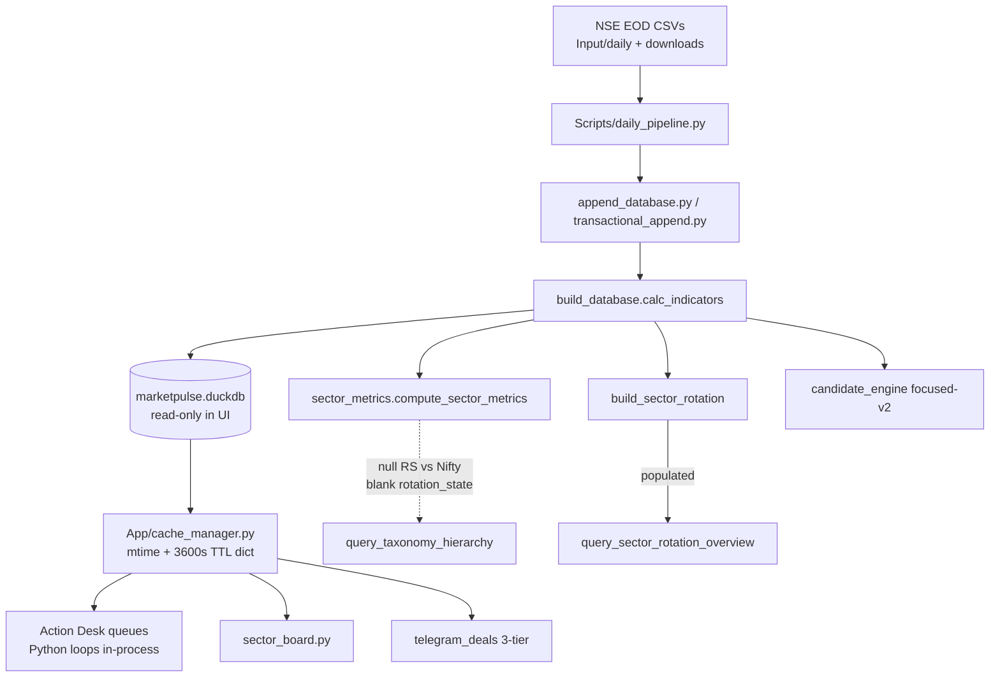
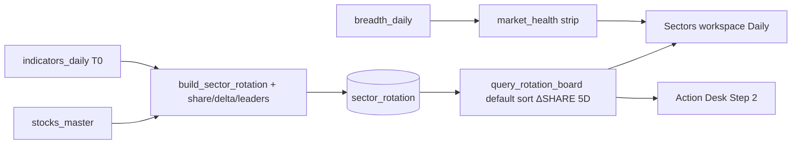

# MarketPulse 2.0 — Ruthless Audit and Upgrade Design

| Field | Value |
| :--- | :--- |
| **Title** | Institutional swing cockpit: audit, prune, and implementable upgrade |
| **Author** | MarketPulse design loop |
| **Date** | 2026-09-08 |
| **Status** | Draft (rev 2026-09-08d — Fixture B includes prior week) |
| **Audience** | Senior engineers who already know this repo |
| **Canonical path** | `docs/MARKETPULSE-AUDIT-AND-UPGRADE-DESIGN.md` |
| **Scratch mirror** | `C:\Users\SIDDHA~1\AppData\Local\Temp\grok-Siddhant.Patil\grok-design-doc-9e772730.md` |
| **Live DB as-of** | `indicators_daily` / `breadth_daily` / `sector_rotation` max date **2026-09-07** |
| **Does not supersede** | Recovery data-authority (`docs/superpowers/specs/2026-08-10-marketpulse-recovery-design.md`), read-only market DB, user-DB split, official-NSE EOD spine |

> [!WARNING]
> This is a critic + implementable upgrade, not a rewrite. The spine stays: NiceGUI + DuckDB, official NSE EOD, cash equities only, no live ticker, no unverified XBRL. Do not clone Screening Mantis. Borrow information architecture only.

---

## Executive Summary

MarketPulse 2.0 is an EOD warehouse that grew a swing-trading cockpit. The warehouse is competent. The cockpit is not yet a 10-second desk.

On 2026-09-07 the live database holds **1,222,069** `prices_daily` / `indicators_daily` rows (2024-05-06 → 2026-09-07), **2,401** names on the latest session, **581** breadth sessions, **22 / 12 / 59 / 187** taxonomy groups (Sector / Broad Sector / Broad Industry / Industry), and a Deals window from 2026-04-29. Indexes exist on the hot keys. Indicator math in `Scripts/indicators.py` is golden-tested and mostly leak-safe.

The product still lies in places a swing trader will notice before the first chart:

1. **The word “VCP” is a 4-factor heuristic**, not Minervini successive contractions (`Scripts/build_database.py` `vcp_score`). Action Desk Queue 1 (`App/pages/action_desk.py`) is “RS ≥ 70 and within 3.5% of a 20-day high,” not VCP.
2. **`focused-v2` is dead as a morning queue.** Latest `candidate_daily`: **0 Prepare, 24 Observe, 2,377 Blocked**. `screener_page` (`app.py:4523`) is an **unused wrapper** — not a default tab and **not** behind `MP_LEGACY_PAGES` (that flag only appends Today/Candidates, `app.py:4614–4619`). Do not demote it twice.
3. **Sector numbers are dual-sourced and one source is empty.** `sector_metrics_daily` latest Sector rows have **null `rs_vs_nifty_21d` / `rs_vs_nifty_63d` and blank `rotation_state`**. `sector_rotation` is populated (Healthcare rank 1 Leading). `query_taxonomy_hierarchy` still prefers the empty table. The Sectors tab toggle labels Industry as **“Industry (58)”** while `stocks_master` has **187 industries**.
4. **Darvas Squeeze is the best original setup in the app and is still internally inconsistent.** Queue uses 5.0% spread + 4.0% candle range + EMA20 alignment + 45-day box history. Chart drawer uses 3.5% / 3.5% and full history. Matrix columns hide `squeeze_pct`. There is no tightness-over-time, no failed-low-but-close-inside, no weekly.
5. **Playbook ≠ code.** Exposure bands, VCP invalidation copy, Darvas 3.5% field-guide vs 5.0% engine, and unsourced percentages (**82 / 71 / 56** pre-move, **21.6 / 9.6** band-runner, **78%** near-10-EMA) are not reproduced by any test that computes those numbers.

What is world-class and should be doubled down: official-NSE EOD discipline, point-in-time 52-week join, 3-tier Deals quarantine of 5% collars and pure PROP, TradingView paste (`to_tv_list` hyphen→underscore), Action Desk 3-column cockpit, and a real Darvas Pine-parity box.

The upgrade is not “more screens.” Slice 1 (ship now): canonical sector read model, exploded **Daily** Broad Industry board, unified daily Darvas, playbook generated from the four live exposure branches. Slice 2 (after contracts below): weekly group ranking and weekly Darvas. That is the path from a strong 7.5/10 warehouse-plus-cockpit to a 10/10 EOD terminal.

---

## 1. Quantitative & Indicator Audit

Live column inventory is `indicators_daily` (DESCRIBE 2026-09-07). Functions live in `Scripts/indicators.py` and `Scripts/build_database.py:calc_indicators`. Darvas is **not** persisted; it is computed in the UI process from OHLC.

### 1.1 Nicolas Darvas Box & 10 EMA Squeeze

**Box construction** (`App/indicators/darvas.py::calculate_darvas_box`, `boxp=5`):

```
LL = rolling min(low, 5)
k1 = rolling max(high, 5)
k2 = rolling max(high, 4)
k3 = rolling max(high, 3)
NH = high when high > k1[t-1]
confirm when bars_since_NH == 3 and k3 < k2
TopBox, BottomBox persist until next confirm
```

This is a faithful sequential port of the documented Pine `ta.valuewhen` definition. It is **not** lookahead: confirmation uses only bars up to `i`. Tests in `tests/test_darvas.py::test_darvas_box_trigger_confirmation` lock the 20.0 / 12.0 example.

**Squeeze predicate** (`is_darvas_10ema_squeeze`):

| Gate | Code | Default |
| :--- | :--- | :--- |
| Validity | `top_box > 0`, `ema10 > 0`, `close > 0`, not NaN | hard |
| EMA trend | if `ema20` provided: `ema10 >= ema20 * 0.995` | optional arg |
| Spread | `0 ≤ (top_box - ema10) / top_box * 100 ≤ max_squeeze_pct` | **5.0** in Action Desk, **3.5** in chart |
| Close vs green | `-0.2 ≤ (top_box - close) / top_box * 100 ≤ max_squeeze_pct` | same |
| OHLC inside | high/open/close ≤ `top_box * 1.002`; low/open ≥ `ema10 * 0.995`; close ≥ `ema10 * 0.998`; low ≥ `bottom_box * 0.998` | `require_ohlc_inside=True` |
| Candle range | `(high - low) / close * 100 ≤ max_candle_range_pct` | **4.0** desk, **3.5** chart |

Action Desk call site (`App/pages/action_desk.py` lines 410–461): last 45 sessions, `max_squeeze_pct=5.0`, `max_candle_range_pct=4.0`, `ema20` passed. Chart (`App/ui/stock_drawer.py::query_stock_candlestick_data` lines 163–174): **full history**, `3.5 / 3.5`, **ema20 not passed**.

> [!CAUTION]
> A name can sit in the Darvas queue and fail the inspector badge. Tests encode the split: `test_action_desk_darvas_squeeze_queue` asserts `squeeze_pct ≤ 5.0`; `test_stock_candlestick_darvas_indicators` asserts the *first* queue name is a 3.5% squeeze. That only works because the queue is sorted tightest-first.

**45-day window is a real miss.** `calculate_darvas_box` starts `current_top = nan` and only paints after a confirmation inside the window. A box confirmed 50 sessions ago is invisible to the queue and the name is dropped. The drawer, using full history, still draws the box. Severity: **high**. Mitigation: compute box on ≥252 sessions (or persisted series), then evaluate the last bar.

**Math soundness vs the user’s mental model** is in §8. Short version: current predicate is a *static containment* test. The user wants *tightening over time*, *wick-through-EMA allowed if close is inside*, and *20 EMA as floor when 10/20 are stacked*. Those three are not implemented.

**Div-by-zero / float:** squeeze uses `np.errstate(divide="ignore")` in `compute_darvas_metrics`; predicate guards `top_box > 0`. `squeeze_pct` is then `max(0, min(sq, 5))` in the queue — that **clips** a computed 5.01% display to 5.00% rather than rejecting. Cosmetic, but dishonest if a future caller reads the clipped column as the raw spread.

### 1.2 Relative Strength

Production RS (`calc_indicators` lines 625–644):

```
Q1 = close/close.shift(63) - 1
Q2 = close.shift(63)/close.shift(126) - 1
Q3 = close.shift(126)/close.shift(189) - 1
Q4 = close.shift(189)/close.shift(252) - 1
rs_score = 0.40*Q1 + 0.20*Q2 + 0.20*Q3 + 0.20*Q4   # min_count=4
rs_percentile = rank(pct) within trade_date * 100
```

This **is** IBD/Minervini quarterly mix and is leak-safe: missing quarters → NaN, not 0. Live 2026-09-07: **294 / 2,401 names (12.2%) have null `rs_percentile`**. `rs_3m_percentile` is filled for 2,362 names. Those 294 are exactly the IPO / short-history population the adaptive mixer was written for.

`Scripts/indicators.py::rs_adaptive_mix` exists, is unit-tested (`tests/test_candidate_semantics.py::test_rs_adaptive_mix_for_ipos`), and is **not called by `calc_indicators`**. Production still uses the inlined `min_count=4` path. `rs_percentile_primary`, `rs_percentile`, and `rs_percentile_no_fill` are three names for the same series.

> [!WARNING]
> Do **not** dump adaptive IPO scores into production `rs_percentile`. The mixer score for ≥252-bar names matches 40/20/20/20; the **percentile does not**. Ranking 294 extra names in the same `groupby(trade_date).rank` moves every mature name, including Action Desk `rs_percentile ≥ 70` gates. The early-history path (`63.0 / bar_count * cumulative return`) can park a 20-day listing at the top of the cross-section. Persist `rs_score_adaptive` / `rs_percentile_ipo` as **separate columns**. Keep `rs_percentile` as the min_count=4 universe (rank only names with four quarters). If IPOs must appear in Queue 1/2/4, gate them on `rs_3m_percentile` or `rs_percentile_ipo` with an “RS n/a (IPO)” chip — Open Question 2.

There is **no persisted RS rank history** at T-0 / T-5 / T-15 / T-30. `App/app.py` has a “last 5 session RS” helper around line 3726 for one research surface; it is not a first-class column and not what Mantis’s rank-history strip is.

Cross-section is the **full `indicators_daily` session (~2,401)**, not a liquid ₹1,000 Cr universe. Action Desk then filters mcap/band/ADV *after* ranking. A ₹200 Cr name can inflate a large-cap’s percentile. Severity: **medium**. Document the population on every RS cell.

### 1.3 ATR, ADR, NR7, RVOL, Delivery Thrust

| Metric | Implementation | Persisted? | Soundness |
| :--- | :--- | :--- | :--- |
| ATR SMA-14 | `atr_sma` = TR rolling mean, `min_periods=5`. Written to `atr_14` / `atr_pct`. | Yes | Not Wilder. Explicitly kept for compatibility. VCP contraction uses this (`atr_pct_avg_5d` vs 20d/50d). |
| ATR Wilder-14 | `atr_wilder` = ewm α=1/14. Written to `atr_14_wilder` / `atr_pct_wilder`. `atr_pct_primary` aliases Wilder. | Yes | Correct Wilder. **Unused by Action Desk stops.** Blue-sky geometry prefers SMA ATR first (`candidate_engine.py` lines 69–71). |
| ADR 20D % | `adr_pct` = rolling mean of `(high/low - 1)*100`, `min_periods=5`, zero-low → NaN. | **No column** | Function exists; never called from `calc_indicators`. Dead. |
| NR7 | `day_range == day_range.rolling(7).min()` | Yes, 314 true on 2026-09-07 | Exact float equality on `high-low`. Two bars with identical range both flag. Should be `≤` with a 1e-12 epsilon, or `(range == min) & (range.shift(1) > min)` for a single winner. |
| RVOL | `volume / rolling(20, min_periods=5).mean()` | Yes | Standard. Pre-move queues treat `rvol_arr` as 7 sessions (`LIMIT 7` in Action Desk SQL). |
| Delivery spike | `delivery_qty > 2 * avg_delivery_qty_20d` | Yes (`delivery_spike`) | Fine. |
| Delivery thrust | `App/market_summary.py::delivery_thrust`: close up, `delivery_pct ≥ 50`, `rvol ≥ 1.2`, mcap ≥ 1,000, LIMIT 20 | Query only | Reasonable tape scan. Not on Action Desk. |

True range itself is correct (gap-aware, previous close).

### 1.4 Blue-sky / all-time-high breakouts

`Scripts/candidate_engine.py` geometry (lines 67–99): if no resistance candidate (`first_resistance`, `high_50d`, `high_100d`, `high_252d`) is above pivot, project `pivot + 2.5 * atr_14` (SMA), else `pivot + 2.0 * max(pivot - invalidation, 5% of pivot)`, flag `geometry_warning = "blue_sky_projection"`. Test: `tests/test_candidate_engine.py::test_blue_sky_breakout_projects_resistance_and_is_valid`.

This is an honest R:R placeholder. It is **not** shown on Action Desk. Action Desk 52W queue uses `trigger = cmp * 1.005`, `stop = max(ema_20, low_10d)` with **no R:R gate** (mandate: zero stop-loss filtering in discovery — correct). The trader still needs a visible “no overhead / measured move = 2.5 ATR” chip so they do not invent a target from empty air.

`database_high = high.cummax()` and `away_database_high_pct` are loaded-history ATH, not NSE lifetime ATH. The friendly name “Loaded High %” (`Scripts/config.py`) is the honest one. UI that says “all-time high” without that qualifier is a lie.

### 1.5 Edge cases

| Case | Current behavior | Verdict |
| :--- | :--- | :--- |
| Lookahead | 52W is as-of joined (`asof_reference`). RS uses `shift`. Darvas is sequential. Weekly features `ffill` Friday bars onto later daily rows — correct for EOD. | Sound. |
| IPO / short history | RS NaN (294 names). Adaptive mixer unused. Action Desk VCP/pullback/52W require `rs_percentile ≥ 70`, so IPOs are excluded from classic queues and **allowed** in Darvas / pre-move (decoupled). | Darvas path is right; classic queues should show “RS n/a” not drop silently if the trader wants IPOs. |
| Div-by-zero | Widespread `nullif`, `replace(0, nan)`. | Sound. |
| Circuit-locked | Action Desk pool: `COALESCE(m.band, 20) > 5` and GSM / STAGE 2 remarks excluded. Deals: `band ≤ 5` → Tier 3B quarantined. | Sound and tested (`test_action_desk_enforces_strict_swing_quality_rules`). |
| Rights | `symbol NOT LIKE '%-RE'` / `'%_RE'`. | Sound. |
| Split-adjusted boxes | `price_adjustment_factors` exists. Darvas is computed from `indicators_daily` OHLC. If those OHLC are split-adjusted, boxes jump on ex-date. No Darvas-specific CA handling. | **Open risk** for weekly boxes especially. |
| `index_daily` depth | Only **48 sessions** (2026-07-02 → 2026-09-07). Local MA files (`Input/downloads/*/MA*.csv`, `Input/archive/MA*.csv`, `Input/daily/MA*.csv`) are **110 files / 48 unique dates** — the same window. `Scripts/index_history.py` already scans those paths. 63d vs-Nifty **cannot** be backfilled from this disk. `India VIX` same 48-day window; Action Desk hard-defaults VIX to **11.3** on query failure (`action_desk.py:85–101`). | High for display honesty (hide vs-Nifty, stop VIX 11.3). Historical MA download is a **blocked ops ticket**, not a code PR. |

### 1.6 VCP / Trend Template (honesty, because the desk is named after them)

Verified `vcp_score` (`build_database.py` 673–698):

```
trend_score        = 20 each: close>ema50, close>ema150, close>ema200, ema200 rising, RS≥70
contraction_score  = 25 each: range_5d<10d, range_10d<20d, atr5<atr20, atr20<atr50   # SMA ATR
volume_dryup_score = 25 each: vol5<vol20, vol5<vol50, rvol<1, dryup_pct>20          # current bar rvol
pivot_proximity    = 100 - clip(distance_below_52w,0,20)*5
vcp_score          = 0.30*trend + 0.30*contraction + 0.25*dryup + 0.15*pivot
```

There are no named contractions, no 3T/VCP pivot = last-contraction high, no stop = last-contraction low. `base_quality_score` is an alias. Breadth `vcp_candidates = 703` on 2026-09-07. Market-health strip maps that count to a card titled **“Recent breakout”** (`App/ui/market_health.py` lines 152–159). That is a naming crime: 29% of the universe is not in breakout.

Minervini Trend Template 8-rule pass is computed (`trend_template_pass_n` / `trend_template_pass`) and **not used as an Action Desk gate**. Queue 1 uses a stripped “above 200 + RS 70 + near 20d high” instead of the 8-rule checklist.

---

## 2. UI / UX & Cognitive Ergonomics Audit

### 2.1 Can a trader decide in <10 seconds at 08:30 / 15:45?

**Almost, on Action Desk, if they already trust the queues.** Default landing is Action Desk (`App/app.py:main`, `MP_DEFAULT_TAB` default `"Action Desk"`). Layout is a real cockpit: Exposure → Leading Sectors → 8 queue buttons → matrix → inspector (`mp-cockpit-container`).

What burns the 10 seconds:

| Friction | Where | Cost |
| :--- | :--- | :--- |
| Exposure is a paragraph, not a traffic light you can trust | Left card recomputes breadth from `indicators_daily` (`action_desk.py:64–82`) instead of reading `breadth_daily`. After PR 4 the strip uses `breadth_daily` — two universes unless exposure is wired to the same row. Playbook bands ≠ code bands. | Re-read every morning. |
| Leading sectors = top 4 by **average stock RS**, not turnover share or rank-change | `fetch_action_desk_data` SQL `ORDER BY avg_rs DESC LIMIT 4`. Financial Services can lead turnover and rank 10 Lagging on the rotation table. | Wrong group emphasis. |
| Darvas matrix hides the only columns that matter | `display_cols` = symbol, ticket, band, 10EMA%, deals, rvol trail, theme, cmp, trigger, stop, day%, rvol, delivery, RS, sector. **No `squeeze_pct`, `darvas_top`, `candle_range_pct`.** | Open inspector to learn why it qualified. |
| Queue 1 is labelled VCP | Predicate is not VCP. | Semantic tax. |
| 8 queues, chips for every symbol, then a 10-row table | Chip strip duplicates the table. Darvas `head(150)` vs others `head(15)`. | Darvas is a dump, not a queue. |
| Info tab is a reading room | Macro essays, chronology, case studies. Not linked to today’s tape. | Zero 08:30 value. |
| focused-v2 Screener | `screener_page` unused wrapper. **Not** a default tab. **Not** `MP_LEGACY_PAGES`. | Dead code, not a morning tab. |
| Two sector surfaces | Default **Sectors** tab = `sector_board.py`. `sector_intel.py` (1,190 lines, RRG + taxonomy) is **imported and never mounted**. | Explorer tax. |

Verdict: a trained user can copy a Darvas/Silent Coil TV list in <10 seconds. They cannot *know* the tape, the leading industry, and why a name is in the list in <10 seconds. That is the gap.

### 2.2 Density vs clutter

The Action Desk is the right density experiment: badges (`10% ⚡`, `🏛️ +₹Cr`, ticket `1.3x 🏛️`), rvol trail `0.4x -> 0.3x -> 0.2x`, emerald/rose/amber tokens (`--mp-surface`, `--mp-primary` in `App/ui/styles.py`). Column registry (`App/ui/columns.py`) is actually professional.

Clutter sources:

- Emoji as UI chrome (`💎 ⚡ 🎯 🤫 📈 📦 🏛️`). Fine in a personal tool; noisy at 08:30.
- `why_now` strings are templates, not evidence.
- Theme tags from `get_stock_thematic_tags` (`marketpulse_user.duckdb`) inject a second, non-NSE taxonomy into the matrix.
- Momentum tab still exists as a first-class peer (`special_watchlist_page`) with subtitle “Tighter trend template.”

### 2.3 TradingView export

`Scripts/telegram_deals.py::to_tv_list`: strip, upper, `-` → `_`, `NSE:` prefix, de-dupe, optional `###header,` prefix. Clipboard (`App/app.py::copy_text_to_clipboard`) writes NiceGUI clipboard **and** a JS fallback (`navigator.clipboard` / `execCommand`). Dual-arg signature is tested.

Remaining failures:

- `symbols_text` still defaults `min_mcap_cr=900`, `require_above_ema200=True`. GEMINI.md already forbids silent truncation for visible rows. Research copy buttons that go through `symbols_text` can drop Stage-1 names the table is showing.
- Action Desk `all_focus` concatenates 8 queues including Darvas’s 150 names. TradingView paste of 200+ tickers works but is not a watchlist a human will arm.
- No length warning. Telegram path chunks at 4,000; UI path does not.
- Invalid tickers: `tradingview_symbol` does not validate against `stocks_master`. `&` names, spaces, or series suffixes other than `-RE` can emit `NSE:FOO&BAR`.

### 2.4 Visual hierarchy

Exposure banner + queue counts + inspector is the right skeleton. Failures: Action Desk header still says **“the 4 actionable setup queues”** (`app.py:2172`) while eight exist; the `action_desk.py` module docstring still says **“5 Actionable Setup Queues.”** Market-health strip (`render_market_health_strip`) is already on **Desk** (`pages/desk.py:141`), Momentum, and Screener; **not** on Action Desk (which rolls its own 6-row mini-strip) or Sectors. Candlestick drawer Darvas markArea is genuinely good (`render_inline_candlestick_chart`). Inspector is the right pattern; it is slower than it should be because `query_stock_candlestick_data` pulls **all** history for the symbol then `tail(limit)`.

### 2.5 Playbook vs code vs Info tab

`App/ui/playbook_guide.py` and `App/pages/info_page.py::_render_trading_guide` are the same doctrine, copy-pasted.

| Claim | Playbook / Info | Code |
| :--- | :--- | :--- |
| Aggressive exposure | “>50% above 20 EMA, VIX < 15”, bands 75–100 / 25–50 / 0–25 | `adv≥58 AND ab20≥48 AND ab200≥45 AND vix<15 AND not vix_spike AND not net_lows`. Four bands including **50–75% Constructive** and **0–15%** Risk-Off. |
| VCP | “tight <6% invalidation” in queue_meta desc | **No `risk_pct` filter.** Mandate forbids it. Copy is leftover. |
| Darvas | Field guide: `squeeze_pct < 3.5%` | Engine: 5.0%. |
| Silent Coil RVOL | Guide: `≤ 0.6x` | Code: `rvol ≤ 0.70`. |
| “82% / 71% / 56% hit rate” | Queue titles and Momentum leftover (`app.py:2853` inside `special_watchlist_page`) | No test computes these. |
| “21.6% vs 9.6% runner” / “78% within ±3% of 10 EMA” | `playbook_guide.py:60, 86, 101`; `info_page.py:478` | Same class of unverified claim. Delete or footnote. |
| 15-min routine | “4:00 PM – 9:00 AM” | User’s actual windows are **08:30 and 15:45**. |
| Holy Trinity 10 EMA | “[-1.5%, +2.0%]” on Info, “[-1.5%, +2.5%]” in modal | Silent Coil: `abs(away_10ema)≤2.5 or abs(away_20ema)≤2.5`. |

Info tab usability at the desk: **no**. Macro playbook cards (crude → ASIANPAINT, silver → HINDZINC) are fine Sunday reading. They do not bind to `index_daily` or positions. Data Health sub-tab is the only operationally useful pane. The Swing Trading Playbook button that opens the same modal already linked from Action Desk is duplication.

`app.py:2804–2895` leftover Darvas / Silent Coil tabs sit inside **Momentum** (`special_watchlist_page`), not a second Action Desk page. Still code rot; delete in PR 10.

---

## 3. Architecture, Pipeline & Performance Audit



### 3.1 DuckDB hygiene

**Scale:** ~1.22M indicator rows, ~2,400 names × ~581 sessions. Not 5–10 years. At 10 years this design will hurt.

**Indexes present:** `idx_indicators_symbol_date (symbol, trade_date)`, `idx_prices_symbol_date`, `idx_deals_symbol_date`, `idx_breadth_date`, `idx_sector_rotation (level, group_name, trade_date)`, `idx_sector_metrics` same, `idx_candidate_date_score`. Duplicate `idx_index_date_name` and `idx_index_daily_date_name`.

**Missing / painful:**

- No `(trade_date)` leading index on `indicators_daily`. Latest-session scans (`WHERE trade_date = max`) are sequential filters on a 1.22M-row table. DuckDB will still scan a lot. At 5–10y this is the first index to add: `idx_indicators_date_symbol (trade_date, symbol)`.
- Action Desk `setup_pool` joins `indicators_daily` ⨯ `stocks_master` ⨯ 7-day `ARRAY_AGG` history, then a second 45-day OHLC pull for pool symbols. Two round-trips, then **Python** `groupby` Darvas and three `iterrows` pre-move scans.
- Deals attach uses `max(trade_date) - INTERVAL 25 DAY` (calendar), not 25 **sessions**.
- `query_stock_candlestick_data` selects all rows for a symbol (index-friendly) then Python-tails. Fine at 581 bars; wasteful at 2,500.
- `schema.sql` is a **partial** DDL (candidate/sector_metrics/signals). The real warehouse is created in `build_database.py` (`CREATE TABLE AS SELECT`). Drift is guaranteed.

### 3.2 cache_manager — can stale session data reach the trader?

File: `App/cache_manager.py`. Not LRU. Unbounded `dict[str, tuple[float, Any]]`, TTL 3,600s.

- `cache_key(..., session_date=None or "latest")` embeds `st_mtime_ns`. Pipeline rewrite → new key. **Good.**
- Specific `session_date` keys **ignore mtime**. A rebuild of the same date can serve yesterday’s object until TTL. Action Desk uses `None` (mtime path). Chart uses `"latest"` (mtime path). Deals telegram cache uses `None`. **Mostly good.**
- No max entries. A long research session that opens 200 drawers leaves 200 DataFrames in RAM for an hour.
- Process-local. Multi-worker NiceGUI would split caches; current `ui.run` is single process.
- **Stale risk that remains:** if DuckDB is updated in-place without bumping file mtime, the 1-hour TTL is the only safety. Severity: **low–medium**.
- **`invalidate_cache()` at the end of `daily_pipeline.py` is not a fix.** The pipeline is a different process; it would clear the pipeline’s empty dict and leave the UI cache untouched. Cross-process safety today is `st_mtime_ns` (GEMINI.md invariant 5). Mitigation that actually works: for `'latest'` / `None` keys, embed **`max(trade_date)` from `indicators_daily`** (and optionally a row count) **in addition to mtime**. Bound `_CACHE` at 256. Do not list pipeline `invalidate_cache()` as cache-correctness work.

### 3.3 Logic leaking into NiceGUI

`App/` is supposed to be presentation. Reality:

| Belongs in Scripts/ | Currently |
| :--- | :--- |
| Darvas box + squeeze | `App/indicators/darvas.py` (right module, wrong package — UI import) |
| Action Desk predicates | `App/pages/action_desk.py::fetch_action_desk_data` (600 lines of SQL + pandas) |
| Sector aggregation overlays | `App/sector_read_model.py::_computed_sector_overview` invents `rank_change_5d = 0`, `turnover_expansion` fallback, RRG quadrants |
| 3-tier deals | `Scripts/telegram_deals.py` (correct) called from `App/pages/research/deals.py` |

`App/app.py` is **4,660 lines**. It still owns Momentum, a nested taxonomy expansion tree, `strong_groups_page`, `vcp_lab_page`, leftover Momentum pre-move tabs (`:2804–2895`), `symbols_text`, and the nav shell. Pages were peeled; the god file was not deleted.

`Scripts/query_service.py::load_market_context` is **never called** by any App page (grep: definition only).

---

## 4. Candid Critique

### 4.1 Genuinely elite (keep and double down)

1. **Official NSE EOD spine with checksums and point-in-time 52W.** `calc_indicators` as-of join, `distance_below_high` clip, dual ATR. This is the unglamorous thing most Indian “screeners” fake.
2. **Darvas Pine-parity box + a squeeze idea that is actually original.** `App/indicators/darvas.py` + Action Desk Queue 5. Not a Mantis clone. The containment geometry is trader-native.
3. **Deals 3-tier with quarantine.** `telegram_deals.py` mutually exclusive Conviction / Fresh Whale / Prop-only / 5% collar. Entity keywords in `institutional_engine.py`. TV lists with headers. This is closer to a prop desk blotter than a retail bulk-deals dump.
4. **Action Desk cockpit IA.** Three-step funnel, queue counts, inspector, TV copy on the same page. `App/pages/action_desk.py` render path. The *shape* is hedge-fund-terminal. The *labels* are not.
5. **Column contract + clipboard dual-signature + no silent TV truncation policy.** `App/ui/columns.py`, `copy_text_to_clipboard`, GEMINI.md invariants. Rare in a NiceGUI app.

### 4.2 Most annoying / bloated / slow / confusing

1. **`App/app.py` 4,660 lines + dead `sector_intel.py` 1,190 lines never mounted.** Two sector products, one nav slot, a toggle that says Industry (58).
2. **`vcp_score` / Queue 1 / market-health “Recent breakout” / 703 VCP candidates.** Four UIs, zero contractions.
3. **Playbook hit-rate mythology (82/71/56 and 21.6/9.6/78) and exposure bands that do not match `fetch_action_desk_data`.** Trains the user on the wrong regime.
4. **Python `iterrows` over the setup pool for three pre-move queues plus per-symbol Darvas on 45 bars**, on every cache miss. Fine at 2,400 names today; insulting as architecture.
5. **`focused-v2` with 0 Prepare** still compiled as `screener_page` and as a health-card religion, even though it is **already off default nav**. Treat it as Diagnostics copy, not a tab to remove twice.

Honorable mention: `rs_adaptive_mix` and `adr_pct` implemented, tested, and not wired (wire adaptive as a **side column**, not into `rs_percentile`). `industry_state = "Unknown"` hardcoded in `candidate_engine.py:279`.

---

## 5. Keep / Fix / Cut Decision Matrix

| Module / feature | Path | Decision | Why |
| :--- | :--- | :--- | :--- |
| Darvas box + squeeze | **`Scripts/darvas_squeeze.py` (new home)**; `App/indicators/darvas.py` becomes a one-release re-export | **KEEP / MOVE** | One module path. Pine box stays; squeeze predicate unifies. |
| Darvas daily queue | `action_desk.py` Queue 5 | **FIX** | 252-bar box, truth-table wick, matrix columns, display window 40, unclipped count on the button. |
| Weekly Darvas | (missing) | **ADD in slice 2** | Same predicate on completed weeks only. Blocked on §8.4. |
| Action Desk cockpit | `action_desk.py` UI | **KEEP** | Right IA. |
| Desk (tape) tab | `pages/desk.py` | **KEEP** | First-class default tab. Already has the health strip. |
| SMA Template tab | `pages/sma_template.py` | **KEEP** | Honest Minervini SMA 50/150/200 gate. |
| Exposure gate | `fetch_action_desk_data` + playbook | **FIX** | Four live `if/elif` branches in `desk_contract.py`. Inputs `adv_pct` / `ab20_pct` / `ab200_pct` from the **same `breadth_daily` row as the health strip**; `indicators_daily` recompute is fallback only. VIX n/a not 11.3. |
| Pre-move queues 6–8 | Silent Coil / Stair-Step / Spike-Pause | **FIX** | Keep predicates; drop fake hit rates (82/71/56 **and** 21.6/9.6/78); vectorize; cap at 25. |
| Queue 1 “VCP” | action_desk | **FIX** | Rename to “Near 20D Pivot” until contraction engine exists. `QUEUE_DISPLAY_CAPS` key `near_pivot`, not `vcp`. |
| `vcp_score` 4-factor | `build_database.py` | **LET GO** as a product name | Persist as `base_quality_score` only. Health card 7 stays a slot: retitle “VCP heuristic,” do not drop. |
| focused-v2 Screener | `screener_page` unused wrapper | **KEEP file / not on any nav** | 0 Prepare. Not `MP_LEGACY_PAGES`. Optional Diagnostics copy under Info. |
| Momentum tab | `special_watchlist_page` | **KEEP in nav / FIX copy** | Default tab today. Research scan, not a peer of Action Desk. Delete leftover pre-move block `:2804–2895`. |
| Deals 3-tier | `telegram_deals.py` + `pages/research/deals.py` | **KEEP** | Best institutional surface. |
| `to_tv_list` | `telegram_deals.py` | **KEEP** | One helper for all pages. |
| `symbols_text` default gates | `app.py` | **FIX** | Visible row = copied row. |
| `sector_rotation` table | `build_sector_rotation` | **KEEP** as rotation source | Populated, has rank Δ. |
| `sector_metrics_daily` | `Scripts/sector_metrics.py` | **FIX** | Stop preferring it for UI ranks. Hide vs-Nifty until MA history exists. If `_computed` remains as fallback, require `rs_vs_nifty_63d.notna().any()` before assigning `rotation_state`; else “insufficient index history” and skip quadrants. |
| `sector_intel.py` | `pages/research/sector_intel.py` | **HARVEST then deprecate** | Unmounted. PR 3 harvests `_render_taxonomy_tree_workspace` (**starts :568**; `ui.tree` **:782–797**) plus CSS; then mark deprecated. |
| Taxonomy tree in `app.py` ~1400 | nested `ui.expansion` | **CUT** | Replaced by exploded workspace. |
| `strong_groups_page`, `vcp_lab_page` | `app.py` | **CUT** | Dead. |
| Leftover pre-move tabs | `app.py:2804–2895` inside Momentum | **CUT** | Duplicate of Action Desk. |
| Market-health strip | `ui/market_health.py` | **FIX** | Also mount on Action Desk + Sectors (already on Desk). Retitle card `breakout` → “VCP heuristic” (keep 7 cards; `tests/test_market_health.py` asserts exactly 7 including `breakout`). |
| `cache_manager` | `App/cache_manager.py` | **FIX** | Bound size 256; key `mtime` **and** `max(trade_date)`; no pipeline `invalidate_cache()`. |
| `rs_adaptive_mix` | `indicators.py` | **KEEP / persist separately** | `rs_score_adaptive` + `rs_percentile_ipo`. Do not write into `rs_percentile`. |
| `adr_pct` | `indicators.py` | **KEEP / WIRE** | Persist `adr_20_pct`. Useful for Darvas range context. |
| Info macro essays | `info_page.py` | **KEEP** off the morning path | Sunday reading. |
| Playbook modal | `playbook_guide.py` | **FIX** | Generated from `desk_contract`. Delete 82/71/56 and 21.6/9.6/78. |
| Watchlists hub | `ui/watchlist_hub.py` | **KEEP** | Local WL1/2/3 + TV. |
| Thematic tags in Action Desk | `thematic_engine` | **LET GO** from default matrix | NSE industry is enough. Optional column. |
| CMF | (none) | **DON’T ADD now** | Mantis has it; we lack a documented group aggregation and must not average stock CMF. |
| Earnings reaction | (none) | **DON’T ADD** | No trusted event source. |

---

## 6. Engineering & UI Roadmap

Leverage order. These five *are* the proposed design.

| # | Upgrade | From → To | Why first |
| :--- | :--- | :--- | :--- |
| 1 | Canonical sector read model + exploded **Daily** Sector Rotation workspace | Dual empty/full tables, 22-sector average-RS strip, “Industry (58)” lie | Answers “which group is leading?” Sort key is a named column, not `rotation_rank`. |
| 2 | Darvas Squeeze **daily** unify + tighten | Queue ≠ chart, 45-bar miss, hidden columns | User mandate. Weekly Darvas is slice 2. |
| 3 | Action Desk 10-second truth | Playbook ≠ code, VCP lie, hidden squeeze columns, 4-vs-8 header | Morning path. |
| 4 | Shared market-health strip | Missing on Action Desk/Sectors; “Recent breakout” maps VCP count | Regime before names. Keep 7 cards. |
| 5 | Peel / prune / persist | God file, dead pages, unwired ADR, cache dict | `rs_percentile` stays min_count=4. |

**Slice 2 (after slice 1):** weekly group ranking per §7.4.1 column contract; weekly Darvas per §8.4 completed-week predicate; MA-history ops ticket (not a code PR).

Default nav (one table — live `tab_specs` plus this design’s keep/cut):

| Tab | Live default? | This design |
| :--- | :--- | :--- |
| Action Desk | yes (landing) | **KEEP** |
| Desk (tape) | yes | **KEEP** |
| Momentum | yes | **KEEP** (research scan; delete leftover pre-move block) |
| Template (SMA) | yes | **KEEP** |
| Sectors | yes | **KEEP / rebuild in place** |
| Deals | yes | **KEEP** |
| Watchlists | yes | **KEEP** |
| Portfolio | yes | **KEEP** |
| Info | yes | **KEEP** |
| Screener focused-v2 | **no** (unused `screener_page` wrapper) | not a tab; not `MP_LEGACY_PAGES` |
| Today / Candidates | `MP_LEGACY_PAGES` only | unchanged |

Detailed design for 1–2 is §§7–8 and Proposed Design. 3–5 are specified there as interfaces.

---

## 7. Sector Intel — Audit and Exploded Rotation Workspace

### 7.1 What exists today (verified 2026-09-07)

**Taxonomy in `stocks_master`:** 2,406 names, **12 Broad Sectors, 22 Sectors, 59 Broad Industries, 187 Industries**. Capital Goods alone is 380 names. That is not a “sector” a Minervini trader can trade.

**Two persisted aggregations, same grain, different truth:**

| Table | Latest rows | `rs_vs_nifty_21d` | `rotation_state` | Rank Δ |
| :--- | ---: | :--- | :--- | :--- |
| `sector_metrics_daily` | 280 (12+22+59+187) | **all null** | **blank** (`compute_sector_metrics` sets `rotation_state = ""`) | n/a |
| `sector_rotation` | 280 | n/a (has `rs_percentile` mean of stock RS) | populated (Leading / Weakening / …) | `rank_change_5d` / `_20d` live |

Sample `sector_rotation` Sector 2026-09-07: Healthcare #1 Leading RS 62.3, Oil/Gas #2 Leading, Capital Goods #3 Weakening (turnover ₹17,822 Cr), Financial Services #10 Lagging (turnover ₹18,927 Cr).

**Read-model split brain:**

- `query_sector_rotation_overview` **prefers `sector_rotation`** if rows exist (`sector_read_model.py:517–541`). Board ranking can be right.
- `query_taxonomy_hierarchy` **prefers `sector_metrics_daily`** if the table has any date (`:246–261`). Tree RS/state are zeros / “Neutral.” Only caller today is unmounted `sector_intel.py`.
- `_computed_sector_overview` reads **`sector_metrics_daily` only**. It never sees `sector_rotation`. It maps `rs_percentile = rank(rs_vs_nifty_63d)` on an all-null column, sets `return_5d_pct = 0.0` then overlays indicators, hard-sets `rank_change_5d = 0`, and if vs-Nifty abs-sum is 0 invents RRG from `rs_percentile.fillna(50)` (`:422–441`). The tree is not merely blank — it is a **synthetic Leading/Lagging map**. Fix is “do not call `_computed` for UI ranks,” not “stop it from zeroing rank Δ when rotation has it” (rotation never enters that function).

**UI split brain:**

- Default Sectors tab → `build_sector_board_page`. Toggle `{"Sector": "Sector (22)", "Industry": "Industry (58)"}`. **58 is Mantis’s number, not ours.** Industry level in DuckDB is 187. Broad Industry (59) is the closest analogue to Mantis’s 58 and is **not even a toggle option**.
- “Weekly” re-sorts the same daily row by `return_5d_pct` and relabels RANK as WK RANK. It does **not** resample weekly bars.
- Heatmaps: 15-session turnover share + vs-history from `sector_rotation` (`query_turnover_heatmaps_data`). Real and useful.
- RS leadership T0 vs T-5: `query_rs_leadership_data` uses last 6 distinct dates, `dates[-1]` as T-5 — **that is T-5 only if 6 dates exist; it is T-(n-1)**. Fragile.
- Indices panel filters `index_daily` with `LIKE 'NIFTY%'` excluding 100/200/500/Nifty 50. Depth = 48 sessions.
- `build_sector_intel_page` (RRG quadrants, taxonomy workspace) is **not in `tab_specs`**. Dead product.

**Action Desk Step 2** ignores all of the above and averages `rs_percentile` per `stocks_master.sector`, LIMIT 4.

### 7.2 Screening Mantis — what was verified this run vs what was not

**This run (Chrome DevTools, 2026-09-08, signed-out `https://www.screeningmantis.com/`):**

- Market-health strip: Advance/decline **-6.5%** (12.7 pts), Above 20 EMA **44.0%**, Above 200 EMA **50.4%**, RSI>60 **21.8%**, Above daily pivot **39.8%**, Near 52w high **28.5%**, Recent breakout **12.0%**.
- Header indices: Nifty 50 23,635.1 −0.61%; LargeCap 100; MidCap 150; SmallCap 250.
- Stocks table: date **2026-09-08**, **1,538 stocks match**, grouped headers PRICE & VOLUME / EMAS / PIVOTS / BREAKOUT STOCKS / RELATIVE STRENGTH / EARNINGS / PRICE MOVES, Daily/Weekly, cap + sector scopes, Sign in visible.
- Sectors control is a button with `haspopup="dialog"`. Clicking it expanded the dialog host; **this run did not inspect an authenticated Sectors workspace.** Do not treat that click as a Sectors page review.

**Authenticated Sectors workspace:** use `learnmantis.md` only (reviewed 2026-09-03, data label 2026-09-02): Nifty Indices 21, Sector Ranking ~58 groups with Turnover / %chg / Share / Δshare / A/D net / Avg RSI / %>20EMA / %BO 10d / 3 leaders, 15-session heatmaps, CMF 4-point trend, RS T0 vs T-5, sector-to-stock drilldown.

**Do not clone.** Do not scrape. Do not add CMF until aggregation is documented as sum(MFV)/sum(volume) at group level. Do not add earnings columns. Universes differ (1,538 vs 2,401); never compare percentages as if they were the same population.

### 7.3 Answers to the three product questions

**1. Is there a better way to present this data?**  
Yes. Stop making the trader choose between a 22-row average-RS table, an unmounted RRG, and a nested expansion tree. One workspace: **regime strip → exploded hierarchy → ranking table at Broad Industry → drill to Industry → leaders → stocks.** Ranking is the metric the user clicked, not a hidden composite.

**2. What view shows which sector / industry is leading?**  
Not Action Desk Step 2 as written (average stock RS). Not `rotation_rank` (composite soup that parks Financial Services at #10 while it prints ₹18,927 Cr). The honest view is `sector_rotation` **sorted by a named column**. This design’s default named column is **`turnover_share_delta_5d`** (session-lag share change). Composite `rotation_rank` may remain a debug column. The missing grain is Broad Industry (59) with Δ share and named leaders.

**3. Can we use a more exploded view into broad sectors and industry?**  
Yes, and we already have the keys (`broad_sector`, `sector`, `broad_industry`, `industry`). Explode **down**, don’t flatten 187 industries into a 22-row average. Default rank grain = **Broad Industry (59)** — same order of magnitude as Mantis’s 58, still NSE-official. Group headers = Broad Sector (12). Drill path: Broad Sector → Broad Industry → Industry → stock.

### 7.4 Proposed Sector Rotation workspace (implementable)

**Canonical read model (Phase 0, blocking):**

1. `sector_rotation` is canonical for **rotation UI** (returns, breadth, turnover, rank Δ, state).
2. `sector_metrics_daily` is **not** shown for vs-Nifty until `rs_vs_nifty_63d` is non-null on the as-of date (local MA files cannot fill this). UI copy: “insufficient index history.”
3. Do not call `_computed_sector_overview` for UI ranks. If it remains as a fallback, require `rs_vs_nifty_63d.notna().any()` before assigning `rotation_state`; otherwise return empty quadrants and the insufficient-history badge. **Forbid synthetic RRG** from `rs_percentile.fillna(50)`.
4. Extend `tests/test_sector_rotation_contract.py` (do not invent a parallel file): fail if the selected source would display 0.0 / Leading from null vs-Nifty.

**Default sort (named column, not composite):**

- Board and Action Desk Step 2 both default-sort **`turnover_share_delta_5d` DESC** (session lag). Card subtitle prints `Δ SHARE 5D`.
- `rotation_rank` stays on the table as a debug column; it is **not** “who is leading.”
- `query_sector_rotation_overview(db_path, level="Sector")` **function default stays `"Sector"`** (backward compatible). The board calls `query_rotation_board(..., level="Broad Industry")`.

**Persisted additions (PR 3 owns these + `Scripts/migrations.py`):**

| Column | Definition |
| :--- | :--- |
| `turnover_share_pct` | `turnover_1d_cr / sum(turnover_1d_cr) * 100` at same `(level, trade_date)` |
| `turnover_share_delta_1d` | share[T0] − share[T-1] **sessions** |
| `turnover_share_delta_5d` | share[T0] − share[T-5] **sessions** (`lag(share, 5) OVER (PARTITION BY level, group_name ORDER BY trade_date)`) |
| `adv_pct` | `count(members where close > prev_close) / stock_count * 100` on that `trade_date`. Unchanged names are not in the numerator. |
| `leader_symbols` | `VARCHAR`, **comma-joined** `SYM1,SYM2,SYM3`, mcap ≥ 1000, top 3 by `rs_percentile` DESC, tie-break `symbol` ASC |

Until persisted, `query_rotation_board` may compute share/delta live from `sector_rotation.turnover_1d_cr` history (same formulas). PR 3 still ships migrations so append path grows the columns.

Do **not** add CMF or earnings.

#### 7.4.1 Weekly ranking contract (slice 2 — not v1)

`resampled_timeframe_features` resamples **one stock’s OHLC**. It is **not** the group aggregator. Do not cite it for sector ranking.

**v1 Sectors toggle:** keep Daily | Weekly, but Weekly **must** label itself **“5D % sort (daily rows)”** — the current costume (`sector_board.py:371–375`) until this contract ships. No `W-` prefix on daily columns in v1.

**Slice 2** adds `query_sector_rotation_overview(..., timeframe="W")` (kw-only, default `"D"`).

**Week identity:** same `calendar_friday` / `week_complete` / `week_end_session` as §8.4. Do **not** use `as_of >= week_end_session` — that false-completes Mon–Thu when the frame is truncated at `as_of` (the live desk path).

**Column-by-column weekly dictionary** (grain = selected taxonomy level; members = `stocks_master` names at that level; Min names / Min T/O apply **after** SQL as table filters):

| UI column | Source | Grain | Formula | As-of |
| :--- | :--- | :--- | :--- | :--- |
| `turnover_1d_cr` (header `W T/O`) | `indicators_daily.turnover_cr` | members × sessions in the completed W-FRI period | `sum(turnover_cr)` | `last_completed_week` |
| `turnover_share_pct` | that sum | level | group weekly T/O / market weekly T/O × 100 | same |
| `turnover_share_delta_1w` (header `W Δ SHARE`) | weekly shares | 1 **completed week** lag | `share[this week] − share[prior completed week]` | not `_5d` |
| `return_5d_pct` (header `W %`) | `indicators_daily.close_price` | members with both week_end closes | equal-weight mean of `close[week_end] / close[prior_week_end] - 1` | two completed week_ends |
| `rs_percentile` (header `W RS`) | weekly `W %` | groups at this level | `rank(pct)*100` of weekly group returns | **not** Friday’s daily RS mean |
| `above_50ema_pct` | `indicators_daily` on `week_end_session` | members | `% with close > ema_50` (**daily** EMA on week_end) | Fri or Thu session |
| `above_20ema_pct` | same | members | `% with close > ema_20` daily on week_end | same |
| `near_52w_highs` | `away_52w_high_pct` on week_end | members | count `>= -5` | daily field as-of week_end |
| `adv_pct` | close vs prev_close on week_end | members | daily A/D on week_end (tooltip says so) | week_end session |
| `rotation_state` | `sector_rotation` daily row `(level, group, week_end)` | group | **copied, not recomputed** | “state as of week_end (daily definition)” |
| `rank_change_5w` (header `W RANK Δ5`) | weekly `W %` ranks | 5 **completed weeks** | this week’s rank − rank 5 weeks ago | omit if <6 completed weeks |
| Heatmaps | `query_turnover_heatmaps_data` | 15 **sessions** | unchanged in weekly mode | caption: daily 15-session, independent of ranking timeframe |
| RS T0 vs T-5 bars | `query_rs_leadership_data` | sessions | T-k = k-th prior session, **not** `dates[-1]` | daily RS; not rebuilt for weekly |

Do not write a 1-week lag into `turnover_share_delta_5d`. Daily keeps `_5d` (5 sessions). Weekly share-change is `_1w`. Weekly rank Δ is `_5w`.

`min_turnover_cr=200` in weekly mode is compared to **`W T/O`** (sum of member `turnover_cr` over the completed week), not to daily `turnover_1d_cr`. `min_names=8` is still a stock-count filter on members as of `week_end_session`.

`query_sector_rotation_overview(..., timeframe="W")` returns the same dict shape as Daily (`leaderboard`, `as_of=week_end`, `quadrants` from copied daily state). Empty if no completed week.

#### 7.4.2 Widget / query boundary (PR 3)

| Symbol | Role |
| :--- | :--- |
| `query_rotation_board(db_path, *, level, as_of=None, timeframe="D", min_names=8, min_turnover_cr=200.0)` | Leaderboard. Daily default sort `turnover_share_delta_5d` DESC; weekly default sort `turnover_share_delta_1w` DESC. `min_*` applied after fetch. Weekly `min_turnover_cr` is vs **W T/O** (completed-week sum). `timeframe="W"` is slice 2; v1 ignores it and the toggle shows the 5D-sort costume label. |
| `query_group_members(db_path, *, level, group_name, as_of=None)` | Stocks in that group on `as_of`. Replaces `movers()` which only knows `sector`/`industry` (`sector_board.py:308`). Must accept `Broad Industry` / `Broad Sector`. Columns: symbol, close, 1D, 5D, RS, rvol, away_52w, turnover, mcap. |
| `query_child_groups(db_path, *, parent_level, parent_name, child_level)` | Industry rows inside a Broad Industry, etc. Taxonomy is a strict tree (0 Broad Industries with two Broad Sector parents — verified). |
| `query_turnover_heatmaps_data` | Keep. Session-lag helper for T-5. |
| `query_rs_leadership_data` | Fix T-5 = 5th prior session. |
| `render_market_health_strip` | Mount above the board. |

**Navigator:** CSS already exists: `.mp-sector-workspace` is `minmax(320px, 0.42fr) + 1fr` (`App/ui/styles.py:1032`). Reuse `.mp-taxonomy-tree-host` + NiceGUI **`ui.tree`**. Harvest `_render_taxonomy_tree_workspace` starting at `sector_intel.py:568` (it already calls `query_taxonomy_hierarchy` — the PR 1 hook). The `ui.tree` constructor is **:782–797**, not 654–788.

| Grain selected | Left tree | Right table rows |
| :--- | :--- | :--- |
| Broad Industry (default) | Broad Sector (12) as roots; children = Broad Industries | one row per Broad Industry (59), filter min names/T/O |
| Sector | Broad Sector roots; children = Sectors | 22 Sector rows |
| Industry | Broad Sector → Broad Industry → Industry | 187 Industry rows, same filters |

Clicking a **leaf** that matches the grain selects that group, sorts the table to it, and opens drilldown. Clicking a **parent** filters the table to descendants without changing grain.

Drill path: selected Broad Industry → `query_child_groups(..., child_level="Industry")` → row click → `query_group_members`. TV copy = visible member rows via `to_tv_list` (no `symbols_text` gates).

Action Desk Step 2: `query_rotation_board(level="Broad Industry").head(4)` **already sorted by `turnover_share_delta_5d`**. Each card shows group name, `Δ SHARE 5D` value, turnover, 3 `leader_symbols`.



**Why not 22 and not 187 as default:** 22 hides NBFC vs banks inside Financial Services. 187 is a dump. 59 fits one screen.

---

## 8. Darvas Squeeze — Keep, Tighten, Add Weekly

### 8.1 Exact current daily predicate (code)

Queue (`App/pages/action_desk.py` 410–461) after pool gates (`mcap ≥ 1000`, `band > 5`, ADV ≥ 3 Cr, not `-RE`, not GSM/STAGE 2 remarks):

```python
top_box, bottom_box = calculate_darvas_box(highs, lows, boxp=5)  # last 45 sessions only
is_darvas_10ema_squeeze(
    last_c, last_top, last_btm, last_ema10,
    high=last_h, low=last_l, open_price=last_o,
    max_squeeze_pct=5.0,
    max_candle_range_pct=4.0,
    require_ohlc_inside=True,
    ema20=last_ema20,
)
# sort squeeze_pct, candle_range_pct  ASC; head(150)
# trigger = darvas_top; stop = ema_10 * 0.985   # displayed, not used as a filter
```

Engine (`is_darvas_10ema_squeeze`): see §1.1.

### 8.2 Gaps vs the user’s mental model

User (product truth): *OHLC is within Darvas top box and 10 EMA; distance getting less, no space left in the box; stock may hit low below 10 EMA, or 20 EMA if they are together, but closes in the narrow space; same logic on weekly.*

| User idea | Current code | Gap |
| :--- | :--- | :--- |
| OHLC inside top box ↔ 10 EMA | Yes, with 0.2% ceiling / 0.5% floor tolerances | Keep tolerances; show them. |
| Distance getting less | Only `spread ≤ 5%` on **last bar** | No `squeeze_pct` slope, no squeeze age, no 5-bar tightness. |
| Wick below 10 EMA OK if close inside | `low >= ema10 * 0.995` **rejects** | User wants failed-low-but-close-inside. CHALET test is a 0.06% dip, not a real undercut. |
| 20 EMA as floor when stacked | 20 EMA used only as `ema10 >= ema20*0.995` trend gate | When 10 and 20 are within e.g. 0.4%, floor should be `min(ema10, ema20) * 0.995` for the **wick**, close still ≥ 10 EMA. |
| Weekly | None | `wema_10` / `wema_200` exist; no weekly box, no `wema_20`. |
| Visual: box height vs EMA | Inspector markArea only if chart’s 3.5% test passes | Queue members can have no badge. |

### 8.3 Proposed daily tightening

**One module:** `Scripts/darvas_squeeze.py`. Move `calculate_darvas_box` here. `App/indicators/darvas.py` re-exports for one release, then delete. Constants live **only** in `Scripts/desk_contract.py` (`DARVAS` dict); this module imports them. Do not also hard-code 5.0/4.0 in PR 5 or in `SQUEEZE_MAX_PCT` copies.

```python
# desk_contract.DARVAS
max_squeeze_pct = 5.0
max_range_pct = 4.0
ceiling_tol = 1.002          # high/open/close <= top * this
wick_floor_tol = 0.995       # strict wick: low >= ema_floor * this
close_floor_tol = 0.998      # close >= ema10 * this
undercut_cap_tol = 0.985     # failed-low: low >= ema_floor * this (1.5% poke)
ema_stack_tol = 0.004        # |ema10-ema20|/ema10 <= this → stacked
ema_trend_tol = 0.995        # ema10 >= ema20 * this (NTPC/RHIM)
box_lookback_sessions = 252
display_window = 40          # matrix/TV window, not a discovery gate
```

**Open-floor gate: DROP.** Current code requires `open >= ema10 * 0.995`. User language is wick + close. A gap-open below 10 EMA that **closes inside** is a membership change and is accepted. Tests must include `open < ema10 * 0.995`.

**Definitions:**

```
stacked = ema20 is finite and ema20 > 0
          and (abs(ema10 - ema20) / ema10) <= 0.004
          and ema10 >= ema20 * 0.995
ema_floor = min(ema10, ema20) if stacked else ema10
close_ok = close >= ema10 * 0.998 and close <= top * 1.002
wick_strict = low >= ema_floor * 0.995
failed_low = (low < ema_floor * 0.995) and (low >= ema_floor * 0.985) and close_ok
floor_ok = wick_strict or failed_low
# open is not tested against the floor
```

**Truth table** (other gates already true: spread, green-line proximity, ceiling, range, trend):

| Stack | Wick vs `ema_floor` | Open vs 10 EMA | Result | Notes |
| :--- | :--- | :--- | :--- | :--- |
| Unstacked | `low >= ema10 * 0.995` | any | **PASS** | today’s strict wick |
| Unstacked | `ema10*0.985 <= low < ema10*0.995` | any | **PASS** iff `close_ok` | failed-low; `failed_low=True` |
| Unstacked | `low < ema10 * 0.985` | any | **FAIL** | breakdown, not a coil |
| Stacked | `low >= ema_floor * 0.995` | any | **PASS** | includes “wick through 10 but above 20” when `ema_floor = ema20` |
| Stacked | `ema_floor*0.985 <= low < ema_floor*0.995` | any | **PASS** iff `close_ok` | failed-low vs stacked floor |
| Stacked | `low < ema_floor * 0.985` | any | **FAIL** | |
| either | any | `open < ema10 * 0.995` | **does not fail by itself** | open-floor dropped |

CHALET (low 893.1 vs ema10 893.65, 0.06%) already passes the 0.5% wick test; it is **not** the 1% undercut fixture. New fixtures: `low = 0.99 * ema10` (1% poke) + `open < ema10 * 0.995`; stacked wick-through-10-above-20.

**Columns** (`squeeze_frame` returns a **DataFrame**, one row per symbol):

`darvas_top`, `darvas_bottom`, `squeeze_pct` (unclipped), `squeeze_pct_5d_ago`, `tightening`, `squeeze_age`, `failed_low`, `ema_floor`, `candle_range_pct`, `adr_20_pct`, `box_age_sessions`, `qualifies` (bool).

**Discovery gates:** box from 252 sessions; `0 ≤ squeeze_pct ≤ 5`; close vs green unchanged; ceiling; `floor_ok`; trend; range ≤ 4%. Soft rank: tightening + `squeeze_age ≥ 2` first. No stop filter.

**Display window (Key Decision, not an open question):**

- Qualifying set is unclipped. Queue **button count = len(qualifying)**.
- Matrix + TV copy = first **40** after sort (display window). Pagination 10 is a viewport inside those 40.
- Do not TV-copy the unclipped 150. Do not hide overflow without the button count.

**Dry-run:** PR 5 must attach `Exports/darvas_predicate_diff_2026-09-07.csv` (old vs new `qualifies`) before merge. This document does not invent add/drop tickers. Replace `MIDHANI` hard-assert and “first row is 3.5% drawer squeeze” with: every display-window symbol has `query_stock_candlestick_data(..., predicate=desk_contract.DARVAS)["is_darvas_squeeze"] is True`.

### 8.4 Proposed weekly Darvas Squeeze (slice 2)

Pandas `W-FRI` on a series that ends Wednesday **emits a partial week** labeled this Friday; `.dropna(subset=OHLC)` does **not** drop it. That is why “reuse resampled_timeframe_features and dropna” is not a completed-week rule.

**Completed-week predicate (canonical — also used by §7.4.1).** Completeness is vs the **calendar Friday**, not vs `week_end_session`. Live `as_of = max(trade_date)` truncates the frame: Friday is absent on Mon–Thu, so `week_end_session(as_of)` would be `as_of` itself and `as_of >= week_end` would false-complete a 1–4 session bar.

```
# nse_session_list may be truncated at as_of (desk path). That is OK.

calendar_friday(d) = Period(d, freq='W-FRI').end_time.date()
# pandas W-FRI period end is that week's Friday calendar date, holiday or not.

week_end_session(period, sessions) =
    last s in sessions with Period(s, 'W-FRI') == period
# Normal week: Friday. Holiday Friday: Thursday (Friday not in sessions).

week_complete(period, as_of) =
    as_of >= calendar_friday(period)
# Equivalent desk shortcut for a *trading* Friday: include current week iff as_of.weekday() == 4.
# Do NOT use as_of >= week_end_session.

# Holiday Friday (calendar Friday not in sessions):
#   Thursday as_of (weekday=3) → week_complete False (Thu < Fri).
#   Monday as_of → Monday >= Friday → True; week_end_session = Thursday.

completed_weeks(sessions, as_of) =
    unique week_end_session(p, sessions)
    for each W-FRI period p represented in sessions
    if week_complete(p, as_of) and week_end_session(p, sessions) is not None

last_completed_week(sessions, as_of) =
    max(completed_weeks(sessions, as_of)) if completed_weeks else None
# Only periods that appear in `sessions` can be returned. A prior Friday
# not in the frame is not a completed week of this series.

weekly_ohlc(daily, as_of):
    sessions = sorted unique trade_date in daily  # already <= as_of
    for week_end in completed_weeks(sessions, as_of):
        bars = daily rows with Period(trade_date, 'W-FRI') == Period(week_end, 'W-FRI')
        yield week_end, open=first, high=max, low=min, close=last, volume=sum
```

**OHLC builder** may reuse the agg from `resampled_timeframe_features` **only after** `completed_weeks`. That helper is not the completeness check.

**Weekly EMAs:** `ewm(span=10/20, adjust=False, min_periods=span)` on the completed-week close series. Persist `wema_20` in PR 6 (not PR 8). Do **not** change existing `wema_200` (`min_periods=10` today); weekly squeeze does not need 200.

**Weekly box:** `calculate_darvas_box(weekly_high, weekly_low, boxp=5)` on completed weeks only.

**Queue:** evaluate `is_darvas_10ema_squeeze` (same `DARVAS` constants, same truth table) on the **last completed week**. Session date of the signal = that `week_end`. No Tuesday emission.

**Inspector:** compute weekly boxes on completed weeks; `reindex` onto daily dates with `ffill` **only those completed weeks**. In-progress week stays NaN (last completed box may ffill onto Mon–Tue daily rows for overlay — that is last week's box, not a partial bar). Never ffill a partial week's OHLC.

**CA box-reset: DROP from v1.** `price_adjustment_factors` has **0 rows**. `corporate_actions` has 343 rows but no join is specified in the 400-bar pull. Use split-adjusted OHLC already on `indicators_daily`. Do not reset NH on ex-date until a CA join exists.

**Where it lives:** Action Desk Queue 5 Daily | Weekly toggle (default Daily). Slice 2; flag `MP_DARVAS_WEEKLY` off until then. TV: `darvas_weekly` = display window of weekly qualifies.

**Storage:** resample last 400 daily bars at desk-build time (mtime + max(trade_date) cache). No `indicators_weekly` table in slice 2.

**Fixture weeks (tests) — both required:**

```
# A. Research as-of (Friday 09-04 still in the frame; does NOT catch the desk bug)
Frame: 2026-08-31 .. 2026-09-04 (Mon–Fri). as_of = 2026-09-02 (Wed).
calendar_friday(current) = 2026-09-04. Wed >= Fri? False.
Assert: no current-week bar (the 09-04 row is ignored).
last_completed_week is None unless the prior week is also in the frame
(see Fixture B).

# B. Desk as-of (PRODUCTION PATH) — frame max date == Wednesday as_of; NO Friday 2026-09-04
# Include the prior completed week so last_completed_week is testable (400-bar
# production lookback always has it; a 3-day frame would make completed_weeks == []).
Frame: 2026-08-24 .. 2026-08-28 (prior W-FRI, Fri 08-28 is a session)
     + 2026-08-31, 2026-09-01, 2026-09-02. as_of = 2026-09-02.
week_end_session(current period) would be Wednesday if we used the old formula.
week_complete(current) uses calendar_friday 2026-09-04: as_of >= Fri? False.
Assert: no current-week bar.
Assert: last_completed_week = 2026-08-28
        (calendar_friday of that period is 08-28; as_of >= 08-28; week_end in frame).

# C. Trading Friday
Frame through 2026-09-04. as_of = 2026-09-04 (weekday == 4).
last completed week_end = 2026-09-04; high = max(Mon..Fri); close = Friday.

# D. Holiday Friday — completes on the next session (Monday), week_end = Thursday
Frame: Mon–Thu of that week, no Friday row. as_of = Thursday → no current-week bar
        (Thu < calendar Friday).
Frame: that Thu + following Monday. as_of = Monday → week_complete True
        (Monday >= calendar Friday); week_end_session = Thursday; close = Thursday.
```

### 8.5 Failure modes

| Mode | Risk | Mitigation |
| :--- | :--- | :--- |
| IPO < 5 weekly bars | Box NaN | Skip; “insufficient weekly history.” |
| Circuit 5% | False coils | Pool `band > 5`. |
| Holiday Friday | Complete too early on Thursday | `week_complete` vs **calendar Friday**; week_end = Thursday; completes Monday. Fixture D. |
| Mid-week desk as-of | Frame truncated at as_of; old formula false-completes | Fixture B: no Friday row. |
| Split / bonus | Box jump | v1: use existing adjusted OHLC. **No CA reset.** |
| 45-bar miss | False negatives | 252-bar daily lookback. |
| Chart 3.5 vs queue 5.0 | False inspector | One `DARVAS` dict. |
| `min(sq, 5)` clip | Display lie | Store raw. |
| Display window 40 vs 150 | Overflow | Button = unclipped count; TV = 40. |

### 8.6 Tests to add (extend `tests/test_darvas.py` and `tests/test_action_desk.py`)

| Test | Assert |
| :--- | :--- |
| `test_darvas_box_persists_beyond_45_bars` | Confirm at t=0 still present at t=80. |
| `test_failed_low_1pct_open_below` | `low=0.99*ema10`, `open < ema10*0.995`, close inside → True under v2; False under old open-floor. |
| `test_failed_low_over_cap_fails` | `low < ema_floor*0.985` → False. |
| `test_stacked_ema_floor_uses_min_10_20` | Wick through 10, above 20, close above 10 → True. |
| `test_ntpc_rhim_still_fail` | Keep downtrend rejects. |
| `test_chalet_still_passes` | 0.06% dip still True (not the undercut fixture). |
| `test_tightening_column` | 4.8 → 3.1 over 5 bars. |
| `test_display_window_count` | Button count ≥ matrix rows; matrix ≤ 40. |
| `test_queue_and_drawer_same_predicate` | Every display-window symbol is squeeze-true in the drawer. |
| `test_weekly_fixture_research_wednesday` | §8.4 fixture A (Fri still in frame). |
| `test_weekly_fixture_desk_wednesday_truncated` | **Fixture B: 2026-08-24..08-28 + 08-31..09-02, no 09-04. as_of=Wed. No current-week bar. `last_completed_week == 2026-08-28`.** |
| `test_weekly_fixture_friday_full_week` | Fixture C. |
| `test_weekly_holiday_friday_completes_monday` | Fixture D: Thu as_of incomplete; Mon as_of, week_end=Thu. |
| `test_circuit_and_rights_excluded` | Existing pool gates. |

---

## Goals & Non-Goals

### Goals

- One Sector Rotation workspace that answers leading Broad Industry in <10 seconds (default sort **`turnover_share_delta_5d`**), exploded Broad Sector → Industry → stock, Daily grain in slice 1, weekly ranking only after §7.4.1.
- Darvas Squeeze daily matches the coil model (truth table); queue and chart share `DARVAS`; display window 40 with unclipped button count.
- Weekly Darvas (slice 2) uses `as_of >= calendar_friday`, including the truncated-frame desk fixture.
- Action Desk labels, playbook, and the four exposure `if/elif` branches compile from `desk_contract.py`. Kill 82/71/56 **and** 21.6/9.6/78.
- Market-health strip on Action Desk and Sectors (already on Desk). Keep **7 cards**; retitle `breakout`.
- Persist ADR 20, RS rank history T-5/15/30, `rs_score_adaptive` / `rs_percentile_ipo` as **side columns**. Production `rs_percentile` stays min_count=4.
- Default nav stays the live nine tabs (Action Desk, Desk, Momentum, Template, Sectors, Deals, Watchlists, Portfolio, Info). `screener_page` is an unused wrapper, not a tab.

### Non-Goals

- No Mantis clone, no CMF v1, no earnings, no live quotes, no XBRL, no Gemini essays, no sixth score, no `focused-v3`.
- No stop-loss filtering in discovery. Display stops; do not gate.
- No replacing SMA `atr_14`.
- No scraping Screening Mantis.
- No dumping adaptive IPO scores into `rs_percentile`.
- No pipeline `invalidate_cache()` as a cross-process cache fix.
- No 252-session `index_daily` backfill from local MA files (48 dates only).
- No CA Darvas box-reset in v1 (`price_adjustment_factors` is empty).
- Do not change `wema_200` `min_periods=10`.

---

## Proposed Design

### A. `desk_contract.py` — copy the live gate, do not ellipsis it

`Scripts/desk_contract.py` (importable by App and tests). Flags default **off**:

```python
import os
def flag_on(name: str) -> bool:
    return os.environ.get(name, "").strip().lower() in {"1", "true", "yes", "on"}
# MP_SECTOR_V2, MP_DARVAS_V2 default off. No collision with MP_LEGACY_PAGES / MP_DEFAULT_TAB.

POOL = dict(min_mcap=1000.0, min_adv_cr=3.0, min_band=5.0)
QUEUE_DISPLAY_CAPS = dict(
    near_pivot=15, pullback=15, episodic=15, high52=15,
    darvas=40,  # display window; button shows unclipped count
    silent_coil=25, stair_step=25, spike_pause=25,
)
DARVAS = dict(
    max_squeeze_pct=5.0, max_range_pct=4.0, ceiling_tol=1.002,
    wick_floor_tol=0.995, close_floor_tol=0.998, undercut_cap_tol=0.985,
    ema_stack_tol=0.004, ema_trend_tol=0.995, box_lookback_sessions=252,
    display_window=40,
)
SECTOR_DEFAULT_SORT = "turnover_share_delta_5d"  # DESC
SECTOR_DEFAULT_LEVEL = "Broad Industry"  # board only; query_sector_rotation_overview default stays "Sector"

# Exact four branches from action_desk.py:121-145. First match wins.
EXPOSURE_RULES = [
    dict(id="aggressive", pct="75% - 100%", state="Aggressive / Full Trend", badge="mp-badge-good",
         when=lambda a: a["adv_pct"] >= 58.0 and a["ab20_pct"] >= 48.0 and a["ab200_pct"] >= 45.0
                        and a["vix"] is not None and a["vix"] < 15.0
                        and not a["vix_spike"] and not a["net_lows_expanding"],
         guidance="Broad market participation is strong and volatility is low (<15 VIX). ..."),
    dict(id="constructive", pct="50% - 75%", state="Constructive / Selective", badge="mp-badge-good",
         when=lambda a: a["adv_pct"] >= 45.0 and a["ab20_pct"] >= 38.0
                        and a["vix"] is not None and a["vix"] < 18.0
                        and not (a["vix_spike"] and a["net_lows_expanding"]),
         guidance="Market is constructive but selective. ..."),
    dict(id="selective", pct="25% - 50%", state="Selective / Caution", badge="mp-badge-warn",
         when=lambda a: a["adv_pct"] >= 35.0 and a["vix"] is not None and a["vix"] < 22.0,
         guidance_net_lows="Net 52W Lows expanding ({count_52w_lows} lows vs {count_52w_highs} highs). ...",
         guidance_vix_spike="VIX surge of +{vix_1d_pct:.1f}% ...",
         guidance="Diverging market breadth. ..."),
    dict(id="risk_off", pct="0% - 15%", state="Risk-Off / Defensive", badge="mp-badge-bad",
         when=lambda a: True,
         guidance="Net distribution, breadth breakdown, or high volatility. ..."),
]
# If vix is None: do not match branches that require vix < X; fall through; surface "VIX n/a".
```

**Exposure inputs (same universe as the strip):** `adv_pct` / `ab20_pct` / `ab50_pct` / `ab200_pct` come from the latest `breadth_daily` row:

| Exposure key | `breadth_daily` column |
| :--- | :--- |
| `adv_pct` | `advance_pct` |
| `ab20_pct` | `above_20ema_pct` |
| `ab50_pct` | `above_50ema_pct` |
| `ab200_pct` | `above_200ema_pct` |

Recompute from `indicators_daily` (`action_desk.py:64–82`) **only if** that `breadth_daily` row is missing. Do not show both numbers unlabeled. Net 52w high/low counts may stay on `indicators_daily` (different threshold than `near_52w_highs`); they are not strip cards.

Playbook renders `EXPOSURE_RULES` / `DARVAS` / `POOL`. Delete 82/71/56 and 21.6/9.6/78. Extend `tests/test_action_desk.py` so a string change in the modal without a contract change fails.

Health strip: keep 7 cards. Rename key `breakout` title to “VCP heuristic”; update `tests/test_market_health.py` expected titles, **keep** key `breakout` so `assert len==7` and key list still pass.

### B. Action Desk (slice 1)

- Header + docstring: “8 setup queues,” not 4 or 5.
- Queue 1 title: **Near 20D Pivot**.
- Queue 5 daily: squeeze columns; button = unclipped; matrix/TV = 40.
- Weekly toggle on Queue 5 is slice 2 (`MP_DARVAS_WEEKLY`).
- Step 2: `query_rotation_board(level="Broad Industry")` already sorted by `turnover_share_delta_5d`.
- Do not delete Desk or Template tabs.

### C. Indicator wiring (slice 1)

- `rs_percentile` **unchanged** (min_count=4 rank).
- Persist `rs_score_adaptive`, `rs_percentile_ipo` (rank among names with adaptive score, **or** leave as score-only — do not merge into the 252-bar ladder).
- Persist `adr_20_pct`, `rs_rank_t5`, `rs_rank_t15`, `rs_rank_t30` (session lag of `rs_percentile`). No `rs_rank_t0` column (`rs_percentile` is T0).
- `wema_20` is **PR 6**, not this slice.

### D. Cache

- For `session_date in {None, "latest"}`: key `mtime_ns` **and** `max(trade_date)` (1-row ping). Optional row count.
- Evict oldest when `len(_CACHE) > 256`.
- Chart: `ORDER BY trade_date DESC LIMIT 400` then reverse.
- Do **not** call `invalidate_cache()` from `daily_pipeline.py`.

---

## API / Interface Changes

No HTTP API. Python contracts:

```python
# Scripts/darvas_squeeze.py  -- the only Darvas module
def calculate_darvas_box(high, low, boxp: int = 5) -> tuple[np.ndarray, np.ndarray]: ...
def squeeze_frame(daily: pd.DataFrame, *, timeframe: Literal["D", "W"], as_of) -> pd.DataFrame: ...
# columns: symbol, darvas_top, darvas_bottom, squeeze_pct, squeeze_pct_5d_ago,
#          tightening, squeeze_age, failed_low, ema_floor, candle_range_pct,
#          box_age_sessions, qualifies
def weekly_ohlc(daily: pd.DataFrame, *, as_of) -> pd.DataFrame: ...  # completed weeks only

# App/sector_read_model.py
def query_sector_rotation_overview(db_path, level="Sector", as_of=None, timeframe="D") -> dict: ...
# default level stays "Sector" until callers opt in. timeframe default "D".
# timeframe="W" is slice 2; v1 callers omit it.

def query_rotation_board(db_path, *, level: str, as_of=None, timeframe="D",
                         min_names=8, min_turnover_cr=200.0) -> dict: ...
def query_group_members(db_path, *, level: str, group_name: str, as_of=None) -> pd.DataFrame: ...
def query_child_groups(db_path, *, parent_level: str, parent_name: str, child_level: str) -> pd.DataFrame: ...

# App/pages/action_desk.py
def fetch_action_desk_data(db_path) -> dict:
    # queues["darvas"] = display window (≤40)
    # queues["darvas_count"] = unclipped int
    # queues["darvas_weekly"] only if MP_DARVAS_WEEKLY
```

Playbook: `open_playbook_modal()` reads `desk_contract`.

---

## Data Model Changes

No table drops. Additive:

One owner per column (see PR plan). Additive only:

```sql
-- PR 3 (migrations.py + build_sector_rotation)
ALTER TABLE sector_rotation ADD COLUMN IF NOT EXISTS turnover_share_pct DOUBLE;
ALTER TABLE sector_rotation ADD COLUMN IF NOT EXISTS turnover_share_delta_1d DOUBLE;
ALTER TABLE sector_rotation ADD COLUMN IF NOT EXISTS turnover_share_delta_5d DOUBLE;
ALTER TABLE sector_rotation ADD COLUMN IF NOT EXISTS adv_pct DOUBLE;
ALTER TABLE sector_rotation ADD COLUMN IF NOT EXISTS leader_symbols VARCHAR;  -- 'SYM1,SYM2,SYM3'

-- PR 8
ALTER TABLE indicators_daily ADD COLUMN IF NOT EXISTS adr_20_pct DOUBLE;
ALTER TABLE indicators_daily ADD COLUMN IF NOT EXISTS rs_score_adaptive DOUBLE;
ALTER TABLE indicators_daily ADD COLUMN IF NOT EXISTS rs_percentile_ipo DOUBLE;
ALTER TABLE indicators_daily ADD COLUMN IF NOT EXISTS rs_rank_t5 DOUBLE;
ALTER TABLE indicators_daily ADD COLUMN IF NOT EXISTS rs_rank_t15 DOUBLE;
ALTER TABLE indicators_daily ADD COLUMN IF NOT EXISTS rs_rank_t30 DOUBLE;

-- PR 6 only
ALTER TABLE indicators_daily ADD COLUMN IF NOT EXISTS wema_20 DOUBLE;
```

No `rs_rank_t0`. No Darvas columns on `indicators_daily` in slice 1. `index_daily` is **not** expanded in code PRs; hide vs-Nifty instead.

`sector_metrics_daily.rotation_state` stays unused by UI; do not invent RRG from null vs-Nifty.

---

## Alternatives Considered

### Sector grain

| Option | Pros | Cons |
| :--- | :--- | :--- |
| **A. Default Broad Industry (59)** — chosen | Matches Mantis-scale board; NSE-official; exploded path to 187 | Traders used to 22 Sector names need a header |
| B. Stay on 22 Sectors | Small table | Capital Goods 380 names; hides leadership |
| C. Flatten to ~58 custom groups cloned from Mantis | Familiar | Invented taxonomy, maintenance hell, violates NSE-only constraint |
| D. Default Industry (187) | Most precise | Not a morning board; heatmap is unreadable |

### Weekly group ranking

| Option | Pros | Cons |
| :--- | :--- | :--- |
| **A. Slice 1: honest “5D % sort (daily rows)” label; slice 2: §7.4.1 dictionary** — chosen | No second lie; implementable query | Two-step UX |
| B. Ship Weekly now via `resampled_timeframe_features` | Looks like Mantis | **Wrong aggregator** (stock OHLC, not group share/RS) |
| C. Drop the Weekly control in v1 | Simplest | Loses a labeled costume traders already click |

### Weekly squeeze storage

| Option | Pros | Cons |
| :--- | :--- | :--- |
| **A. Resample last 400 daily bars after `completed_weeks` filter** — chosen for slice 2 | No weekly warehouse | Repeats work per cache miss (mtime + max(trade_date) makes this once per session) |
| B. Persist `indicators_weekly` | Fast | Second universe |
| C. Ffill weekly columns onto daily including in-progress week | Convenient overlay | Partial-week leakage — rejected |

### Sector source precedence

| Option | Pros | Cons |
| :--- | :--- | :--- |
| **A. `sector_rotation` for UI rotation; `sector_metrics_daily` for vs-Nifty once filled** — chosen | Matches live data; learnmantis blocker | Two tables remain |
| B. Kill `sector_metrics_daily` | Simpler | Loses cap-weighted vs-Nifty and deal columns |
| C. Finish `sector_metrics_daily` and switch everything to it | One table | Blocked on 48-day `index_daily`; currently writes blank state |

---

## Security & Privacy

Local desktop app. Market DB read-only in UI. User DB (`marketpulse_user.duckdb`) holds notes, watchlists, portfolio. Threats: clipboard contains NSE symbols only (not credentials); Telegram bot token in `.env` (`telegram_deals.py`) — do not log it; no new network calls in this design. Do not persist Mantis cookies or scrape. Notes stay local.

---

## Observability

| Signal | Where | Alert |
| :--- | :--- | :--- |
| `max(indicators_daily.trade_date)` vs expected session | `load_market_status` (already) | Non-actionable banner |
| `sector_metrics_daily.rs_vs_nifty_21d` null rate | extend `tests/test_sector_rotation_contract.py` | Fail if UI would display 0 or synthetic RRG |
| Darvas queue vs drawer disagreement | extend `tests/test_darvas.py` / `test_action_desk.py` | CI fail |
| Cache size | debug log `len(_CACHE)` | none |
| Pipeline duration / row counts | existing `Logs/pipeline_*.log` | runbook |
| VIX missing | Action Desk currently silent-defaults 11.3 | **Must surface “VIX n/a”** |

---

## Rollout Plan

Flags **default off** (`desk_contract.flag_on`). Existing tests (MIDHANI, 7-card strip, `test_app_shell_contract` tab patches) stay green on default. Flag-on coverage is explicit new tests.

Sequence (slice 1): **PR 1 → PR 5 (daily only, flag off until dry-run CSV) → PR 7 → PR 4 → PR 3 (Daily grain, migrations) → PR 9 → PR 8 (ADR / IPO side columns / RS history, not adaptive-into-`rs_percentile`) → PR 10**.

Slice 2 (separate): weekly sector ranking (§7.4.1), weekly Darvas (§8.4), ops ticket to download historical MA files (not a code PR).

Rollback: flags off; additive columns only. PR 10 does **not** drop Desk or Template.

---

## Open Questions

1. **Should IPO names appear in Queue 1/2/4 via `rs_3m_percentile` / `rs_percentile_ipo`?** Today NaN RS excludes them. Adaptive scores must **not** enter the mature `rs_percentile` ladder either way.
2. **Persist Darvas series or keep resampling 400 bars?** Defer until a 10y DB exists (~2y now).
3. **CMF later?** Only with group-level `sum(MFV)/sum(volume)`. Not this slice.

Resolved in this revision (not questions):

- Holiday Friday → week completes when `as_of >= calendar Friday`; `week_end_session` = last session in the period (Thursday). Completes Monday, not Thursday EOD. No holiday table.
- Darvas display window = **40**; button = unclipped count; TV = the 40.
- vs-Nifty frozen out of UI until MA history exists (ops ticket, not PR 2).
- 82/71/56 **and** 21.6/9.6/78 are unverified claims to **delete**.

---

## Key Decisions

1. **`sector_rotation` is the rotation UI source.** Do not call `_computed_sector_overview` for ranks. Forbid synthetic RRG from null vs-Nifty.
2. **Default board grain is Broad Industry (59).** `query_sector_rotation_overview` default `level` stays `"Sector"` (compat).
3. **Named sort column is `turnover_share_delta_5d` DESC** for the board and Action Desk Step 2. `rotation_rank` is debug, not “who is leading.”
4. **Slice 1 Weekly control is labeled “5D % sort (daily rows).”** Real weekly ranking is slice 2 per §7.4.1. Weekly Δ share is `turnover_share_delta_1w`. Never cite `resampled_timeframe_features` as a group aggregator.
5. **One Darvas module: `Scripts/darvas_squeeze.py`.** One `DARVAS` dict. 252-bar lookback. Open-floor **dropped**. Failed-low cap 1.5% below `ema_floor`. Display window **40**; unclipped count on the button; TV = those 40.
6. **Weekly bars (Darvas + sector ranking) complete iff `as_of >= calendar Friday` of that W-FRI period.** Not `as_of >= week_end_session`. Holiday Friday completes on the next session (Monday); `week_end_session` = Thursday. Mandatory truncated-frame fixture. No CA box-reset.
7. **Zero stop-loss filtering remains.**
8. **Do not clone Mantis.**
9. **Rename Queue 1** to Near 20D Pivot. `QUEUE_DISPLAY_CAPS["near_pivot"]`.
10. **Playbook from `desk_contract`**, including the four exposure branches. Delete unsourced percentages.
11. **Default nav keeps Desk and Template.** `screener_page` is an unused wrapper, not `MP_LEGACY_PAGES`.
12. **`rs_percentile` stays min_count=4.** Adaptive mixer is a side column.
13. **Flags default off.** Cache keys `mtime` + `max(trade_date)`. No pipeline `invalidate_cache()`.
14. **Health strip stays 7 cards**; retitle `breakout`.
15. **Exposure `adv_pct` / `ab20_pct` / `ab200_pct` share the health-strip `breadth_daily` row.** `indicators_daily` recompute is fallback only.

---

## References

- Live code: `App/pages/action_desk.py`, `App/indicators/darvas.py`, `App/ui/stock_drawer.py`, `App/ui/playbook_guide.py`, `App/pages/info_page.py`, `App/pages/research/sector_board.py`, `App/pages/research/sector_intel.py`, `App/sector_read_model.py`, `App/cache_manager.py`, `App/ui/market_health.py`, `App/app.py`, `Scripts/indicators.py`, `Scripts/build_database.py`, `Scripts/sector_metrics.py`, `Scripts/telegram_deals.py`, `Scripts/candidate_engine.py`, `Scripts/institutional_engine.py`
- Tests: `tests/test_darvas.py`, `tests/test_action_desk.py`, `tests/test_deals_desk.py`, `tests/test_sector_rotation_contract.py`, `tests/test_market_health.py`, `tests/test_app_shell_contract.py`
- `learnmantis.md` (authenticated Sectors, 2026-09-03)
- Chrome signed-out Mantis, 2026-09-08 (health strip and stocks table only)
- `docs/superpowers/specs/2026-08-30-marketpulse-swing-desk-design.md`
- GEMINI.md invariants (clipboard, no stop filter, mtime cache)

---

## PR Plan

Independently reviewable. Flags default **off**. Sequence: **1 → 5 → 7 → 4 → 3 → 9 → 8 → 10**. Slice 2 = PR 6 + PR 11 (weekly sector) + ops MA ticket.

### PR 1 — Sector read-model contract

- **Title:** Stop using empty `sector_metrics_daily` for UI ranks; forbid synthetic RRG
- **Files:** `App/sector_read_model.py`, **extend** `tests/test_sector_rotation_contract.py`
- **Depends on:** none
- **Changes:** UI ranks come from `sector_rotation` only. `_computed_sector_overview` must not assign `rotation_state` unless `rs_vs_nifty_63d.notna().any()`; otherwise insufficient-history, empty quadrants. Fail if null vs-Nifty would render as 0.0 or Leading. `query_taxonomy_hierarchy` attaches rotation attributes from `sector_rotation` (needed by harvested tree in PR 3). Do **not** claim this function currently “zeros rank Δ when rotation has it” — rotation never enters `_computed`.

### PR 2 — Display honesty for vs-Nifty and VIX (no backfill)

- **Title:** Hide vs-Nifty; stop Action Desk VIX default 11.3
- **Files:** `App/pages/research/sector_board.py`, `App/pages/action_desk.py`, `App/sector_read_model.py`, `tests/test_action_desk.py`
- **Depends on:** none (parallel to PR 1)
- **Changes:** Any vs-Nifty cell is “insufficient index history” while `index_daily` has 48 sessions. If VIX row missing, show **VIX n/a** and skip vix-threshold exposure branches. **Do not** extend `index_history.py` to 252 sessions in this PR — local MA files have 48 unique dates. Historical MA download is a blocked **ops ticket** (`download_nse_reports.py` date loop), not this PR.

### PR 3 — Sector Rotation exploded workspace (Daily)

- **Title:** Broad Industry board, named sort `turnover_share_delta_5d`, harvest intel CSS
- **Files:** `App/pages/research/sector_board.py`, `App/sector_read_model.py` (`query_rotation_board`, `query_group_members`, `query_child_groups`), `Scripts/build_database.py` (`build_sector_rotation`), **`Scripts/migrations.py`**, `App/pages/action_desk.py` Step 2, `App/pages/research/sector_intel.py` (harvest `_render_taxonomy_tree_workspace` **:568** / `ui.tree` **:782–797**, then deprecate), `App/ui/styles.py` (already has CSS), extend `tests/test_sector_rotation_contract.py`
- **Depends on:** PR 1
- **Column owner:** `turnover_share_*`, `adv_pct`, `leader_symbols` (comma-joined, mcap ≥ 1000, top 3 RS)
- **Changes:** Replace “Industry (58)” with Broad Industry / Sector / Industry. Default sort Δ SHARE 5D. Weekly toggle **labeled** “5D % sort (daily rows)” — no weekly aggregator. Heatmaps stay 15 sessions; T-5 = 5th prior session. Step 2 uses the same board query, not `rotation_rank`. `MP_SECTOR_V2` default off.

### PR 4 — Shared market-health strip

- **Title:** Mount strip on Action Desk and Sectors; retitle breakout card
- **Files:** `App/ui/market_health.py`, `App/pages/action_desk.py`, `App/pages/research/sector_board.py`, **extend** `tests/test_market_health.py`
- **Depends on:** PR 7 (exposure numbers live in `desk_contract`; strip itself can land after)
- **Changes:** Keep **exactly 7 cards**; key `breakout` remains, title “VCP heuristic.” Already mounted on Desk — do not regress. As-of + universe on the strip. Action Desk exposure `adv_pct` / `ab20_pct` / `ab200_pct` **must** read that same `breadth_daily` row (map above); `indicators_daily` recompute is fallback only.

### PR 5 — Darvas daily unify + tighten

- **Title:** `Scripts/darvas_squeeze.py`, 252-bar box, truth-table wick, display window 40
- **Files:** `Scripts/darvas_squeeze.py` (new), `App/indicators/darvas.py` (re-export), `App/pages/action_desk.py`, `App/ui/stock_drawer.py`, **extend** `tests/test_darvas.py`, `tests/test_action_desk.py`
- **Depends on:** none (constants duplicated until PR 7, then import `DARVAS`)
- **Changes:** One predicate; no `min(sq,5)` clip; open-floor dropped; failed-low cap 1.5%; button = unclipped count; matrix/TV = 40. Attach `Exports/darvas_predicate_diff_2026-09-07.csv` before merge. `MP_DARVAS_V2` default **off** until that CSV exists. Replace MIDHANI / 3.5% drawer asserts with same-predicate asserts.

### PR 6 — Weekly Darvas (slice 2)

- **Title:** Completed-week Darvas Squeeze
- **Files:** `Scripts/darvas_squeeze.py`, `Scripts/build_database.py` + `Scripts/migrations.py` (**`wema_20` owner**), `App/pages/action_desk.py` toggle, tests in §8.4 fixture
- **Depends on:** PR 5, PR 7
- **Changes:** `weekly_ohlc` uses `as_of >= calendar_friday(period)`, **not** `as_of >= week_end_session`. `last_completed_week = max(completed_weeks)`. Fixture B: prior week 2026-08-24..08-28 **plus** 08-31..09-02, no 09-04; as_of=Wed; no current-week bar; `last_completed_week == 2026-08-28`. Holiday Friday completes Monday; `week_end_session` = Thursday. No CA reset. Flag `MP_DARVAS_WEEKLY` default off.

### PR 7 — Desk contract + playbook sync

- **Title:** Copy four exposure branches into `desk_contract`; kill unverified percentages
- **Files:** `Scripts/desk_contract.py`, `App/ui/playbook_guide.py`, `App/pages/info_page.py`, `App/pages/action_desk.py` (queue_meta, docstring, header), `tests/test_action_desk.py`
- **Depends on:** none (lands before PR 4; PR 5 may import `DARVAS` after)
- **Changes:** `EXPOSURE_RULES` as specified. Delete 82/71/56 **and** 21.6/9.6/78. Rename Queue 1. Routine 15:45 / 08:30. VIX n/a path. `QUEUE_DISPLAY_CAPS["near_pivot"]` not `vcp`.

### PR 8 — ADR, IPO side columns, RS rank history

- **Title:** Persist `adr_20_pct`, `rs_score_adaptive`, `rs_percentile_ipo`, RS T-5/15/30
- **Files:** `Scripts/build_database.py`, `Scripts/indicators.py`, `Scripts/migrations.py`, golden tests
- **Depends on:** none
- **Column owner:** those five indicator columns. **Not** `wema_20` (PR 6). **Not** production `rs_percentile`.
- **Changes:** Rank history uses session lag (shared helper with sector T-5). Adaptive mixer never writes `rs_percentile`.

### PR 9 — Cache + date-leading index

- **Title:** Bound cache; key `max(trade_date)`; `idx_indicators_date_symbol`
- **Files:** `App/cache_manager.py`, **`Scripts/migrations.py`** (`_MIGRATION_8`, bump `CURRENT_SCHEMA_VERSION` 7 → 8), `Scripts/build_database.py` (also create the index on rebuild), `App/ui/stock_drawer.py`
- **Depends on:** none
- **Changes:** Max 256 entries; `'latest'` keys include mtime **and** `max(trade_date)`. Chart `LIMIT 400`. **No** `daily_pipeline.py` `invalidate_cache()`. Live DBs get the date-leading index from `_MIGRATION_8`, not from a rebuild-only `CREATE INDEX` in `build_database.py`.

### PR 10 — Prune dead code; keep Desk and Template

- **Title:** Delete leftover Momentum pre-move block and dead page functions
- **Files:** `App/app.py` (`strong_groups_page`, `vcp_lab_page`, `:2804–2895`), `App/pages/research/sector_intel.py` (deprecated after PR 3 harvest), **extend** `tests/test_app_shell_contract.py` (`tab_specs` still includes `desk_page` and `sma_template_page`)
- **Depends on:** PR 3, PR 7
- **Changes:** Default nav **unchanged**: Action Desk, Desk, Momentum, Template, Sectors, Deals, Watchlists, Portfolio, Info. `screener_page` remains an unused wrapper (not `MP_LEGACY_PAGES`). Do not hide Desk or Template.

### PR 11 — Weekly sector ranking (slice 2)

- **Title:** `query_sector_rotation_overview(..., timeframe="W")` per §7.4.1
- **Files:** `App/sector_read_model.py`, `App/pages/research/sector_board.py`, tests
- **Depends on:** PR 3
- **Changes:** Column dictionary in §7.4.1. Weekly share-change column is **`turnover_share_delta_1w`**, not `_5d`. `min_turnover_cr=200` vs **W T/O** (completed-week sum). Same `week_complete` as PR 6 (calendar Friday). Remove the “5D % sort” costume label once this ships. Heatmaps remain 15 **sessions**.

### Ops ticket (not a PR)

Download historical `MA*.csv` via `download_nse_reports.py` date loop until `index_daily` ≥ 252 sessions. Then, and only then, display `rs_vs_nifty_*`. Blocked by NSE archive availability, not by code.

Each slice-1 PR must include a test that fails on current main for the bug it claims to fix (synthetic RRG, VIX 11.3, Industry (58), drawer≠queue, playbook 82% **and** 21.6%).
