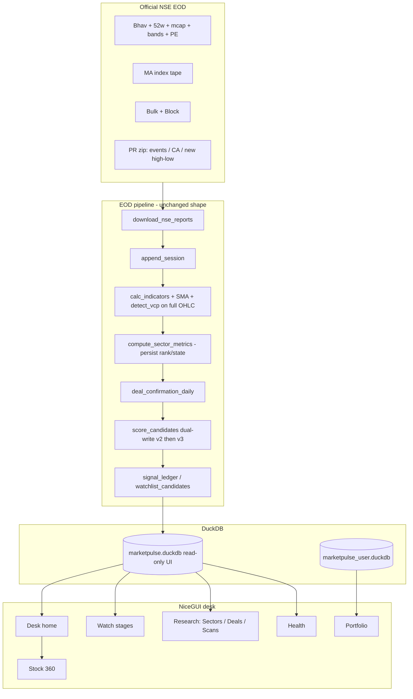
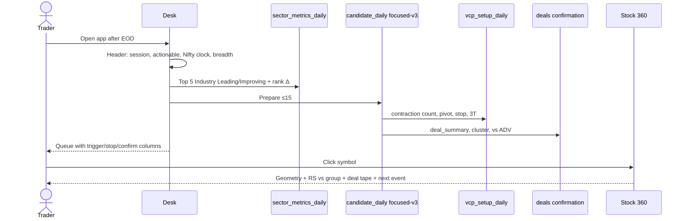
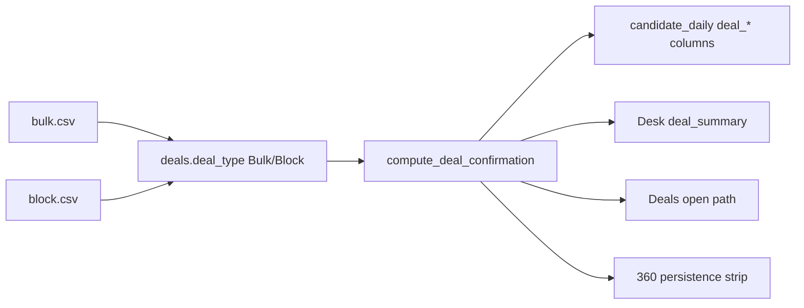

# MarketPulse 2.0: EOD Swing-Trading Decision Desk

| Field | Value |
| :--- | :--- |
| **Title** | Redesign MarketPulse as a Minervini / VCP / Stage-2 / IBD-group EOD swing desk |
| **Author** | MarketPulse design loop |
| **Date** | 2026-08-30 |
| **Status** | Draft |
| **Revision** | 2026-08-30c |
| **Supersedes (product thesis)** | `2026-08-16-marketpulse-eod-technofunda-design.md` (near-term swing slice only; fundamentals remain on hold), `docs/superpowers/specs/2026-08-16-marketpulse-eod-near-term-implementation-design.md` (IA and VCP naming), `docs/superpowers/specs/2026-08-03-marketpulse-focused-watchlist-design.md` §3.2 (one thesis) |
| **Does not supersede** | Recovery data-authority (`2026-08-10`), read-only market DB, user-DB split, `focused-v2` snapshot identity, official-NSE EOD spine |

> This is a **critic + redesign**, not a greenfield rewrite. The spine stays: NiceGUI + DuckDB, official NSE EOD files, `focused-v2` decision snapshot (bumped to `focused-v3` only when geometry/gates change), read-only market DB, user DB split. No live tickers, no WebSockets, no screener.in, no XBRL. Fundamentals stay **on hold**.

> **Revision 2026-08-30c** — re-review: one `initial_risk_pct` formula on v3 (`(pivot-stop)/pivot*100`); frozen v2 algorithm behind `score_version`; `deal_summary` Nd = primary type+clientele sessions; `deal_term` NaN with no non-PROP deals and Block net excludes PROP; exact MA name `Nifty Fin Service`; Goals copy is skip-if-1R>8% of pivot.

> **Revision 2026-08-30b** — review pass: VCP `detect_vcp` contract (non-circular base, min bars/depth, expansion ends sequence, hook on full OHLC, `pattern_valid` vs `valid_vcp`); stop = last contraction low (skip if 1R > 8%); VCP is a Prepare gate not a setup-pillar map; measured-move R:R; dual-write v2+v3 in one bump; CA fail-closed before long-base backfill; persist index features; Watch `setup_stage` + user pins; `deal_summary` grammar; first-match industry states; split peel PRs; Desk Superdesign frame A (v2) vs B (v3).

Spot-checked against live code on 2026-08-30 (not copied from the 16-Aug spec). Primary evidence: `App/app.py` `main()` (home = Screener, 6 default tabs, `MP_LEGACY_PAGES` for Today/Candidates), `Scripts/build_database.py:645-688` (still the 4-factor `vcp_score`), `Scripts/candidate_engine.py` (setup re-averages those four components; `industry_state="Unknown"`), `App/pages/research/sector_intel.py` (taxonomy tree, no Gemini import), `App/thematic_read_model.py` (dead `NEXTGEN_TECH_UNIVERSE` still present), `App/deals_read_model.py` (PROP included by default), `App/ui/styles.py` (dark `#0e1116` / `#161b22`). Parallel audits: `explore-data.md`, `explore-vcp.md`, `explore-sector.md`, `explore-deals.md`, `explore-momentum-ui.md`.

---

## Overview

MarketPulse already downloads a rich official NSE EOD pack and scores a versioned swing queue. It is **not** a swing-trading decision desk. After the close, a Minervini / VCP / Stage-2 trader needs one surface: **is the tape tradable → which industries lead → a short Prepare list with a real pivot and stop → confirmation (successive contractions, RS vs group, FII/DII bulk/block persistence)**. Today that job is split across a misnamed Screener, a competing Momentum census, a taxonomy browser labeled Sector Leadership, a rupee-sorted Deals dump, and a Stock 360 that prints a scalar called “VCP Score.”

The proposed product is that one morning **Desk**. Keep the warehouse and the audited snapshot. Stop selling a 4-factor heuristic as VCP. Ship a real contraction engine, an honest Trend Template **gate**, an IBD-style industry leaderboard that actually gates Prepare, and deals as a confirmation sentence on the queue (`FII bulk 3d, 1.8× ADV`). Demote Momentum to a research scan that **joins** `focused-v3`; do not let 10-EMA buckets become a second ranking religion. VCP is a Prepare **gate and column**, not a 70–100 map inside the setup pillar. Do not add another score.

---

## Background & Motivation

### Current state (verified 2026-08-30)

```
NSE archives (bhav, 52w, mcap, PE, bands, bulk, block, MA, PR zip)
        │
        ▼
Scripts/download_nse_reports.py  →  Input/downloads/{ddmmyyyy}/ + Input/daily (8 CSVs; ZIP stays in downloads/)
        │
        ▼
Scripts/daily_pipeline.py → append_database.py → build_database.calc_indicators()
        │                     → decision_pipeline.process_accepted_session()
        │                     → candidate_engine.score_candidates() → candidate_daily (focused-v2)
        │                     → telegram_deals.notify_deals()
        ▼
Database/marketpulse.duckdb        (market, UI read-only)
Database/marketpulse_user.duckdb   (portfolio / journal)
        │
        ▼
App/app.py  (~3997 physical lines) + thin pages
Default nav: Screener | Momentum | Sectors | Deals | Portfolio | Health
Home: show_page("Screener") → App/pages/screener.py (focused-v2 Prepare/Observe/Blocked)
```

What is solid and **stays**: official-report download with checksums, point-in-time 52w join, versioned decision snapshot that refuses silent `focused-v1` fallback, user-DB split, DuckDB, EOD batch (no live tape).

What shipped since 16-Aug and **must not be relitigated as if still broken**:

| 16-Aug claim | 2026-08-30 live code |
| :--- | :--- |
| Light Bloomberg theme | **Fixed.** `App/ui/styles.py` dark tokens `#0e1116` / `#161b22`. Leftover light Tailwind on sector page is CSS-patched. |
| Deals `exclude_hft=True` default | **Fixed.** `query_deals_desk_default(exclude_hft=None)` includes PROP; UI checkbox starts off. Residual: Stock 360 KPI still strips `is_hft`. |
| Sector Intel Gemini thematic default | **Runtime-fixed.** `build_sector_intel_page` always renders taxonomy; `tests/test_sector_runtime_wiring.py` asserts no `thematic_read_model` import. **Dead code remains:** `NEXTGEN_TECH_UNIVERSE`, `_render_thematic_mode`, `tests/test_thematic_tracker.py`. |
| Home = Today | **Renamed.** Home is **Screener** (same snapshot). README still says Today. |
| Indicator math untestable | **Partial.** `Scripts/indicators.py` exists; golden tests cover EMA, Wilder RSI, SMA ATR, Wilder ATR, `distance_below_high`, `setup_class`. **No golden test of `vcp_score` or contraction sequence.** |
| `distance_to_high_pct` used `.abs()` | **Fixed.** `distance_below_high` clips new highs to 0. |
| RS `fillna(0)` crushes IPOs | **Fixed** in `calc_indicators` (`min_count=4`). Scorer `_score(..., default=50)` still launders missing into 50. |

What is **still true**, and is the reason this document exists:

- `vcp_score` is still `0.30*trend + 0.30*nested-range + 0.25*current-bar-dryup + 0.15*distance-to-high` (`build_database.py:666-671`). `base_quality_score` is an alias, not a rename. UI, config, drawer, sector counts still say VCP.
- `App/app.py` **grew** (16-Aug: 3,892 lines; now ~3,997). Dead page functions still compiled. Momentum and Portfolio still live in the god file.
- Momentum is a **first-class competing universe** (`test_momentum_is_a_first_class_active_tab`), not a scan preset.
- `industry_state` is hardcoded `"Unknown"` (`candidate_engine.py:267`). Prepare is not gated on leading groups.
- `sector_metrics_daily.rotation_state` is persisted `""`; the read model invents Leading/Improving/Lagging and **zeros** `rank_change_5d`.
- Bulk vs Block is stored then discarded on cards and scoring.
- Fundamentals banner on Screener says inputs are unavailable while `PE_*.csv` sits in DuckDB — a copy lie, not a data gap.

### Pain points for the actual user

The user thinks in Mark Minervini / VCP / Stage 2 / IBD group leadership. The app thinks in 5-pillar averages and EMA-stack filters. Those are not the same job:

1. **Morning path is a scavenger hunt.** Regime lives as a 4-word enum on the queue (full posture only on *legacy* Today expansion). Leading groups live on Sectors. Trigger/stop live on Screener. Confirmation lives on Deals + 360. Momentum invents a second list.
2. **Vocabulary is false.** “VCP” is nested rolling windows. “STAGE 2” in `DecisionPolicy` is NSE GSM/ESM. Momentum subtitle says “Tighter trend template” for an EMA-stack screen. Sector page subtitle promises concentration and flow that the canvas does not show.
3. **The warehouse is not the desk.** Collection is 8/10; exposure for this trader is 3/10. That is the data-justice failure.

---

## Goals & Non-Goals

### Goals (this slice)

- After NSE close or next morning, **one Desk** answers: tape tradable? which industries lead? which ≤15 names are Prepare, with trigger = last-contraction high and stop = last-contraction low; **skip if 1R > 8% of pivot**? what confirms (deals, RS vs group, real VCP / 3T)?
- Rename the 4-factor heuristic. Do not call it VCP until successive named contractions exist. Ship the contraction engine with pytest on **geometry**, not wiring. VCP is a Prepare **gate + column**; it must not become a 70–100 map in the setup pillar.
- Honest Trend Template as a **gate** (pass/fail chips), not a 20-point bonus mashed into `trend_score`.
- Sector Intel becomes an IBD-style **industry RS leaderboard** (rank, rank Δ, concentration, new-high %, deal flow) with a documented industry gate on Prepare.
- Deals become confirmation: Bulk vs Block first-class; persistence; size vs ADV; join onto Prepare rows; cluster radar on the open path.
- Momentum becomes a **research scan that joins `candidate_daily`**, not a peer of the decision queue.
- Stock 360 shows contraction geometry, RS vs Nifty **and** vs group, deal persistence, next event date. Not a scalar `vcp_score`.
- Peel `App/app.py`. Delete or quarantine dead pages. README matches the product.
- Keep `focused-v2` as the last frozen snapshot; introduce `focused-v3` only when pivot/stop/gates change, with ledger identity preserved.

### Non-goals (hard)

- No live ticker, WebSocket, intraday product, options chain, broker execution.
- No screener.in scrape, no XBRL, no yfinance in any score. Fundamentals remain on hold unless an Open Question is answered to un-hold.
- No Gemini essays, no revival of `NEXTGEN_TECH_UNIVERSE` as a default universe, no LLM sector narratives.
- No sixth score (`focus_score`, similarity, 10-EMA bucket-as-rank, VCP 100/90/80/70 inside setup). `focused-v3` remains five pillars with **different inputs**, not a new religion.
- Do not keep Momentum and focused-v2 as equal universes.
- Do not overwrite `indicators_daily.atr_14` (SMA ATR stays the production ATR column; Wilder stays parallel; contraction geometry in the **new** VCP engine should use Wilder or true range of swings, not SMA ATR nested windows).
- Do not invent `rs_vs_sector_index` without a session-dated constituent snapshot. Cap-weighted taxonomy vs Nifty 50 is the honest RS until then.
- Do not treat `nsetools-marketpulse` as a data layer.

---

## Honest critic

This section is the verdict, not a sandwich.

### The product is a scored shortlist wearing Minervini clothes

`focused-v2` is a competent swing **filter**: ₹1,000 Cr, ₹10 Cr 20d ADV, band ≥ 10%, trigger within −2%…+5% of a 20-day high, stop at the tightest of EMA20/EMA50/10d/20d low, max 8% fabricated width, R:R ≥ 1.5, Prepare ≥ 60, Risk-Off demotes Prepare → Observe. That is a tradable queue. It is **not** Trend Template, not Stage 2, not VCP, not IBD group work.

A trader who opens the app believing “VCP Near Pivot in a leading group” is being lied to by column names.

### Information architecture scatters the only job that matters

Desired morning path: **regime → leading groups → short queue with trigger/stop → confirm**.

| Step | Where it lives | Failure |
| :--- | :--- | :--- |
| Tape tradable? | Health (dates); Screener compact “Gate” string; full breadth only on **legacy** Today expansion (`app.py` `_regime_posture`) | Default home has no Nifty clock, no % above 50/200, no advance spark. `Scripts/query_service.py:load_market_context` loads `index_daily` + `breadth_daily` and **no App page calls it**. |
| Leading groups? | Sectors tree; Momentum “top leadership **of this scan**”; legacy Today industry tables | Three definitions. Default Sector level is one rung too coarse for Minervini (Industry is the unit). |
| Actionable queue? | Screener (correct data, **wrong name**) | Looks like a research tool. `why_now` is in `SWING_VIEW_COLUMNS` then stripped by `table_from_df`. Blocked dump shares the page (good) but the page identity is “Screener.” |
| Confirm? | Deals tab; 360; Momentum deal Cr columns; dead VCP Lab | No sentence on the queue. 360 Overview prints “VCP Score.” Institutional tab strips PROP. |
| Track to trigger? | **Missing.** `App/pages/watchlist.py` raises `NotImplementedError`. `watchlist_candidates` is written by `watchlist_service.persist_candidate_snapshot` and never shown. | Momentum 10-EMA buckets are a poor substitute for Building → Near Pivot → Armed → Triggered. |

Six tabs is fine if home is complete. Home is a misnamed table, so the trader still uses four tabs before the first TradingView window.

### VCP is a naming lie (still)

Verified formula (`Scripts/build_database.py:652-684`):

```
contraction_score = 25*(range_5d < range_10d) + 25*(range_10d < range_20d)
                  + 25*(atr_pct_avg_5d < atr_pct_avg_20d)   # SMA ATR
                  + 25*(atr_pct_avg_20d < atr_pct_avg_50d)
volume_dryup_score = 25*(avg_vol_5d < 20d) + 25*(avg_vol_5d < 50d)
                   + 25*(rvol < 1)                          # CURRENT BAR
                   + 25*(dryup_pct > 20)
vcp_score = 0.30*trend_score + 0.30*contraction + 0.25*dryup + 0.15*pivot_proximity
base_quality_score = vcp_score   # alias only
```

This is true of **any mildly quiet week under a high**. Missing vs Minervini: successive named contractions, contraction count, per-contraction dry-up, pivot = left-side high of last contraction, stop = last-contraction low, 3T/2T, SMA Trend Template, Stage 2 as market stage.

Worse, the heuristic **fights itself on the completion day**: `rvol ≥ 1.5` breakout loses 25 dry-up points so `vcp_score` falls, while `vcp_state == "Breakout"` is assigned from raw `new_20d_high & rvol≥1.5 & trend_score≥70`. `setup_class` (BREAKOUT/PIVOT/BASE) was added after 16-Aug, is mutually exclusive, and **is unused by `score_candidates`**. Setup pillar still averages the four VCP components plus EMA-stack bonus plus `near_high_tight`.

`DecisionPolicy` “STAGE 2” is GSM/ESM surveillance (`decision_policy.py:81-85`). Momentum copy says “trend template” for CMP > 10/200 EMA + stack 10>20>50>100>200. There is **no SMA series** in production (`EMA_WINDOWS` only; tests still invent `sma_20`/`sma_50`).

Pivot is `high_20d` if still above close. Names **already through** the 20d high are Blocked (`geometry_warning: pivot_missing`). That is the opposite of “Stage 2 already in motion.” `trigger_type` is hardcoded `"break_above_pivot"` anyway.

### Sector Intel is a classification browser

`sector_metrics_daily` is the right table: cap-weighted RS vs **Nifty 50**, breadth 50/200, top-3 ADV concentration, near-52w %, deal net — and then the product throws the useful bits away.

- `rotation_state` written as `""` (`sector_metrics.py:274`).
- Read model: rank ≤5 Leading, ≤10 Improving, else Lagging; **Emerging/Weakening/Neutral chips empty** when metrics exist; `rank_change_5d = 0` (`sector_read_model.py:365-371`). The “good” path is *worse* at “is money rotating in?” than legacy `sector_rotation`.
- Live canvas: tree + RS-sorted names. Concentration, deal flow, near-52w %, breadth_200 **not shown** despite the subtitle claiming them.
- Stock table sorts by **universe** `rs_percentile`, not RS vs group, not `candidate_daily`.
- `industry_state` dummy. Context pillar can nibble the score; it cannot Block a lagging-industry name.
- Default status level = Sector, not Industry.
- `candidate_engine` looks up `return_63d_pct` on `sector_rotation` whose column is `return_3m_pct` — sector RS often falls through to Nifty. Join has **no `level` filter**.

Gemini is gone from the runtime path. The corpse (`thematic_read_model.py`, unused renderers, CI tests that protect the 70-name list) will be “wired back” by the next agent who greps for Thematic.

### Deals are a tape dump with a hidden radar

Ingest is good: Bulk vs Block tagged, clientele waterfall (PROP > DII-MF > DII-ins > FII > HNI > CORPORATE > OTHER), `repeated_client_count`, `get_cluster_buys`, ADV-normalized `normalized_deal_activity`.

Open path (`query_deals_desk_default`): latest-session BUY names, ₹1,000 Cr, CMP > 200 EMA, mixed Bulk+Block, mixed PROP+FII+DII, sorted by rupees, TV-paste. `cluster_buys` is always an empty frame. `deal_type` is in the SQL then aggregated away. Persistence is unused. Size vs ADV lives inside an opaque 0–100 that is 1/5 of a 20% pillar (~4% of `total_score`) and defaults to 50 when there are no deals.

There is no “3 days of FII bulk on this VCP pivot” on the queue. `explain_candidate` never mentions deals. `is_cluster_buy` is merged then dropped from `OUTPUT_COLUMNS`. `EXPLANATIONS["Deal Impact"]` documents a +1D…+20D study that was never built; `info_icon("Deal Impact")` is never called. Telegram is still an unclassified BUY dump (plan Task 4 Step 4 ALL/PROP/INST not shipped).

### Momentum is a second ranking religion

`special_watchlist_page` (`app.py:1998-2476`) is live SQL, not the snapshot. Defaults: stack on, within 15% of 52w high, ≥25% off 52w low, CMP > 10 and 200 EMA, ₹1,000 Cr, 20d share volume 1e6. Buckets are **distance above 10 EMA**. No trigger, no stop, no `candidate_state`, no event_risk.

Same name can be Momentum-tradable and Screener-Blocked (trigger >5% away, R:R <1.5, 5% band). The page is useful as **chart-prep census**. Promoting it to a default peer of the audited queue redefines priority every morning. 16-Aug said move remnants into screener presets or delete. The opposite happened.

### Stock 360 is a packed dialog that still cannot confirm

Header: VCP **state** badge. Overview: RS, **VCP Score scalar**, 52W %, RVOL, EMA distances. Institutional: HFT-stripped KPIs + raw table (Type column exists). Risk: trigger/stop/R:R/`why_now`. Events: headlines, not a calendar.

Missing: C1/C2/C3 depths, Trend Template checklist, RS vs industry, `rotation_state`, deal session-count, next_event_date (already computed in `event_risk_for_date` and discarded), in-app chart (TV outbound only). 360 reads raw latest `candidate_daily`, not `load_decision_snapshot` (no version pin).

### God file and docs

`main()` is a 40-line router trapped in a 4k-line module that still owns `table_from_df`, Momentum, Portfolio, VCP lab, EMA-cross `SCREENER_RULES`, backtest, journal page, stock detail, confluence SQL. First `screener_page` at `:1846` is overwritten at `:3889`. `App/ui/table.py` `SWING_COLUMNS` / `SCREENER_COLUMNS` are tested and unused by the renderer (runtime uses ad-hoc widths). README Decision workflow still says Data Health → **Today** → Candidates. `App/pages/today.py` is a quarantined stub.

### Severity summary

| Issue | Severity | Why it matters to this trader |
| :--- | :--- | :--- |
| Calling the 4-factor heuristic “VCP” | **High** | Trains the user, the drawer, sector counts, and `train_vcp_classifier.py` on a pattern that does not exist. |
| Two universes (Momentum vs focused-v2) | **High** | Pages independently redefine the thesis (2026-08-03 finding 3.2, still true). |
| No industry gate; `industry_state="Unknown"` | **High** | Violates “buy the strongest names in the strongest groups.” |
| Pivot = 20d high; stop = nearest EMA | **High** | Wrong buy point, wrong 1R, geometry blocks names already through. |
| Deals not joined as confirmation | **High** | Official FII/DII tape is the Indian substitute for IBD accumulation; it is a side tab. |
| Index tape unused on home | **Medium** | 100+ official indices ingested; trader sees a regime word. |
| Rank Δ zeroed on metrics path | **Medium** | Cannot see rotation. |
| PE ingested, UI denies it | **Medium** | Copy lie. Not a scoring issue this slice. |
| CA ratios hardcoded 1.0 | **High (data quality)** | Rolling 252d / EMAs unadjusted around splits; 52W file *is* adjusted. Silent corruption. |
| `app.py` still a god file | **Medium (maintainability)** | Every desk PR will fight the file. Peel is a real PR, not a tidy-up. |
| Gemini corpse | **Low-medium** | Will be revived. Delete it. |

---

## Data-justice map

**Verdict: we are not doing justice to the available data.** Collection is excellent. The trader-facing desk fully uses mainly bhav + mcap/52w + taxonomy + bulk/block. The rest is computed and melted into a score, gated behind Health row-counts, or never shown.

Utilization legend: **promote** (warehouse → Desk/360 this slice), **keep-internal** (needed for gates/scores, not a column), **stop-computing** (cost with no desk value), **later** (hold or fix-quality first).

### Raw NSE inputs

| Input | Table | Now | This slice |
| :--- | :--- | :--- | :--- |
| Bhavcopy OHLCV, delivery, trades | `prices_daily` / `indicators_daily` | Core prices used; `last_price`, `avg_price`/`vwap`, `trades` barely shown | **Promote** delivery spike + RVOL onto Desk/360 as accumulation evidence. Keep trades/VWAP internal. |
| `EQUITY_L .csv` | `stocks_master` | Universe filter | Keep. |
| `sector.csv` 4-level taxonomy | master + `sector_metrics_daily` | Tree browser; engine uses equal-weight `sector_rotation` | **Promote** Industry-level metrics to leaderboard + Prepare gate. |
| MCap | `security_reference_daily` | ₹1,000 Cr gate | Keep gate. No mcap-trend chart this slice. |
| 52W high/low **+ dates** | reference + `away_52w_*`, `is_fresh_52w_high` | High used; date / fresh-high tape barely shown | **Promote** fresh-52w-high count onto Desk strip; 52w date onto 360. |
| Price bands / GSM remarks | reference | Hard-block <10%; Momentum avoid ≤5% | Keep as gate. Show remarks on Desk if surveillance. |
| PE / adjusted PE | master + reference | **Unused**; Screener banner denies existence | **Promote as colour only** on 360 (see Open Question). **Do not score.** Fix the banner: “PE snapshot on file, not in score.” |
| MA index tape (100+ names) | `index_daily` + features | Hidden inside `market_regime` + Nifty 50 benchmark | **Promote** Nifty 50 / Midcap 150 / relevant sector index onto Desk clock. |
| MA market-wide totals | parser skips | Unused | **Later** (session cash-market value is nice, not required). |
| Bulk / Block | `deals.deal_type` | Ingested; UI/score mix them | **Promote** type, persistence, vs ADV, cluster onto Desk + Deals open path. |
| PR `an*` / `bm*` | `security_events` | `event_risk` word; 360 headlines | **Promote** `next_event_date` / sessions-to-event onto Prepare rows (already returned by `event_risk_for_date`, discarded by scorer). |
| PR `bc*` corporate actions | `corporate_actions` | `ratio_from=ratio_to=1.0`; `price_adjustment_factors` never written | **Fix-quality PR** (parse ratios, populate factors). Not a UI feature. |
| PR `bh*`/`hl*` official new high/low | `security_risk_daily` | Health count only | **Promote** as the official new-high tape on Desk (joinable; do not rebuild from rolling highs only). |
| PR `tt*` top traded | `top_value_daily` | **symbol always `""`** | **Stop showing** in Health as if useful. **Fix parser** later or drop ingestion. |
| PR leftover (Pd, Fo, Gl, …) | none | Downloaded not ingested | **Later.** Do not expand PR surface this slice. |
| Manifest | `ingested_reports` | Health | Keep (ops). |

### Derived tables

| Table | Now | This slice |
| :--- | :--- | :--- |
| `indicators_daily` (~80 extra columns) | Momentum/360 see a handful; Screener sees none | **Promote** `setup_class`, `ema_stack_bullish`, RS 1y/3m, `is_fresh_52w_high` as inspectable chips. **Keep-internal** candle soup (hammer, NR7, RSI divergences) unless 360 “timing” expander. |
| `breadth_daily` | Scoring gate; legacy Today only | **Promote** to Desk strip. |
| `sector_rotation` (no `schema.sql`) | Engine `sector_state`; equal-weight | **Freeze** once candidates read `sector_metrics_daily`. Do not dual-write forever. |
| `sector_metrics_daily` | Tree remap; rank Δ zeroed; `rotation_state=""` | **Promote** as the single rotation product. Persist rank, Δ, state. |
| `candidate_daily` focused-v2 | Screener | **Extend** with deal confirmation, industry_state, next_event, trend_template_pass, vcp contraction fields. Version `focused-v3` when geometry changes. |
| `screener_results` 40-rule lab | Dead UI (`stock_detail_page` not in nav) | **Stop materializing** on the EOD path. Keep `make_screener_results` callable for research flag. |
| `watchlist_candidates` | Written, stub UI | **Promote** as Watch stages. |
| `signal_ledger` / `signal_outcomes` | Health aggregate, often empty | **Promote** hit-rate by setup_class / regime as a Desk footnote once walk-forward is populated. Until then, keep Health-only — do not fake expectancy. |
| `index_daily` | Unused in App | **Promote** Desk clock. |
| `train_vcp_classifier.py` | Trains XGBoost on heuristic `is_vcp` | **Stop.** Do not train on a naming lie. Revisit only after real contractions have outcomes. |

### `indicators_daily` — what to stop melting

The core data-justice gap: **the database is a technical research warehouse; the desk is a scored shortlist.** Stop averaging components the trader cannot audit.

| Column family | Action |
| :--- | :--- |
| `trend_score` 5×20 EMA booleans | Replace as **gate** (new SMA or labeled-EMA template). Keep column one release for compare. |
| `contraction_score` / `volume_dryup_score` / `pivot_proximity_score` / `vcp_score` | Relabel in UI to **Base quality**. Stop calling them VCP. Do not use as setup pillar once `vcp_setup_daily` exists. |
| `setup_class` | **Promote** to Desk + sector `tech_pass_n` (already used there). |
| `rs_percentile`, `rs_1y`, `rs_3m` | **Promote** as three inspectable numbers; persist vs-Nifty and vs-industry (today ephemeral and buggy). |
| `rank_acceleration` | **Stop reading.** Never written. Drop from leadership mean. |
| Weekly/monthly EMA crosses (`SCREENER_RULES`) | Scan presets only. Do not revive as a tab. |
| Dual ATR | Keep both; **new VCP engine must not use SMA ATR nested windows as “contraction.”** Risk pillar keeps Wilder (`atr_pct_primary`). |

---

## Product thesis — what we would do differently

One sentence: **MarketPulse is the morning desk for an Indian equity swing trader who only buys Stage-2 names in leading industries, at a VCP/3T pivot, with institutional confirmation, into a constructive tape.**

Everything else is research overflow.

### 1. One morning Desk

Not six specialist tabs. Home **is** the workflow:

```
regime (breadth + Nifty/index clock)
    → leading industry chips (rank + Δ)
        → short Prepare queue (≤15) with trigger / stop / R:R
            → confirmation columns: real VCP / 3T, RS vs group, deal sentence
                → click → Stock 360 (geometry, not a score)
```

Screener, Today, and Candidates collapse into Desk. Blocked remains a chip on the same page (diagnostics), not a second product.

### 2. Stop calling the heuristic VCP. Ship a real VCP engine.

Until successive contractions exist, UI says **Base quality** / `setup_class`. After the engine lands, “VCP” means: contraction count, depths, dry-up per contraction, pivot = left-side high of last contraction, stop = last contraction low (**not lifted**), optional 3T/2T. If 1R from that stop exceeds 8%, **skip** the trade (`initial_risk_too_wide`) — do not fabricate a tighter stop.

### 3. Trend Template is a gate, not a bonus

Minervini’s template is a screen you **fail**, not 20 points in a mash. Either:

- **SMA 50/150/200** (published template) — additive columns, recommended default, or
- **Labeled EMA template** — if the user prefers to keep thinking in the existing 10/20/50/150/200 EMA stack.

Either way the UI must say which. Momentum’s “tighter trend template” copy is deleted.

### 4. Sector Intel is an industry RS leaderboard with a Prepare gate

Default level = **Industry**. Dense table: rank, Δ5d/20d, RS vs Nifty 21d/63d, breadth, new-high %, top-3 concentration, deal flow. Tree is drill-down. Prepare requires industry in {Leading, Improving, Emerging} **or** a soft demotion (Open Question). `industry_state` is a real column.

### 5. Deals are confirmation, not a second scanner

Bulk vs Block first-class. PROP visible but **not mixed** into FII/DII net for scoring. Persistence and size-vs-ADV on the open path. Join onto Prepare: `FII bulk 3d, 1.8× ADV`. Cluster radar (2+ non-PROP institutions) computed by default.

### 6. Momentum is a scan that joins the queue

Keep 10-EMA buckets as **extension/risk colour** (how extended is this leader?), not identity. Every scan row shows `candidate_state` / trigger / stop or explicit `not in focused-v3`. Copy-to-Watch, not a second rank.

### 7. Stock 360 is the confirmation workspace

Contraction geometry, RS vs Nifty and vs group, deal persistence, event calendar. Kill the scalar “VCP Score” card.

### 8. One score

`focused-v3` keeps five pillars. Change **inputs** (real pivot/stop, template gate, VCP pattern gate, industry_state, split inst vs prop flow, empty-mean is NaN not 50). Setup pillar stays `setup_class` + tightness — **not** a VCP 70–100 map. Do not add `focus_score`. Do not rank by 10-EMA %.

---

## Proposed Design

### Architecture (keep the spine)



EOD orchestrator remains `Scripts/daily_pipeline.py` → `append_database.append_session` → `decision_pipeline.process_accepted_session`. New work plugs into `calc_indicators` (SMA, honest labels, **VCP engine on full OHLC**), `sector_metrics.compute_sector_metrics` (persist rank/Δ/state), `candidate_engine.score_candidates` (v3 **reads** `vcp_setup_daily` / `deal_confirmation_daily`; does not recompute them), and App pages. UI still cannot write the market file. `materialize_decision_tables.py` currently loads only **120 days** of `indicators_daily` — that window is too short for a 65-week base, so the VCP hook is **not** materialize.

Expected load (unchanged order of magnitude): ~2,000 NSE equities × ~1 session/day. `vcp_setup_daily` ≈ 2,000 rows/session. `vcp_contractions` ≈ 0–4 rows/symbol/session only when a base is open (~few thousand rows/session). Desk query budget: ≤4 read-only DuckDB queries on home paint (status, breadth+index strip, industry chips, Prepare snapshot) — same spirit as Deals desk’s 2-query open path.

Latency target: Desk first paint < 400 ms on local DuckDB after snapshot load (today’s `load_decision_snapshot` path). VCP engine must run inside EOD, not on UI click; worst case +2–4 min on full rebuild, +10–20 s on append-one-session if incremental (see Rollout).

### Morning sequence



### Real VCP engine

**Module:** `Scripts/vcp_engine.py` (pure pandas, no DuckDB). Golden tests in `tests/test_vcp_contractions.py`.

**Contract:** one deterministic function

```python
def detect_vcp(
    ohlcv: pd.DataFrame,          # symbol-sliced prices: trade_date, open, high, low, close, volume
    *,                            # full history available to the caller (prices_daily), not a 120-day slice
    sma_200: pd.Series,
    template_pass: bool,          # Trend Template evaluated on the *as-of bar only*
    corporate_actions: pd.DataFrame,  # ex_date, action_type, ratio_from, ratio_to, ca_unparsed
    as_of: pd.Timestamp,
) -> tuple[dict, pd.DataFrame]:
    """Return (setup_row, contraction_rows) for one symbol as-of as_of. No I/O."""
```

**Hook (mandatory):** `calc_indicators` / `append_session` on **full** `prices_daily` OHLC for that symbol, then `INSERT` into `vcp_setup_daily` + `vcp_contractions`. `score_candidates` / `materialize_decision_tables` **only read** those tables. Do not call `detect_vcp` from materialize (120-day load cannot see a 65-week base).

**Does not** replace `setup_class`. `setup_class` stays the cheap daily label (BREAKOUT/PIVOT/BASE/NONE). VCP is base anatomy + a Prepare **gate**, not a 0–100.

**Constants (named, tested):**

| Name | Value | Role |
| :--- | :--- | :--- |
| `FRACTAL_LEFT` / `FRACTAL_RIGHT` | 2 | 5-bar swing (high[i] ≥ high[i-2:i+2], ties: first). Last 2 bars unconfirmed, ignored. |
| `MIN_ADVANCE_PCT` | 20 | Last significant rally that starts the base. |
| `MAX_BASE_SESSIONS` | 325 | ~65 weeks of NSE sessions. Truncate older. |
| `MIN_CONTRACTION_BARS` | 10 | Ignore a swing pair shorter than this. |
| `MIN_CONTRACTION_DEPTH_PCT` | 3 | Ignore a swing pair shallower than this (noise). |
| `MAX_CONTRACTIONS` | 4 | After 4 completed decreasing contractions, stop walking. |
| `LAST_DEPTH_MAX_PCT` | 15 | `pattern_valid` last contraction. |
| `LAST_DEPTH_MAX_PCT_3T` | 20 | Only if `weeks_tight==3` and weekly close-band ≤ 5%. Not unbounded. |
| `WEEKS_TIGHT_3_BAND_PCT` | 5 | 3 weekly closes, range / min(close) ≤ 5%, 3-week high within 5% of pivot. |
| `WEEKS_TIGHT_2_BAND_PCT` | 4 | 2 weekly closes. |
| `DRYUP_RATIO` | 0.70 | Last 5 sessions in C_last vs 50d average volume, ignoring breakout bar. |
| `BREAKOUT_RVOL` | 1.5 | Plus `close_location_pct >= 66`. |
| `FAILED_BASE` | `close < sma_200` on the as-of bar | No extra “X% below.” Stage-2 fail-closed. |

#### Algorithm (daily bars; weekly resample only for 3T/2T)

1. **Swings.** 5-bar fractals as above. Pair confirmed swing highs/lows.
2. **Base start (not circular).** Last swing-low → swing-high with `(high-low)/low ≥ MIN_ADVANCE_PCT`. `base_start_date` = that high’s date. `base_high` = that high. There is no pivot yet.
3. **Base end.** Walk forward from `base_start_date` up to `MAX_BASE_SESSIONS` or `as_of`. End the window at the first of:
   - **Failed:** as-of `close < sma_200` → `fail_reason=lost_200sma`. (`pattern_valid=False`.)
   - **Breakout:** at least one **completed** contraction exists, and a bar closes **above that completed contraction’s high** with `rvol ≥ 1.5` → `breakout=True`. Pivot is that completed contraction’s high (known before this bar).
   - Else the window is still open at `as_of`.
4. **Named contractions.** Inside the open window, walk swing-high → next swing-low:
   - Drop the pair if bars < `MIN_CONTRACTION_BARS` or `depth_pct < MIN_CONTRACTION_DEPTH_PCT`.
   - `depth_pct = (swing_high - swing_low) / swing_high * 100`.
   - **Walk rule on expansion:** if the next qualifying pair has `depth >=` previous depth, **stop**. Do not record it as C[n+1], do not start a new C1, do not fill a fourth slot. The named sequence is the strictly-decreasing prefix (cap `MAX_CONTRACTIONS`).
   - Typical bands C1 ~25–35 / C2 ~15–25 / C3 ~8–15 are **descriptive, not a hard fail**.
   - `avg_volume` over bars from that high date to that low date. `volume_vs_prior = avg_volume[n] / avg_volume[n-1]`. `volume_declining` if all recorded steps have `volume_vs_prior < 1`.
5. **Pivot / stop (do not lift the stop).** After the decreasing prefix: `pivot_price = high of last recorded contraction`. `stop_price = low of last recorded contraction`. **Never** `max(stop, pivot*0.92)`. **One 1R formula everywhere on the v3 path:**

   `initial_risk_pct = (pivot - stop) / pivot * 100`   # percent of entry, not of stop

   Same field on `vcp_setup_daily`, `calculate_risk_geometry` (v3 branch), `candidate_daily`, Desk, and 360. Do **not** use live `(trigger / invalidation - 1) * 100` = `(pivot - stop) / stop * 100` on v3 (that stays the **v2** formula only). If `initial_risk_pct > DecisionPolicy.max_initial_risk_pct` (8), eligibility blocks with existing `initial_risk_too_wide`. 360 may show **“1R > 8% of pivot — skip”** as display only; it is not `invalidation_price`. Golden: pivot 100 / stop 92 → `initial_risk_pct=8` → eligible on risk; pivot 100 / stop 91 → 9 → skip. Position size stays in `suggested_quantity`.
6. **3T / 2T.** Friday last-close resample (existing weekly path). 3T iff last 3 weekly closes sit in a band ≤ `WEEKS_TIGHT_3_BAND_PCT` of the lowest of those closes **and** the 3-week high is within 5% of `pivot_price`. 2T = 2 weeks, `WEEKS_TIGHT_2_BAND_PCT`. 3T is terminal, not a substitute for count ≥ 2.
7. **Dry-up vs breakout (do not mix).** Last-contraction dry-up uses bars in C_last excluding the as-of bar when `breakout=True`. Breakout is the boolean in step 3. A loud completion day **must not** flip `pattern_valid` off.
8. **CA fail-closed.** If any `corporate_actions` row with `action_type` in `{split, bonus}` and (`ratio_from != ratio_to` **or** `ca_unparsed=True`) has `ex_date` in `[base_start_date, as_of]`, set `pattern_valid=False`, `fail_reason=ca_unparsed_in_base`. Do **not** backfill 325-session bases on unadjusted OHLC (PR 5 before long-history backfill).
9. **Validity split (no double bind).** Template is evaluated on the **as-of bar only**, never over the whole base (a 32% C1 under the 52w high is allowed; the buy point is what must be within 25% of the high).
   - `pattern_valid` = count ≥ 2 AND strictly decreasing prefix AND last-depth rule (`≤15`, or `≤20` iff `weeks_tight==3` and weekly band ≤ 5%) AND not CA-blocked AND not `lost_200sma`.
   - `valid_vcp` = `pattern_valid AND template_pass`.
   - Desk `vcp_label` may show the pattern even when template fails: `C3 8% · TT fail`.
   - `MP_TREND_TEMPLATE=off` turns off the **Prepare** template gate only. Contraction detection still runs. `valid_vcp` still ANDs template for the combined badge; Prepare uses `trend_template_required` independently.

`vcp_label = f"C{n} {last_depth:.0f}%"` + (`" 3T"` if `weeks_tight==3` else `""`) + (`" · TT fail"` if `pattern_valid and not template_pass` else `""`). The `8%` in `C3 8%` is **last contraction depth**, not stop width.

Engine `vcp_state` (360 / counts, **not** `watchlist_candidates.candidate_state`): `None / Building / Tightening / 3T / Near Pivot / Breakout / Failed`.

#### What the heuristic becomes

| Old | New |
| :--- | :--- |
| `vcp_score` | Persist one release as `base_quality_score` (already aliased). **UI label: Base quality.** Stop writing heuristic `vcp_state`. |
| `vcp_state` Failed/Breakout/Near Pivot/Building Base | Engine states above. |
| `is_vcp` | `valid_vcp`. Breadth `vcp_candidates` uses this, not the heuristic. |
| `near_high_tight` | Cheap tightness for the **setup pillar**; **do not label 3T**. |
| `train_vcp_classifier.py` | Do not call. Quarantine. |

#### Golden tests (required; not wiring)

| Test | Expect |
| :--- | :--- |
| Synthetic 3-contraction 32% → 18% → 8%, each ≥10 bars, declining volume, template pass | `contraction_count=3`, `depths≈[32,18,8]`, `pivot=C3 high`, `stop=C3 low` (not lifted), `pattern_valid=True`, `valid_vcp=True` |
| Expanding 8% → 18% → 30% | Sequence stops at first expansion; `pattern_valid=False` |
| Qualifying C1 then a 5-bar 2% dip | Dip dropped (`MIN_CONTRACTION_BARS` / `MIN_CONTRACTION_DEPTH_PCT`); does not poison C2 |
| Single quiet 5d range < 10d range under a high (today’s heuristic would score high) | `contraction_count=0` or 1, `pattern_valid=False` — **VCP ≠ nested windows** |
| 3 weekly closes within 4% near pivot after 2 contractions, last_depth 18% | `weeks_tight=3`, `pattern_valid=True` (3T last-depth cap 20). Last_depth 22% → `pattern_valid=False` |
| Breakout bar `rvol=1.8`, `close>pivot` | `breakout=True`; dry-up **unchanged** vs prior session |
| Template fail on as-of bar, pretty contractions | `pattern_valid=True`, `valid_vcp=False`; label `C3 8% · TT fail` |
| As-of close < sma_200 | `fail_reason=lost_200sma`, `pattern_valid=False` |
| Split `ex_date` inside base, `ca_unparsed` or ratio ≠ 1 | `fail_reason=ca_unparsed_in_base`, `pattern_valid=False` |
| Pivot already through | `triggered=True`; **geometry_valid=True** iff `stop < close` and R:R computable (see Geometry) |
| **Noisy real series** (fixture: one liquid NSE name with 2+ years of OHLC, not a synthetic triangle) | Engine returns finite count, does not mark every quiet week `pattern_valid`; snapshot pinned in the test |

### Honest Trend Template (gate)

Add SMA 50/150/200 as **additive** columns in `calc_indicators` (`sma_50`, `sma_150`, `sma_200`, `sma_200_rising_21`). Do not delete EMAs. Do not overwrite `atr_14`.

**Template pass** (persisted booleans, not a 0–100):

| Check | Default rule |
| :--- | :--- |
| Price > 150 SMA | `close > sma_150` |
| Price > 200 SMA | `close > sma_200` |
| 150 SMA > 200 SMA | `sma_150 > sma_200` |
| 200 SMA rising ≥ 1 month | `sma_200 > sma_200.shift(21)` |
| Price > 50 SMA | `close > sma_50` |
| 50 SMA > 150 SMA | `sma_50 > sma_150` |
| Price ≥ 30% above 52w low | `away_52w_low_pct >= 30` (column already exists) |
| Price within 25% of 52w high | `distance_below_52w <= 25` |
| RS ≥ 70 | `rs_percentile >= 70` |

`trend_template_pass = all(checks)` on the **as-of bar only** (a 32% C1 during the base does not fail “within 25% of 52w high”; the buy-point bar does). `trend_template_fails` is a `;`-joined list of failed keys (shown as chips).

**Eligibility:** `trend_template_required=True` (default) → template fail cannot be Prepare (Blocked `trend_template_fail` or Observe — recommendation: **hard fail Prepare**, allow Observe). `MP_TREND_TEMPLATE=off` sets `trend_template_required=False`. It does **not** disable contraction detection and does **not** rewrite `pattern_valid`.

`vcp_pattern_required=True` (default) → Prepare also requires `pattern_valid` (contractions), independent of the template flag. That is the VCP **gate**. It is not a setup-pillar map. Escape: `MP_VCP_GATE=off`.

Stage 2 (Weinstein/Minervini, **not** GSM): `stage2 = close > sma_200 AND sma_200_rising_21 AND sma_150 > sma_200`. Fail closed if close < sma_200. Persist `stage2` boolean. Policy surveillance strings remain a **separate** hard block (`surveillance_gsm_asm_high`). Rename that reason in UI to “NSE surveillance (GSM/ESM)” so “Stage 2” never means both.

If the user chooses labeled-EMA template (Open Question), the same nine checks use `ema_50/150/200` and the UI header reads **EMA Trend Template** — never the unadorned “Trend Template.”

### Sector leadership desk

**Single rotation product:** `sector_metrics_daily`. Persist, do not recompute in the read model:

```
rotation_rank          INTEGER   -- 1..N among peers at that level that session
rank_change_5d         INTEGER   -- prior rank − current (positive = rising)
rank_change_20d        INTEGER
rs_vs_nifty_63d        DOUBLE    -- already stored: cap-weighted group 63d minus Nifty 50
rs_vs_nifty_63d_pctile DOUBLE    -- NEW: cross-sectional percentile of rs_vs_nifty_63d at that level
rotation_score         DOUBLE    -- 0.40*rs_vs_nifty_63d_pctile
                                 -- + 0.25*breadth_50 + 0.20*breadth_200
                                 -- + 0.15*clip(rs_vs_nifty_21d, -20, 20)
                                 -- Intentional change from the current read-model remap
                                 -- (0.40 / 0.30 / 0.20 / 0.50×clip). Persist both the raw
                                 -- excess and the percentile. Rank 1 must be best rotation_score,
                                 -- not “highest 21d clip.”
rotation_state         TEXT      -- Leading / Emerging / Improving / Weakening / Lagging / Neutral
```

State machine: **first match wins**, same `np.select` order as `build_sector_rotation` (`build_database.py:832-841`):

```python
rotation_state = np.select(
    [
        (rotation_rank <= 5) & (score_change_5d >= 0),                          # Leading
        (rank_change_5d >= 5) & (score_change_5d > 0) & (rotation_rank > 5),    # Emerging
        (rank_change_5d >= 2) & (score_change_5d > 0),                          # Improving
        (rotation_rank <= 8) & (score_change_5d < 0),                           # Weakening
        (rotation_rank > 8) & (score_change_5d <= 0),                           # Lagging
    ],
    ["Leading", "Emerging", "Improving", "Weakening", "Lagging"],
    default="Neutral",
)
```

A rank-3 name with Δ=+3 and rising score is **Leading**, not Improving. A rank-7 name with Δ=+6 is **Emerging**, not Improving. Rank ≤5 among Industry peers is ~5 of ~130 NSE industries; that is intended.

Stop inventing 3-bucket states in `_computed_sector_overview`. Stop mapping `rs_vs_nifty_21d` to a column named `return_1m_pct`. Labels: **“21d vs Nifty 50”**, **“63d vs Nifty 50”**.

`deal_net_10s_cr` is 30 calendar days today — either rename to `deal_net_30d_cr` or actually window 10 **sessions**. Do not leave the name lie.

**Industry gate on Prepare** (recommendation: **soft** until the user picks hard):

- Resolve `industry_state` from Industry-level row (`level='Industry'`, `group_name=stocks_master.industry`). Never `"Unknown"` if taxonomy exists; else `"Unclassified"`.
- Soft: Prepare in a Lagging/Weakening industry → demote to Observe + warning `industry_lagging` (mirrors Risk-Off).
- Hard (optional): blocking reason `industry_not_leading`.
- Context pillar uses this state (keep 15% weight); the gate is the actual policy.

**Leaderboard UI (default level = Industry):** dense table, not cards, not tree-first.

| Col | Source |
| :--- | :--- |
| Rank | `rotation_rank` |
| Δ5d | `rank_change_5d` |
| Industry | `group_name` |
| Sector | parent from taxonomy |
| 63d vs Nifty | `rs_vs_nifty_63d` |
| 21d vs Nifty | `rs_vs_nifty_21d` |
| % >50 / % >200 | `breadth_50`, `breadth_200` |
| Near 52w % | `near_52w_pct` |
| Top3 ADV % | `adv_concentration_top3` (badge **Narrow** if > 60) |
| Deal net | `deal_net_*` split inst vs PROP if available |
| Setups | `tech_pass_n` |
| State | `rotation_state` |

Row click → names in that industry sorted by **RS vs this group** (stock 63d − cap-weighted industry 63d), then tightness. Show universe RS as a second column. Filter chips: Leading / Improving / Emerging default-on.

Tree remains a **drill-down**, not the home. Delete `_render_thematic_mode`, `_render_taxonomy_mode` (unused dashboard), `App/thematic_read_model.py`, `tests/test_thematic_tracker.py`.

**Index map (display only this slice):**

```sql
CREATE TABLE IF NOT EXISTS index_taxonomy_map (
  index_name TEXT,
  level TEXT,
  group_name TEXT,
  mapping_source TEXT,
  PRIMARY KEY (index_name, level, group_name)
);
```

Seed as a checked-in CSV `Scripts/data/index_taxonomy_map.csv` loaded once into `index_taxonomy_map`. Join on the **exact** MA `index_name` string (session `Input/daily/MA280826.csv`). Do **not** fuzzy-match (`Nifty Financial Services` is **not** a live name; the file has `Nifty Fin Service`, also `Nifty FinSrv25 50`, `Nifty FinSerExBnk` — seed only `Nifty Fin Service` for the FS sector). Honest grains only: do **not** map `Nifty Bank` onto Sector `Financial Services` (that sector includes insurance, capital markets, NBFCs).

Required seed rows (exact strings):

| index_name (MA, exact) | level | group_name (sector.csv) |
| :--- | :--- | :--- |
| Nifty IT | Sector | Information Technology |
| Nifty IT | Industry | Computers - Software & Consulting |
| Nifty Bank | Industry | Private Sector Bank |
| Nifty PSU Bank | Industry | Public Sector Bank |
| Nifty Fin Service | Sector | Financial Services |
| Nifty Media | Sector | Media |

Further pairs (`Nifty Auto`, `Nifty Pharma`, `Nifty Metal`, `Nifty Realty`, `Nifty FMCG`, `Nifty Energy`) may be added **only** when `group_name` is an exact `sector.csv` value at that level. Drop the row rather than fuzzy-map. Do not duplicate Realty. Do not map `Nifty Bank` to Sector `Financial Services`. Display-only: **not required for PR 3 industry chips** (chips come from `sector_metrics_daily` / until then `sector_rotation`). Optional later: stock → industry → parent sector → map → `index_daily.trend_state` on 360; that walk is **not** on the Desk home query budget and must not block the leaderboard. **Do not** compute `rs_vs_sector_index` until session-dated constituents exist. Cap-weighted taxonomy vs Nifty 50 remains the RS.

Canonical clock names: `Nifty 50`, `NIFTY MIDCAP 150` (exact MA strings). Never “Midcap150.”

Candidates stop reading `sector_rotation` once v3 lands. Keep `build_sector_rotation` one release behind a flag, then freeze.

### Deals as confirmation



**New helper** `Scripts/institutional_engine.py` `compute_deal_confirmation(deals, indicators, session_dates, as_of, lookback_sessions=10) -> DataFrame`. Persist to `deal_confirmation_daily` **before** the v3 score bump so PR 8 does not mutate `focused-v3`. Lookback is the last **10 rows of `prices_daily.trade_date` ≤ as_of**, not `Timedelta(days=10)`.

| Field | Definition |
| :--- | :--- |
| `deal_buy_sessions_10d` | Distinct **session** dates in the lookback with any non-PROP BUY |
| `deal_primary_sessions_10d` | Distinct session dates with BUY of **`deal_primary_type` + `deal_primary_clientele` only** |
| `deal_inst_net_10d_cr` | FII+DII+HNI+CORPORATE net Cr (**exclude PROP**) |
| `deal_prop_net_10d_cr` | PROP only |
| `deal_block_net_10d_cr` | `deal_type=='Block'` net, **exclude PROP** (same universe as `deal_inst_net`) |
| `deal_bulk_net_10d_cr` | `deal_type=='Bulk'` inst net (**exclude PROP**) |
| `deal_vs_adv` | `deal_inst_net_10d_cr / avg_traded_value_cr_20d` |
| `deal_cluster` | ≥2 distinct **non-PROP** BUY clients in lookback |
| `deal_repeat_client_max` | max `repeated_client_count` among BUY clients |
| `deal_primary_type` | `'block'` if `abs(deal_block_net_10d_cr) >= abs(deal_bulk_net_10d_cr)` else `'bulk'` |
| `deal_primary_clientele` | among non-PROP, argmax of |net Cr| on `deal_primary_type` rows (FII/DII/HNI/CORP) |
| `deal_summary` | grammar below; **Nd interpolates `deal_primary_sessions_10d`**, never `deal_buy_sessions_10d` |

**`deal_summary` grammar (one line, tested):**

```
if no non-PROP BUY in lookback and PROP BUY exists:  "PROP only"
elif no non-PROP BUY in lookback:                    "—"
else:
  "{clientele} {type} {deal_primary_sessions_10d}d, {deal_vs_adv:.1f}× ADV"
  # clientele = deal_primary_clientele (FII|DII|HNI|CORP)
  # type      = deal_primary_type      (bulk|block)
  # Nd        = deal_primary_sessions_10d  (BUY sessions of that type+clientele)
  # if inst net is negative but primary BUY sessions exist: still emit the sentence
```

Golden: 1 session FII-bulk + 2 sessions DII-block, `|block| ≥ |bulk|` → `DII block 2d, …` **not** `3d` and **not** `1d`. Also: PROP-only → `PROP only`; no prints → `—`.

**Participation scalar (v3, written once in the score-bump PR):**

```
if lookback has no non-PROP deals:          deal_term = NaN   # omit from participation mean
else:
    flow_ratio = (deal_inst_net_10d_cr + 0.5 * deal_block_net_10d_cr) / max(adv_20d, 1)
    deal_term  = clip(50 + 25 * flow_ratio, 0, 100)
```

Zero nets from “no prints” must **not** become 50. PROP is visible on the desk, **not** in `deal_inst_net`, `deal_block_net`, or `deal_term`. `_mean_scores(..., default=np.nan)`: if the clean list is **empty**, return NaN, **not** 50. All-NaN participation stays NaN and that pillar is omitted from `total` (renormalize remaining weights) rather than laundering 50.

**`why_now`:** if `deal_cluster` or `deal_primary_sessions_10d >= 2`, append the `deal_summary` (still max 3 clauses, but deals are allowed to replace a weaker clause).

**Deals page open path (no expansion):**

1. Chips: **Block** | **Inst Bulk** | **PROP Bulk** (microstructure strip, included, not mixed).
2. Card fields: type, clientele mix counts, buy sessions, net Cr, vs ADV, cluster flag, `candidate_state`, RS, 52w, `deal_summary`.
3. Cluster radar computed on the same session frame (budget: in-memory; today’s `get_cluster_buys` already does this — stop passing empty).
4. Repeat-buyer list: `repeated_client_count >= 2`, same symbol+side, sorted by net Cr.

**Stock 360 KPI:** align with desk — PROP visible, labeled PROP, not dropped via `~is_hft`.

**Telegram:** three lists, same mcap/EMA gates as the desk: ALL (current), INST (non-PROP), PROP. Optional fourth: cluster names. Phone and screen must not disagree.

**Deal Impact:** either implement median +1/+5/+10/+20 session returns vs universe sliced by clientele and Bulk/Block, or **delete** `EXPLANATIONS["Deal Impact"]`. Do not keep dead copy.

### focused-v3 scoring (same five pillars, honest inputs)

Keep `PILLAR_WEIGHTS`. Change construction:

| Pillar | Today | v3 |
| :--- | :--- | :--- |
| Leadership 30 | mean of 6 terms including **unwritten** `rank_acceleration` and default-50 | `rs_percentile`, `rs_1y_percentile`, `rs_3m_percentile`, stock `rs_vs_nifty_63d`, stock `rs_vs_industry_63d`. Drop `rank_acceleration`. `_mean_scores(..., default=np.nan)`; empty mean is NaN, omitted from `total` (renormalize). |
| Setup 25 | mean of 4 heuristic VCP parts + EMA stack bonus + near_high_tight | **Not a VCP score.** `mean(setup_class_map, tightness)`. `setup_class`: BREAKOUT 80 / PIVOT 70 / BASE 60 / NONE 35. Tightness: 100 if `near_high_tight` else 50. EMA stack and `away_10ema_pct` are **colour**, not this pillar. VCP is a Prepare **gate + column**. |
| Participation 20 | turnover z, delivery z, close location, rvol, **mixed** deal activity | Same tape stats + `deal_term` formula above (PROP excluded, Block +0.5× in the ratio). Breakout rvol **helps** here and does **not** hurt setup. |
| Context 15 | regime + equal-weight sector_rotation | Regime from breadth+Nifty clock (Desk **shows** the inputs). `industry_state` from metrics. |
| Risk 10 | ADV, Wilder ATR, events | Unchanged + optional `event_within_1_session` extra penalty. |

**Stock RS (persist on `indicators_daily` or v3 candidate rows):**

```
rs_vs_nifty_63d     = return_63d_pct - nifty50_return_63d_pct
rs_vs_industry_63d  = return_63d_pct - industry_cap_weighted_return_63d_pct
```

`industry_cap_weighted_return_63d_pct` is the industry’s own 63d return (the term `compute_sector_metrics` subtracts Nifty from), **not** `sector_metrics_daily.rs_vs_nifty_63d`. Missing Nifty 63d → `rs_vs_nifty_63d` NaN, omit from leadership mean.

**Geometry (`calculate_risk_geometry`) — function-level contract, v3 branch only:**

```
trigger_price       = vcp_setup.pivot_price if finite else high_20d
invalidation_price  = vcp_setup.stop_price if finite else max(ema_20, ema_50, low_10d, low_20d)
                      # last contraction low; NEVER pivot*0.92
first_resistance    = pivot + (pivot - stop)     # measured move
                      if not finite: min(high_52w, next_swing_high) strictly > pivot
                      if still missing: geometry_valid=False, geometry_warning="resistance_missing"
distance_to_trigger_pct = (trigger / close - 1) * 100    # negative when close > trigger
initial_risk_pct    = (pivot - stop) / pivot * 100       # v3 ONLY; percent of entry
                      # NOT (trigger / invalidation - 1) which is v2 / live code
reward_to_risk      = (first_resistance - trigger) / (trigger - invalidation)
trigger_type        = "break_above_vcp_pivot" | "break_above_20d_high"
```

Golden (v3): pivot 100 / stop 92 → `initial_risk_pct == 8` → risk gate pass; pivot 100 / stop 91 → `== 9` → `initial_risk_too_wide`. R:R still uses rupee width `(resistance - trigger) / (trigger - stop)`.

**Through-pivot:** today’s code sets `pivot_missing` when `pivot <= close`. v3: `geometry_valid=True` iff `invalidation < close` and `first_resistance` finite and R:R ≤ 10. Distance window **unchanged**: `min_distance_to_trigger_pct = -2`, `max_distance_to_trigger_pct = 5`. Dist < −2% → existing `trigger_too_far` (chase). Dist in [−2, 5] with close > pivot → Prepare-eligible on geometry with warning `already_through_pivot`. Golden test: through-pivot R:R using measured move.

**Gates (DecisionPolicy additions), all consumed in the **single** v3 write:**

```
trend_template_required: bool = True   # MP_TREND_TEMPLATE=off → False
vcp_pattern_required: bool = True      # MP_VCP_GATE=off → False; tests pattern_valid, not the setup pillar
industry_gate: str = "soft"            # "soft" | "hard" | "off"
max_initial_risk_pct: 8.0              # compared to (pivot-stop)/pivot*100; do not lift the stop
```

Do not raise `min_prepare_score` in the same PR as geometry.

**Dual-write freezes the v2 algorithm.** `process_accepted_session` calls `score_candidates` twice until PR 13:

```
score_candidates(..., policy=DecisionPolicy(score_version="focused-v2"))
score_candidates(..., policy=DecisionPolicy(score_version="focused-v3"))
```

`MP_SCORE_VERSION` only selects which partition Desk **reads**. Inside `score_candidates`:

```
if policy.score_version != "focused-v3":
    # FROZEN 2026-08-30 body. Do not join vcp_setup_daily or deal_confirmation_daily.
    # trigger = high_20d; invalidation = max(ema_20, ema_50, low_10d, low_20d)
    # initial_risk_pct = (trigger / invalidation - 1) * 100
    # mixed PROP+inst normalized_deal_activity; industry_state = "Unknown"
    # _mean_scores default 50; trigger_type = "break_above_pivot"
    # do not populate vcp_label / pattern_valid / deal_summary / trend_template_pass
else:
    # v3 path: read vcp_setup_daily + deal_confirmation_daily; gates and formulas above
```

Do **not** “upgrade” v2 in place. Test: dual-write fixture v2 rows have `trigger_type="break_above_pivot"`, `industry_state="Unknown"`, and `vcp_label` null/empty. **No pillar math after the v3 bump** without `focused-v4`. Snapshot loader already refuses silent fallback; keep that.

### Momentum as a scan, not a religion

Move `special_watchlist_page` to `App/pages/research/scans.py`. Default nav: **not** a peer. Reachable from Research ▾ Scans, preset **“EMA stack + 52W (chart prep)”**.

SQL stays (it is useful). Add a join:

```sql
LEFT JOIN candidate_daily c
  ON c.symbol = i.symbol
 AND c.trade_date = i.trade_date
 AND c.score_version = 'focused-v3'
```

Columns added: `candidate_state`, `trigger_price`, `invalidation_price`, `deal_summary`. 10-EMA buckets remain, labeled **Extension vs 10 EMA** — risk colour (10%+ = extended, not “better”). Sort default: still bucket, but the page subtitle cannot say “trend template.”

EMA-cross `SCREENER_RULES` stay as additional presets. Delete the shadowed `screener_page` body in `app.py`.

### Watch stages

Three vocabularies must not share a column:

| Vocabulary | Column | Values |
| :--- | :--- | :--- |
| Queue lifecycle | `watchlist_candidates.candidate_state` **unchanged** | Prepare / Observe / Triggered / Invalidated / Expired / Removed / Completed (`transition_candidate` today) |
| Desk score state | `candidate_daily.candidate_state` | Prepare / Observe / Blocked |
| VCP engine | `vcp_setup_daily.vcp_state` | None / Building / Tightening / 3T / Near Pivot / Breakout / Failed |
| Trader stage | **new** `watchlist_candidates.setup_stage` | Building / Near Pivot / Armed / Triggered / Held |

`persist_candidate_snapshot` already writes **every** scored row (~2k). That table is **not** a pin list. Keep writing queue identity there. Add `setup_stage TEXT` derived from VCP + distance + Prepare:

| `setup_stage` | Rule |
| :--- | :--- |
| Building | `pattern_valid` or `setup_class=BASE`, not within 5% of pivot, not triggered |
| Near Pivot | distance to pivot ≤ 5%, not triggered |
| Armed | `candidate_daily.candidate_state=Prepare` AND distance ≤ 2% |
| Triggered | close ≥ pivot AND rvol ≥ 1.5 (or ledger `trigger_date` set) |
| Held | **not stored in market DB** — Watch UI left-joins user portfolio OPEN rows |
| (blank) | else |

**User pins go in the user DB in the same PR as the Watch UI**, not later:

```sql
-- marketpulse_user.duckdb
CREATE TABLE IF NOT EXISTS user_watch_pins (
    symbol TEXT PRIMARY KEY,
    pinned_at TIMESTAMP,
    note TEXT
);
```

Watch tab default filter: `symbol IN user_watch_pins` (empty → prompt to pin from Desk). Optional “show system Armed” toggle. Do not dump the 2k universe. Do not auto-trade. Do not load unversioned snapshots.

---

## UI / IA (before vs after)

### Tab map

**Before (default `main()`):**

```
Screener (home, actually focused-v2 queue)
Momentum (live EMA-stack census)
Sectors (taxonomy tree)
Deals (session BUY cards)
Portfolio
Health
[+ Today / Candidates if MP_LEGACY_PAGES=1]
```

Dead in god file: VCP lab, backtest, journal-as-page, sector tree, strong groups/RS, EMA screener UI, stock_detail, confluence SQL.

**After:**

```
Desk (home)          regime strip + industry chips + Prepare queue
Watch                pinned names + setup_stage
Research             body = existing App/pages/research.py render_research
                     switcher: Sectors | Deals | Scans
Portfolio
Health               also: header badge (session / actionable / as-of)
```

NiceGUI: **do not invent a nested Quasar menu in the Desk PR.** `main()` stays a flat `ui.tabs` list. The Research tab’s `build_fn` calls existing `render_research({"Sectors": ..., "Deals": ..., "Scans": ...})` (`App/pages/research.py` already has a `ui.select` specialist switcher; wire it). Optional later: `ui.menu` on the tab. `MP_LEGACY_PAGES=1` may still expose Today/Candidates/Screener-name during one release, then die.

**Momentum leaves default `tab_specs` in the Desk chrome PR** (route kept under Research → Scans). That is when one-universe lands — not after v3 math.

### Desk — Superdesign frame A (v2 chrome, ships PR 3)

No TT / VCP / DEAL / vsGRP columns yet. Header is **reduced** until index features persist (PR 4): breadth + Nifty 50 close/change from raw `index_daily`. Industry chips from `sector_rotation` rank.

```
┌─ header ──────────────────────────────────────────────────────────────┐
│ 28-Aug-2026  ACTIONABLE  focused-v2  Selective                         │
│ Nifty 50  24720  ▲0.8%     Adv 58%   >50 EMA 62%   >200 EMA 48%       │
│ Groups   Heavy Electrical   Spec. Chemicals   PSU Bank                 │
└───────────────────────────────────────────────────────────────────────┘
┌─ chips ─ Prepare 12  Observe 34  Blocked 210  TV copy ────────────────┐
│ SYM    SECTOR       SCORE  TRIG   STOP   DIST  R:R  EVT  STATE        │
│ ABB    Capital Gds   72    6120   5840   1.2   2.1  —    Prepare      │
└───────────────────────────────────────────────────────────────────────┘
```

v2 grid = today’s `SWING_VIEW_COLUMNS` minus `why_now` (already stripped): symbol, state, score, sector, trigger, invalidation, dist, R:R, mcap, event_risk, market_regime, sector_state.

### Desk — Superdesign frame B (v3 columns, ships after the score bump)

```
┌─ header ──────────────────────────────────────────────────────────────┐
│ 28-Aug-2026  ACTIONABLE  focused-v3  Constructive                     │
│ Nifty 50  24720  ▲0.8%  >50 SMA  >200 SMA   NIFTY MIDCAP 150 Constr.   │
│ Breadth  62% >50   48% >200   Adv 58%   Fresh 52w highs 41            │
│ Groups   Heavy Electrical ▲+4   Spec. Chemicals ▲+2   PSU Bank ▼-1    │
└───────────────────────────────────────────────────────────────────────┘
┌─ chips ─ Prepare 12  Observe 34  Blocked 210  TV copy  Watch selected ┐
│ SYM    INDUSTRY        RS  vsGRP  TT  VCP         DEAL              TRIG   STOP   DIST  R:R  EVT │
│ ABB    Heavy Elec.     92   +8.1  ✓   C3 8% 3T    FII bulk 3d 1.8×  6120   5840   1.2   2.1  —   │
│ POLYCAB Cables         88   +5.4  ✓   C2 11%      DII block 0.6×    7450   7020   2.4   1.9  04-Sep results │
└──────────────────────────────────────────────────────────────────────────────────────────────────┘
│ footnote: Prepare is not live until Health walk-forward is populated. Risk-Off demotes.           │
```

Clock MA string follows `MP_TREND_TEMPLATE`: `sma` → “>50 SMA >200 SMA”; `ema` → “>50 EMA >200 EMA”. Breadth “>50 / >200” remains **EMA breadth** (`breadth_daily.above_50ema_pct`) — that is participation, not the template. Do not relabel breadth as SMA.

Column contract (fixed widths, `App/ui/table.py` **actually used** by renderer):

| Key | Label | Width | Notes |
| :--- | :--- | :--- | :--- |
| symbol | SYM | 88 | click → 360 |
| industry | INDUSTRY | 120 | click → Sectors deep-dive |
| rs_percentile | RS | 44 | universe |
| rs_vs_industry_63d | vs GRP | 56 | excess 63d |
| trend_template_pass | TT | 36 | ✓ / fail chip |
| vcp_label | VCP | 88 | `C{n} {last_depth:.0f}%` [` 3T`] [` · TT fail`]; `—` if not `pattern_valid` |
| deal_summary | DEAL | 140 | confirmation sentence |
| trigger_price | TRIG | 72 | |
| invalidation_price | STOP | 72 | |
| distance_to_trigger_pct | DIST | 48 | |
| reward_to_risk | R:R | 44 | |
| next_event_label | EVT | 72 | date + type or — |

Cap default paint at 15 Prepare rows with “Show all.” `why_now` stays in 360 Risk, not the grid. Fundamentals banner: replace with one muted line **“PE snapshot on file, not in score. Fundamentals on hold.”** or remove if PE colour is off.

Header Health badge: session date, market vs decision as-of mismatch, actionable/not. Health tab remains the operator page.

### Sectors (Superdesign mock this)

Default: **Industry RS board** (table). Left tree optional collapse. Pills must show metrics the subtitle promises: concentration, near-52w %, deal net, rank Δ. Copy: never “1M” for 21d vs Nifty. Never “VCP count” for `tech_pass_n` — say **Setups**.

### Deals (Superdesign mock this)

Open path: type chips + confirmation cards (not rupee-only). Each card: Bulk/Block badge, clientele mix, sessions, vs ADV, cluster, in-queue? (`Prepare`/`Blocked`/`—`). Advanced expansion may keep leaderboard. Cluster table is **not** behind Run.

### Stock 360 — VCP tab (Superdesign mock this)

Replace Overview’s “VCP Score” card. Tabs:

1. **Setup (was Overview)** — Trend Template 9-check list (pass/fail), Stage 2 boolean, RS vs Nifty 63d **and** vs industry, 52w date + % , RVOL, delivery.
2. **VCP** — contraction bars (C1/C2/C3 depth % + volume vs prior), pivot line, **last-contraction-low stop** (if `(pivot-stop)/pivot*100 > 8` show “1R > 8% of pivot — skip”, not a lifted line), 3T flag, `setup_class`, breakout boolean. If `pattern_valid=False`, show **why** (`fail_reason`). If `pattern_valid` and template fail, show `C3 8% · TT fail`. Muted “legacy nested-window score” only as a footnote.
3. **Flow** — PROP-labeled + inst; persistence by client; Bulk vs Block; vs ADV.
4. **Risk** — trigger/stop/R:R/`why_now` from snapshot (version-pinned).
5. **Events** — next event date highlighted; list 20 headlines; results-week warning.

No in-app chart required this slice (TV outbound stays). Optional later: reuse `chart_line` with dark tokens.

### Copy and README

- Home label **Desk**, not Screener.
- README workflow: Health badge → Desk → 360 → Portfolio. Delete “use Today then Candidates.”
- FRIENDLY_COLUMNS: `"vcp_score": "Base Quality (legacy)"` until dropped.
- Momentum subtitle: delete “trend template.”

---

## API / Interface Changes

No HTTP API. NiceGUI page builders and Python function contracts:

| Contract | Before | After |
| :--- | :--- | :--- |
| `App/app.py` `tab_specs` | 6 tabs, home Screener | Desk, Watch, Research children, Portfolio, Health |
| `build_screener_page` | focused-v2 table | becomes `build_desk_page` (regime + chips + queue) or thin wrapper |
| `special_watchlist_page` | in god file, default tab | `App/pages/research/scans.py` |
| `load_market_context` | unused; raw `index_daily` OHLC only | Desk header; returns persisted index features (`trend_state`, `ema_50`/`sma_50`, `ema_200`/`sma_200`, `new_52w_high`, `return_63d_pct`) for `Nifty 50` and `NIFTY MIDCAP 150` |
| `App/pages/research.py` `render_research` | unwired | Research tab body; switcher Sectors / Deals / Scans |
| `score_candidates` | `SCORE_VERSION="focused-v2"` | Dual-write; **v2 branch is the frozen 2026-08-30 body**; only `!= "focused-v3"` skips new tables; extra columns on v3 rows only |
| `OUTPUT_COLUMNS` | no deals, `industry_state` dummy | v3: + deal_*, `deal_primary_sessions_10d`, trend_template_pass, vcp_label, pattern_valid, next_event_date, rs_vs_nifty_63d, rs_vs_industry_63d |
| `calculate_risk_geometry` | `high_20d` / EMA mash; `pivot<=close` → `pivot_missing`; 1R = `(trig/inv - 1)*100` | v3: VCP pivot + last-contraction low; 1R = `(pivot-stop)/pivot*100`; measured-move `first_resistance`; through-pivot `geometry_valid`. v2 keeps live formula. |
| `evaluate_candidate_eligibility` | no template/industry | `trend_template_required`, `vcp_pattern_required`, `industry_gate` |
| `_mean_scores` | empty list → 50 | v3: empty list → NaN; omit pillar and renormalize |
| `compute_sector_metrics` | `rotation_state=""` | persist rank/Δ/state |
| `query_deals_desk_default` | empty cluster, mixed types | type chips, cluster on, confirmation fields |
| `open_stock_360_modal` | VCP scalar; HFT-stripped KPI | VCP tab; PROP labeled; snapshot-pinned |
| `event_risk_for_date` | scorer keeps only `event_risk` | persist `next_event_date`, `days_to_next_event` |
| Telegram `query_deals_tv_lists` | one BUY list | ALL / INST / PROP |

`load_decision_snapshot` continues to pin `score_version`. Desk must not `SELECT * FROM candidate_daily` without version.

---

## Data Model Changes

### New tables

```sql
CREATE TABLE IF NOT EXISTS vcp_setup_daily (
    symbol TEXT,
    trade_date DATE,
    trend_template_pass BOOLEAN,
    trend_template_fails TEXT,
    stage2 BOOLEAN,
    contraction_count INTEGER,
    depths_pct TEXT,                -- csv '32.1,18.4,8.0'
    last_depth_pct DOUBLE,
    pivot_price DOUBLE,
    stop_price DOUBLE,              -- last contraction low; never lifted
    initial_risk_pct DOUBLE,        -- v3: (pivot-stop)/pivot*100 ONLY; eligibility uses this
    weeks_tight INTEGER,            -- 0, 2, 3 (weekly 3T/2T stored on this same daily row)
    weeks_tight_range_pct DOUBLE,
    volume_declining BOOLEAN,
    dryup_last_contraction BOOLEAN,
    breakout BOOLEAN,
    triggered BOOLEAN,
    pattern_valid BOOLEAN,
    valid_vcp BOOLEAN,              -- pattern_valid AND template_pass
    vcp_state TEXT,
    vcp_label TEXT,
    base_start_date DATE,
    base_high DOUBLE,
    fail_reason TEXT,
    PRIMARY KEY (symbol, trade_date)
);

CREATE TABLE IF NOT EXISTS deal_confirmation_daily (
    symbol TEXT,
    trade_date DATE,
    deal_buy_sessions_10d INTEGER,          -- any non-PROP BUY sessions
    deal_primary_sessions_10d INTEGER,      -- BUY sessions of primary type+clientele (sentence Nd)
    deal_inst_net_10d_cr DOUBLE,
    deal_prop_net_10d_cr DOUBLE,
    deal_block_net_10d_cr DOUBLE,
    deal_bulk_net_10d_cr DOUBLE,
    deal_vs_adv DOUBLE,
    deal_cluster BOOLEAN,
    deal_repeat_client_max INTEGER,
    deal_primary_type TEXT,         -- bulk | block
    deal_primary_clientele TEXT,    -- FII | DII | HNI | CORP | PROP
    deal_summary TEXT,
    PRIMARY KEY (symbol, trade_date)
);

CREATE TABLE IF NOT EXISTS vcp_contractions (
    symbol TEXT,
    trade_date DATE,
    seq INTEGER,                    -- 1..4
    high_price DOUBLE,
    low_price DOUBLE,
    high_date DATE,
    low_date DATE,
    depth_pct DOUBLE,
    avg_volume DOUBLE,
    volume_vs_prior DOUBLE,
    PRIMARY KEY (symbol, trade_date, seq)
);

CREATE TABLE IF NOT EXISTS index_taxonomy_map (
    index_name TEXT,
    level TEXT,
    group_name TEXT,
    mapping_source TEXT,
    PRIMARY KEY (index_name, level, group_name)
);
```

### Columns added (migrations, additive)

**`sector_metrics_daily`:** `rotation_rank INTEGER`, `rank_change_5d INTEGER`, `rank_change_20d INTEGER`, `rotation_score DOUBLE`, `score_change_5d DOUBLE`, `rs_vs_nifty_63d_pctile DOUBLE`. Fill `rotation_state` (no longer `""`). Rename `deal_net_10s_cr` → `deal_net_30d_cr` **or** window 10 sessions; do not leave the lie.

**`candidate_daily` (v3 rows only):** `industry_state` populated; `trend_template_pass`; `pattern_valid`; `vcp_contraction_count`; `vcp_label`; `valid_vcp`; `deal_summary`; `deal_buy_sessions_10d`; `deal_primary_sessions_10d`; `deal_vs_adv`; `deal_cluster`; `deal_inst_net_10d_cr`; `rs_vs_nifty_63d`; `rs_vs_industry_63d`; `next_event_date`; `days_to_next_event`. Keep old columns; do not break v2 readers. v2 rows must leave `vcp_label` / `pattern_valid` / `deal_summary` null.

**`indicators_daily`:** `sma_50`, `sma_150`, `sma_200`, `sma_200_rising_21` (additive). Persist stock `rs_vs_nifty_63d` here so 360 does not depend on candidate rows. Stop *displaying* `vcp_score` as VCP.

**`index_daily`:** additive columns written by `build_index_features` at append (today the derived frame is computed and **not persisted** — `schema.sql:38-49` is OHLC + `return_1d_pct` only): `ema_50`, `ema_200`, `sma_50`, `sma_200`, `trend_state`, `new_20d_high`, `new_52w_high`, `return_5d_pct`, `return_20d_pct`, `return_63d_pct`. `load_market_context` reads this one table. Canonical names: `Nifty 50`, `NIFTY MIDCAP 150`.

**`corporate_actions`:** additive `ca_unparsed BOOLEAN` (true when the ratio could not be parsed; never silent `1.0` on a recognized split/bonus token).

**`watchlist_candidates`:** additive `setup_stage TEXT`. Do **not** overwrite `candidate_state`.

**User DB:** `user_watch_pins` in the Watch UI PR (same merge).

### Migration strategy

- `Scripts/migrations.py` additive `CREATE TABLE IF NOT EXISTS` / `ALTER TABLE ADD COLUMN`. No rebuild required to *open* the app.
- SMA + index features + sector rank + deal_confirmation_daily require an EOD run before the v3 pin.
- VCP latest-session-only may run before CA ratios parse; **long-base backfill is forbidden** until PR 5 CA lands. Engine fail-closed on unparsed splits inside the base.
- `focused-v2` rows remain in `candidate_daily` (dual-write). Desk default reads `MP_SCORE_VERSION`. Banner if v3 missing: **“geometry still 20d-high (v2)”**.
- `compare_score_versions.py` already compares two partitions; dual-write is what **produces** the second partition.

### Corporate actions (hard prerequisite of VCP **backfill**)

`pr_report_ingestion._parse_corporate_actions` currently writes `ratio_from=ratio_to=1.0`. `Scripts/corporate_actions.py` is test-only. Until ratios parse, rolling 252d, EMAs, and VCP highs/lows are **unadjusted** while 52W files are adjusted. A split inside a 65-week base looks like a 50% “contraction.”

This slice:

1. Thin parser: bonus/split ratios from `bc*.csv` purpose text where regular; else `ca_unparsed=True` (new column, default False). Never silent 1.0 on a recognized split token.
2. Health flag `ca_unparsed` count.
3. Populate `price_adjustment_factors` when ratios parse; apply on indicator rebuild.
4. `detect_vcp` fail-closed if a split/bonus sits in `[base_start_date, as_of]` and (unparsed or ratio ≠ 1).
5. **Do not** backfill `MAX_BASE_SESSIONS` history until (1) is merged. Latest-session VCP with fail-closed is allowed.

Do not pretend charts are split-adjusted until factors apply.

---

## Alternatives Considered

### A. Keep focused-v2 and only fix the UI (Desk chrome on the same score)

**Pros:** smallest PR, no ledger bump, no queue shock.  
**Cons:** still sells nested windows as VCP, still 20d-high pivots, still Unknown industry. The user’s complaint is the **system**, not the CSS.  
**Rejected** as the product thesis. Chrome-only is allowed as **PR-0 peel + Desk header** if we need a visible win before v3, but it is not the destination.

### B. Greenfield rewrite (new app, new DB, live data)

**Pros:** clean IA.  
**Cons:** throws away the only trustworthy pieces (official EOD, snapshot identity, user-DB split). User explicitly asked critic+redesign, not rewrite. Live tickers are a non-goal.  
**Rejected.**

### C. Make Momentum the home (EMA-stack leadership list)

**Pros:** matches how some Indian swing traders already scan.  
**Cons:** no trigger/stop, no audit, second thesis. 16-Aug and 03-Aug both forbade pages redefining priority.  
**Rejected** as home. Kept as a scan.

### D. Hard-delete all heuristic VCP columns immediately

**Pros:** naming honesty.  
**Cons:** breaks sector `tech_pass` counts, 360, compare scripts, historical `candidate_daily`.  
**Rejected.** Alias + UI relabel one release, then drop.

### E. IBD RS vs official industry indices now

**Pros:** closer to IBD.  
**Cons:** no session-dated constituent snapshot; mapping Nifty IT to taxonomy is approximate. 16-Aug correctly forbade inventing `rs_vs_sector_index`.  
**Deferred.** Map is display-only; RS stays cap-weighted vs Nifty 50.

### F. Sixth “confluence” score (VCP + deals + RS)

God-file leftover already does `vcp_score + buy_deal_cr * 5`.  
**Rejected.** That is how the product got two religions. Confirmation is columns and sentences, not another number.

### G. Map `valid_vcp` onto the setup pillar (100/90/80/70)

Draft 2026-08-30a did this. It is a VCP rank inside 25% of `total_score` — the same failure mode as Momentum-as-religion.  
**Rejected.** VCP is a Prepare **gate + Desk column**. Setup pillar stays `setup_class` + tightness.

### H. Lift the stop to 8% of pivot (`capped_stop`)

Makes 9–15% last contractions look like 8% risk and still pass `max_initial_risk_pct`. A valid test of C_last low stops the trader out.  
**Rejected.** `stop_price = last contraction low`. If `(pivot-stop)/pivot*100 > 8`, `initial_risk_too_wide` — skip. Display copy is “1R > 8% of pivot — skip”, not a lifted line.

---

## Security & Privacy Considerations

Unchanged threat model:

- UI binds loopback; `MP_ALLOW_REMOTE=1` required for non-loopback; **no auth**. Do not expose.
- Market DB read-only from App. User DB holds portfolio thesis text — local only, not logged.
- NSE downloads via existing `curl_cffi` impersonation; no new scraping surface.
- Deals contain client names (public NSE tape). Do not ship client lists to Telegram beyond what the user already enables.
- No LLM calls. Gemini corpse deletion reduces accidental prompt-shaped copy in the UI.

New: `index_taxonomy_map` is a checked-in seed, not a user secret. Watchlist in market DB is system state, not a broker account.

---

## Observability

| Signal | Where | Alert |
| :--- | :--- | :--- |
| Market date ≠ focused-v3 date | Health + Desk header badge | Non-actionable banner (already) |
| `vcp_setup_daily` rowcount = 0 after EOD | Health dataset counts | Fail pipeline step |
| `valid_vcp` count | Health + breadth (replace heuristic `vcp_candidates`) | Info; do not alert on low count (bear markets) |
| Prepare count collapse vs v2 shadow | `compare_score_versions.py` | Review gate before flipping Desk default |
| `industry_state` still Unknown % | Health | Fail if taxonomy present |
| Deals confirmation NaN rate | Health | Warn if deals table nonempty but `deal_summary` empty |
| CA unparsed | Health | Warn |
| v3 rowcount=0 while v2>0 | Health | Fail dual-write |
| `pattern_valid` but `fail_reason=ca_unparsed_in_base` leak | Health | Fail engine contract |

Logging: EOD already writes `Logs/`. VCP engine logs per-session: symbols processed, valid_vcp count, median contraction_count. No per-bar debug in production.

Do not treat Prepare as live expectancy until `signal_outcomes` has a populated walk-forward. Desk footnote states that (Health already warns; Screener currently looks like a blotter — fix copy).

---

## Rollout Plan

Feature flags (env, matching existing `MP_LEGACY_PAGES` style):

| Flag | Default | Meaning |
| :--- | :--- | :--- |
| `MP_SCORE_VERSION` | `focused-v2` until v3 backfill exists, then `focused-v3` | Snapshot pin |
| `MP_HOME` | `Desk` after PR-Desk; until then `Screener` | Home tab name |
| `MP_INDUSTRY_GATE` | `soft` | `soft` / `hard` / `off` |
| `MP_TREND_TEMPLATE` | `sma` | `sma` / `ema` / `off` (Prepare gate only) |
| `MP_VCP_GATE` | `on` | `on` / `off` (Prepare requires `pattern_valid`) |
| `MP_LEGACY_PAGES` | unset | Today/Candidates/old Screener label |

Staged:

1. **Peel + honesty + Desk chrome on v2** (no queue change). Reduced Nifty header. **Momentum off default nav** (route under Research). Scores unchanged.
2. **Warehouse (no score bump):** SMA, persist index features, CA parser + `ca_unparsed`, VCP engine (latest session; fail-closed on splits), sector rank/Δ/state, `deal_confirmation_daily`.
3. **Dual-write v2 + v3** in one materialize (the **only** score bump). Health shadow. `MP_SCORE_VERSION` selects the read partition.
4. **Desk frame B + 360 VCP tab + scans join.** Watch pins in user DB.
5. **Flip** default pin to v3 after ≥5 sessions of shadow. Freeze `sector_rotation`.

Rollback: `MP_SCORE_VERSION=focused-v2`, `MP_HOME=Screener` (or Desk still reading v2). Do not drop v2 columns. VCP / deal / SMA tables are additive.

Full-history VCP backfill: **after CA parser**. Until then latest-session only. Expected minutes at 2k names × ~500 sessions once ratios exist.

---

## Risks

| Risk | Severity | Mitigation |
| :--- | :--- | :--- |
| v3 Prepare list shrinks to ~0 (template + VCP gate + industry + real 1R) | High | Flags `MP_TREND_TEMPLATE=off`, `MP_VCP_GATE=off`, `MP_INDUSTRY_GATE=off`; shadow compare; do not raise min_prepare_score in the geometry PR |
| Swing detection too noisy (5-bar fractals) | High | `MIN_CONTRACTION_BARS=10`, `MIN_CONTRACTION_DEPTH_PCT=3`; expanding swing **ends** the sequence; golden test on a noisy real series |
| Traders already internalized heuristic “VCP” | Medium | Dual label one release: “Base quality (legacy)” vs `C3 8%` |
| SMA vs EMA debate delays shipping | Medium | Flag `MP_TREND_TEMPLATE`; default SMA |
| Hard industry gate misses early rotation | Medium | Default soft demotion |
| CA unadjusted history corrupts long bases | High | Fail-closed on unparsed splits; **no 325-session backfill until CA PR merges** |
| Peel of `app.py` breaks NiceGUI import paths | Medium | Split 1a/1b/1c; `test_ui_recovery_contracts` updates **in the same PR** as each `tab_specs` change |
| Cluster radar on open path slows Deals | Low | Same in-memory frame as today; default desk already loads all session deals |
| Dual-write missed → v3 partition empty | High | `process_accepted_session` must call `score_candidates` twice until PR 13; Health fails if v3 rowcount=0 while v2>0 |

---

## What NOT to do

- **Do not add another score.** No `focus_score`, no confluence `vcp + 5*deal_cr`, no 10-EMA rank as priority, **no 70–100 VCP map inside the setup pillar**.
- **Do not revive Gemini essays** or `NEXTGEN_TECH_UNIVERSE`. Delete the module and tests. Themes, if ever, are user YAML with zero shipped universes.
- **Do not scrape fundamentals** this slice. No screener.in, XBRL, yfinance. PE colour is optional; PE is not a pillar.
- **Do not keep two universes as equals.** Momentum is a scan. Desk is the queue.
- **Do not call nested windows VCP.** Relabel or replace.
- **Do not mix PROP bulk into institutional net** for scoring.
- **Do not invent sector-index RS** without constituents.
- **Do not overwrite `atr_14` with Wilder.**
- **Do not grow `app.py`.** Peel is split 1a/1b/1c, not one 3600-line rewrite, and not a side effect of a feature PR.
- **Do not lift the VCP stop** to pass the 8% gate.
- **Do not mutate `focused-v3` pillar math** after the version bump; that is `focused-v4`.
- **Do not backfill long VCP bases** on unadjusted OHLC.
- **Do not train `train_vcp_classifier.py` on `is_vcp`.**
- **Do not keep `EXPLANATIONS` for studies that do not exist.**
- **Do not put `why_now` back in the grid.**
- **Do not auto-load Watch from unversioned snapshots** (recovery rule).
- **Do not dump `watchlist_candidates` (the full scored universe) as the Watch tab.** Pins live in user DB.

---

## Open Questions

The user must answer these. Items that 2026-08-30a listed here but the spec now decides are **Key Decisions** (VCP as gate not setup points; stop = last contraction low; through-pivot `geometry_valid`; Watch pins in user DB in the Watch PR; fundamentals stay on hold; Telegram ALL/INST/PROP in the deals-confirmation PR; min contraction 10 bars / 3%).

1. **Industry gate: hard vs soft vs off?**  
   Soft demotes Prepare → Observe with `industry_lagging`. Hard blocks. Off is today’s behavior.  
   **Recommend: soft.** Hard is closer to IBD but will empty the queue in early rotation.

2. **Trend Template: SMA 50/150/200 vs labeled-EMA template vs off?**  
   SMA is what Minervini published. EMA is what this codebase already computes. Default is SMA (`MP_TREND_TEMPLATE=sma`).  
   **Recommend: keep SMA as the named template; `ema` / `off` are escape hatches.** `off` affects the Prepare gate only.

3. **After Momentum is demoted off default nav (PR 3), delete the scan later?**  
   PR 3 already removes it as a peer tab. Remaining fork: keep Research → Scans or delete the census.  
   **Recommend: keep the scan one release**, then delete if Desk+Watch cover chart-prep.

4. **PE snapshot: colour on 360 only, or hide completely?**  
   Banner “fundamentals unavailable” is a lie either way. Scoring PE is out of scope.  
   **Recommend: 360 badge, never in `total_score`. Banner: “not in score.”**

5. **Should `min_prepare_score` stay 60 after setup stops averaging the heuristic?**  
   Recalibrate only after v2/v3 shadow.  
   **Recommend: do not change in the geometry PR.**

6. **Official new-high tape (`security_risk_daily`) vs rolling `is_fresh_52w_high` on Desk?**  
   **Recommend: prefer official PR `bh/hl` when that session ingested; else rolling flag. Never show both as competing counts.**

---

## Key Decisions

1. **Keep the spine; change the job.** NiceGUI + DuckDB + official NSE EOD + versioned snapshot + read-only market DB + user DB split stay. The job becomes an EOD swing **decision desk**, not a toolbox of specialist tabs. *Rationale:* the warehouse is an asset; the IA and naming are the failure.

2. **One home: Desk.** Collapse Screener/Today/Candidates into one surface with regime + groups + Prepare. *Rationale:* the morning path is the product.

3. **`focused-v3` is not a sixth score.** Five pillars remain; inputs become honest (real pivot/stop, template gate, VCP **pattern** gate, industry_state, inst-vs-prop deals, empty mean NaN, no ghost `rank_acceleration`). Dual-write v2+v3 until pin flip. The v2 call executes the **frozen 2026-08-30 body** (no new tables). **No pillar mutation after the bump** without `focused-v4`. *Rationale:* snapshot identity is the product’s audit story.

4. **Do not call the 4-factor heuristic VCP.** UI label Base quality; engine table is the only thing named VCP. *Rationale:* 16-Aug KD8; alias shipped, lie remains.

5. **VCP engine is successive contractions + 3T, with pytest on geometry.** Pivot = last-contraction high; **stop = last-contraction low, never lifted**. v3 `initial_risk_pct = (pivot - stop) / pivot * 100` everywhere (engine, geometry, Desk, 360). If that > 8, skip (`initial_risk_too_wide`). Live `(trig/inv - 1)*100` stays on the **v2** path only. Breakout volume does not punish dry-up. Min contraction 10 bars / 3% depth; expanding swing **ends** the named sequence. Hook = `calc_indicators` on full OHLC; scorer only reads. *Rationale:* two 1R formulas would make the 8% gate disagree with itself.

6. **Trend Template is a Prepare gate, default SMA 50/150/200, additive columns, evaluated on the as-of bar only.** Split `pattern_valid` from `valid_vcp = pattern_valid AND template_pass`. `MP_TREND_TEMPLATE=off` affects the Prepare gate only. EMA stack is extension colour. Surveillance “STAGE 2” copy is renamed to NSE GSM/ESM. *Rationale:* a 32% C1 must not fail “within 25% of 52w high” mid-base.

6b. **VCP is a Prepare gate + Desk column, not setup-pillar points.** Setup pillar = `setup_class` + tightness. *Rationale:* 100/90/80/70 is a second VCP religion inside the audited snapshot (same failure as Momentum-as-peer).

7. **Industry RS board is the Sector page; Prepare gets a soft industry gate.** Persist rank/Δ/state in `sector_metrics_daily`. Stop zeroing Δ in the read model. Default level = Industry. *Rationale:* “strongest names in strongest groups” is a rule, not a 15% context nibble.

8. **No `rs_vs_sector_index` until constituents exist.** Cap-weighted taxonomy vs Nifty 50 + optional display map. *Rationale:* do not invent index RS.

9. **Deals are confirmation joined onto the queue.** Bulk vs Block first-class; PROP visible but excluded from inst net used in participation; cluster and persistence on the open path; `deal_summary` on Prepare. *Rationale:* the tape is already ingested; the desk ignores it.

10. **Momentum leaves default nav in the Desk chrome PR** (route kept as Research → Scans). Join to `candidate_daily` is a later PR. 10-EMA buckets = extension risk colour. *Rationale:* two universes should not wait on v3 math.

11. **Delete Gemini leftover architecture**, not just the runtime import. *Rationale:* dead modules get rewired.

12. **Peel `app.py` as three PRs (1a/1b/1c), not one <400-line rewrite.** Update recovery contract tests in the **same** PR as each `tab_specs` change. *Rationale:* 16-Aug peel as a single PR is a NiceGUI/import bomb.

13. **Fundamentals stay on hold.** PE at most colour. Fix the “unavailable” banner regardless. *Rationale:* user hold; copy must not lie.

14. **Stop computing the 40-rule `screener_results` on the EOD path.** *Rationale:* data justice includes stopping wasted cycles.

15. **CA parser + fail-closed is a hard prerequisite of VCP long-base backfill.** Latest-session VCP may ship with `ca_unparsed_in_base` blocking those names. *Rationale:* unadjusted splits look like 50% contractions.

16. **Shadow v2 vs v3 before flipping the home pin.** Dual-write is two `score_candidates` calls. The v2 call **must not** read `vcp_setup_daily` / `deal_confirmation_daily` or apply new gates. *Rationale:* otherwise compare and rollback are a no-op.

17. **Through-pivot: `geometry_valid` stays true; distance window stays −2%…+5%.** Today is Blocked because `pivot <= close` → `pivot_missing`, not because the window differs. *Rationale:* the breakout bar is the buy; chase protection is already the −2% floor.

18. **Watch: keep `watchlist_candidates.candidate_state` as queue identity; add `setup_stage`; user pins in user DB in the Watch UI PR.** Held is a join to portfolio, not a market-DB mutation. *Rationale:* the table is a 2k dump today, not a pin list.

19. **Persist index features on `index_daily` and extend `load_market_context`.** PR 3 Desk uses a reduced header (Nifty close/change + breadth) until that warehouse PR. Canonical names `Nifty 50`, `NIFTY MIDCAP 150`. *Rationale:* `trend_state` is not in the raw table.

20. **Research tab reuses `render_research`; no new shell.** *Rationale:* `App/pages/research.py` already has the switcher.

---

## References

- Live code: `App/app.py` `main()`; `App/pages/screener.py`; `App/pages/research/sector_intel.py`; `App/pages/research/deals.py`; `App/ui/stock_drawer.py`; `App/ui/styles.py`; `App/ui/table.py`; `App/deals_read_model.py`; `App/sector_read_model.py`; `App/thematic_read_model.py`; `App/decision_read_model.py`; `Scripts/build_database.py`; `Scripts/indicators.py`; `Scripts/candidate_engine.py`; `Scripts/decision_policy.py`; `Scripts/sector_metrics.py`; `Scripts/institutional_engine.py`; `Scripts/schema.sql`; `Scripts/events.py`; `Scripts/index_history.py`; `Scripts/query_service.py`; `Scripts/watchlist_service.py`; `Scripts/config.py`; `README.md`
- 2026-08-30 audits: `explore-data.md`, `explore-vcp.md`, `explore-sector.md`, `explore-deals.md`, `explore-momentum-ui.md` (Temp `grok-Siddhant.Patil`)
- Prior specs: `D:\Sid\MarketPulse2.0\2026-08-16-marketpulse-eod-technofunda-design.md`; `docs/superpowers/specs/2026-08-16-marketpulse-eod-near-term-implementation-design.md`; `docs/superpowers/specs/2026-08-03-marketpulse-focused-watchlist-design.md`; `docs/superpowers/plans/2026-08-16-marketpulse-eod-near-term-implementation-plan.md`
- Archived (not a source of truth): `docs/archive/gemini/*`

---

## PR Plan

Each PR is **reviewable and mergeable with listed dependencies**. They are not all independent of each other. Do not bundle v3 geometry with the god-file peel. Pytest green per PR. `test_ui_recovery_contracts.py` updates land **in the same PR** as the `tab_specs` / `show_page` change they assert.

### PR 1a — `refactor(ui): move Momentum and Portfolio out of app.py`

- **Files:** `App/pages/research/scans.py` (from `special_watchlist_page`); `App/pages/portfolio.py`; `App/app.py` re-exports; tabs **unchanged**.
- **Dependencies:** none.
- **Description:** Behavior-neutral extract. Keep default nav. Do **not** promise <400 lines.

### PR 1b — `refactor(ui): move table_from_df onto SWING_COLUMNS`

- **Files:** `App/ui/table_render.py` or `App/ui/table.py`; `App/app.py` import; `tests/test_table_spec.py`.
- **Dependencies:** none (can parallel 1a).
- **Description:** Runtime tables use the spec. Still drop `why_now`.

### PR 1c — `refactor(ui): delete dead god-file pages`

- **Files:** remove `vcp_lab_page`, `backtest_page`, `journal_page`, `stock_detail_page`, `market_health_page`, `sector_tree_page`, `strong_groups_page`, `strong_rs_stocks_page`, shadowed first `screener_page`, `_lazy_panel`, confluence SQL (`vcp_score + buy_deal_cr * 5`). Drop tests that import them.
- **Dependencies:** 1a (so Momentum/Portfolio are already out).
- **Description:** Shrink the file. Still not a <400-line target by itself.

### PR 2 — `fix(copy): honest labels, README, kill Gemini corpse`

- **Files:** `README.md`; `Scripts/config.py` `FRIENDLY_COLUMNS`; Momentum subtitle; Screener/Desk fundamentals banner; **delete** `App/thematic_read_model.py`, `_render_thematic_mode`, unused taxonomy dashboard, `tests/test_thematic_tracker.py`; keep `test_sector_runtime_wiring.py`. Delete `EXPLANATIONS["Deal Impact"]`.
- **Dependencies:** none (easier after 1c).
- **Description:** Stop lying in copy. No score change.

### PR 3 — `feat(desk): Desk chrome on focused-v2; Momentum off default nav`

- **Files:** `App/pages/desk.py`; `App/app.py` `tab_specs` = Desk, Research, Portfolio, Health (Watch later); `show_page("Desk")`; `render_research({Sectors, Deals, Scans})`; reduced header = `breadth_daily` + raw `index_daily` close/change for **`Nifty 50`**; industry chips from `sector_rotation`; **v2 column contract** (no TT/VCP/DEAL/vsGRP). `tests/test_ui_recovery_contracts.py` in **this** PR.
- **Dependencies:** 1a (Scans module), 2 (names).
- **Description:** Superdesign **frame A**. One universe before v3 math. Route `/scans` stays. Today/Candidates stay behind `MP_LEGACY_PAGES`. Header does **not** claim Constructive-from-index-features until PR 4.

### PR 4 — `feat(indicators): SMA 50/150/200 + persist index features`

- **Files:** `Scripts/indicators.py`; `calc_indicators`; `index_history.build_index_features` **written** onto `index_daily` (additive cols); `query_service.load_market_context` returns them; Desk header can then show `trend_state` / vs 50/200 MA; `tests/test_indicators_golden.py`; `test_index_history.py`; `test_trend_template.py`.
- **Dependencies:** none strictly; Desk clock upgrade after PR 3.
- **Description:** Additive SMA + template booleans. Do not gate Prepare yet. Do not overwrite `atr_14`. Canonical names `Nifty 50`, `NIFTY MIDCAP 150`.

### PR 5 — `fix(data): corporate-action ratios + ca_unparsed`

- **Files:** `Scripts/pr_report_ingestion.py`; `Scripts/corporate_actions.py` wired; `price_adjustment_factors`; Health `ca_unparsed`; `tests/test_corporate_actions.py` / `test_pr_report_ingestion.py`. Optional: stop `make_screener_results` on EOD in this PR or a one-line follow-up.
- **Dependencies:** none. **Hard prerequisite of PR 6 long-base backfill.**
- **Description:** Never silent `1.0` on a recognized split. Latest-session VCP may start in PR 6 with fail-closed; 325-session backfill waits for this merge.

### PR 6 — `feat(vcp): successive contraction engine + golden tests`

- **Files:** `Scripts/vcp_engine.py`; `detect_vcp` hooked from `calc_indicators` / append on **full OHLC**; `vcp_setup_daily` / `vcp_contractions`; Health counts; `tests/test_vcp_contractions.py` including a noisy real-series fixture. Scorer does **not** read it yet.
- **Dependencies:** PR 4 (`sma_200`, `template_pass` as inputs); PR 5 before **backfill**. Latest-session write allowed with CA fail-closed.
- **Description:** Geometry pytest, not wiring. Relabel heuristic as Base quality if PR 2 missed it.

### PR 7 — `feat(sectors): persist rotation rank/Δ/state; Industry leaderboard`

- **Files:** `Scripts/sector_metrics.py`; schema additive cols including `rs_vs_nifty_63d_pctile`; `App/sector_read_model.py` stop zeroing Δ / stop 3-bucket remap; Industry table default; `Scripts/data/index_taxonomy_map.csv`; `tests/test_sector_metrics.py` first-match state machine + “rank 1 is not highest 21d clip.”
- **Dependencies:** none strictly; better after 1a.
- **Description:** Leadership desk. Display map not required for Desk chips. Do not switch `candidate_engine` onto this table until PR 9.

### PR 8 — `feat(deals): confirmation warehouse + open path + Telegram ALL/INST/PROP`

- **Files:** `compute_deal_confirmation`; `deal_confirmation_daily`; `App/deals_read_model.py` cluster on open path, type chips; `deals.py`; Stock 360 PROP-labeled KPI; `Scripts/telegram_deals.py`; tests for grammar (1 FII-bulk + 2 DII-block → `DII block 2d`; PROP-only; no prints) and session lookback.
- **Dependencies:** 1a optional. **Does not change `score_candidates`.**
- **Description:** Persist confirmation before the version bump so v3 can consume it in one write. Phone/screen contract.

### PR 9 — `feat(score): focused-v3 snapshot (the only score bump)`

- **Files:** `Scripts/candidate_engine.py` (branch on `policy.score_version`; v3: geometry from `vcp_setup_daily.stop_price`, `initial_risk_pct=(pivot-stop)/pivot*100`, measured-move resistance, leadership real column names + stock `rs_vs_*`, setup = `setup_class`+tightness, participation `deal_term` NaN when no non-PROP deals, `_mean_scores` default NaN, `industry_state`, `next_event_date`; **v2: frozen 2026-08-30 body**); `decision_policy.py` gates on v3 only; `process_accepted_session` **dual-write** v2 then v3; `decision_read_model.py`; `compare_score_versions.py`; tests: through-pivot R:R; pivot 100/stop 92 → 8 pass; 100/91 → 9 skip; v2 rows `trigger_type="break_above_pivot"`, `industry_state="Unknown"`, no `vcp_label`.
- **Dependencies:** PR 4, 6, 7, 8 (template, VCP, industry, deals warehouse).
- **Description:** One version write consumes all new inputs. Default pin remains v2. Desk `MP_SCORE_VERSION` selects partition. **No later PR changes pillar math.** Do not upgrade v2 in place.

### PR 10 — `feat(desk,360): v3 columns + VCP geometry tab`

- **Files:** Desk frame B column contract; `App/ui/stock_drawer.py`; `tests/test_stock_360_contract.py` (template checklist, contraction depths, no scalar “VCP Score” as primary); 360 pinned to snapshot version.
- **Dependencies:** PR 9 (and 6, 8 for fields).
- **Description:** Superdesign **frame B** + VCP tab.

### PR 11 — `feat(scans): join focused-v3`

- **Files:** `App/pages/research/scans.py` LEFT JOIN `candidate_daily` on `score_version`; `tests/test_momentum_contract.py` rewritten from source-string to join contract.
- **Dependencies:** PR 3 (already demoted), PR 9.
- **Description:** Scan shows Prepare/Blocked/not-scored. 10-EMA buckets stay as extension colour.

### PR 12 — `feat(watch): setup_stage + user_watch_pins`

- **Files:** `watchlist_service.py` (`setup_stage`, do not overwrite `candidate_state`); `App/pages/watchlist.py`; `Scripts/user_data.py` `user_watch_pins`; nav Watch; tests.
- **Dependencies:** PR 9 (Prepare), PR 6 (`pattern_valid`).
- **Description:** Pins in user DB in **this** PR. Held = join portfolio. Do not dump 2k rows.

### PR 13 — `chore(ops): flip default pin to focused-v3; freeze sector_rotation`

- **Files:** `MP_SCORE_VERSION` default; stop reading `sector_rotation` in the engine; README; quarantine `train_vcp_classifier.py`; optional official `bh/hl` on Desk strip; drop `top_value_daily` Health pretense if still blank.
- **Dependencies:** PR 9 dual-write in production shadow ≥5 sessions; user answers Open Questions 1–3.
- **Description:** Cut over. Rollback = env pin v2. Do not mutate v3 math here.

Order summary: **1a–3** UX without math; **4–8** warehouse (CA before VCP backfill; deals table before score bump); **9 is the only score bump** and dual-writes; **10–12** surfaces; **13** pin flip.
