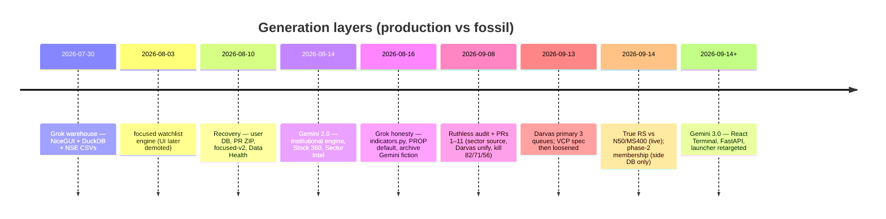
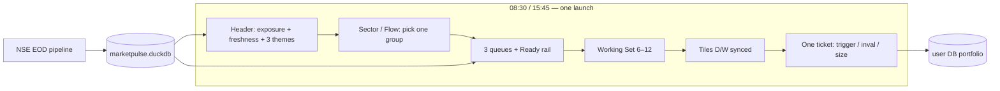
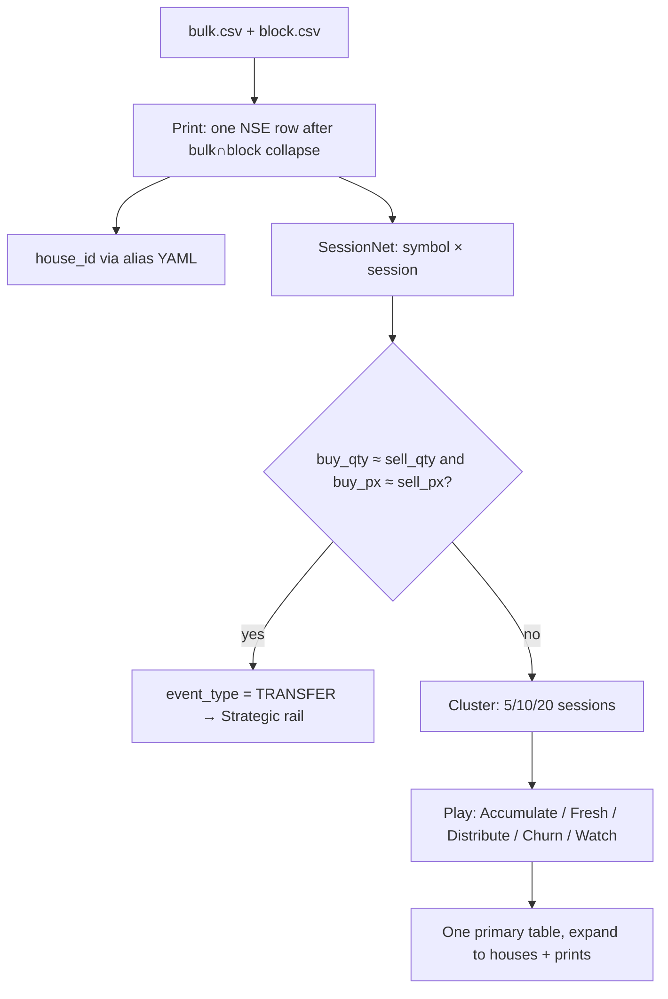

# MarketPulse 2.0 / 3.0 — Usefulness Review + Implementable Upgrade Design

| Field | Value |
| :--- | :--- |
| **Title** | Morning EOD swing desk: honesty first, then one ticket |
| **Author** | MarketPulse design loop |
| **Date** | 2026-09-21 |
| **Status** | Draft (rev **2026-09-21d — user decisions locked**) |
| **Audience** | Siddhant (discretionary NSE EOD swing trader) and senior engineers who know this repo |
| **Lens** | Financial investor + swing trader + technical-indicator analyst. Trading usefulness outranks engineering elegance. |
| **Repo** | `D:\Sid\MarketPulse2.0` |
| **Live DB as-of** | `prices_daily` / `indicators_daily` max **2026-09-18** (verified read-only) |
| **Does not supersede** | Recovery data-authority, read-only market DB, user-DB split, official-NSE EOD spine, true-RS contract (`docs/superpowers/specs/2026-09-14-true-rs-vs-bench-design.md`) |
| **Does not implement** | This document is design only. No code is patched in this pass. |

This document is grounded in five investigation briefs (2026-09-21) plus live DuckDB verification on 2026-09-21. Investigation claims that failed verification are called out with evidence.

---

## Overview

MarketPulse is an official-NSE EOD warehouse with a tested Darvas Squeeze edge and a three-queue Action Desk. `Launch_MarketPulse.bat` currently opens a React 3.0 Terminal: six research tabs, a 180-bar daily sidecar, and a snapshot-first morning. The warehouse (1.24M daily bars, delivery, peer RS, true vs-index excess, bulk/block prints, 589 breadth sessions) is the moat. The default cockpit is a research browser sitting on that warehouse.

The upgrade is a single morning desk: 10-second regime, three setup queues, `candidate_daily` in the existing focused-v2 column format, one Working Set. Honesty bugs ship first. **React 3.0 is the only user-facing morning desk.** NiceGUI source stays in the tree as optional Lab (`Launch_Legacy_UI.bat`); it is not opened in the morning workflow.

**Rev 2026-09-21e (user):** do not invent a Ready predicate, account-equity size formula, or CA PURPOSE parse. Surface existing `candidate_daily` columns; the trader filters.

---

## Background & Motivation

The Jul–Aug Grok spine (NiceGUI + DuckDB + official NSE CSVs + focused-v2 + user-DB split) is still the system of record. Gemini 2.0 added Stock 360 and the institutional engine. Gemini 3.0 added React + FastAPI and retargeted the primary launcher. The 2026-09-08 audit (`docs/MARKETPULSE-AUDIT-AND-UPGRADE-DESIGN.md`) remains true on warehouse math, Darvas, and playbook-vs-code. Gemini 3.0 landed *after* that audit; the dual-UI tax and several new honesty bugs are the 3.0 overlay.

Pain for this desk, as of 2026-09-18:

- Double-clicking the advertised launcher opens React on `:8000`. README still documents `:8081`. Portfolio (11 OPEN / 11 SOLD), Data Health, and focused-v2 Prepare (18 names with real trigger/inval/R:R) live only in NiceGUI.
- The badge labeled “RS” is a 40/20/20/20 peer percentile vs ~2,396 names. True excess vs Nifty 50 and NIFTY MIDSML 400 is already on every `indicators_daily` row. React never renders `rs_vs_*`. The tooltip claims Nifty outperformance (`frontend/src/utils/benchmarks.tsx:41–46`).
- FastAPI VCP can invent `"3T VCP Contraction (15% → 7% → 3%)"` when the Action Desk queue is empty (`App/api/server.py:758–802`). A trader can size rupees from that copy.
- Sector vs-Nifty is populated through 2026-09-17 and **all-null on 2026-09-18** (append order: `Scripts/append_database.py:156–160` reads stale `index_daily` before `write_database` re-ingests MA).
- Corporate-action ratios are hardcoded 1.0 (`Scripts/pr_report_ingestion.py:159`). 649/649 live rows. Daily OHLC/EMAs/RS are unadjusted; the 52w file is CA-adjusted. Mixed tape.
- Tabs are parallel lists. The sidecar is the only connective tissue. Watchlist chips are a clipboard. Tiles default to HAL/MTARTECH/ROSSTECH/PARAS.

A trained user on **Legacy Action Desk + TradingView + Portfolio** can extract edge. The advertised launcher is a prettier, less complete, less honest desk. That gap is the reason for this design.

---

## Goals & Non-Goals

### Goals

1. One morning object: `as_of`, exposure band, freshness gate, **10–25 names** (22 on the 2026-09-18 tape under `is_ready()`), each with trigger / invalidation / 1R% / suggested shares / group state / delivery+deals sentence.
2. Honest labels: peer RS stays `rs_percentile` (min_count=4); vs-index and vs-sector are separate labeled chips; NIFTY MIDSML 400 is the default displayed bench (ORIGINAL_REQUEST R3).
3. Cross-tab context (symbol, group, Working Set, thesis) that survives tab switches, tiles, and sidecar.
4. Historical surfaces: RS rank T-0/T-5/T-15/T-30, flow 5d/20d, weekly/monthly candlesticks from `prices_daily`.
5. Momentum as a Stage-2 *leader* scan with RS / RVOL / delivery / ADV as first-class filters; Darvas EMA200 invariant; D/W/M toggle.
6. Institutional desk as Print → SessionNet → Transfer-vs-Cluster → scored Play. House IDs. Size vs ADV. T+5 follow-through. Matched transfers routed to Strategic.
7. Fail-closed NULLs. Empty **Stage-2 coil** queue returns empty. No COALESCE-to-50/45. No fabricated wave copy. No playbook numbers except those generated from live code.
8. Input gold already on disk: CA ratios, MA A/D + TOP25, isin/T2T, mp44 table, unified date-token parser.

### Non-Goals

- Live ticker, broker execution, unverified XBRL, official FII/DII (skipped this quarter; no manual CSV table).
- Cloning Screening Mantis. Information architecture (health strip, sector board, Daily/Weekly) may be borrowed; persistence model and screens stay original.
- Replacing `rs_percentile` with vs-index, or dumping adaptive IPO scores into the primary rank (true-RS design + `tests/test_candidate_semantics.py` already lock this).
- Silent truncation of visible symbols on copy (GEMINI.md invariant 1).
- Artificial stop-loss filtering in discovery (GEMINI.md invariant 3).
- SAST / PIT / pledge ingest in this tranche.
- Deleting NiceGUI source. It remains Lab. Do not invest in it as a parallel morning product.

---

## Executive verdict

| Layer | Score /10 | Why |
| :--- | ---: | :--- |
| EOD warehouse (NSE spine, as-of 52W, delivery, deals, RS mix, true vs-index, indexes) | **8.5** | Official tape, 1,241,244 bars 2024-05-06 → 2026-09-18, 2,406 symbols, 589 breadth sessions. This is the moat. |
| Darvas Squeeze as a morning list | **8.0** | Pine-parity box, dry `rvol ≤ 1.0`, 252-session lookback in `desk_contract.DARVAS`. Best original idea. |
| Action Desk IA (exposure → 3 queues → inspector), shared `fetch_action_desk_data` | **7.5** | Right shape. VCP label overclaims. Two universes vs focused-v2 gates. |
| focused-v2 audited snapshot | **6.5** | 18 Prepare / 15 Observe on 2026-09-18 with real trigger/inval/R:R. Hidden from default launch. `industry_state="Unknown"`. |
| Institutional prints (3-tier + PROP quarantine) | **6.0** | Useful blotter raw material. Bulk∩block double-count (222 prints), matched transfers in Conviction, keyword waterfall. |
| Sector rotation | **5.5** | Equal-weight member RS including microcaps; latest vs-Nifty all-null; React Horizon is a no-op. |
| Default React 3.0 launch | **5.0** | Looks like a terminal. Hardcoded HAL, fabricated VCP fallback, no portfolio, no health gate, port-hop breakage, snapshot tables. |
| Honesty / playbook = code | **5.5** | Much improved since 2026-09-08. Gemini 3.0 reintroduced fabricated VCP copy and COALESCE-to-average. |
| Dual-UI / operability | **4.0** | Two launchers, two ports, README wrong, recovery checklist still open, phase2 clone leftover. |
| **Overall usefulness for this trader** | **6.5** | Warehouse held. Cockpit forked. |

**What this app is:** a competent official-NSE EOD warehouse that grew a real Darvas/VCP Action Desk, then grew a second React “3.0 Terminal” that is now what launch opens — while the audited Prepare queue, portfolio, journal, and Data Health still live only in the NiceGUI “legacy” app. It is a **warehouse with a research browser on top**, and it will become a **morning desk** when one launch produces one honest ticket.

---

## Key Decisions

| # | Decision | Rationale |
| :--- | :--- | :--- |
| **K1** | **React 3.0 is the only user-facing morning desk.** FastAPI is a thin JSON adapter over existing Python contracts. Week-1 ports existing `candidate_daily` (focused-v2 columns) and read-only portfolio heat into React. `Launch_Legacy_UI.bat` may remain as **Lab**. Do not delete NiceGUI source. | User: 3.0 UI is preferred; NiceGUI in the tree does not hurt. |
| **K2** | **Keep `rs_percentile` as min_count=4 peer rank** (`RS%ile`). Display vs-index as separate labeled chips. Default displayed bench = **NIFTY MIDSML 400** 63d. `rs_percentile_liquid` is **latest-session only** until as-of mcap exists (PR-14). Universe = **EQ ∩ POOL** (mcap ≥ 1,000, ADV ≥ ₹3 Cr), exclude BE/BZ/`TOTAL`. Historical dates stay NULL. After PR-14, liquid RS **history stays inside EQ ∩ POOL** (do not switch to Nifty 500 membership). | Ranking 2,396 names including T2T inflates the hunting ground. Q4 locked to POOL. |
| **K3** | **Working Set = symbol rows + a JSON context blob.** Table `working_set(symbol, added_at, source, thesis, sort_order)`. Context `{as_of, group, universe, queue, filters, thesis}` persists as `portfolio_settings.setting_key='working_context'`. | Symbol-only persistence drops the group a theme pill just selected. Blob + rows matches the protocol. |
| **K4** | **Fail-closed on missing data.** Queue title is **“Stage-2 coil”** (not “VCP”). Empty queue → `candidates: []` with standing copy **“No coil setups in the pool today.”** Manas T1>T2>T3 + VDU is a **badge** on names that actually qualify. Harden-true-VCP is out of this tranche. Non-empty rows emit wave / VDU / risk / shares **only** from Action Desk geometry; missing pivot/stop → JSON `null`, never `CMP×1.02` / `CMP×1.025`. TypeScript optional numbers + blank chips. Ban COALESCE 50/45 and `risk_pct` default 3.5 / 4.0. | Empty-queue fabrication is `server.py:758–802`. Non-empty fiction is `server.py:734–738`. A Stage-2 coil queue labeled “VCP” trains bad pattern recognition. |
| **K5** | **Deals: Print → SessionNet → Transfer vs Cluster → Play.** PR-08 = collapse + TRANSFER tag + Conviction exclusion + `deal_vs_adv` + ADANIGREEN fixture. PR-09 = numeric `play_score` + ordered Play enum. Illiquid ADV → `vs_adv=null`. YAML at `Scripts/data/house_alias.yaml`. | 222 Bulk∩Block overlaps. `max(adv,1)` would mark illiquids as whales. |
| **K6** | **Sector leadership boards default ≥ ₹1,000 Cr.** Toggle **All \| ≥1,000 \| Watch 300–1,000 (do not size)**. Watch overlay is locked (Q5). | Leader chips already filter 1,000; group RS currently mixes 522 sub-300 names. |
| **K7** | **Capital Flow is turnover-share Δ + delivery accumulators.** Filter the **already-selected** `turnover_expansion_pct >= 30` (do not COALESCE). Persist `turnover_share_delta_21d` NULL until that group has 21 sessions. | SQL already computes expansion (`server.py:1158`) and does not filter it. UI claims 1.3× (`CapitalFlowDashboard.tsx:511`). |
| **K8** | **CA PURPOSE parse, 5-session badge, and drop-TOTAL are out of scope.** User does not use this path. Leave `corporate_actions` as ingested. Do not add PR-03a / PR-03b. Mixed-tape (raw OHLC, CA-adjusted 52w) remains a documented data fact, not a work item. | User: “Parse CA PURPOSE onto corporate_actions + 5-session badge + drop TOTAL — I don’t use this.” |
| **K9** | **Charts: D/W/M from `prices_daily`, completed periods only.** Ratio overlay vs MidSml (or Nifty 50 via exact-name helper). True RS chips stay 21d/63d excess. NiceGUI `vcp_chart.py` uses the same helper in PR-02. | `vcp_chart.py:137–138` `LIKE 'nifty 50%'` duplicates dates when Nifty 500 is present. |
| **K10** | **Do not invent a Ready rail or skip the 8% cap.** Surface `candidate_daily` in the existing focused-v2 columns (State, Score, Trigger, Invalidation, To trigger %, Risk %, R:R, Why now, Blocks, Warnings). As already coded: Prepare = eligible AND `total_score ≥ 60`; Observe = eligible AND score < 60; Blocked = not eligible (`decision_policy.py` + `candidate_engine.py:263–268`). The 8% stop cap stays in the engine. The trader filters. | User: do not decide Ready for me; give correct data in my format. |
| **K11** | **One token file.** Accent gold `#d8ac3d`. Up `#10b981`. Down `#f43f5e`. Warn `#f0be58`. Cyan is links-only. | React currently competes gold vs cyan vs three greens. |
| **K12** | **Unsourced 82/71/56 copy stays deleted.** Expectancy / `signal_outcomes` wiring is **deferred** from this tranche. Parked contract: `signal_id` prefix per queue, `horizon_sessions=20`, JSON `null` if n<30. PR-16 is tokens + fossils only. | Shipping “playbook from `signal_outcomes`” without identity/horizon/N would invent a join and repeat attribution’s fillna(50) sin. |
| **K13** | **No implied account equity and no suggested share count.** Do not default ₹1,00,000 / 1%. Ticket / candidate rows show Trigger, Invalidation, Risk %, R:R only. Size is the trader’s. | User: “Size uses portfolio_settings else ₹1,00,000 / 1% — not this.” |
| **K14** | **Weekly Darvas is a timeframe toggle only.** `MP_DARVAS_WEEKLY` default **off**. No fourth morning queue. PR-12 as written. | User Q7 locked. |
| **K15** | **Momentum RS ≥ 70 default is OFF** (census). RS ≥ 70 lives on named presets (Minervini 8/8, Stage 2 leader). Sort-by-RS remains. Do not add RS≥70 as a default Momentum filter. | User Q2 locked. |
| **K16** | **IBD 1–99 this quarter** as a *second* series. Label `RS 1–99 (MS400)`. Overlapping cumulative 3/6/9/12-month excess vs NIFTY MIDSML 400, 40/20/20/20 mix, mapped to integer 1–99 within EQ ∩ POOL on the latest session. Fail-closed NULL if any leg missing. Does **not** replace `rs_percentile`. PR-06c after PR-06a. | User Q10 locked. True-RS design deferred this; now in-tranche. |
| **K17** | **Official FII/DII skipped this quarter.** No download, no manual CSV table. Client-name buckets stay labeled as keyword buckets. | User Q9 locked. |

---

## Answers to all 17 questions

Each answer: current state (cited + live numbers), trader impact, proposed change.

### 1. Input files utilization — is every NSE input used to its maximum?

**Current state.** We download a strong NSE EOD set and use it unevenly. Live `Input/daily/` for 18-Sep-2026 has nine files; `ingested_reports` has those nine rows only.

| Input | Used as | Unused gold |
| :--- | :--- | :--- |
| `sec_bhavdata_full_*.csv` | First-class: OHLC, volume, delivery, turnover → `prices_daily` / `indicators_daily` | `last_price`, `avg_price` / `vwap_distance_pct`, `trades` / `avg_trade_size` barely shown |
| `CM_52_wk_High_low_*.csv` | CA-adjusted 52w onto indicators | No EQ series preference (`build_database.py:273–287`); `is_fresh_52w_high` computed, not a first-class column |
| `sec_list_*.csv` | Band number + GSM remarks | Series dropped; T2T (`BE`/`BZ`) never becomes `is_trade_to_trade`. Drawer SELECT `is_trade_to_trade, is_fno` is **`stock_drawer.py:701–704`**, swallowed by `except duckdb.Error`. Live `stocks_master` has 15 columns, neither of those two. |
| `PE_*.csv` | `pe` / `adjusted_pe` | Filename 6-digit; `parse_file_date` is 8-digit only (`build_database.py:102–109`) |
| `mcap*.csv` | `market_cap_cr` | `issue_size` parsed then absent from live `stocks_master` (15 cols). `TOTAL` row ingested: 48,051,465 Cr |
| `MA*.csv` | Index rows → `index_daily` (54,887 rows, 140 names, 424 sessions) | Official A/D, circuit-hit count, TOP 25 (has SYMBOL), per-scrip tape skipped (`index_history.parse_market_activity` requires ≥8 columns) |
| `bulk.csv` / `block.csv` | `deals` 14,036 rows | Remarks unused; no ISIN; 5 months vs 16 months of prices |
| `PR{ddmmyy}.zip` | announcements + board meetings + CA skeleton | Ratios hardcoded 1.0; `hl`/`tt` blank symbol (3,550 / 625 rows); `pd`/`gl`/`sme` unread |
| `EQUITY_L .csv` | Universe filter | `isin`, `listing_date`, `ipo_age_days`, face/lot/paid-up parsed then dropped from live master |
| `mp44_membership.csv` | In-memory sector-index RS for 499 names | `index_constituents` table **missing** from live DB (`ensure_index_constituents` imported `build_database.py:34`, never called) |
| FII/DII cash stats | Not downloaded | UI “FII/DII” is client-name buckets |

**Trader impact.** The tape a swing trader actually needs (delivery, 52w, mcap, deals, index benches) is present. The injuries are CA-unadjusted prices, blank top-traded symbols, missing T2T chips, and a stale `security_reference_daily` (max `effective_date` **2026-08-13** while files exist through 2026-09-18).

**Proposed change.** Week-1 P0 is **parse PURPOSE + CA badge + drop `TOTAL`** (PR-03a), no OHLC rewrite. Later ingest (PR-14 / PR-03b): map SECURITY→symbol for hl/tt **and** parse MA TOP 25 into `ma_top25_daily`; persist `exchange_macro_daily`; persist EQUITY_L identity + `is_t2t`; call `ensure_index_constituents` inside `write_database`; unified 6/8-digit date parser; upsert `security_reference_daily` even on append-noop. Official FII/DII stays out until a stable endpoint exists.

### 2. RS calculation against indices — are we doing this and showing it in the app?

**Current state.** Four RS systems. Verified live 2026-09-18 (2,396 names that session):

| System | Formula | Coverage latest | Shown where |
| :--- | :--- | :--- | :--- |
| **A. `rs_percentile`** | Non-overlapping 63-session quarters, 40/20/20/20, percentile vs all names that day, min_count=4 (`build_database.py:741–751`) | 2,111 non-null / 285 NULL; 634 ≥70, 423 ≥80, 212 ≥90 | React “RS Rating” everywhere it appears. Cockpit table omits the column even though the API sends it. |
| **B. True vs-index** | `(stock_ret_N − index_ret_N) * 100` vs `"Nifty 50"` and `"NIFTY MIDSML 400"`, 21d/63d (`Scripts/true_rs.py`) | 21d 2,396/2,396; 63d 2,365/2,396 | NiceGUI Stock 360 chips only. **Zero `rs_vs_` matches in `frontend/src`.** |
| **C. vs sector index** | Same excess vs mapped `sector_index_name` | 499 mapped / 478 with 63d | Hidden from React. Membership CSV, no `index_constituents` table. |
| **D. Group vs Nifty** | Cap-weighted member return − Nifty 50 (`sector_metrics.py:55–73`) | **2026-09-17:** Sector 22/22, Broad Sector 12/12, Broad Industry 59/59, Industry **186/187**. **2026-09-18: 0 at every level** (22/12/59/187). | React Sector reads `sector_rotation.rs_percentile` = **mean of member stock RS** (`build_database.py:991`), a different number. |

Tooltip lie: `benchmarks.tsx:41–46` — “outperforming the Nifty benchmark.” The column is a peer mix of *absolute* quarterly returns.

Disagreement is the point. Live sample 2026-09-18:

| Symbol | `rs_percentile` | vs N50 63d | vs MS400 63d |
| :--- | ---: | ---: | ---: |
| TITAN | 78.4 | +11.3 | +7.7 |
| HAL | 68.5 | +11.7 | +8.0 |
| DIXON | 43.2 | +6.7 | +3.0 |
| RELIANCE | 44.8 | −3.6 | −7.2 |
| HDFCBANK | 31.7 | −3.5 | −7.2 |
| INFY | 30.6 | +2.8 | −0.9 |

DIXON is an outperformer vs Nifty 50 over 63d while sitting at peer RS 43. That is why vs-index belongs on the row.

**Trader impact.** ORIGINAL_REQUEST R3 asked RS to default to NIFTYMIDSML400 across screeners. The primary displayed RS is still the 2,400-name peer percentile. A MidSml swing book is being ranked against illiquids and T2T.

**Proposed change.** See Proposed Design § Honest RS. Labels: `RS%ile` / `vs MS400 63d` / `vs N50 63d` / `vs {sector} 63d`. Default chip = MidSml 63d. Liquid rank as a fourth number on queues. Tooltip rewritten to the actual formula.

### 3. Connecting information across tabs / connecting the dots

**Current state.** One `selectedSymbol` in `frontend/src/App.tsx` (default `'HAL'` line 30). Sidecar is the only shared surface. Cross-link matrix from the UI investigation: theme pills open Sector with no group filter (`ExposureGateHeader.tsx:187`); `onNavigateTab` omits `'flow'` (line 9); sector group rows are inert (`SectorWorkspace.tsx:378–385`) even though `/api/sector/{group}/stocks` exists (`server.py:1688`); watchlist chips are not clickable (`StagingBasketDrawer.tsx:39–52`); inspect-from-tile closes the grid (`App.tsx:246–249`); tiles fallback is Defence quartet (`App.tsx:56–62`); J/K advertised (`InspectorSidecar.tsx:323`) with no handler.

The decision a swing trader needs:

> Defence is Leading → HAL/MTAR/PARAS are RS leaders → is HAL a Darvas squeeze *and* a delivery thrust *and* a fresh whale print *and* an accumulator?

Today that is four tab clicks plus memory.

**Trader impact.** Highest-friction item on the desk. Edge is in the *intersection*, and the UI only shows unions.

**Proposed change.** Working Set + context payload (Proposed Design § Cross-tab context). Theme pill, sector row, flow card, deals row all write the same object. Sidecar grows a “qualifies” strip: Cockpit · Mom · Deal · Acc · Prepare. Tiles consume Working Set. Inspect updates sidecar and keeps the grid.

### 4. Are we using the historical database to show trend, pattern, flow? This is an EOD warehouse, displayed as snapshots.

**Current state.** Data layer is a multi-year daily warehouse. UI is mixed.

| Table | Span | Rows | Nature |
| :--- | :--- | ---: | :--- |
| `prices_daily` / `indicators_daily` | 2024-05-06 → 2026-09-18 | 1,241,244 / 2,406 symbols | Full daily feature warehouse |
| `index_daily` | 2025-01-01 → 2026-09-18 | 54,887 / 424 sessions | Official MA only; 63d true RS cannot exist before 2025-04-03 |
| `breadth_daily` | 589 sessions | 589 | Daily tape |
| `sector_rotation` / `sector_metrics_daily` | 2024-05-06 → 2026-09-18 | daily group history | |
| `deals` | 2026-04-29 → 2026-09-18 | 14,036 | Trailing ~5 months |
| `candidate_daily` | **2026-09-18 only** | 2,396 | Snapshot |
| `rs_rank_t5/t15/t30` | persisted on every indicator row | lags of `rs_percentile` | **unused in React** |

Time-series already queried: stock charts last 400 bars display 180 (`server.py:1300–1404`); VCP/Minervini geometry; breadth drawer; momentum lookback as “did it qualify in the window, then show *current-day* columns.” Snapshot screens: cockpit queues, sector board, capital-flow cards, named screeners.

**Trader impact.** The warehouse can answer “is RS rising, is share flowing, is the weekly still Stage-2.” The React desk answers “what does today’s row look like, plus 180 daily candles.” Stage-2 confirmation is a weekly close. A 180-bar daily pane is a daily pane.

**Proposed change.** RS rank strip T-0/T-5/T-15/T-30 on every stock row. 60-session RS sparkline in sidecar (NiceGUI `stock_drawer.py:123–158` already queries this). Flow 5d/20d share path. D/W/M candlesticks. Capital-flow 20-session share small-multiples. Persist Darvas/VCP marks in EOD (like focused-v2) so both UIs read history rather than recompute 252-bar boxes at UI start.

### 5. Momentum screener

**Current state.** `MomentumWorkspace.tsx` + `GET /api/screener/momentum` (`server.py:375–703`).

Defaults: lookback **20D**, min mcap **₹1,000 Cr**, day vol 1,000,000, max 52w away 25%, min 52w-low +50%, CMP>10 EMA, CMP>200 EMA, EMA stack on. **RS ≥ 70 is absent.** NiceGUI momentum default is **10D** / max-52w **15** (`config.py:317`, `app.py:2379`) — same product name, different scan.

What a trader can decide today: “liquid, above 200 EMA, within 25% of 52w high, coiled on 10 EMA, here is the sector mix of *this* scan.” What they cannot: pivot/stop, RS gate, RVOL gate, ADV ₹ gate, “already in Cockpit.”

False-positive machinery:

- NULL EMAs **pass** (`server.py:459, 468–475, 515–526` — `IS NULL OR a > b`).
- `COALESCE(c.rs_percentile, 50)` and `COALESCE(c.delivery_pct, 45.0)` (`server.py:579, 593`).
- 20D-avg volume mode applies `i.volume >= min_avg_volume_20d` on the *trigger* window (`server.py:444–447`).
- `delivery_thrust` current-day is only `close > ema_20` (`server.py:541–542`).
- Stage 2 preset = trend stack. Minervini 8/8 `rs_70` lives only on the sidecar checklist (`minervini_geometry.py:26–35`).
- `mcap_cr` is returned and never rendered. Limit 300 silently truncates.
- `debug_symbol` interpolated into SQL (`server.py:492–493`).

**Trader impact.** Momentum looks like a buy list and is a census. A name with RS 40, RVOL 0.3×, and NULL EMAs can sit next to a coiled RS 92 leader.

**Proposed change.** See Proposed Design § Momentum. Preset “Minervini 8/8” wires SMA template **and** `rs_percentile ≥ 70` **and** 25%/30% 52w. ADV ₹ Cr replaces share-volume as the default liquidity gate (align with Action Desk). Fail-closed NULLs. Trigger-age chip. Sector cards click-to-filter. Flag rows already in Cockpit / Deals / Working Set / Prepare. Keep discovery free of stop-loss filters.

### 6. Institutional deal desk — is there a better way to handle it?

**Current state.** NSE bulk + block prints, classified by substring keywords on `client_name`. No SAST, no PIT, no official FII/DII. Live mix of 14,036 rows: PROP 7,268 (52%, ₹2.40 lakh Cr), OTHER 3,513, CORPORATE 2,420, DII 471, FII 351, HNI 13. True FII+DII ≈ 822 rows.

Critical product bugs (verified):

- Dedup key includes `deal_type` (`build_database.py:421–424`) → **222** overlapping Bulk∩Block prints.
- Conviction rule `buy_cr ≥ 25 OR net_cr ≥ 20 OR deal_days ≥ 2` (`telegram_deals.py:401–406`) admits matched block transfers (ADANIGREEN 2026-06-09).
- `deal_pct_volume` > 100% on **312** rows (max 6,777%) because block volume is outside CM volume (`build_database.py:913`).
- `bets_count` reads the wrong column (`server.py:885` vs `total_bets` in `institutional_attribution.py:143`) — Fund Leaderboard shows 0 bets.
- Star Radar TV key `tv_strings.star_radar_tv` is never set (`DealsWorkspace.tsx:166` vs `server.py:935`).
- Default NiceGUI cards: latest session, ₹900 Cr, CMP > 200 EMA, top 12 → 6 names. React hub: 10/20/30 deal sessions, no 200 EMA hard gate. Two universes.
- `cluster_buys` on the default path is hardcoded empty (`deals_read_model.py:259`).
- `deal_net_10s_cr` is a **30-calendar-day** window (`sector_metrics.py:113, 235–236`).

**Trader impact.** The 3-tier + PROP quarantine is the closest thing in Indian retail software to a blotter. It currently cannot tell a promoter/OFS transfer from stealth accumulation, and it double-counts block-sized events.

**Proposed change.** See Proposed Design § Institutional desk. One primary table of scored Plays. Transfers and Prop on separate rails. House alias YAML. Size vs 20d ADV. T+5 from the *next* session. Align gates: structure filter on the Play, session-complete lookbacks. Cache the FastAPI payload the way NiceGUI already caches Telegram.

### 7. Grid charts — how can the process be seamless?

**Current state.** `MultiChartModal.tsx`: layouts 1–12, time-scale pan/zoom sync only (no `subscribeCrosshair`), daily 180 bars, no volume pane, no SMA in tiles, density shrinks candles to 24 at 3×4. Source = opener list; nav fallback HAL/MTAR/ROSS/PARAS. Inspect closes the modal (`App.tsx:246–249`). Recenter uses hardcoded `to = 185+3` (`MultiChartModal.tsx:642–650`). Watchlist has no ⊞. Each tile independent fetch, destroy/recreate.

**Trader impact.** Comparative charting is the job *after* screening. The plumbing skips the basket, destroys the comparison to inspect one name, and cannot mark “what did all four do on the deal day.”

**Proposed change.** Tiles as a docked pane (or tab), sidecar stays. Default source = Working Set, else selected rows of the active table. Sync **crosshair + time range**. Deal-day and VCP-pivot markers. Volume histogram. 63/126/252 lookback switch. D/W/M. Click = select (sidecar updates). Double-click = maximize inside the grid. Shared candle cache. See Proposed Design § Grid charts.

### 8. Capital flow radar — what can we do better?

**Current state.** `GET /api/market/capital-flow` (`server.py:1096–1236`). 1D/5D = `turnover_share_delta_*` from `sector_rotation`. **1M sorts `return_1m_pct`** (`server.py:1202`). Accumulators: `turnover_cr ≥ 5` AND (delivery spike OR price-up-delivery-up) AND close > prev_close, LIMIT 25 — **no 1.3× predicate**. UI copy: “Real-time capital migration” (`CapitalFlowDashboard.tsx:133`), “TURNOVER SURGE > 1.3x” (line 511), “Sectors (19) / Industries (80+)” hardcoded (150, 160). Live Sector count is **22**, Industry **187**. `COALESCE(rs_percentile, 50)` again (`server.py:1160`). Deal overlay is last **10 calendar days**.

**Trader impact.** Flow is a second ranking of the same `sector_rotation` table, with a 1M number that is price, and an accumulator list that any up-day with a delivery flag can enter. The unique job (share *path*, trustworthy deal-net, stock-level 1.3×) is undone.

**Proposed change.** Honest naming. 1D/5D/21D share Δ. 20-session share small-multiples for top 6 in/out. Accumulators: expansion ≥ 30%, mcap ≥ 1,000 (toggle 300), `rs_percentile ≥ 70`, ADV ≥ 3 Cr, show mcap. Group click writes context → Sector + Momentum. Drop “real-time” / “INSTITUTIONAL TAPE” unless deals-net is the primary sort.

### 9. Sector intel — does it show stocks below ₹1000 Cr mcap?

**Current state.** Live master: **1,469** names ≥ ₹1,000 Cr, **415** in 300–1,000, **522** below 300 or null.

| Surface | Floor |
| :--- | :--- |
| Action Desk / Cockpit / VCP pool | 1,000 + ADV 3 Cr + band > 5 (`desk_contract.py:31`) |
| React Momentum default | 1,000 (user can type 0) |
| Deals | **900** (`server.py:819`, `deals_read_model.py:70`) |
| Leader chips / `leader_symbols` | 1,000 at materialize (`build_database.py:1040`, `LEADER_MIN_MCAP_CR`) |
| **Group RS / Stage-2% / % > 200 EMA** | **none** — equal-weight includes every EQ name |
| React `/api/sector/{group}/stocks` | default `min_mcap=0`, unused by UI |
| NiceGUI `query_group_members` | 1,000, with an explicit comment to hide microcaps in UI |

React Sector Matrix has **no mcap toggle**. Horizon 10/30/63 is sent as `lookback_days` and ignored (`server.py:943–952`; `sector_read_model.py:1280–1283` still says weekly ranking is “PR 11”). Sidecar peers list sub-1,000 industry members.

**Trader impact.** A group’s Stage-2% is dragged by junk names; the chips are 1,000+. A ₹400 Cr “leader” that cannot appear in Cockpit is a trap. Mixing mid/small into the large-cap board silently is how this desk mis-sizes.

**Proposed change.** Default leadership boards and member drill-downs at ≥ 1,000 Cr. Toggle: All | ≥1,000 | Watch 300–1,000 (do not size). Recompute Stage-2% and % > 200 EMA under the selected floor. Group name is a drill-down calling the existing members API with `min_mcap=1000`. Honor Horizon. Align Deals floor to 1,000.

### 10. UI — theme, colors, charts

**Current state.** Two night fields, competing signals.

- Tailwind tokens (`frontend/tailwind.config.js`): bg `#080c14`, primary `#d8ac3d`, bullish `#10b981`, bearish `#f43f5e`.
- NiceGUI (`App/ui/styles.py:14–58`): `--mp-bg #080c12`, `--mp-good #45d483`, `--mp-bad #f27c84`, `--mp-primary #d8ac3d`.
- React **does not use the Tailwind tokens** in practice. Raw hex everywhere. Third green `#45d483`, fourth `#34d399`, chart `#22c55e`, interaction cyan `#38bdf8` competing with brand gold.
- Sidecar chart height **240px** (`InspectorSidecar.tsx:96`) — too short to read a 3-month base.
- Density: 11px mono headers, 12px body — tables are the right primitive; Flow cards fight it.
- **11** `fetch('http://127.0.0.1:8000...')` call sites in `frontend/src` (grep gate, not “14”). Momentum is already relative (`MomentumWorkspace.tsx:89`). Plus Vite proxy target `frontend/vite.config.ts:11` and `launch_terminal.py:21–22`. `Launch_MarketPulse.bat:18–28` hops port when 8000 is busy. Production SPA is same-origin (`server.py:1716–1719`); relative `/api` survives the hop. `npm run dev` still dies if uvicorn is not on 8000.

**Trader impact.** Muscle memory does not transfer between UIs. Cyan-vs-gold makes “primary” ambiguous. A 240px chart cannot veto a VCP. Port-hop silently kills the desk.

**Proposed change.** One JSON token file generating both Tailwind and `styles.py`. Accent gold, one up, one down, cyan for external links only. Sidecar chart ≥ 360px on 1080p. Relative `/api` everywhere. Kill emoji in table cells. See Proposed Design § UI theme.

### 11. Benchmarks we have set: RVOL, delivery %, turnover, etc.

**Current state.** Defined and stored on every daily bar. Displayed as badges. Used as **hard gates in some queues, optional in others, absent on React Momentum** (except delivery-thrust checkbox and share volume).

| Benchmark | Definition | Live 2026-09-18 | Gates |
| :--- | :--- | :--- | :--- |
| **RVOL** | `volume / prior 20-session SMA` (current bar excluded) (`indicators.py:80–84`) | median 0.74×, p90 2.32×, 511 names ≥1.5× | Darvas squeeze **hard** `rvol ≤ 1.0` (`desk_contract.py:43`). Momentum: display only. |
| **Delivery %** | NSE `DELIV_PER` | median **56.6%**, 292 spikes | Momentum optional Delivery Thrust. COALESCE 45% fabricates healthy prints. |
| **Turnover** | `TURNOVER_LACS / 100` = ₹ Cr | — | Action Desk ADV ≥ 3 Cr. Momentum uses **share** volume 1M. Badge ideal ≥ ₹25 Cr disagrees with thresholds 50/20/5 (`benchmarks.tsx:26–32`). |
| **Ticket ratio** | avg trade size / 20d | — | Action Desk only. |
| **RS** | see Q2 | 2,111 ranked | Minervini sidecar ≥70. Momentum: none. |
| **`avg_volume_20d`** | rolling 20 **including today** (`build_database.py:513`) | — | Inconsistent denominator vs RVOL. |

**Trader impact.** Badges teach a language the filters do not speak. A trader cannot say “RS ≥ 80, T/O ≥ 25 Cr, RVOL ≥ 1.5” on Momentum. Value-RVOL (`turnover_cr / avg_traded_value_cr_20d`) is the position-sizing number for Indian cash and is unlabeled.

**Proposed change.** One RVOL definition (exclude current bar) plus a parallel `value_rvol` column. Delivery fail-closed. Momentum filters match badges. Align turnover “1W” to 5 *sessions* (calendar `INTERVAL 5 DAY` in `app.py:1493–1494` is weekend-sensitive). Tooltip ideal ≥ ₹25 Cr becomes the Momentum ADV default optional chip; Action Desk stays 3 Cr for discovery, focused-v2 stays 10 Cr for Ready.

### 12. Weekly and monthly charts?

**Current state.** **No W/M candlestick charts in React.** Inspector and tiles are daily (`/api/stock/{symbol}/chart`, 180 display / 400 calc). Weekly/monthly exist as **resampled features** forward-filled onto the daily row (`build_database.py:474–628`): `wema_*`, `rsi_14_w`, `mema_*`, morning-star W/M. Darvas W/M: `weekly_ohlc` completed-Friday only (`darvas_squeeze.py:166–240`); `monthly_ohlc` **includes the in-progress month** (243–310). `MP_DARVAS_WEEKLY` defaults False. React cockpit does not expose weekly/monthly Darvas queues. Momentum “Weekly RSI ≥ 60” uses the forward-filled daily copy with `COALESCE(rsi_14_w, 50)` (`server.py:545–546`). Sector `timeframe='W'` is ignored (`sector_read_model.py:1280–1283`). No weekly RS, no weekly RVOL.

**Trader impact.** Stage-2 confirmation is a weekly close. Darvas weekly boxes are a real edge sitting behind a flag the React desk never exposes. A Wednesday `wema_10` that includes Wednesday as if it were the weekly close is a leak.

**Proposed change.** Chart API `tf=D|W|M`. Resample `prices_daily` in the read path (history is already loaded). Completed week / completed month only. Inspector and tiles share the switch. Relative-to-bench pane on all three. Optional weekly Darvas queue behind the existing flag, labeled, completed-week only. Fail-closed: in-progress week features are NULL on the latest daily row or explicitly labeled “week-to-date.”

### 13. Code review — identify bugs (cite file:line). Propose corrections in the design; do not patch code in this pass.

Severity: **S0** trading-decision false signal; **S1** wrong number on a primary widget; **S2** correctness hazard; **S3** hygiene.

#### S0 — fix in PR-01 / PR-02 / PR-03a (week-1 honesty; 03b is the tape rebuild)

| ID | Where | Bug | Intended correction |
| :--- | :--- | :--- | :--- |
| **H1** | `App/api/server.py:758–802` **and** `734–738` | Empty queue fabricates `"3T VCP Contraction (15% → 7% → 3%)"`, `vdu_ratio=0.72`, `risk_pct=3.5`, pivot=`CMP×1.025`. **Non-empty path** defaults `wave_seq` to `"3T VCP Contraction"`, invents `vdu_ratio` 0.65/0.85 from a substring, and if pivot/stop missing uses `CMP×1.02` / `CMP×0.96`. `_sanitize_float(..., 4.0)` at line 730. | Empty → `candidates: []`, copy **“No coil setups in the pool today.”** Non-empty: emit wave/VDU/risk/shares only from AD columns; missing geometry → JSON `null`; never CMP multiples. Tests forbid `15% → 7% → 3%` **and** `cmp_val * 1.025` / `* 1.02`. |
| **H2** | `server.py:324` (cockpit) and `server.py:730` (VCP `4.0`) | Cockpit `risk_pct` defaults **3.5**; VCP sanitizer defaults **4.0**. | JSON `null`. Size UI disabled until a real stop exists. TypeScript `risk_pct: number \| null` (`types.ts:73,136`). `CockpitWorkspace.tsx:267–268` and `VcpWorkbenchWorkspace.tsx:198,247` must blank-chip, never `.toFixed` on null. |
| **H3** | `server.py:579, 593, 992, 1160` | `COALESCE(rs_percentile, 50)` and `COALESCE(delivery_pct, 45.0)`. | SELECT raw; JSON `null`; UI blank chip “RS n/a”. |
| **H4** | `frontend/src/utils/benchmarks.tsx:41–46` | RS tooltip claims Nifty outperformance. | Rewrite to 40/20/20/20 peer percentile, min_count=4, universe = session names. Point at vs-MS400 chips. |
| **H5** | `server.py:296–299` | Cockpit 1D% is **open→close**. Other tabs are vs `prev_close`. | Use `return_1d_pct` / `(close/prev_close − 1)`. |
| **H6** | `Scripts/append_database.py:156–160` + `build_database.py:1194–1202` | Sector vs-Nifty computed from DB `index_daily` *before* today’s MA ingest. Live: 2026-09-18 all-null at every taxonomy level. | Compute `sector_metrics` *after* index features for the new date, or pass in-memory `build_index_features(load_all_market_activity_history())` into `compute_sector_metrics`. |
| **H7** | `Scripts/sector_metrics.py:61`; also `Scripts/candidate_engine.py:203`; `App/market_commentary_engine.py:223`; `App/ui/vcp_chart.py:137–138` (`LIKE 'nifty 50%'`) | `str.contains("NIFTY 50")` matches `"Nifty 500"` (live same-date closes 23346.4 vs 22840.55). `vcp_chart` duplicates `trade_date` in the ratio overlay. | One helper `index_rows(index_daily, true_rs.BENCH_NIFTY50)` used by all four. Fixture: both names on the same date. |
| **H8** | `Scripts/pr_report_ingestion.py:159` + unused `corporate_actions.py:20–59` | Ratios always 1.0; `price_adjustment_factors` missing from live DB; 649/649 ratio 1.0, 0 cash_amount, 632 type=`other`, 0 splits typed. Nested-loop factor builder is not production-safe. | **PR-03a:** parse PURPOSE onto **`corporate_actions`**; badge reads that table; no daily factor table. **PR-03b:** vectorized `price_adjustment_factors` daily series; sidecar `*_adjusted`; dividends factor 1.0. |
| **H9** | `Scripts/build_database.py:421–424` + `telegram_deals.py:401–406` | Bulk∩block double-count (222 prints); matched transfers enter Conviction via `buy_cr ≥ 25`. | Collapse on `(date, symbol, client, side, qty, px)`; tag TRANSFER when buy≈sell same session; exclude from accumulation scores. |
| **H10** | `Scripts/build_database.py:433–447` | RSI divergence uses `shift(-1)` (tomorrow’s bar) to mark today’s swing. | Require the next bar to exist; leave latest-session divergence NULL (fail-closed). |

#### S1 — wrong number / false positive on a primary widget

| ID | Where | Bug | Intended correction |
| :--- | :--- | :--- | :--- |
| **N1** | `server.py:459, 468–475, 515–526` | NULL EMA/SMA predicates pass the stack. | `IS NOT NULL AND a > b`. Darvas EMA200 invariant: missing 200 EMA excludes. |
| **N2** | `server.py:444–447` | 20D-avg volume mode tests *day volume* in the trigger window. | `i.avg_volume_20d >= min_avg_volume_20d`. |
| **N3** | `server.py:541–542` | Delivery thrust current-day is only `close > ema_20`. | Require current-day `delivery_spike AND price_up_delivery_up` when the preset is on; lookback remains the trigger. |
| **N4** | `server.py:267–268` | Header `vcp_count` reads `breadth_daily.vcp_candidates` (4-factor heuristic, hundreds). Workbench shows the Action Desk queue (tens). | Header count = `len(queues['vcp'])` from `fetch_action_desk_data`. Persist 4-factor as `base_quality_score` only. |
| **N5** | `server.py:885` | Leaderboard `bets_count` reads missing `bets_count`; column is `total_bets`. | Read `total_bets`. |
| **N6** | `server.py:935` + `DealsWorkspace.tsx:166` | Star Radar TV copy never populated. | Set `tv_strings.star_radar_tv` from the star symbol list via `to_tv_list`. |
| **N7** | `server.py:1202` + `CapitalFlowDashboard.tsx:511` | 1M flow is 1M return; UI claims 1.3× surge the SQL does not apply. | 21d share Δ; SQL `turnover_expansion_pct >= 30`. |
| **N8** | `server.py:640` | `bullish_stack` badge skips EMA 100; filter requires 10>20>50>100>200. | Align badge with filter. |
| **N9** | `Scripts/sector_metrics.py:76–123` | `deal_net_10s_cr` is 30 calendar days. | 10 *sessions*; rename column or label. |
| **N10** | `read_market_cap` in `build_database.py` (live `stocks_master.symbol='TOTAL'`, mcap 48,051,465 Cr) | NSE mcap file summary row ingested into master. | Drop rows where `symbol` is `TOTAL` / non-ticker at read, before `build_master`. |
| **N11** | `build_database.py:913` | `deal_pct_volume` vs CM volume; blocks explode. | Size vs `avg_traded_value_cr_20d` as `deal_vs_adv`. Leave raw % nullable when qty > volume. |
| **N12** | `darvas_squeeze.py:243–310` vs `206–208` | Monthly OHLC includes incomplete month; weekly does not. | Completed-month only, symmetric with weekly. |
| **N13** | `build_database.py:474–491, 579–604` | `wema_10` / weekly RSI ffill in-progress week. | Completed-week helper for all weekly features, or NULL on incomplete. |
| **N14** | `candidate_engine.py:279` | `industry_state="Unknown"` on all 18 Prepare names (verified). | Join industry `rotation_state` from `sector_rotation` level=Industry. Rebuild `candidate_daily` (EOD) to persist; until then Ready rail may join at read time. |
| **N15** | `institutional_attribution.py:92, 115, 171` | `sess_idx=0` is print day (same-day high in runup); `win_rate` fillna(50). | Forward from next session; NULL win-rate when sample < N. One bet per (house, symbol, cluster). |

#### S2 / S3 — wiring, injection, dual-UI, dead code

| ID | Where | Bug | Intended correction |
| :--- | :--- | :--- | :--- |
| **W1** | **11** `fetch` call sites in `frontend/src` hardcoded `http://127.0.0.1:8000` | Port-hop (`Launch_MarketPulse.bat:18–28`) loads SPA, then APIs die. Vite proxy (`vite.config.ts:11`) is a separate **dev-only** pin. | Relative `/api/...` in SPA (PR-04). Vite proxy → `process.env.MP_PORT \|\| 8000`. Grep-gate test counts `http://127.0.0.1:8000` in `frontend/src` = 0. |
| **W2** | `server.py:492–493, 548–549` | `debug_symbol` f-string SQL. | Bound parameter. |
| **W3** | `App.tsx:30, 56–62, 246–249` | HAL default; Defence tile fallback; inspect closes grid. | Default = first row of active table or Working Set[0]. Tiles from Working Set. Inspect keeps grid. |
| **W4** | `ExposureGateHeader.tsx:9, 187` | No `'flow'` tab; theme pills carry no group. | Extend union; pass context. |
| **W5** | `InspectorSidecar.tsx:323` | J/K advertised, unimplemented. | Implement row nav on the active table. |
| **W6** | `README.md:14` vs `Launch_MarketPulse.bat:18–38` | README says 8081; bat starts FastAPI 8000. `tests/test_ui_recovery_contracts.py:121–127` still expects `localhost:%PORT%` on Launch_MarketPulse (now `127.0.0.1`). Legacy bat still uses localhost. | README 8000/8081. Fix/delete both recovery tests. Vite proxy `MP_PORT` (Issue 15). |
| **W7** | `tests/test_ui_recovery_contracts.py:140–144` | Asserts `App/pages/screener.py` — source deleted. | Delete or retarget the test. |
| **W8** | `App/thematic_read_model.py` `NEXTGEN_TECH_UNIVERSE` | Gemini fossil; Sector Intel unhooked; tests still assert 8 pillars. | Archive module; drop runtime tests or mark skipped. |
| **W9** | `Database/marketpulse_phase2_rs.duckdb` | Stale clone max **2026-09-11**, extra tables, **zero Python imports**. | Move to `scratch/` or `Exports/`. Import `index_constituents` / factors into live DB via the EOD path. |
| **W10** | Dual `query_service.py` | Both test-only. | Leave until a later delete PR. |
| **W11** | `config.py:39` | `EQUITY_L .csv` trailing space. | Accept both filenames. |
| **W12** | `build_database.py:792` | `"master" in dir()` always false inside `calc_indicators`. | Pass `master` as a parameter. |
| **W13** | `pr_report_ingestion.py:177–194` | `hl`/`tt` no SYMBOL → 625/625 and 3,550/10,528 blank. | Name→symbol map + MA TOP 25. |
| **W14** | CORS `allow_origins=["*"]` (`server.py:62–68`) | Fine on loopback; dangerous if `MP_ALLOW_REMOTE`. | Restrict when non-loopback. |

### 14. Suggest improvements

Ranked by expected improvement in “did I take the right names at the right size tomorrow morning.” Engineering elegance ignored.

1. **One launch = one honest desk** (K1). Health gate. Relative `/api`. README matches bat.
2. **Delete fabricated VCP + COALESCE averages + risk 3.5** (H1–H3). Highest-severity 3.0 honesty bugs.
3. **Show `candidate_daily` in the existing focused-v2 columns** (State, Score, Trigger, Invalidation, To trigger %, Risk %, R:R, Why now, Blocks). No new Ready predicate. No skipped 8% cap. Trader filters.
4. **Geometry only on the row:** Trigger, Invalidation, Risk %, R:R. No suggested share count, no assumed account equity.
5. **Working Set + context payload** so Sector → Momentum → Tiles → Cockpit is one path.
6. **Honest RS on every row** (K2) plus T-0/T-5/T-15/T-30 strip already persisted as `rs_rank_t*`.
7. **Deals as Plays** (K5). Transfers out of Conviction. House IDs. vs ADV.
8. **Industry leadership as a gate on Ready**, a chip on Discovery. Stop writing `industry_state="Unknown"`.
9. **Relabel the queue “Stage-2 coil.”** Manas T1>T2>T3 + VDU is a badge. Header count from the Action Desk coil queue. Harden-true-VCP is out of this tranche.
10. **Delivery + deals confirmation sentence on the ticket**, assembled from columns that already exist (`rvol` trail, `delivery_pct`, session-net).
11. **W/M candlesticks + relative-to-bench pane.** Stage-2 lives on the weekly.
12. **CA PURPOSE parse is out of scope** (K8). Mixed tape stays a data fact.
13. **Expectancy deferred** (K12). Parked: `signal_id` prefix per queue, horizon 20, NULL if n<30. Do not invent a join in PR-16.
14. **Freshness as a trade gate.** If `database_date != expected_session` (weekend excepted), disable TV copy and size. `/api/health` already returns `actionable` (`server.py:99–109`); SPA never consumes it.
15. **Input gold:** MA A/D + TOP25, isin/T2T, mp44 table, date-token, drop TOTAL.

Honorable: persist Darvas/VCP marks in EOD; value-RVOL column; complete-month monthly OHLC; delete NEXTGEN fossil; move phase2 clone off `Database/`.

### 15. What would you do differently?

Short, opinionated, still implementable as a north star. Full write-up in the dedicated section below.

If starting from a blank repo for *this* trader: one DuckDB, one user DB, one UI, one contract file, one ticket object, queues persisted at EOD, official NSE only. Discovery screens are Lab. Morning is 25 names. Name things what they are. Never ship a second UI until it is a strict client of the same contracts including positions and freshness.

The spine we have (DuckDB, official EOD, `desk_contract`, `fetch_action_desk_data`, pytest Darvas/exposure) is the right spine. The product forked. This design is how we unfork without a rewrite.

### 16. Overall review of the app (usefulness score, warehouse vs cockpit, what a morning desk should be)

**Scores:** warehouse **8.5**, default cockpit **5.0**, overall **6.5**. See Executive verdict.

**Warehouse vs cockpit.** The warehouse is a multi-year, as-of, delivery-aware, deal-aware, index-aware EOD book. Most Indian “screeners” fake this. The cockpit is currently a six-tab research browser that *reads* that book as latest-session tables plus 180 daily candles. focused-v2 is the only place that jointly emits conviction-state + invalidation + R:R as an audited snapshot, and React never reads `candidate_daily`.

**What a morning desk should be (this trader, 08:30 / 15:45):**

1. **10 seconds — regime.** Exposure band + VIX + breadth + freshness. If not actionable, stop. TV copy and size disabled.
2. **30 seconds — where.** Three leading Broad Industries with share Δ and vs-Nifty (when present). One group selected into context.
3. **3 queues + focused-v2 table.** Darvas Squeeze, Darvas 10 EMA, **Stage-2 coil**, plus `candidate_daily` in existing columns. Trader decides which rows to act on.
4. **Working Set of 6–12.** Stage from queues / Momentum / Deals / Sector leaders. Tiles of exactly those names, W/D toggle, synced crosshair.
5. **One ticket.** Symbol, group, setup, trigger, invalidation, Risk %, R:R, RS%ile + vs MS400, delivery+deals sentence, event chip, thesis box. Size is the trader’s. Promote to Portfolio.

That path is implementable on the existing read models. It is a wiring and honesty problem, not a data problem.

### 17. Base was done by Grok, then 3.0 by Gemini — generation archaeology, conflicts, dead code, dual-UI tax

Git is ~109 commits from `5e0faaa 2026-07-30`. Two Gemini generations sit on a Grok spine. They overpainted; they did not replace.



**Keep from every generation**

- Grok: EOD spine, `desk_contract`, Darvas Pine-parity, focused-v2 engine, user-DB split, pytest contracts, true RS columns.
- Gemini 2.0: `institutional_engine.py`, Stock 360 (`stock_drawer.py`), 3-tier deals + PROP quarantine.
- Gemini 3.0: React density, Lightweight Charts sidecar, Momentum filter panel, Deals hub layout, FastAPI as a *potential* adapter.

**Conflicts (docs vs tree)**

| Claim | Reality 2026-09-21 |
| :--- | :--- |
| README `Launch_MarketPulse.bat` → `:8081` | Bat starts uvicorn `:8000`, labels “3.0 Terminal” |
| Gemini archive RS weights 40/30/20/10 | Production **40/20/20/20** (`indicators.py:99–104`) |
| Gemini tables `deals_daily` / `bhav_daily` | Live: `deals`, `prices_daily` |
| VCP spec shakeout + 3M +30% + purple≥3 | Flags off (`vcp.py:32–33`, `purple_min_count=0`) |
| focused-v2 “do not promote until checklist complete” | Default UI promoted twice (Action Desk, then React) |
| `index_daily` “~48 sessions” (`sector_read_model.py:34`) | Live **424** |
| `launch_terminal.py` “React 19” | `package.json` React **18.3.1** |
| Recovery test `screener.py` | Source gone; `.pyc` remains |
| Phase-2 `index_constituents` | Live DB missing; clone at 2026-09-11 |

**Dead / demoted (confirm before deleting)**

- `App/query_service.py`, `Scripts/query_service.py` (tests only)
- `Scripts/daily_update.py` (full-rebuild wrapper; dangerous)
- `Scripts/manas_focus.py` (shim)
- `Scripts/train_vcp_classifier.py` (trains on 4-factor `vcp_score`)
- `App/thematic_read_model.py` NEXTGEN_TECH_UNIVERSE
- `App/pages/screener.py` (deleted source)
- `Database/marketpulse_phase2_rs.duckdb`
- Hardcoded keyword tuples in `institutional_engine.py:17–181` overwritten by YAML at 184–192
- `net_deals_daily` (tests only)
- `App/app.py` still ~4,698 lines (`special_watchlist_page`, `today_page`, `strong_groups_page`) — Luna wanted a thin composition root

**Dual-UI tax (concrete drift)**

| Concern | NiceGUI `:8081` | React/FastAPI `:8000` |
| :--- | :--- | :--- |
| Portfolio / size | `suggested_quantity` vs 11 OPEN | VCP ₹10k/25k/50k absolute; cockpit no size |
| VCP empty | empty table | fabricates 15→7→3% |
| Watchlist | `watchlist_service` → user DB | in-memory array |
| Data Health | Info tab | `/api/health` unused by SPA |
| focused-v2 Prepare | `MP_LEGACY_PAGES` | never referenced in `frontend/` |
| Momentum defaults | 10D / 15% from high | 20D / 25% from high |
| Deals mcap | 900 | 900 (vs POOL 1000) |
| Default symbol | none | HAL |

**Verdict on archaeology.** Grok built the spine and the honesty pass. Gemini 2.0 added the institutional blotter (keep) and a fictional architecture doc (archive). Gemini 3.0 added a terminal skin and then made it the default **without** portfolio, health, or an honest empty state. The most expensive 3.0 gift is the VCP fallback that will size from fiction. The correct absorption is: keep the React shell, make it a strict client of Grok contracts, delete the parallel SQL and the lies.

---

## Target product: a single morning EOD swing desk



**Operating model (tab jobs, rewritten)**

| Surface | Job | Output that feeds the next |
| :--- | :--- | :--- |
| Header | Risk-on/off + freshness + hot groups | Exposure % + 3 theme names **with group payload** |
| Sector Matrix | Where is RS and money | 1 group + 3–6 leaders → Working Set |
| Capital Flow | Confirm the group with share path + prints | Same group, accumulator names |
| Momentum | Stage-2 leaders in that group / Working Set | Coiled subset → Tiles |
| Tiles | Visual veto (base, Darvas, deal bars, weekly) | 1–3 survivors |
| Cockpit / VCP | Pivot, stop | Geometry on the ticket |
| Ready (Prepare) | Audited trigger / inval / R:R | The ticket |
| Deals | Confirmation / veto | Sentence on the ticket |
| Portfolio | Heat vs 11 OPEN | Size |

Discovery (Darvas / Stage-2 coil / Momentum) stays wide and **stop-unfiltered**. Ready is the only list that jointly requires geometry + liquidity + (optional) industry leadership. Size is computed on Ready, never used to drop Discovery names.

---

## Proposed Design

### Dual-UI (K1) — phases match the PR plan

**React 3.0 is the advertised morning from C1 onward.** NiceGUI is Lab only (`Launch_Legacy_UI.bat`); not opened in the morning.

| Phase | PRs | What the trader opens in the morning |
| :--- | :--- | :--- |
| **C0 — honesty** | 01, 02, 03a | React advertised launcher. Stage-2 coil empty is empty. Sector vs-Nifty latest is populated. CA badge exists. Size from invented waves is gone. Queue title **“Stage-2 coil.”** |
| **C1 — shell** | 04, 05a, **05b** | React: relative `/api`, health gate, Working Set, **thin Ready rail**, **read-only `/api/portfolio` heat vs 11 OPEN**. After 05b the advertised launcher is React only. NiceGUI Lab (RRG, Data Health) is optional, not morning. |
| **C2 — research wiring** | 06a, **06c**, 07–14 | RS chips, IBD 1–99, Momentum fail-closed, deals Plays, sector/flow, W/M, inputs. |
| **C3 — one ticket** | 15 | `/api/ticket/{symbol}` with geometry precedence + size. Journal in React later; until then journal is Lab-only. |
| **C4 — Lab leftover** | no extra PR | NiceGUI source and `Launch_Legacy_UI.bat` stay in the tree. README describes React as the desk. Do not invest in NiceGUI as a parallel morning product. |

FastAPI adapter rules (all phases): Cockpit / Stage-2 coil call `fetch_action_desk_data` (`server.py:276–281, 709–719`). Momentum SQL moves to `App/momentum_read_model.py` (single default 20D / mcap 1000 / max-52w 25). No second Momentum SQL, no VCP fallback, no fabricated risk, no hardcoded HAL.

Thin Ready (PR-05b) is a table of Ready-predicate rows: symbol, sector, trigger, invalidation, 1R%, R:R, `size_eligible`, `industry_state` (read-time join if still `"Unknown"`). It does **not** call `suggested_quantity` yet. Portfolio heat is a header chip: N OPEN, missing-stop count, total initial risk ₹ — read-only.

**Ready predicate — one Python function. Delete the LIKE-SQL soup; it missed `below_200_ema` (13 names on this tape) and `surveillance_gsm_asm_high`.**

`candidate_daily` does not store `close_price`, `ema_200`, `band`, or `band_remarks`. PR-05b joins latest `indicators_daily` (close, ema_200) and `stocks_master` (band, band_remarks) before calling eligibility. One-line change in `evaluate_candidate_eligibility`: skip the 8% block when `policy.max_initial_risk_pct is None`.

```python
from dataclasses import replace
from Scripts.decision_policy import DecisionPolicy, evaluate_candidate_eligibility

READY_POLICY = replace(DecisionPolicy(), max_initial_risk_pct=None)  # keep min_prepare_score=60

def is_ready(row: Mapping[str, Any], *, latest) -> bool:
    """Morning Ready rail. Never filter on candidate_state."""
    if str(row.get("score_version") or "") != "focused-v2":
        return False
    if row.get("trade_date") != latest:
        return False
    try:
        score = float(row.get("total_score"))
    except (TypeError, ValueError):
        return False
    if score < READY_POLICY.min_prepare_score:  # 60 — KEEP; Observe stays off the rail
        return False
    return evaluate_candidate_eligibility(row, READY_POLICY).eligible
```

`size_eligible = initial_risk_pct > 0 AND initial_risk_pct ≤ 8` (policy cap on **size**, never on listing).

**2026-09-18 snapshot contract (test fixture, 22 names):** 18 Prepare + 4 wide-stop with `total_score ≥ 60`. Observe (15 names, scores 45.8–59.9) are **not** Ready. Zero `below_200_ema`.

| symbol | state | total_score | 1R% | size_eligible |
| :--- | :--- | ---: | ---: | :--- |
| AKUMS | Prepare | 77.59 | 5.00 | true |
| COMSYN | Blocked | 77.12 | 8.46 | false |
| GLAND | Prepare | 76.32 | 5.34 | true |
| SHYAMMETL | Prepare | 76.13 | 4.74 | true |
| BLSE | Prepare | 74.09 | 4.92 | true |
| GANDHAR | Prepare | 72.97 | 6.16 | true |
| VARROC | Prepare | 72.88 | 7.10 | true |
| VIJAYA | Prepare | 72.34 | 6.25 | true |
| EDELWEISS | Blocked | 70.25 | 8.55 | false |
| PIRAMALFIN | Prepare | 67.41 | 4.33 | true |
| BELRISE | Prepare | 65.82 | 4.31 | true |
| ASAHIINDIA | Prepare | 65.02 | 4.31 | true |
| LLOYDSME | Prepare | 64.13 | 2.97 | true |
| RATNAMANI | Blocked | 64.05 | 8.17 | false |
| NH | Prepare | 63.05 | 2.60 | true |
| PWL | Blocked | 62.83 | 8.61 | false |
| BLACKBUCK | Prepare | 62.80 | 7.71 | true |
| IIFLCAPS | Prepare | 62.20 | 2.63 | true |
| 3MINDIA | Prepare | 62.17 | 3.14 | true |
| KPRMILL | Prepare | 61.36 | 6.00 | true |
| TIPSMUSIC | Prepare | 60.35 | 2.71 | true |
| SAREGAMA | Prepare | 60.10 | 4.90 | true |

Test: `test_ready_predicate_2026_09_18` asserts this 22-symbol set (order-independent) and that none have `below_200_ema` in joined eligibility. Goal 1’s 10–25 still holds (22 on this tape). The 40-name list (Prepare+Observe+7 wide-stop) and the 53-name LIKE soup are **not** Ready.

### Honest RS

**Keep.** `rs_percentile` = min_count=4 40/20/20/20 peer percentile of *absolute* quarterly returns, ranked among names present that session. Adaptive IPO mix stays on `rs_percentile_ipo` / `rs_score_adaptive`. Tests in `tests/test_candidate_semantics.py` remain the guard.

**Add / display.**

| Label in UI | Column | Unit | Where it appears |
| :--- | :--- | :--- | :--- |
| `RS%ile` | `rs_percentile` | 0–100, blank if NULL | All stock rows. Tooltip = actual formula. |
| `RS 1–99 (MS400)` | `rs_ibd99_ms400` **new** | integer 1–99 | Cockpit, Momentum, ticket, sidecar. PR-06c. See formula below. |
| `RS liq` | `rs_percentile_liquid` **new, latest session only** | 0–100 inside EQ ∩ POOL | Queues/Momentum/ticket **after PR-06b**. Universe = EQ ∩ POOL; exclude BE/BZ/`TOTAL`. Fail-closed if universe < 50. **Historical dates stay NULL** until as-of mcap (PR-14). After PR-14, history stays inside EQ ∩ POOL (Q4 locked). |
| `vs MS400 63d` | `rs_vs_midsml400_63d` | signed pp | **Default bench chip** (R3). Cockpit, Momentum, Deals, ticket, sidecar header. |
| `vs MS400 21d` | `rs_vs_midsml400_21d` | signed pp | Sidecar + ticket secondary. |
| `vs N50 63d` | `rs_vs_nifty50_63d` | signed pp | Sidecar + optional Momentum column. |
| `vs {sector} 63d` | `rs_vs_sector_index_63d` | signed pp | Sidecar when non-null (499 names until membership backfill). |
| `RS Δ` | `rs_percentile − rs_rank_t5` (and t15/t30) | points | Rank-history strip. `rs_rank_t*` are **lags of `rs_percentile`**, already persisted. |

Nifty 500 remains an `index_daily` series and is **not** a stock RS bench in this tranche (true-RS design locked N50 + MidSml).

**IBD 1–99 vs MidSml (PR-06c).** Complementary to `rs_percentile`. Does not replace it.

```
r3  = stock_ret_63  − midsml400_ret_63     # overlapping 3m
r6  = stock_ret_126 − midsml400_ret_126    # 6m
r9  = stock_ret_189 − midsml400_ret_189    # 9m
r12 = stock_ret_252 − midsml400_ret_252    # 12m
mix = 0.40*r3 + 0.20*r6 + 0.20*r9 + 0.20*r12
```

Fail-closed: if **any** of r3/r6/r9/r12 is NULL, `rs_ibd99_ms400` is NULL (`min_count=4`). Index name exact `"NIFTY MIDSML 400"` via `index_rows`. Rank the mix among **EQ ∩ POOL** on that session (same universe as liquid RS). Map percentile to integer 1–99: `clip(round(pct * 99), 1, 99)`. Latest-session only until as-of mcap (PR-14); then backfill history inside EQ ∩ POOL. Label in UI: **`RS 1–99 (MS400)`**. Optional Momentum sort; **not** a default filter.

**Where each appears**

- Cockpit: add `RS%ile` + `vs MS400 63d` next to RVOL (API already sends `rs_percentile`; add the vs-index fields from the indicator join).
- Momentum: `RS%ile` + `vs MS400 63d` + `RS 1–99 (MS400)` after PR-06c. Optional filter `min_rs_percentile` default **off** (K15). **70** only on “Minervini 8/8” and “Stage 2 leader” presets. Sort-by-RS remains.
- Ticket / sidecar header: all four chips, NULL hidden.
- Sector board: show both equal-weight mean `rs_percentile` (labeled “mean RS%ile”) and cap-weighted `rs_vs_nifty_63d` (labeled “vs N50 63d”) once H6/H7 are fixed. React today shows only the mean.

**Chart overlay.** One ratio line: `100 * stock_close / bench_close / (stock_close[t0] / bench_close[t0])`. Label: “Price vs MS400 (100 = window start)”. Distinct from 21d/63d excess chips. NiceGUI `_nifty_closes` (`vcp_chart.py:131–141`) switches to `index_rows(..., BENCH_NIFTY50)` in **PR-02** so Nifty 500 cannot duplicate dates. Default overlay bench remains MidSml 400 on React charts (K9).

### Cross-tab context object

```ts
// frontend/src/types.ts — WorkingContext
type Universe = 'watchlist' | 'group' | 'scan' | 'prepare' | 'queue';

interface GroupRef {
  level: 'Sector' | 'Broad Industry' | 'Industry';
  name: string;
}

interface WorkingContext {
  as_of: string;                 // session date from /api/health
  symbol: string | null;
  group: GroupRef | null;
  universe: Universe;
  queue?: 'darvas' | 'darvas_10ema' | 'vcp' | 'prepare';
  filters?: Record<string, string | number | boolean>;
  thesis?: string;               // user text, persisted with Working Set
}
```

Persistence (user DB):

| Store | Shape | Survives refresh |
| :--- | :--- | :--- |
| `working_set` table | `symbol, added_at, source, thesis, sort_order` | Symbols + per-name thesis |
| `portfolio_settings` key `working_context` | JSON blob of `WorkingContext` (`as_of`, `group`, `universe`, `queue`, `filters`, `thesis`) | Group / queue / filters |

On load: hydrate React state from blob + rows. Spacebar still toggles rows. Chips clickable → sidecar. Double-click / ⊞ → tiles of *exactly* these names. Badge per chip from `/api/working-set/qualifies` (specified below).

Protocol:

- Header theme pill → `group` set, navigate Sector, highlight that row, stage leaders.
- Sector group click → member table (`/api/sector/{group}/stocks?min_mcap=1000`) + “Scan this group” (Momentum `sector=` + mcap 1000) + “Tiles of leaders.”
- Flow card → same `group`.
- Deals row → `symbol` + sidecar + “in Cockpit?” flag.
- Tiles inspect → `symbol` updated, **grid stays open**.

Default symbol: Working Set[0] else first row of the active table. HAL is removed as a constant.

**`/api/working-set/qualifies`**

```
GET /api/working-set/qualifies?symbols=HAL,BEL
```

Request is keyed by `(as_of from /api/health, symbols[])`. Response is a boolean map:

```json
{
  "as_of": "2026-09-18",
  "flags": {
    "HAL": {"cockpit": true, "momentum": true, "deals": false, "acc": true, "prepare": false}
  }
}
```

Each flag is fail-closed (`false` when that surface is empty, errors, or the symbol is absent). Implementation reuses in-process Python, no extra SQL dialects:

| Flag | Source |
| :--- | :--- |
| `cockpit` | symbol in any `fetch_action_desk_data` queue |
| `momentum` | symbol in `momentum_read_model` with current context filters (or defaults) |
| `deals` | symbol has a non-TRANSFER SessionNet row in the deals lookback |
| `acc` | symbol in capital-flow accumulator set (`turnover_expansion_pct >= 30` after PR-11; current SQL until then) |
| `prepare` | symbol passes the Ready predicate (K10), not raw `candidate_state='Prepare'` |

Cache key: market DB `st_mtime_ns` + `as_of` + sorted symbols. TTL 60s. Empty `symbols` → `flags: {}`.

### Historical surfaces

Already in the warehouse; wire them.

1. **RS rank history.** Columns `rs_rank_t5/t15/t30` exist. UI strip: `T0 78 → T5 71 → T15 64 → T30 55` with Δ coloring. Sparkline: last 60 sessions of `rs_percentile` (endpoint `/api/stock/{symbol}/rs-history?sessions=60`).
2. **Flow path.** For the selected group, last 20 sessions of `turnover_share_pct` and `turnover_share_delta_1d` from `sector_rotation`. Small-multiple on Capital Flow; sparkline on Sector row.
3. **Weekly / monthly charts.** See § Grid charts + chart API. Completed periods only.
4. **RVOL trail.** Action Desk already aggregates last **7** distinct dates into `rvol_arr` (`action_desk.py:297–301, 305–308`). Promote to ticket sentence and Momentum optional column. Keep 7; label “7-session RVOL trail.”
5. **Deals T+5.** After SessionNet, join next 5 *sessions* of `indicators_daily` for ret, RS Δ, delivery. Attribution `sess_idx` starts at 1.

`candidate_daily` remains a latest-session snapshot; Ready history lives in `signal_ledger` (already 18 Prepare identities).

### Momentum screener

**Role.** Stage-2 leader census and coil finder. Output feeds Tiles / Working Set. It is Discovery.

**Defaults (single contract, both UIs)**

| Control | Default | Notes |
| :--- | :--- | :--- |
| Lookback | 20 sessions | NiceGUI currently 10; unify to 20 and document. |
| Min mcap | 1,000 Cr | Chips: 500 / 1,000 / 2,500 / 5,000 + “Watch 300–1,000”. |
| Liquidity | ADV ≥ ₹3 Cr | Share-volume 1M becomes optional extra. Aligns with POOL. |
| CMP > 200 EMA | on, **fail-closed** | NULL ema_200 excludes. Darvas EMA200 invariant (R2). |
| CMP > 10 EMA | on, fail-closed | |
| EMA stack | on, fail-closed | `IS NOT NULL AND` each comparison. |
| Max 52w away | 25% | |
| Min above 52w low | 50% Discovery / 30% Minervini preset | |
| RS%ile | **no default floor** | Preset “Stage 2 leader” and “Minervini 8/8” set 70. Optional filter exposed. |
| Min RVOL | off | Optional; VDU max for coil preset. |
| Min delivery % | off | Optional; thrust preset requires live spike, NULL excludes. |
| Trigger age | ≤ 5 sessions default chip | Trigger date already computed. |
| Limit | 300 | Visible count + “truncated” warning; copy still copies **visible** rows only (GEMINI.md). |

**Presets**

- Stage 2 leader: CMP>200, CMP>10, 25% of high, 50% off low, mcap 1000, EMA stack, **RS%ile ≥ 70**.
- Minervini 8/8: SMA template + RS ≥ 70 + 25%/30% 52w. Show `trend_template_pass_n` as a column (already computed `build_database.py:811–821`).
- Near 52w (≤5%), Delivery Thrust (fail-closed), NR7 coil, Weekly RSI ≥ 60 (no COALESCE 50), Clear.

**Columns added:** mcap, ADV ₹ Cr, `vs MS400 63d`, trigger age (`T` / `T-3` / `T-20`), qualifies badges, 8/8 score when SMA preset on.

**Darvas D/W/M toggle (R2).** Timeframe switch on Momentum *and* Cockpit Darvas queues. Weekly/monthly use `darvas_squeeze.weekly_ohlc` / completed `monthly_ohlc`. Close > EMA200 (or WEMA/MEMA 200) fail-closed on that timeframe.

**SQL hygiene.** Bound parameters for `debug_symbol`. Trigger-window 20D-avg uses `avg_volume_20d`. `ohlc_gt_20` gets a checkbox next to OHLC>10.

### Institutional desk model



**Print (PR-08).** Collapse key without `deal_type`: `(trade_date, symbol, client_name, side, quantity, price)`. Keep `deal_types=['Bulk']` or `['Bulk','Block']`. Live uniqueness today includes `deal_type` (`build_database.py:421–424`). Rewrite contract: `refresh_deals.py` (or next append `read_all_deals`) rebuilds `deals` from CSVs; expected row count **14,036 − 222 = 13,814** on the 2026-09-18 snapshot (assert in test). `deals` is created by `CREATE TABLE AS` from the in-memory frame (`write_database`); it is **not** in `PRESERVED_TABLES` — every append already rewrites it. PR-08 is a deals rewrite, not a tape-OHLC rebuild.

**Checked-in fixture (PR-08):** ADANIGREEN 2026-06-09, ADANI INFRA BUY vs ARDOUR SELL, ~₹3,246 Cr, same qty/px, present as both Bulk and Block. After collapse: one BUY print + one SELL print (or one row per side), `event_type=TRANSFER`, **absent** from Conviction.

**TRANSFER match (PR-08).** Same `trade_date` + `symbol`, opposite sides, any two clients (NSE block is two counterparties; do **not** require the same `house_id`). `abs(qty_buy/qty_sell − 1) ≤ 0.01` and `abs(px_buy/px_sell − 1) ≤ 0.0025`. Tag both legs. Excluded from Play scores, Conviction, star bets, sector deal-net.

**House YAML (PR-08).** File `Scripts/data/house_alias.yaml`. Each row: `{raw: str, house_id: str, clientele: FII|DII|HNI|PE|PROP|CORPORATE|OTHER}`. Apply after `clean_fund_name()` (`institutional_attribution.py:23–34`). Unmatched raw names keep `house_id = clean_fund_name(raw)` and `needs_review=true`. Drop `"TRUSTEE"` as a DII token in `clientele_keywords.yaml`. `needs_review` is a filter chip on the blotter (default off).

**`deal_vs_adv` (PR-08).** `abs(net_cr) / adv_20d_cr` when `adv_20d_cr` is finite and > 0; else **`null`**. Do not `max(adv, 1)`. Illiquids never score as 0.3× whales.

**SessionNet (PR-09).** Rebuilt every EOD from collapsed deals. Columns: `symbol, trade_date, buy_cr, sell_cr, net_cr, unique_houses, vwap, vs_adv, vs_close, event_type`.

**Play enum + `play_score` (PR-09), evaluated in this order, first match wins:**

| Order | Play | Predicate |
| :--- | :--- | :--- |
| 1 | `TRANSFER` | any TRANSFER leg in the lookback |
| 2 | `CHURN` | 100% of house_quality-0 (PROP) prints |
| 3 | `WATCH` | band ≤ 5 or mcap missing |
| 4 | `DISTRIBUTE` | net_cr < 0 AND vs_adv is not null AND vs_adv ≥ 0.3 |
| 5 | `FRESH` | persistence_sessions == 1 AND vs_adv ≥ 0.5 AND house_quality > 0 |
| 6 | `ACCUMULATE` | net_cr > 0 AND house_quality > 0 AND (persistence_sessions ≥ 2 OR vs_adv ≥ 0.3) |
| 7 | `WATCH` | fallback |

`house_quality`: FII/DII/HNI = 1.0, PE = 0.6, CORPORATE = 0.3, OTHER = 0.1, PROP = 0.0.

```
# vs_adv null → size_term = 0 (fail-closed, not a whale)
size_term        = 0 if vs_adv is null else clip(vs_adv / 0.5, 0, 1)
persist_term     = clip(persistence_sessions / 4, 0, 1)
stealth          = 1 if (vs_adv is not null and vs_adv >= 0.3 and abs(day_ret) <= 0.02 and delivery_ratio > 1) else 0
dump             = 1 if (net_cr < 0 and day_range_pct >= 4 and close_location_pct <= 33) else 0

play_score = 100 * (
    0.40 * size_term
  + 0.25 * persist_term
  + 0.20 * house_quality
  + 0.15 * stealth
  - 0.30 * dump
)
```

Sort: Play enum order, then `play_score` DESC. `alignment` (CMP>200, RS%ile≥70, away_52w > −15) is a **label and filter chip**, default on for ACCUMULATE, off for the full blotter. Discovery stay stop-unfiltered.

**UI.** One primary table of Plays. Rails: Transfers, Prop, Quarantine. Follow-through T+1/T+5 from the **next** session. Deals mcap floor **1,000**.

**Attribution (PR-09).** One bet per `(house_id, symbol, entry cluster)`. VWAP cost. Forward from next session. `win_rate` JSON `null` when eligible_20d < 3. Map `total_bets` → API `bets_count`. `tv_strings.star_radar_tv` via `to_tv_list`. Cache FastAPI path 1h keyed by db mtime + deals max date.

### Grid charts

Tiles become a first-class surface (tab or docked left/main). Sidecar stays.

| Feature | Spec |
| :--- | :--- |
| Source | Working Set, else selected rows of active table. **Never** a hardcoded Defence quartet. |
| Sync | Time range **and** crosshair (`subscribeCrosshair` + broadcast). |
| Inspect | Click tile → `context.symbol` + sidecar. Grid remains. Double-click maximize inside grid. Esc closes maximize, then tiles. |
| Timeframe | D / W / M. Completed W/M only. |
| Lookback | 63 / 126 / 252 switch. Density-based default is fallback, not recenter truth. Recenter uses `series.length`. |
| Overlays | EMA10/20 (D), WEMA/MEMA on W/M; Darvas top/bottom; deal dots with date; optional SMA 50/150/200; volume histogram; relative-to-bench pane (ratio 100). |
| Perf | Shared candle cache keyed `(symbol, tf, as_of)`. One Lightweight Chart per visible tile; do not destroy on sidecar select. |
| Add symbol | Typeahead against `stocks_master.symbol` (no free-text spinner). |

### Capital flow

**Name:** “Turnover share & delivery accumulators.” Subtitle states EOD, cash market, official NSE. Official FII/DII is out of this product until downloaded.

| Horizon | Metric |
| :--- | :--- |
| 1D | `turnover_share_delta_1d` |
| 5D | `turnover_share_delta_5d` |
| 21D | **new** `turnover_share_delta_21d` = `turnover_share_pct − lag(turnover_share_pct, 21)` per group. **NULL** until that group has 21 sessions (`min_periods=21`, fail-closed). Replaces 1M-return sort. Rebuild of `sector_rotation` required (PR-11, marked rebuild). |

Radar = 20-session share path for top 6 in and top 6 out (sparkline / small-multiples). Deal-net overlay from SessionNet, 10 **sessions**, transfers excluded.

Accumulators: **filter the column the SQL already selects** (`server.py:1158` `turnover_expansion_pct`). Do not COALESCE it. Predicate `turnover_expansion_pct >= 30` (1.3× is +30% vs 20d ADV). Plus:

```
AND mcap_cr >= :min_mcap          -- default 1000, toggle 300
AND rs_percentile >= 70           -- fail-closed: NULL excluded
AND avg_traded_value_cr_20d >= 3
AND close > prev_close
AND (delivery_spike OR price_up_delivery_up)
```

Show mcap, ADV, vs MS400. Group click writes context. Counts from data, not “Sectors (19)”.

### Sector intel mcap

Toggle on the React Sector Matrix (and NiceGUI board for parity):

| Mode | Group metrics | Chips / drill-down / “Scan this group” |
| :--- | :--- | :--- |
| **Trade (≥1,000)** default | Recompute Stage-2%, % > 200 EMA, mean RS on members with mcap ≥ 1,000 | Leaders and members ≥ 1,000 |
| **Watch (300–1,000)** | Same recompute on 300–1,000 | Chips labeled Watch; Cockpit still refuses <1,000 via POOL |
| **All names** | Current equal-weight including microcaps — honest breadth | Members unfiltered; chips still ≥ 1,000 unless user asks |

Never mix floors inside one number without a label. Horizon 5/20/63 changes which return and which Δ is sorted (today a no-op). Default level remains **Broad Industry** (R4, `desk_contract.SECTOR_DEFAULT_LEVEL`). Theme pills land here with the group selected.

Wire `index_constituents` (1,283 rows already sit in the phase2 clone) into live DB via `ensure_index_constituents` so vs-sector-index coverage grows past 499 CSV members. `thematic_engine.get_index_constituents` reads that table.

### UI theme

Single `design/tokens.json` (or `frontend/src/theme/tokens.ts` generated into `styles.py`):

| Token | Value | Use |
| :--- | :--- | :--- |
| `--mp-bg` | `#080c14` | App field |
| `--mp-surface` | `#101721` | Panels |
| `--mp-primary` | `#d8ac3d` | Brand, selected row, tabs |
| `--mp-up` | `#10b981` | Price up, Leading |
| `--mp-down` | `#f43f5e` | Price down, Lagging |
| `--mp-warn` | `#f0be58` | Weakening, squeeze, extended |
| `--mp-link` | `#38bdf8` | External TV links only |
| `--mp-emerging` | `#74a9ff` | Rotation only |
| `--mp-improving` | `#5ad3d0` | Rotation only |

Charts: up/down = `--mp-up` / `--mp-down`; EMA10 white `#f8fafc`; EMA20 `#fbbf24` (Pine parity); Darvas top/floor = `--mp-up` / `--mp-down` (kill `#22c55e` / `#ef4444` extras). Sidecar height ≥ 360px. Density stays 11/12px tables. Emoji out of cells; legends may keep 👑 for RS≥90 if contrast holds.

### Input utilization

Pipeline order:

**PR-03a (week 1, no OHLC rewrite).** Parse PURPOSE onto **`corporate_actions`** (already PRESERVED): `ratio_from/to`, `cash_amount`, `action_type`. Badge “CA within 5 sessions” reads `corporate_actions`. Drop `TOTAL`. Do **not** create `price_adjustment_factors` and do **not** add it to `PRESERVED_TABLES`.

PURPOSE parse contract (tests must assert these tuples):

| PURPOSE text | `action_type` | `ratio_from` | `ratio_to` | `price_factor` | `volume_factor` | `cash_amount` |
| :--- | :--- | ---: | ---: | ---: | ---: | :--- |
| `BONUS 1:1` | bonus | 1 | 2 | **0.5** | 2.0 | null |
| `BONUS 1:2` | bonus | 2 | 3 | 2/3 | 1.5 | null |
| `SPLIT 1:2` | split | 1 | 2 | **0.5** | 2.0 | null |
| `SPLIT 1:10` | split | 1 | 10 | 0.1 | 10.0 | null |
| `DIVIDEND ₹12.50 PER SHARE` | dividend | 1 | 1 | **1.0** | 1.0 | 12.50 |
| `RIGHTS 1:4` | rights | 4 | 5 | 0.8 | 1.25 | null |

Convention: Indian `BONUS A:B` / `SPLIT A:B` means A new per B old. `price_factor = B / (A+B)` for bonus, `A/B` wait — SPLIT 1:2 means 1 old → 2 new, factor = 1/2 = `ratio_from/ratio_to` with from=1, to=2. BONUS 1:1 means 1 bonus per 1 held → 2 shares from 1, factor = 1/2, stored as from=1, to=2 so `from/to = 0.5`. **Dividends never multiply OHLC.** Unparsed PURPOSE → `action_type=other`, ratios 1.0, badge still fires on keyword+ex-date.

Do **not** call the nested-loop `build_adjustment_factors` (`corporate_actions.py:31–39`) in 03a. Do **not** write a thin `(symbol, ex_date)` factor table — that grain is not the daily DDL.

**PR-03b (rebuild-required, after week 1).** Vectorized factor expansion onto every `prices_daily` row (join on symbol, apply product of factors where `trade_date < ex_date`). `apply_adjustment_factors` already writes sidecar `open_price_adjusted` … `close_price_adjusted`, `volume_adjusted` and leaves raw OHLC (`corporate_actions.py:55–59`). **`prices_daily` stays raw.** `calc_indicators`, Darvas boxes, true-RS, and chart adjusted toggle use `*_adjusted` (fallback to raw when factor=1). 52w file remains the official CA-adjusted high/low. `status.json` flag `prices_adjusted=true` only after 03b. Rebuild of indicators (1.24M rows).

2. **MA non-index blocks** (PR-14) → `exchange_macro_daily(trade_date, traded_value_cr, traded_qty_lakhs, trades, total_mcap_cr, advances, declines, unchanged, circuit_hits)` and `ma_top25_daily` from TOP 25 (SYMBOL+VALUE). Persist `parse_market_macro` instead of re-reading `daily/MA*.csv` in UI (`market_health.py:330–344`).
3. **Name→symbol** for PR `hl`/`tt` using `stocks_master.security_name` / EQUITY_L. Then `top_value_daily` becomes joinable.
4. **`stocks_master` identity:** `isin`, `listing_date`, `ipo_age_days`, `listed_series`, `face_value`, `paid_up_value`, `market_lot`, `issue_size`, `is_t2t = latest_series IN ('BE','BZ')`, `is_sme = latest_series IN ('SM','ST')`. Fix drawer SQL at `stock_drawer.py:701–704`. `TOTAL` already dropped in PR-03a.
5. **`ensure_index_constituents`** in `write_database`. Point thematic constituents at the table.
6. **EQ-prefer 52w and sec_list** the way bhav does (`series_priority`).
7. **One date-token helper:** prefer 8-digit `%d%m%Y`, else 6-digit `%d%m%y`. Use in `parse_file_date`, downloader, MA UI lookup. Optionally rename staged PE/MA/PR to 8-digit.
8. **Stable `report_type`** enum (`bhavcopy`, `pe`, `ma`, `pr_zip`, …) and fill `row_count`.
9. **Upsert `security_reference_daily`** even on append-noop (live max 2026-08-13).
10. **Announcement regex** loosen so `event_type` is usable for event_risk (currently 22,255 / 30,925 = `other`).

UI cheap wins on columns already in DuckDB: delivery Cr (`delivery_qty * avg_price / 1e7`), VWAP distance, ticket ratio on Momentum, T2T/GSM chips, `is_fresh_52w_high` screen, 5-session event chip on the queue.

### Bug-fix tranche (highest severity, intended corrections)

Shipped as **week-1 PRs 01, 02, 03a, 04, 05a, 05b**. See Q13 table for file:line.

**PR-01 tests (no relative-fetch grep):**

- `test_vcp_api_empty_queue_returns_empty_array`
- `test_vcp_api_forbids_fabricated_15_7_3_string`
- `test_vcp_api_forbids_cmp_times_1_025_and_1_02_fallback`
- `test_vcp_nonempty_missing_pivot_is_json_null`
- `test_momentum_null_rs_is_json_null`
- `test_momentum_null_delivery_is_json_null`
- `test_cockpit_risk_pct_null_when_missing`
- `test_cockpit_change_1d_uses_prev_close`
- `test_rs_tooltip_does_not_claim_nifty`
- `test_types_risk_pct_optional` (and `renderRsBadge` / `renderDeliveryBadge` accept `number | null`)

**PR-02 tests:** `test_sector_metrics_latest_has_vs_nifty_when_index_present`; `test_nifty50_bench_excludes_nifty500` with a fixture containing **both** `"Nifty 50"` and `"Nifty 500"` on the same date; helper used by `sector_metrics`, `candidate_engine`, `market_commentary_engine`, `vcp_chart`.

**PR-03a tests:** BONUS 1:1 → `corporate_actions` ratio 1/2; SPLIT 1:2 → 1/2; DIVIDEND → cash_amount set, ratios 1.0; no `price_adjustment_factors` table created; no OHLC rewrite.

**PR-04 tests:** `test_frontend_fetches_are_relative` (grep `http://127.0.0.1:8000` in `frontend/src` = 0); launcher URL assertion; `screener.py` test deleted or retargeted.

**PR-08 tests (later):** `test_deals_bulk_block_collapsed` (14,036 → 13,814 on the frozen snapshot); `test_matched_block_is_transfer_not_conviction` (ADANIGREEN fixture).

---

## Data model changes

Fail-closed NULLs everywhere new. No fabricated VCP copy in any table or API.

`write_database` rebuilds a temp DB and copies only `PRESERVED_TABLES` (`build_database.py:1207–1220`: journal, watchlists, PR tables, `candidate_daily`, `signal_ledger`, `signal_outcomes`, …). **Every new table must be rebuilt every EOD from a named source, or listed in `PRESERVED_TABLES`.** Otherwise it vanishes on the next append.

### Live DB `marketpulse.duckdb`

| Object | Change | Survive append how |
| :--- | :--- | :--- |
| `price_adjustment_factors` | **PR-03b only.** Daily series `PRIMARY KEY (symbol, trade_date)` via vectorized expand. Not created in 03a. | **Rebuilt every EOD** from `corporate_actions × prices_daily` dates. **Not** in `PRESERVED_TABLES` (a skipped rebuild must not resurrect a stale daily series). |
| `index_constituents` | Create via `ensure_index_constituents` inside `write_database`. Phase2 clone (1,283 rows, max 2026-09-11) is a reference, not a source. | **Rebuilt every EOD** from `mp44_membership.csv` (+ EQUITY_L). Not preserved. |
| `index_bench_rs_daily` | Index vs N50/MS400 time series. | **Rebuilt every EOD** from `index_daily`. |
| `exchange_macro_daily` | MA header + A/D + circuit hits. | **Rebuilt every EOD** from MA files. |
| `ma_top25_daily` | SYMBOL + value Cr from MA TOP 25. | **Rebuilt every EOD** from MA files. |
| `deals_session_net` | symbol × session nets after collapse. | **Rebuilt every EOD** from `deals`. |
| `house_alias` | Optional materialization of YAML. | Source of truth is `Scripts/data/house_alias.yaml`. If tabled: **rebuilt every EOD from YAML**. |
| `stocks_master` | Identity columns; drop `TOTAL`; `is_t2t` / `is_sme`. | Rebuilt every EOD (already). |
| `indicators_daily` | `rs_percentile_liquid` (PR-06b) and `rs_ibd99_ms400` INTEGER 1–99 (PR-06c), **latest session only** until as-of mcap. RSI divergence NULL on last bar (H10). | Latest-slice UPDATE, not a 1.24M rank. After PR-14, backfill both inside EQ ∩ POOL. |
| `sector_rotation` | Add `turnover_share_delta_21d` NULL until 21 sessions. | Rebuilt every EOD (already). PR-11 is a rotation rebuild. |
| `deals` | `house_id`, `deal_types`, `event_type`. Unique without `deal_type`. | Rebuilt every EOD from CSVs (already, not preserved). PR-08 is this rewrite. |
| `corporate_actions` | Real `ratio_from/to`, `cash_amount`; better `action_type`. | Already in `PRESERVED_TABLES`. |
| `top_value_daily` / `security_risk_daily` | Backfill symbols; until then hide from UI. | Already preserved. |
| `security_reference_daily` | Upsert through current session (PR-14). | Already preserved; replace ON CONFLICT DO NOTHING with upsert. |

### User DB `marketpulse_user.duckdb`

| Object | Change |
| :--- | :--- |
| `working_set` | **New.** `symbol, added_at, source, thesis, sort_order`. User-DB table; not related to market `PRESERVED_TABLES`. |
| `portfolio_settings` | Key `working_context` = JSON blob of `WorkingContext`. Keys `account_equity` / `max_risk_pct` optional; else 100_000 / 1.0 (K13). |
| `portfolio_positions` | Unchanged schema (22 rows: 11 OPEN / 11 SOLD). React reads via `/api/portfolio` in PR-05b. |
| `trade_journal` | 0 rows; port later with the ticket “log fill” action. |

### Explicitly not written

- Fabricated VCP waves.
- COALESCE 50/45 persisted.
- Adaptive IPO scores into `rs_percentile`.
- Official FII/DII tables until downloaded.

Migration: additive columns + new tables in `migrations.py` (CURRENT_SCHEMA_VERSION = 8 → 9). Tape tables are still `CREATE TABLE AS SELECT` on full rewrite; append path must `ALTER` missing columns fail-closed default NULL. Phase2 clone moved to `scratch/` in the same PR that imports constituents.

---

## API / Interface Changes

FastAPI remains the JSON adapter. NiceGUI pages call the same Python read models; they do not go through HTTP.

### Honesty (existing routes)

| Route | Change |
| :--- | :--- |
| `GET /api/screener/vcp` | Empty AD queue → `{"total_count": 0, "candidates": []}`, copy “No coil setups in the pool today.” **No fallback SELECT.** Non-empty: `wave_sequence` / `vdu_*` / `risk_pct` / `suggested_shares_*` / `pivot_entry` / `stop_loss` are JSON `null` unless they come from AD geometry (`pivot_price`/`trigger_price`, `stop_price`, `initial_risk_pct`, real `why_now` contraction text). Never `CMP×1.02` / `CMP×1.025`. |
| `GET /api/candidates/cockpit` | `change_1d_pct` vs prev_close. `risk_pct` JSON null when missing. Include `rs_percentile`, `rs_vs_midsml400_63d`. TypeScript optional; chips blank on null. |
| `GET /api/screener/momentum` | Fail-closed predicates. Bound `debug_symbol`. New query params in PR-07. NULL RS/delivery as JSON null. Relative client in PR-04. |
| `GET /api/market/regime` | `setups_summary.vcp_count` from Action Desk queue length. `as_of` + `actionable` echoed from health. |
| `GET /api/market/capital-flow` | `top_inflows_21d` / `top_outflows_21d` from share Δ. Accumulators honor 1.3×, mcap, RS. Counts from data. |
| `GET /api/sector/rotation` | Honor `lookback_days`. `min_mcap_mode=trade\|watch\|all`. Include `rs_vs_nifty_63d` when non-null. |
| `GET /api/deals/institutional` | Plays + transfers + `tv_strings.star_radar_tv` + `bets_count` from `total_bets`. Cache 1h keyed by db mtime + deals max date. |
| `GET /api/health` | Unchanged shape. **SPA consumes it as a gate.** |
| `GET /api/stock/{symbol}/chart` | Query `tf=D\|W\|M` (default D), `limit`, `bench=MIDSML400\|NIFTY50`. Include `rs_vs_*` latest, deal dots, volume. Weekly/monthly resampled completed bars. |

### New routes

| Route | Purpose |
| :--- | :--- |
| `GET /api/stock/{symbol}/rs-history?sessions=60` | `trade_date, rs_percentile, rs_vs_midsml400_63d, rs_vs_nifty50_63d` |
| `GET /api/working-set` / `PUT` | CRUD symbol rows + read/write `working_context` blob |
| `GET /api/working-set/qualifies` | Boolean map; see Cross-tab section. Keyed `(as_of, symbols[])`. Fail-closed false. |
| `GET /api/candidates/prepare` | **PR-05b.** `is_ready()` (Dual-UI). 22-row fixture on 2026-09-18. |
| `GET /api/ticket/{symbol}` | **PR-15.** Schema below. |
| `GET /api/portfolio` | **PR-05b.** Positions + heat + missing stops; read-only. Equity from K13. |
| `GET /api/sector/{group}/stocks` | Already exists; React starts calling it with `min_mcap=1000` |

All frontend fetches: **relative `/api/...`** (PR-04). CORS remains `*` on loopback; tighten when `MP_ALLOW_REMOTE`. Vite dev proxy: `target: http://127.0.0.1:${process.env.MP_PORT || 8000}` — known remaining pin if `MP_PORT` unset.

NiceGUI share list: `fetch_action_desk_data`, new `momentum_read_model`, `deals` builder, `sector_read_model`, `decision_read_model`, `portfolio_read_model`, `user_data_service`, `load_market_status`. One default file for Momentum filters (`desk_contract` or sibling).

### Ticket JSON schema (PR-15)

Geometry precedence, evaluated in order:

1. If `is_ready(row)` → use focused-v2 `trigger_price` / `invalidation_price` / `initial_risk_pct` / `reward_to_risk`. `source = "focused-v2"`.
2. Else if the symbol is in an Action Desk queue → use that queue’s trigger/stop/`initial_risk_pct`. `source = "darvas" | "darvas_10ema" | "coil"`.
3. Else `size_eligible = false`, trigger/inval/shares JSON `null`. `source = "none"`. A ticket may still exist for RS/delivery/deals context.

`size_eligible = true` only when trigger and invalidation are present, `initial_risk_pct > 0`, **and** `initial_risk_pct ≤ 8.0` (policy cap on **size**, never on listing).

```ts
// frontend/src/types.ts
interface Ticket {
  as_of: string;
  symbol: string;
  source: 'focused-v2' | 'darvas' | 'darvas_10ema' | 'coil' | 'none';  // coil = Stage-2 coil queue (API key may still be vcp)
  setup_class: string;
  group: { level: string; name: string } | null;
  trigger_price: number | null;
  invalidation_price: number | null;
  initial_risk_pct: number | null;      // 1R%
  reward_to_risk: number | null;
  size_eligible: boolean;
  account_equity: number;               // K13
  max_risk_pct: number;                 // K13
  suggested_shares: number | null;      // suggested_quantity(...) or null
  open_heat: { n_open: number; missing_stops: number; initial_risk_inr: number };
  rs_percentile: number | null;
  rs_ibd99_ms400: number | null;        // 1–99, PR-06c
  rs_vs_midsml400_63d: number | null;
  rs_vs_nifty50_63d: number | null;
  rs_rank_t5: number | null;
  rs_rank_t15: number | null;
  rs_rank_t30: number | null;
  confirmation: string;                 // e.g. "delivery 58% 1.6×, rvol 0.4→0.3→0.2, FII block +₹42 Cr 2d"
  event_chip: string | null;            // CA / BM within 5 sessions
  industry_state: string | null;
  thesis: string | null;
}
```

Equity resolution: `portfolio_settings.account_equity` else `100_000`; `max_risk_pct` else `1.0`. `suggested_shares` uses existing `portfolio_read_model.suggested_quantity`. PR-05b Ready rail returns the geometry fields + `size_eligible` without calling `suggested_quantity`. PR-15 adds shares + confirmation sentence + event chip.

---

## Alternatives considered

### (A) Freeze NiceGUI and make React the only desk immediately

**Trade-off.** One launcher, one theme, one watchlist — the destination we want. Cost: 11 OPEN positions, Data Health, Stock 360 completeness, focused-v2 Prepare, Sector Intel RRG, and journal UX vanish on day one unless ported first. Gemini 3.0 already did a version of this (retargeted the bat) and dropped those surfaces. Doing it again without the ports repeats the injury.

### (B) Freeze React and keep NiceGUI as source of truth

**Trade-off.** Honest empty VCP, portfolio, health, Prepare all exist. Cost: the UI the user actually launches is discarded; Lightweight Charts, Momentum filter panel, Deals hub, and tiles go away; README/launcher churn again. React density is the better morning chrome. NiceGUI `app.py` is still 4,698 lines.

### (C) One shell, shared read models — **recommended**

React is the morning shell. FastAPI is a thin JSON adapter over the Python contracts that already make queues, exposure, deals, sector, decisions, and portfolio. NiceGUI stays Lab/Ops on `:8081` until C2 ports land, then it is launch-retired. Dual SQL (Momentum) and dual empty-states (VCP) are deleted in the honesty PRs, before any new chrome.

**Why C over A/B.** A without ports loses the only audited ticket and the only position book. B abandons the launcher and the better charting. C matches how the code is already *trying* to work (`fetch_action_desk_data` is shared) and makes that the law.

### (D) Persist queues in EOD, both UIs become pure reads (north star, later)

Compute Darvas/VCP marks in `daily_pipeline` like focused-v2. Eliminates 252-bar Python on every UI start. Independent of C; schedule after honesty + RS. Not a substitute for C.

---

## What I would do differently if starting from a blank repo

North star, still implementable as a sequence of PRs on *this* tree.

**Product**

- One morning object. Everything else is Lab.
- Discovery ≠ Decision. Wide scans never silently drop on stop distance. Ready requires geometry + liquidity + human thesis before size.
- Name things what they are. A Stage-2 coil queue called “VCP” trains bad pattern recognition. That is a trading injury.
- Finish the recovery checklist or delete the README paragraph. Shipping past an open gate taught the repo that docs do not bind.

**Architecture**

- DuckDB + official NSE EOD + user-DB split + `desk_contract.py` as the only threshold file + pytest contracts for Darvas/exposure/sector source. **Keep these; they are already here.**
- One UI. FastAPI is an adapter, never a second engine.
- Queues persisted at EOD. UI reads.
- One DB file the app can see under `Database/`. Lab clones live under `scratch/`.
- Contracts over invariants markdown. `GEMINI.md` is a sticky note. `desk_contract.py` + tests are the constitution. Gemini 3.0 added invariants and then violated honesty in `server.py`; tests must encode the honesty.

**I would not add** earnings/XBRL, live ticks, broker execution, or a Mantis clone. The spine is correct. The product forked. Unfork it.

---

## Security & Privacy Considerations

- Market DB is read-only in UI (`get_db(read_only=True)`). User DB is the only write surface for Working Set / portfolio. Keep that split.
- No authentication. `MP_ALLOW_REMOTE` remains a documented foot-gun. CORS `allow_origins=["*"]` (`server.py:62–68`) is acceptable on `127.0.0.1`; require explicit origin list when host is non-loopback.
- `debug_symbol` SQL interpolation (`server.py:492–493`) is local injection / breakage. Bound parameters.
- Action Desk `symbol IN ('{sym}',...)` (`action_desk.py:146`) breaks on a quote in a symbol. Parameter lists.
- Cash equities, official NSE EOD only. No live ticker. No unverified XBRL. Client-name “FII/DII” labels stay labeled as **keyword buckets**, never as NSE provisional stats.
- Portfolio thesis / invalidation notes stay in `marketpulse_user.duckdb` on disk. React `/api/portfolio` is loopback-only.

Threat model for this app is “wrong number sizes a real trade” far more than “remote attacker.” Honesty bugs are the security model of a desk.

---

## Observability

- `Database/status.json` is the pipeline ledger (verified 2026-09-20 20:00 IST, ok=true, append noop, db still 2026-09-18). SPA health gate reads `/api/health` which already wraps `load_market_status`.
- Log: empty VCP, COALESCE-removed NULLs count, sector vs-Nifty null rate on latest session (alert if > 0 when `index_daily` has that date), bulk∩block remainder (should be 0), `TOTAL` row presence (should be 0).
- Metrics (cheap SQL on UI start, shown in Data Health): session date, row counts, RS nulls, true-RS 63d coverage, Prepare count, deals last date vs prices last date, `security_reference_daily` max vs session.
- Alerting: Telegram already fires deals after EOD. Add one line: “sector vs-Nifty null on {date}” and “CA ratios unparsed: N other/N”.
- Expectancy **deferred** (K12). Parked contract, not this tranche: `signal_ledger.signal_id` prefixes `darvas:`, `darvas_10ema:`, `vcp:`, `focused-v2:`; `horizon_sessions=20`; JSON `null` if n<30. Do not join `signal_outcomes` in PR-16.

---

## Rollout Plan

Feature flags already exist (`desk_contract.flag_on`, `MP_DARVAS_WEEKLY`, `MP_LEGACY_PAGES`). Use them.

**Week 1 (no full-tape rebuild):** PR-01 + PR-02 + PR-04 + PR-05a + PR-05b. Honesty API/UI, Stage-2 coil rename, sector vs-Nifty, relative `/api` + health gate, Working Set, focused-v2 table in existing columns, read-only portfolio. **Advertised morning is React.** NiceGUI Lab optional. No CA parse PR.

**Then, existing columns only:** PR-06a (vs-index chips + `rs_rank_t*` strip). PR-06c IBD 1–99 (latest-session). PR-07 Momentum fail-closed (RS≥70 default off).

**Rebuild-required / flagged later:** PR-06b (liquid RS latest-session UPDATE), PR-08 (deals rewrite), PR-11 (sector_rotation 21d Δ), PR-14 (constituents + ref upsert). Each marked **rebuild-required** in the PR plan.

**Deals Plays (08–09)** behind `MP_DEALS_PLAYS=1`, shadow week vs old Conviction.

**W/M (PR-12):** D/W/M **toggle**; `MP_DARVAS_WEEKLY` default off. No fourth queue.

**Ticket (PR-15):** geometry fields only (Trigger, Invalidation, Risk %, R:R). No suggested shares. Advertised morning is React from C1 (PR-05b). NiceGUI stays Lab.

**Rollback.** Each PR independently revertible. Liquid RS hide-the-column. Plays: Strategic rail still shows transfers.

---

## Risks

| Risk | Severity | Evidence | Mitigation |
| :--- | :--- | :--- | :--- |
| **Empty-queue VCP fabrication** | Critical | `server.py:758–802` | PR-01: empty `[]`; tests forbid `15% → 7% → 3%`. |
| **Non-empty VCP CMP fallback** | Critical | `server.py:734–738` | PR-01: null geometry; tests forbid `CMP×1.02` / `1.025`. |
| **Look-ahead RSI divergence** | High | `build_database.py:433–447` `shift(-1)` | NULL on latest bar; require next session. |
| **In-progress weekly features** | High | `build_database.py:474–604`; `monthly_ohlc` incomplete | Completed period only; label WTD explicitly if shown. |
| **Split-adjusted mix** | High | CA ratios 1.0; 52w file adjusted; OHLC raw; `away_52w_high_pct` mixes them (`build_database.py:735`) | PR-03a badge; PR-03b sidecar `*_adjusted`; raw OHLC stored; dividends factor 1.0. |
| **Sector vs-Nifty NULL on append** | High | Live 2026-09-18 0/22…0/187; `append_database.py:156–160` | Compute metrics after MA ingest; exact `"Nifty 50"`. |
| **Dual-UI drift** | High | Momentum 10D vs 20D; VCP empty vs fabricated; two watchlists | Shared read models; one default file; React health + Working Set. |
| **Stale EOD Monday morning** | High | status.json 2026-09-18 after 2026-09-20 ok run (correct weekend noop); React does not gate | `/api/health` hard gate; disable TV/size when `actionable=false`. |
| **Port-hop silent API death** | High | bat increments port; **11** SPA fetches pinned to :8000; Vite proxy also :8000 | Relative `/api` (PR-04); Vite `MP_PORT`. |
| **RS percentile vs junk universe** | Medium | 285 null RS; BE 229 / BZ 27 in latest session | `rs_percentile_liquid`; keep research column. |
| **Phase2 membership never in live DB** | Medium | 79% `rs_vs_sector_index_63d` null (1,897/2,396) | `ensure_index_constituents` in EOD; move clone off `Database/`. |
| **Ready 8% cap dropping leaders** | Medium | `decision_policy.py:19,68–72` `initial_risk_too_wide` | K10: ignore cap for listing; `size_eligible=false` when 1R% > 8. |
| **`industry_state="Unknown"`** | Medium | All 18 Prepare rows | Join industry rotation. |
| **User positions invisible in 3.0** | High operationally | 11 OPEN in user DB | PR-05b read-only `/api/portfolio` heat in header; size on PR-15. |
| **No auth off-loopback** | High if bound | CORS `*` | Keep loopback default; origin allowlist when remote. |
| **Attribution in-sample** | Medium | same-day high, per-print bets, fillna 50% | Next-session, cluster bets, NULL win-rate. |
| **Tests encoding vanished files** | Medium | `screener.py`, launcher URL | Fix tests in PR-04. |

Look-ahead generally: as-of 52W (`build_database.py:692–699`), RS `shift`, sequential Darvas = sound. Remaining leaks are weekly in-progress, RSI `shift(-1)`, and split jumps.

---

## Open Questions for Siddhant

**None remaining.** User decisions 2026-09-21 locked:

| Q | Decision | Where |
| :--- | :--- | :--- |
| 1 | Two floors; Ready = `is_ready()` + score ≥ 60 (22 names) | K10 |
| 2 | Momentum RS ≥ 70 default **off**; 70 on named presets only | K15 |
| 3 | Queue title **“Stage-2 coil”**; Manas is a badge; harden-true-VCP out | K4 |
| 4 | Liquid RS history stays EQ ∩ POOL after as-of mcap | K2 |
| 5 | Watch overlay 300–1,000 (do not size); boards default ≥ 1,000 | K6 |
| 6 | Equity ₹1,00,000 / 1% | K13 |
| 7 | Weekly Darvas **toggle only**; `MP_DARVAS_WEEKLY` default off | K14 |
| 8 | React 3.0 is the only morning desk; NiceGUI Lab, source kept | K1 |
| 9 | Official FII/DII skipped this quarter | K17 |
| 10 | IBD 1–99 vs MidSml this quarter as a second series | K16 |

---

## References

- Live DB `Database/marketpulse.duckdb` (read-only, 2026-09-18) and `Database/marketpulse_user.duckdb` (11 OPEN / 11 SOLD).
- `Database/status.json` (2026-09-20 20:00 IST pipeline, append noop).
- Investigation briefs (2026-09-21): inputs, RS/history, UI tabs, deals/bugs, architecture.
- `docs/MARKETPULSE-AUDIT-AND-UPGRADE-DESIGN.md` (2026-09-08) — warehouse math still true; React 3.0 landed after.
- `docs/superpowers/specs/2026-09-14-true-rs-vs-bench-design.md` — complementary vs-index columns, keep `rs_percentile`.
- `README.md`, `GEMINI.md`, `ORIGINAL_REQUEST.md` (R2 Darvas EMA200 + D/W/M; R3 MidSml default RS).
- `Scripts/desk_contract.py`, `Scripts/true_rs.py`, `Scripts/vcp.py`, `App/pages/action_desk.py`, `App/api/server.py`, `frontend/src/App.tsx`.
- Do not treat as source of truth: `docs/archive/gemini/*`, `launch_terminal.py` “React 19”, GEMINI.md VCP paragraph vs actual flags.

### Appendix — live snapshot (verified 2026-09-21, session 2026-09-18)

```
prices/indicators: 2024-05-06 → 2026-09-18, 1,241,244 rows, 2,406 symbols
latest session:    2,396 names (EQ 2,140 / BE 229 / BZ 27)
index_daily:       2025-01-01 → 2026-09-18, 54,887 rows, 140 names, 424 sessions
true RS latest:    N50/MS 21d 2396/2396; 63d 2365/2396; sector-index 499 / 63d 478
rs_percentile:     2111 non-null; 634 ≥70; 423 ≥80; 212 ≥90; 285 null
rvol / delivery:   median 0.74× / 56.6%; 511 ≥1.5× RVOL; 292 delivery spikes
sector vs-Nifty:   2026-09-17 Sector 22/22, Broad Sector 12/12, Broad Industry 59/59, Industry 186/187; 2026-09-18 ALL NULL (0/22, 0/12, 0/59, 0/187)
deals:             14,036 rows, 2026-04-29 → 2026-09-18; Bulk∩Block overlaps 222
clientele:         PROP 7268, OTHER 3513, CORPORATE 2420, DII 471, FII 351, HNI 13
corporate_actions: 649 rows, 649 ratio 1.0, 632 other, 0 cash_amount
candidate_daily:   2026-09-21 13 Prepare / 17 Observe / 2371 Blocked (engine as coded; 8% cap still applied)
mcap:              1469 ≥1000; 415 in 300–1000; 522 <300 or null
user DB:           22 positions (11 OPEN / 11 SOLD), 42 events, 0 journal
Nifty 50 latest:   23346.4, 20d −3.65%, 63d −2.78%, 252d −6.51%, Defensive
missing tables:    index_constituents, index_bench_rs_daily, price_adjustment_factors
phase2 clone:      max 2026-09-11; has those three tables; zero Python imports
top_value_daily:   625/625 blank symbol; security_risk_daily 3550/10528 blank
security_reference_daily: 2026-07-02 → 2026-08-13 (stale vs 2026-09-18)
stocks_master.TOTAL: 48,051,465 Cr
```

---

## PR Plan

Honesty first, then a usable morning (health + focused-v2 table + portfolio heat), then RS/history, deals, W/M, polish. **Rebuild-required** PRs are marked; they are not week-1. Each PR independently reviewable.

**Week 1 merge order:** 01 + 02 + 04 + 05a + 05b.

### PR-01 — Stop inventing numbers + relabel queue “Stage-2 coil”

- **Files:** `App/api/server.py` (empty fallback **and** lines 730–738); `Scripts/desk_contract.py` `QUEUE_META["vcp"]` titles; `frontend/src/types.ts`; `frontend/src/utils/benchmarks.tsx`; `frontend/src/components/CockpitWorkspace.tsx`; `frontend/src/components/VcpWorkbenchWorkspace.tsx`; `frontend/src/App.tsx` tab label; `tests/test_fastapi_honesty.py`.
- **Deps:** none. **Rebuild:** no.
- **Changes:** Queue title **“Stage-2 coil”** (API key may stay `vcp` for compatibility). Empty `[]`, standing copy **“No coil setups in the pool today.”** Manas T1>T2>T3 + VDU is a badge when geometry is real. Non-empty: null geometry unless from AD; never CMP×1.02/1.025 or invented VDU. JSON null RS/delivery/risk. TypeScript `number | null` + blank chips. Cockpit 1D% vs `prev_close`. RS tooltip = peer formula. Header coil-count from AD queue. Tests in Bug-fix tranche (no relative-fetch grep).

### PR-02 — Sector vs-Nifty latest session + shared `index_rows` helper

- **Files:** new `Scripts/index_names.py` (`index_rows(df, true_rs.BENCH_NIFTY50)`); `Scripts/sector_metrics.py`; `Scripts/candidate_engine.py:203`; `App/market_commentary_engine.py:223`; `App/ui/vcp_chart.py:131–141`; `Scripts/append_database.py`; `App/sector_read_model.py` (~48 sessions comment); tests with **both** Nifty 50 and Nifty 500 on the same date.
- **Deps:** none (parallel to PR-01). **Rebuild:** sector_metrics for latest date only (append-order fix), not a full tape rebuild.
- **Changes:** Compute `compute_sector_metrics` from in-memory MA features after today’s index is known. Exact `"Nifty 50"`. Commentary default 23600.0 becomes NULL/hide when unmatched.

### PR-03a / PR-03b — withdrawn

User does not use CA PURPOSE parse, 5-session badge, or drop TOTAL. Out of scope (K8).

### PR-04 — Relative `/api`, health gate, README, recovery tests, Vite `MP_PORT`

- **Files:** 11 `frontend/src` fetch sites; `frontend/vite.config.ts`; `frontend/src/App.tsx`; `ExposureGateHeader.tsx`; `README.md`; `tests/test_ui_recovery_contracts.py`.
- **Deps:** PR-01 preferred. **Rebuild:** no.
- **Changes:** Relative fetches. Health gate disables TV copy + size when `actionable=false`. README 8000 / Legacy 8081. Fix launcher URL assertion (`127.0.0.1`). Delete or retarget `screener.py` test. J/K handlers. HAL constant removed. Vite proxy `process.env.MP_PORT || 8000`. Grep-gate: zero `http://127.0.0.1:8000` in `frontend/src`.

### PR-05a — Working Set rows + `working_context` JSON blob

- **Files:** `Scripts/user_data.py`; `App/user_data_service.py`; `App/api/server.py` `/api/working-set` + `/qualifies`; `App.tsx`; `StagingBasketDrawer.tsx`; `SectorWorkspace.tsx`; `ExposureGateHeader.tsx`; `MomentumWorkspace.tsx`; `CapitalFlowDashboard.tsx`.
- **Deps:** PR-04. **Rebuild:** no (user DB only).
- **Changes:** Persist symbols + blob. Theme pills / sector rows / flow cards write `group`. Members API used. Tiles source = Working Set. Inspect keeps grid. `onNavigateTab` includes `'flow'`. Qualifies map as specified.

### PR-05b — focused-v2 table in existing columns + read-only `/api/portfolio`

- **Files:** `App/api/server.py` `GET /api/candidates` (existing `candidate_daily` columns); `/api/portfolio`; Cockpit table; header heat; `portfolio_read_model.py` (read-only).
- **Deps:** PR-04. **Rebuild:** no.
- **Changes:** Return State, Score, Trigger, Invalidation, To trigger %, Risk %, R:R, Why now, Blocks, Warnings, Eligibility, MCap Cr, Liq 20D Cr, Sector — the labels already in `Scripts/config.py`. Do not skip `max_initial_risk_pct`. Do not invent `is_ready()`. Do not compute suggested shares. Header: N OPEN / missing stops. **After this PR the advertised morning launcher is React only.** NiceGUI Lab remains optional.

### PR-06a — Honest RS chips from existing columns + rank-history strip

- **Files:** `App/api/server.py` cockpit/momentum/chart/`rs-history`; `benchmarks.tsx`; Cockpit/Momentum/Deals/Inspector; NiceGUI Stock 360 labels aligned.
- **Deps:** PR-01 tooltip, PR-02 vs-Nifty. **Rebuild:** no.
- **Changes:** Labeled `RS%ile` / `vs MS400 63d` (default) / `vs N50 63d`. T-0/T-5/T-15/T-30 from existing `rs_rank_t*`. `/api/stock/{symbol}/rs-history`. No `rs_percentile_liquid` yet. No `ensure_index_constituents`.

### PR-06c — IBD `RS 1–99 (MS400)` second series  **rebuild-required (latest slice)**

- **Files:** `Scripts/build_database.py` / `Scripts/true_rs.py` (or sibling `ibd_rs.py`); `App/api/server.py`; Cockpit/Momentum/Inspector/ticket columns; `benchmarks.tsx` tooltip; tests fail-closed on missing 12m leg.
- **Deps:** PR-06a. **Rebuild:** latest-session rank only until as-of mcap (PR-14). May land in parallel with PR-06b.
- **Changes:** Persist `rs_ibd99_ms400` (INTEGER 1–99 or NULL). Formula in Honest RS: overlapping 63/126/189/252 excess vs `"NIFTY MIDSML 400"`, mix 40/20/20/20, rank inside EQ ∩ POOL, `clip(round(pct*99),1,99)`. NULL if any leg missing. Does not replace `rs_percentile`. Not a default Momentum filter.

### PR-06b — `rs_percentile_liquid` latest-session only  **rebuild-required (latest slice)**

- **Files:** `Scripts/build_database.py` / append path UPDATE of max `trade_date`.
- **Deps:** PR-06a. **Rebuild:** latest-session rank only; historical dates stay NULL until as-of mcap (PR-14). After PR-14, backfill history inside EQ ∩ POOL (Q4 locked).
- **Changes:** Universe EQ ∩ POOL, exclude BE/BZ/`TOTAL`. Fail-closed if universe < 50. Pass `master` into `calc_indicators` (W12).

### PR-07 — Momentum fail-closed filters, RS/RVOL/ADV, Darvas EMA200, trigger age

- **Files:** new `App/momentum_read_model.py`; `App/api/server.py`; `App/app.py` `special_watchlist_page`; `MomentumWorkspace.tsx`; `Scripts/desk_contract.py`; `tests/test_momentum_screener_api.py`.
- **Deps:** PR-01, PR-06a. **Rebuild:** no.
- **Changes:** Shared defaults 20D/1000/25. Fail-closed EMA (`IS NOT NULL AND`). ADV ₹ gate. **RS ≥ 70 default off (K15)**; optional min RS; Minervini 8/8 and Stage 2 leader presets set 70. Optional RVOL / delivery. Trigger-age chip. Bound `debug_symbol`. 20D-avg trigger uses `avg_volume_20d`. Delivery thrust current-day requires delivery. Render mcap. Unify NiceGUI lookback if that page is still compiled; do not invest in it as a morning surface.

### PR-08 — Deals collapse + TRANSFER + `deal_vs_adv` + ADANIGREEN fixture  **deals rewrite (not OHLC)**

- **Files:** `Scripts/build_database.py` `read_all_deals`; `Scripts/data/house_alias.yaml`; `clientele_keywords.yaml`; `telegram_deals.py`; `refresh_deals.py`; tests.
- **Deps:** none vs UI. **Rebuild:** deals table from CSVs (already rewritten every append). Expected 14,036 → 13,814 on the frozen snapshot.
- **Changes:** Collapse without `deal_type`. TRANSFER: same session/symbol, opposite sides, qty 1%, price 0.25%. Conviction excludes transfers. `vs_adv` null when ADV missing. House YAML `raw, house_id, clientele`. Deals mcap floor 1,000.

### PR-09 — Numeric `play_score` + SessionNet + T+5 + cache + star TV / bets_count

- **Files:** `Scripts/deals_plays.py`; `App/api/server.py`; `DealsWorkspace.tsx`; `institutional_attribution.py`; `cache_manager.py`.
- **Deps:** PR-08. **Rebuild:** `deals_session_net` every EOD from deals.
- **Changes:** Play enum + formula in § Institutional desk. Rails Transfer/Prop. Follow-through from next session. `star_radar_tv`. `total_bets` → `bets_count`. `win_rate` null if n<3. Cache 1h.

### PR-10 — Sector mcap toggle, group drill-down, honor Horizon, industry_state

- **Files:** `App/sector_read_model.py`; `App/api/server.py`; `SectorWorkspace.tsx`; `Scripts/candidate_engine.py`.
- **Deps:** PR-02, PR-05a. **Rebuild:** `industry_state` persist needs a `candidate_daily` rematerialize; until then Ready joins at read time.
- **Changes:** Trade/Watch/All toggle. Members API. Horizon sorts matching Δ. `industry_state` from Industry `sector_rotation`.

### PR-11 — Capital Flow honest naming, 21d share Δ, filter existing expansion  **rebuild-required (sector_rotation)**

- **Files:** `Scripts/build_database.py`; `App/api/server.py`; `CapitalFlowDashboard.tsx`.
- **Deps:** PR-05a, PR-01. **Rebuild:** `sector_rotation` for `turnover_share_delta_21d` (NULL until 21 sessions).
- **Changes:** Relabel. Filter `turnover_expansion_pct >= 30` (already selected, unfiltered). 21d share Δ replaces 1M-return sort. Counts from data. SessionNet overlay optional until PR-09.

### PR-12 — Weekly/monthly candlesticks + relative-to-bench pane + completed month

- **Files:** `App/api/server.py` `get_stock_chart`; `darvas_squeeze.py` `monthly_ohlc`; `InspectorSidecar.tsx`; `MultiChartModal.tsx`.
- **Deps:** PR-02 (Nifty helper), PR-06a (labels). **Rebuild:** no (resample in read path). Weekly feature leak (H13) is a separate indicator rebuild if touched.
- **Changes:** `tf=D|W|M`. Completed periods. Ratio overlay labeled. Sidecar ≥ 360px. Darvas **toggle only** (K14); `MP_DARVAS_WEEKLY` default off. No fourth morning queue.

### PR-13 — Grid: watchlist-driven, crosshair sync, inspect-without-close, shared cache

- **Files:** `MultiChartModal.tsx`; `App.tsx`; `StagingBasketDrawer.tsx`.
- **Deps:** PR-05a, PR-12. **Rebuild:** no.
- **Changes:** Source = Working Set. Crosshair broadcast. Recenter uses `series.length`. Volume pane. Typeahead. Shared cache.

### PR-14 — Input utilization: MA A/D + TOP25, isin/T2T, mp44 table, date-token, ref upsert  **rebuild-required (constituents + ref)**

- **Files:** `index_history.py`; `build_database.py` (`ensure_index_constituents` in `write_database`); `download_nse_reports.py`; `pr_report_ingestion.py`; `ingestion_manifest.py`; `market_health.py`; `thematic_engine.py`; `reference_history.py`.
- **Deps:** none. **Rebuild:** new tables rebuilt every EOD (see data model). Move `marketpulse_phase2_rs.duckdb` to `scratch/`.
- **Changes:** `exchange_macro_daily`, `ma_top25_daily`, master identity, date parser, stable `report_type`, upsert `security_reference_daily`, name→symbol for hl/tt, T2T chip. After this, PR-06b/06c may backfill liquid RS and IBD 1–99 history inside EQ ∩ POOL.

### PR-15 — Ticket object (geometry only)

- **Files:** `App/api/server.py` `/api/ticket/{symbol}`; `frontend/src/types.ts` `Ticket`; ticket drawer.
- **Deps:** PR-05b (focused-v2 table + portfolio heat), PR-06a (RS chips), PR-04 health. **Rebuild:** no.
- **Changes:** Trigger, Invalidation, Risk %, R:R, RS chips, confirmation sentence, event chip. No `suggested_quantity`. No account-equity default. Discovery stays stop-unfiltered. Visible table copy copies 100%.

### PR-16 — Theme tokens + fossil cleanup (no playbook join)

- **Files:** `design/tokens.json`; `frontend/tailwind.config.js` + hex sweep; `App/ui/styles.py`; archive `thematic_read_model.py`; `docs/ui_previews/preview_gallery.html`; `launch_terminal.py` version string.
- **Deps:** visual PRs preferred. **Rebuild:** no.
- **Changes:** K11 tokens. Emoji out of cells. Gallery 6 tabs. NEXTGEN archived. **Do not** query `signal_outcomes` (K12 deferred).

**Suggested sequence:** Week 1 = 01+02+03a+04+05a+05b → 06a+06c+07 → 08+09 → 10+11 → 12+13 → 03b / 06b / 14 (rebuilds, independently flagged) → 15 → 16.

---

*End of design. Implementation starts at PR-01. Do not size from an empty VCP queue in the meantime.*

